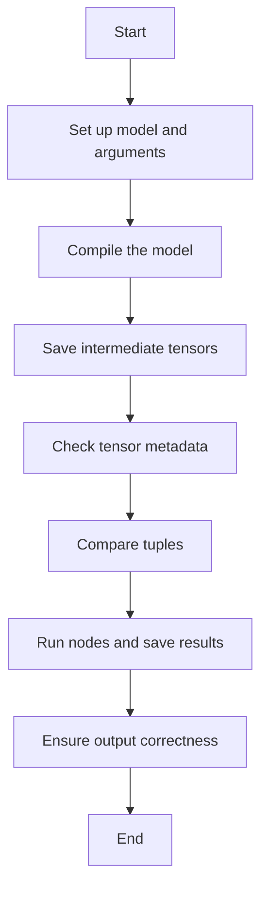

This document will cover the process of analyzing and comparing model outputs, which includes:

1. Setting up the model and arguments
2. Compiling the model
3. Saving intermediate tensors
4. Checking tensor metadata
5. Comparing tuples
6. Running nodes and saving results
7. Ensuring output correctness

Technical document: <SwmLink doc-title="Analyzing and Comparing Model Outputs">[Analyzing and Comparing Model Outputs](/.swm/analyzing-and-comparing-model-outputs.3kw9kzs8.sw.md)</SwmLink>

# [Setting up the model and arguments](https://app.swimm.io/repos/Z2l0aHViJTNBJTNBcHl0b3JjaC1hdXRvZG9jcy1kZW1vJTNBJTNBU3dpbW0tRGVtbw==/docs/3kw9kzs8#setting-up-the-model-and-arguments)

The process begins by setting up the model and the necessary arguments. This involves preparing the model and loading the arguments that will be used for analysis. This step ensures that the model is ready for the subsequent compilation and analysis steps.

# [Compiling the model](https://app.swimm.io/repos/Z2l0aHViJTNBJTNBcHl0b3JjaC1hdXRvZG9jcy1kZW1vJTNBJTNBU3dpbW0tRGVtbw==/docs/3kw9kzs8#compiling-the-model)

The model is then compiled using a specific compilation function. This step is crucial as it transforms the model into a format that can be efficiently executed and analyzed. The compilation process involves setting up the necessary context and environment, ensuring that resources are properly managed.

# [Saving intermediate tensors](https://app.swimm.io/repos/Z2l0aHViJTNBJTNBcHl0b3JjaC1hdXRvZG9jcy1kZW1vJTNBJTNBU3dpbW0tRGVtbw==/docs/3kw9kzs8#saving-intermediate-tensors)

During the analysis, intermediate tensors are saved if the option is enabled. This is done using hooks that capture the tensors at various stages of the model's execution. Saving these tensors is important for debugging and understanding the model's behavior, as it allows for a detailed inspection of the model's internal states.

# [Checking tensor metadata](https://app.swimm.io/repos/Z2l0aHViJTNBJTNBcHl0b3JjaC1hdXRvZG9jcy1kZW1vJTNBJTNBU3dpbW0tRGVtbw==/docs/3kw9kzs8#checking-tensor-metadata)

The metadata of the tensors is checked to ensure they match the expected values. This step involves comparing the metadata of the tensors produced by the model with reference metadata. Ensuring that the metadata is correct is essential for validating the correctness of the model's outputs.

# [Comparing tuples](https://app.swimm.io/repos/Z2l0aHViJTNBJTNBcHl0b3JjaC1hdXRvZG9jcy1kZW1vJTNBJTNBU3dpbW0tRGVtbw==/docs/3kw9kzs8#comparing-tuples)

Tuples are compared to identify any differences. This comparison is done to ensure that the outputs of the model match the expected results. Any discrepancies in the tuples indicate potential issues with the model's execution or the data being processed.

# [Running nodes and saving results](https://app.swimm.io/repos/Z2l0aHViJTNBJTNBcHl0b3JjaC1hdXRvZG9jcy1kZW1vJTNBJTNBU3dpbW0tRGVtbw==/docs/3kw9kzs8#running-nodes-and-saving-results)

Nodes in the computation graph are executed, and the results are saved. This step involves running each node and capturing its output. The results are then stored for further analysis. This process helps in understanding how each part of the model contributes to the final output.

# [Ensuring output correctness](https://app.swimm.io/repos/Z2l0aHViJTNBJTNBcHl0b3JjaC1hdXRvZG9jcy1kZW1vJTNBJTNBU3dpbW0tRGVtbw==/docs/3kw9kzs8#ensuring-output-correctness)

The final step is to ensure that the outputs of the model are correct. This is done by comparing the model's outputs with reference outputs. The comparison takes into account various data types and structures, ensuring that the outputs are accurate and reliable. This step is crucial for validating the overall performance and correctness of the model.

&nbsp;

*This is an auto-generated document by Swimm AI 🌊 and has not yet been verified by a human*

<SwmMeta version="3.0.0" repo-id="Z2l0aHViJTNBJTNBcHl0b3JjaC1hdXRvZG9jcy1kZW1vJTNBJTNBU3dpbW0tRGVtbw==" repo-name="pytorch-autodocs-demo">Powered by [Swimm](https://app.swimm.io/)</SwmMeta>
