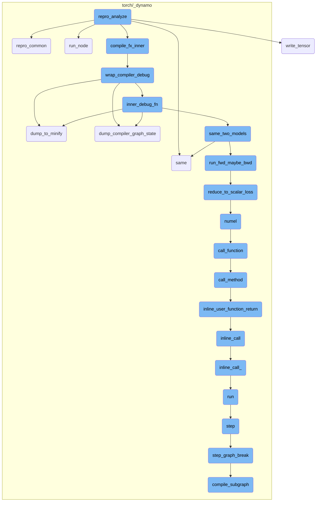
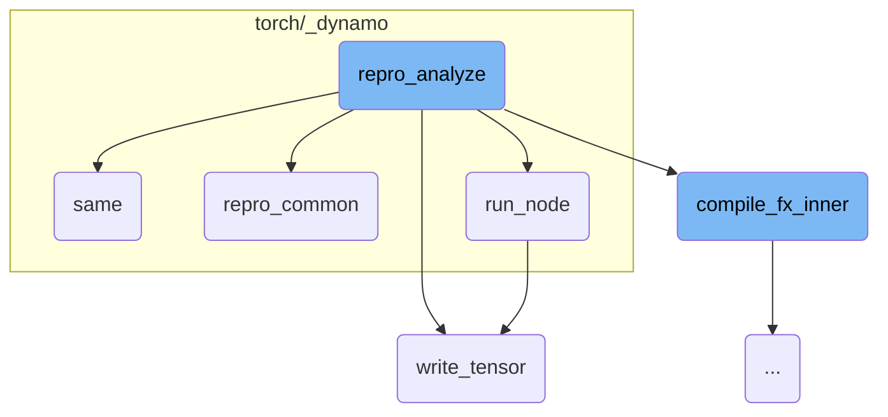
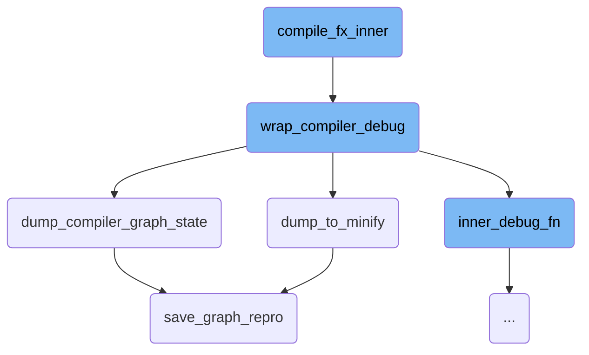
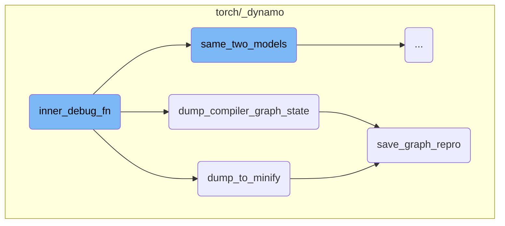
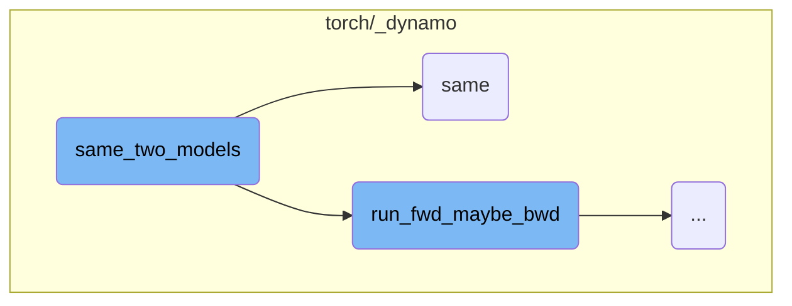

```mermaid
graph TD;
      subgraph torchdynamo["torch/_dynamo"]
45d3914ff219ac59d8791edb23592ffcf2198e42f21e9d2fa8d458122697dfbf(run_fwd_maybe_bwd):::mainFlowStyle --> b849fa0d966995c95bcc0dd289d11300f269a476fb0a889509ae0149e18ed3ef(reduce_to_scalar_loss):::mainFlowStyle
end

subgraph torchdynamo["torch/_dynamo"]
b849fa0d966995c95bcc0dd289d11300f269a476fb0a889509ae0149e18ed3ef(reduce_to_scalar_loss):::mainFlowStyle --> 155e3cc2d5c50ff89e280b9cdc1c9ae4e009632d190253b8d3364f817aed44c4(numel):::mainFlowStyle
end

subgraph torchdynamo["torch/_dynamo"]
155e3cc2d5c50ff89e280b9cdc1c9ae4e009632d190253b8d3364f817aed44c4(numel):::mainFlowStyle --> 0fe776e548d42ed0d2169b9051562848ccfee29509461e7e993ce542426370a7(call_function):::mainFlowStyle
end

subgraph torchdynamo["torch/_dynamo"]
0fe776e548d42ed0d2169b9051562848ccfee29509461e7e993ce542426370a7(call_function):::mainFlowStyle --> fde83ab941c6a2749f130ece53e7f65af2928d91723a63a01273d4e430a433bb(call_method):::mainFlowStyle
end

subgraph torchdynamo["torch/_dynamo"]
fde83ab941c6a2749f130ece53e7f65af2928d91723a63a01273d4e430a433bb(call_method):::mainFlowStyle --> 458008e74f18ebce47c64da5a4233a63dc2fd42ac18b14ae3f3aaea47313241b(inline_user_function_return):::mainFlowStyle
end

subgraph torchdynamo["torch/_dynamo"]
458008e74f18ebce47c64da5a4233a63dc2fd42ac18b14ae3f3aaea47313241b(inline_user_function_return):::mainFlowStyle --> fcd883700fffa007b56c5d346195884dc971b221f81f7154a62efec44b035ea5(inline_call):::mainFlowStyle
end

subgraph torchdynamo["torch/_dynamo"]
fcd883700fffa007b56c5d346195884dc971b221f81f7154a62efec44b035ea5(inline_call):::mainFlowStyle --> 15971f1e27fd627308a99bae241ac3eb113c6830b15353374d03323c5a30959c(inline_call_):::mainFlowStyle
end

subgraph torchdynamo["torch/_dynamo"]
15971f1e27fd627308a99bae241ac3eb113c6830b15353374d03323c5a30959c(inline_call_):::mainFlowStyle --> edf27ab967b775dcd6f62cb8a0fb2a87177da9406db5a99aad72cc627af839ac(run):::mainFlowStyle
end

subgraph torchdynamo["torch/_dynamo"]
edf27ab967b775dcd6f62cb8a0fb2a87177da9406db5a99aad72cc627af839ac(run):::mainFlowStyle --> 99e91bca7ea856f56e3f34579d72219ce35debd0d03d0aee37dedaffe5ac2a22(step):::mainFlowStyle
end

subgraph torchdynamo["torch/_dynamo"]
99e91bca7ea856f56e3f34579d72219ce35debd0d03d0aee37dedaffe5ac2a22(step):::mainFlowStyle --> a8cb423a5d16e220218eb2e3c35a54f64a0aaab6b5233dd0b33a8dae3657ca81(step_graph_break):::mainFlowStyle
end

subgraph torchdynamo["torch/_dynamo"]
a8cb423a5d16e220218eb2e3c35a54f64a0aaab6b5233dd0b33a8dae3657ca81(step_graph_break):::mainFlowStyle --> 2ba345a88495baf48df3654780e05d6be290f7d7a9d8f157cc7acee764a6ff02(compile_subgraph):::mainFlowStyle
end


      classDef mainFlowStyle color:#000000,fill:#7CB9F4
classDef rootsStyle color:#000000,fill:#00FFF4
classDef Style1 color:#000000,fill:#00FFAA
classDef Style2 color:#000000,fill:#FFFF00
classDef Style3 color:#000000,fill:#AA7CB9
```

This document provides an overview of the `repro_analyze` function, which is responsible for analyzing and comparing model outputs. It includes steps for saving intermediate tensors, checking tensor metadata, comparing tuples, running nodes, and ensuring output correctness.

The `repro_analyze` function starts by setting up the model and arguments. It then compiles the model and sets up hooks to save intermediate tensors if needed. The function checks the metadata of tensors to ensure they match expected values and compares tuples to identify differences. It runs nodes in the computation graph and saves the results. Finally, it checks if the outputs are correct by comparing them with reference outputs, handling different data types and structures.

Here is a high level diagram of the flow, showing only the most important functions:



# Flow drill down

First, we'll zoom into this section of the flow:



<SwmSnippet path="/torch/_dynamo/repro/after_aot.py" line="569">

---

## Analyzing and comparing model outputs

The `repro_analyze` function is responsible for analyzing the model outputs. It includes a `save_hook` function that saves intermediate tensors if the option is enabled. This is crucial for debugging and understanding the model's behavior.

```python
def repro_analyze(options, mod, load_args):
    from torch._inductor.compile_fx import compile_fx_inner
    from torch._inductor.hooks import intermediate_hook

    mod, args = repro_common(options, mod, load_args)

    # TODO: The logic for cloning inputs/models here is intentionally
    # modeled off of run_fwd_maybe_bwd, but arguably it is better not to
    # clone inputs (as you are doubling your effective GPU memory usage).
    # It is certainly faster though!  It probably makes sense to let the
    # user specify the offload strategy.

    with tqdm(desc="Compiling"):
        compiled = compile_fx_inner(mod, args)
    total = counters["inductor"]["intermediate_hooks"]

    known_names = set()

    def save_hook(name, val):
        known_names.add(name)
        if not options.skip_saving_inductor_intermediates:
```

---

</SwmSnippet>

<SwmSnippet path="/torch/_dynamo/repro/after_aot.py" line="614">

---

## Checking tensor metadata

The `check_hook` function within `repro_analyze` checks the metadata of tensors to ensure they match expected values. This step is essential for validating the correctness of the model's outputs.

```python
    def check_hook(name, val):
        meta = writer.compute_tensor_metadata(val)
        meta2 = reader.read_tensor_metadata(os.path.join("inductor", name))
        reason = compare_tuples(meta, meta2)
```

---

</SwmSnippet>

<SwmSnippet path="/torch/_dynamo/repro/after_aot.py" line="605">

---

## Comparing tuples

The `compare_tuples` function is used to compare two tuples and identify differences. This function is called within `check_hook` to determine if the tensor metadata matches the expected values.

```python
    def compare_tuples(tuple1, tuple2):
        diff_indices = [i for i in range(len(tuple1)) if tuple1[i] != tuple2[i]]
        diff_values = [(tuple1[i], tuple2[i]) for i in diff_indices]

```

---

</SwmSnippet>

<SwmSnippet path="/torch/_dynamo/repro/after_aot.py" line="635">

---

## Running nodes and saving results

The `run_node` function in `WriterInterp` runs a node in the computation graph and saves the result if the node's name is in the known names set. This is part of the process of analyzing and saving intermediate results.

```python
        def run_node(self, n):
            r = super().run_node(n)
            name = n.name
            if name in known_names:
                pbar.update(1)
                writer.write_tensor(os.path.join(self.subdir, name), r)
            return r
```

---

</SwmSnippet>

<SwmSnippet path="/torch/_dynamo/utils.py" line="1487">

---

## Ensuring output correctness

The `same` function checks if two outputs are the same, ensuring the correctness of the model's outputs. It handles various data types and structures, making it a versatile tool for output validation.

```python
def same(
    ref,
    res,
    fp64_ref=None,
    cos_similarity=False,
    tol=1e-4,
    equal_nan=False,
    exact_dtype=True,
    relax_numpy_equality=False,
    ignore_non_fp=False,
    log_error=log.error,
    use_larger_multiplier_for_smaller_tensor=False,
):
    """Check correctness to see if ref and res match"""
```

---

</SwmSnippet>

<SwmSnippet path="/torch/_dynamo/utils.py" line="1501">

---

## Handling different data types

The `same` function includes logic to handle different data types such as lists, tuples, dictionaries, and tensors. This ensures that the function can accurately compare a wide range of outputs.

```python
    if fp64_ref is None:
        fp64_ref = ref
    if isinstance(ref, (list, tuple, torch.nn.ParameterList, torch.Size)):
        assert isinstance(res, (list, tuple)), f"type mismatch {type(ref)} {type(res)}"
        if len(ref) != len(res):
            log_error("Length mismatch")
            return False
        return len(ref) == len(res) and all(
            same(
                ai,
                bi,
                fp64_refi,
                cos_similarity,
                tol,
                equal_nan,
                exact_dtype,
                relax_numpy_equality,
                ignore_non_fp,
                log_error=log_error,
                use_larger_multiplier_for_smaller_tensor=use_larger_multiplier_for_smaller_tensor,
            )
```

---

</SwmSnippet>

<SwmSnippet path="/torch/utils/_content_store.py" line="181">

---

## Writing tensors to storage

The `write_tensor` function writes a tensor to storage, including its metadata. This function is used within `repro_analyze` to save intermediate results, aiding in the analysis and debugging process.

```python
    def write_tensor(self, name: str, t: torch.Tensor) -> None:
        storage = t.untyped_storage()
        h = self.write_storage(storage)
        # TODO: Support more advanced snapshotting of requires_grad/grad/etc
        d, f = os.path.split(name)
        payload = self.compute_tensor_metadata(t, h=h)
        subfolder = os.path.join(self.loc, "tensors", d)
        os.makedirs(subfolder, exist_ok=True)
        torch.save(payload, os.path.join(subfolder, f))
```

---

</SwmSnippet>

Now, lets zoom into this section of the flow:



<SwmSnippet path="/torch/_inductor/compile_fx.py" line="461">

---

## compile_fx_inner

The function `compile_fx_inner` is responsible for setting up the necessary context and environment for the compilation process. It uses `contextlib.ExitStack` to manage multiple context managers, ensuring that resources are properly handled. This includes disabling current modes, using a lazy graph module if configured, timing the compilation process, and setting up a fresh cache. Finally, it calls `wrap_compiler_debug` with `_compile_fx_inner` and the provided arguments to perform the actual compilation.

```python
    with contextlib.ExitStack() as stack:
        stack.enter_context(torch.utils._python_dispatch._disable_current_modes())
        stack.enter_context(_use_lazy_graph_module(dynamo_config.use_lazy_graph_module))
        stack.enter_context(
            dynamo_utils.dynamo_timed(
                "compile_fx_inner", phase_name="inductor_compile", fwd_only=False
            )
        )
        stack.enter_context(with_fresh_cache_if_config())
        stack.enter_context(DebugContext())

        return wrap_compiler_debug(_compile_fx_inner, compiler_name="inductor")(
            *args, **kwargs
        )
```

---

</SwmSnippet>

<SwmSnippet path="/torch/_dynamo/repro/after_aot.py" line="59">

---

### wrap_compiler_debug

The function `wrap_compiler_debug` wraps the compiler function with additional debugging capabilities. It creates a `debug_wrapper` function that handles fake tensors and real inputs, ensuring that the compiler function is called correctly. This wrapper helps in debugging and minifying the compiled graph.

```python
def wrap_compiler_debug(unconfigured_compiler_fn, compiler_name: str):
    """
    Minifier for Fx Graph modules after Aot Autograd has finished. We wrap both
    forward and backward call separately with the backend compiler_fn - like
    inductor or nvfuser. Intercepting after Aot Autograd presents neat
    abstraction, where all the params are lifted as graph inputs, making it easy
    to save the graph as a string.
    """

    @functools.wraps(unconfigured_compiler_fn)
    def debug_wrapper(gm, example_inputs, **kwargs):
        from torch._subclasses import FakeTensorMode

        compiler_fn = functools.partial(unconfigured_compiler_fn, **kwargs)

        from torch._functorch.aot_autograd import get_aot_graph_name

        graph_name = get_aot_graph_name()

        # TODO: why do we need to deepcopy the original graph?
        orig_graph = copy.deepcopy(gm.graph)
```

---

</SwmSnippet>

<SwmSnippet path="/torch/_dynamo/repro/after_aot.py" line="333">

---

### dump_to_minify

The function `dump_to_minify` is used to save the current state of the graph for minification purposes. It creates a subdirectory for checkpoints, saves the graph representation using `save_graph_repro`, and returns the minified output.

```python
def dump_to_minify(gm, args, compiler_name: str):
    out = io.StringIO()
    # TODO: factor this out
    subdir = os.path.join(minifier_dir(), "checkpoints")
    if not os.path.exists(subdir):
        os.makedirs(subdir, exist_ok=True)
    save_graph_repro(out, gm, args, compiler_name, save_dir=subdir, command="minify")
    return helper_for_dump_minify(out.getvalue())
```

---

</SwmSnippet>

<SwmSnippet path="/torch/_dynamo/repro/after_aot.py" line="305">

---

### dump_compiler_graph_state

The function `dump_compiler_graph_state` saves the current state of the compiler graph to a file. It creates a checkpoint with the number of nodes in the graph, saves the graph representation using `save_graph_repro`, and copies the file for convenience.

```python
def dump_compiler_graph_state(gm, args, compiler_name, *, accuracy=None):
    subdir = os.path.join(minifier_dir(), "checkpoints")
    if not os.path.exists(subdir):
        os.makedirs(subdir, exist_ok=True)
    file_name = os.path.join(subdir, f"{len(gm.graph.nodes)}.py")
    log.warning(
        "Writing checkpoint with %s nodes to %s", len(gm.graph.nodes), file_name
    )
    with open(file_name, "w") as fd:
        save_graph_repro(
            fd, gm, args, compiler_name, save_dir=subdir, accuracy=accuracy
        )
    curdir = os.getcwd()
    repro_path = os.path.join(curdir, "repro.py")
    try:
        shutil.copyfile(file_name, repro_path)
        log.warning("Copying repro file for convenience to %s", repro_path)
        if use_buck:
            BuckTargetWriter(file_name).write()
    except OSError:
        log.warning("No write permissions for %s", repro_path)
```

---

</SwmSnippet>

<SwmSnippet path="/torch/_dynamo/repro/after_aot.py" line="257">

---

### save_graph_repro

The function `save_graph_repro` generates a reproducible script for the given graph module and arguments. It writes the graph representation to a file, including necessary imports and function calls to run the script independently. This helps in debugging and reproducing the graph state.

```python
def save_graph_repro(
    fd,
    gm,
    args,
    compiler_name,
    *,
    stable_output=False,
    save_dir=None,
    command="run",
    accuracy=None,
    tracing_mode=None,
    check_str=None,
):
    if any(
        isinstance(arg, torch.fx.experimental._backward_state.BackwardState)
        for arg in args
    ):
        fd.write(
            "Repro is not generated due to existence of BackwardState in graph input"
        )
        return
```

---

</SwmSnippet>

Now, lets zoom into this section of the flow:



<SwmSnippet path="/torch/_dynamo/repro/after_aot.py" line="127">

---

## Handling Fake Tensors

The function `inner_debug_fn` starts by handling fake tensors. It copies the tensor attributes like shape and stride by converting them to fake tensors using `FakeTensorMode`. This is necessary because the inductor clears the tensor list in its codegen, and example inputs are only available for the first invocation.

```python
            fake_mode = FakeTensorMode()
            copy_tensor_attrs = [
                fake_mode.from_tensor(x) if isinstance(x, torch.Tensor) else x
                for x in real_inputs
            ]
```

---

</SwmSnippet>

<SwmSnippet path="/torch/_dynamo/repro/after_aot.py" line="132">

---

## Dumping States Based on Repro Level

If the `repro_level` is set to 3, the function always dumps the original module to help with debugging in case of segfaults. This is done using the `dump_to_minify` function.

```python
            if config.repro_level == 3:
                # Always dump the original module in case we have segfaults
                dump_to_minify(
                    fx.GraphModule(gm, orig_graph), real_inputs, compiler_name
                )

```

---

</SwmSnippet>

<SwmSnippet path="/torch/_dynamo/repro/after_aot.py" line="138">

---

### Accuracy Check for Inductor

For `repro_level` 4, the function performs an accuracy check specifically for the inductor compiler. If the accuracy check fails, it logs a warning and dumps the compiler graph state and minified module for further inspection.

```python
            if config.repro_level == 4:
                if compiler_name != "inductor":
                    raise NotImplementedError(
                        "Accuracy minification is supported for inductor only"
                    )
                failed = not same_two_models(
                    gm,
                    inner_compiled_fn,
                    real_inputs,
                    only_fwd=True,
                    ignore_non_fp=config.repro_ignore_non_fp,
                )

                if failed:
                    log.warning(
                        "Accuracy failed for the AOT Autograd graph %s", graph_name
                    )
                    dump_compiler_graph_state(
                        fx.GraphModule(gm, orig_graph),
                        real_inputs,
                        f"{compiler_name}_accuracy",
```

---

</SwmSnippet>

<SwmSnippet path="/torch/_dynamo/repro/after_aot.py" line="170">

---

### Handling Exceptions

If an exception occurs during the invocation of the compiled function, the function handles it based on the `repro_level`. For `repro_level` 1, it dumps the compiler graph state, and for `repro_level` 2, it dumps the minified module.

```python
                try:
                    # Call the compiled function with real inputs
                    out = inner_compiled_fn(real_inputs)
                    # sync cuda kernels to ensure IMA detection
                    for arg in example_inputs:
                        if isinstance(arg, torch.Tensor) and arg.is_cuda:
                            torch.cuda.synchronize()
                            break
                    return out
                except Exception as e:
                    if config.repro_level == 1:
                        dump_compiler_graph_state(
                            fx.GraphModule(gm, orig_graph),
                            copy_tensor_attrs,
                            compiler_name,
                        )
                    elif config.repro_level == 2:
                        dump_to_minify(
                            fx.GraphModule(gm, orig_graph),
                            copy_tensor_attrs,
                            compiler_name,
```

---

</SwmSnippet>

Now, lets zoom into this section of the flow:



<SwmSnippet path="/torch/_dynamo/debug_utils.py" line="334">

---

## Comparing the accuracy of two models

The function `same_two_models` is responsible for checking if two models have the same accuracy. It first runs the forward (and optionally backward) pass on the first model to get a reference output. If configured, it also attempts to generate a reference output in fp64 precision. Then, it runs the forward (and optionally backward) pass on the optimized model. Finally, it compares the outputs of the two models using the `same` function, taking into account the tolerance and whether to ignore non-floating point outputs.

```python
def same_two_models(
    gm,
    opt_gm,
    example_inputs,
    only_fwd=False,
    *,
    require_fp64=False,
    ignore_non_fp=False,
):
    """
    Check two models have same accuracy.

    require_fp64: if True, raise an error if we unable to calculate the fp64 reference
    ignore_non_fp: if True, do not compare outputs which are not floating point.  This
        is mostly useful for the minifier (which wants to avoid quantizing floating point
        error into integer/boolean error)
    """
    from .utils import same

    ref = run_fwd_maybe_bwd(gm, example_inputs, only_fwd)

```

---

</SwmSnippet>

Now, lets zoom into this section of the flow:



<SwmSnippet path="/torch/_dynamo/debug_utils.py" line="316">

---

## run_fwd_maybe_bwd

The function `run_fwd_maybe_bwd` is responsible for running a forward and possibly a backward iteration for a given model and arguments. It first deep copies the model and clones the inputs if `disable_clone` is not set to True. If the model has a `zero_grad` method, it is called to zero out the gradients. The model is then executed with the provided arguments. If `only_fwd` is set to True, the function returns the output of the forward pass. Otherwise, it checks if a backward pass is required using `requires_bwd_pass`. If so, it reduces the output to a scalar loss using `reduce_to_scalar_loss` and performs the backward pass. Finally, it collects and returns the results.

```python
    gm = copy.deepcopy(gm)
    if not disable_clone:
        args = clone_inputs_retaining_gradness(args)

    if hasattr(gm, "zero_grad"):
        gm.zero_grad(True)

    # TorchInductor returned callable expects lists. So, may need a boxed calling convention.
    out = gm(args) if hasattr(gm, "_boxed_call") else gm(*args)

    if only_fwd:
        return out
    if requires_bwd_pass(out):
        loss = reduce_to_scalar_loss(out)
        loss.backward()
    return collect_results(gm, out, None, args)
```

---

</SwmSnippet>

<SwmSnippet path="/torch/_dynamo/testing.py" line="107">

---

### reduce_to_scalar_loss

The function `reduce_to_scalar_loss` reduces the output of a model to a scalar loss. It handles various types of outputs, including tensors, lists, tuples, and specific model output types. For tensors, it computes the sum and divides by the number of elements. For lists and tuples, it recursively reduces each element and averages the results. For certain model output types, it reduces the logits. For dictionaries, it reduces each value and averages the results.

```python
    if isinstance(out, torch.Tensor):
        # Mean does not work on integer tensors
        return out.sum() / out.numel()
    elif isinstance(out, (list, tuple)):
        return sum(reduce_to_scalar_loss(x) for x in out) / len(out)
    elif type(out).__name__ in (
        "MaskedLMOutput",
        "Seq2SeqLMOutput",
        "CausalLMOutputWithCrossAttentions",
    ):
        return reduce_to_scalar_loss(out.logits)
    elif type(out).__name__ == "SquashedNormal":
        return out.mean.sum()
    elif isinstance(out, dict):
        return sum(reduce_to_scalar_loss(value) for value in out.values()) / len(
            out.keys()
        )
```

---

</SwmSnippet>

&nbsp;

*This is an auto-generated document by Swimm AI 🌊 and has not yet been verified by a human*

<SwmMeta version="3.0.0" repo-id="Z2l0aHViJTNBJTNBcHl0b3JjaC1hdXRvZG9jcy1kZW1vJTNBJTNBU3dpbW0tRGVtbw==" repo-name="pytorch-autodocs-demo"><sup>Powered by [Swimm](https://app.swimm.io/)</sup></SwmMeta>
