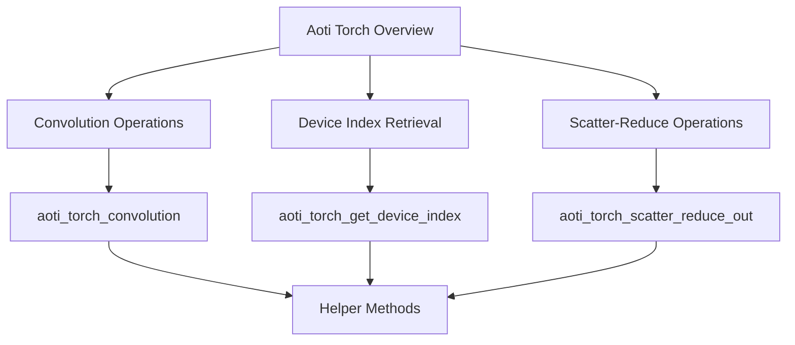

# Overview of Aoti Torch

Aoti Torch is a component within the Inductor module that provides various utility functions and constants for tensor operations. It includes functions for convolution operations, device index retrieval, and scatter-reduce operations. These functions rely on helper methods to manage tensor data and operations efficiently.

# Convolution Operations

The <SwmToken path="torch/csrc/inductor/aoti_torch/shim_common.cpp" pos="581:4:4" line-data="AOTI_TORCH_EXPORT AOTITorchError aoti_torch_convolution(">`aoti_torch_convolution`</SwmToken> function performs convolution operations on tensors. It converts tensor handles to tensor pointers and applies the convolution operation using the <SwmToken path="torch/csrc/inductor/aoti_torch/shim_common.cpp" pos="607:8:10" line-data="    *out = new_tensor_handle(at::convolution(">`at::convolution`</SwmToken> method.

<SwmSnippet path="/torch/csrc/inductor/aoti_torch/shim_common.cpp" line="581">

---

The function <SwmToken path="torch/csrc/inductor/aoti_torch/shim_common.cpp" pos="581:4:4" line-data="AOTI_TORCH_EXPORT AOTITorchError aoti_torch_convolution(">`aoti_torch_convolution`</SwmToken> converts tensor handles to tensor pointers and applies the convolution operation.

```c++
AOTI_TORCH_EXPORT AOTITorchError aoti_torch_convolution(
    AtenTensorHandle input,
    AtenTensorHandle weight,
    AtenTensorHandle bias, // optional argument
    const int64_t* stride_ptr,
    int64_t stride_size,
    const int64_t* padding_ptr,
    int64_t padding_size,
    const int64_t* dilation_ptr,
    int64_t dilation_size,
    int transposed,
    const int64_t* output_padding_ptr,
    int64_t output_padding_size,
    int64_t groups,
    AtenTensorHandle* out // returns new reference
) {
  AOTI_TORCH_CONVERT_EXCEPTION_TO_ERROR_CODE({
    at::Tensor* input_tensor = tensor_handle_to_tensor_pointer(input);
    at::Tensor* weight_tensor = tensor_handle_to_tensor_pointer(weight);
    at::Tensor* bias_tensor = tensor_handle_to_tensor_pointer(bias);
    auto optional_bias = pointer_to_optional(bias_tensor);
```

---

</SwmSnippet>

# Device Index Retrieval

The <SwmToken path="torch/csrc/inductor/aoti_torch/shim_common.cpp" pos="278:2:2" line-data="AOTITorchError aoti_torch_get_device_index(">`aoti_torch_get_device_index`</SwmToken> function retrieves the device index of a tensor. This is essential for managing tensor operations across different devices, ensuring that operations are performed on the correct hardware.

<SwmSnippet path="/torch/csrc/inductor/aoti_torch/shim_common.cpp" line="278">

---

The function <SwmToken path="torch/csrc/inductor/aoti_torch/shim_common.cpp" pos="278:2:2" line-data="AOTITorchError aoti_torch_get_device_index(">`aoti_torch_get_device_index`</SwmToken> retrieves the device index of a tensor.

```c++
AOTITorchError aoti_torch_get_device_index(
    AtenTensorHandle tensor,
    int32_t* ret_device_index) {
  AOTI_TORCH_CONVERT_EXCEPTION_TO_ERROR_CODE({
    at::Tensor* t = tensor_handle_to_tensor_pointer(tensor);
    *ret_device_index = static_cast<int16_t>(t->device().index());
  });
```

---

</SwmSnippet>

# Scatter-Reduce Operations

The <SwmToken path="torch/csrc/inductor/aoti_torch/shim_common.cpp" pos="867:2:2" line-data="AOTITorchError aoti_torch_scatter_reduce_out(">`aoti_torch_scatter_reduce_out`</SwmToken> function performs scatter-reduce operations on tensors. This function is useful for reducing data across specified dimensions, which is a common operation in various machine learning and data processing tasks.

<SwmSnippet path="/torch/csrc/inductor/aoti_torch/shim_common.cpp" line="867">

---

The function <SwmToken path="torch/csrc/inductor/aoti_torch/shim_common.cpp" pos="867:2:2" line-data="AOTITorchError aoti_torch_scatter_reduce_out(">`aoti_torch_scatter_reduce_out`</SwmToken> performs scatter-reduce operations on tensors.

```c++
AOTITorchError aoti_torch_scatter_reduce_out(
    AtenTensorHandle out,
    AtenTensorHandle self,
    int64_t dim,
    AtenTensorHandle index,
    AtenTensorHandle src,
    const char* reduce,
    int32_t include_self) {
  AOTI_TORCH_CONVERT_EXCEPTION_TO_ERROR_CODE({
    at::Tensor* out_tensor = tensor_handle_to_tensor_pointer(out);
    at::Tensor* self_tensor = tensor_handle_to_tensor_pointer(self);
    at::Tensor* index_tensor = tensor_handle_to_tensor_pointer(index);
    at::Tensor* src_tensor = tensor_handle_to_tensor_pointer(src);
    at::scatter_reduce_out(
        *out_tensor,
        *self_tensor,
        dim,
        *index_tensor,
        *src_tensor,
        reduce,
        (bool)include_self);
```

---

</SwmSnippet>

# Helper Methods

Helper methods are used to manage tensor data and operations efficiently. These include <SwmToken path="torch/csrc/inductor/aoti_torch/shim_common.cpp" pos="282:10:10" line-data="    at::Tensor* t = tensor_handle_to_tensor_pointer(tensor);">`tensor_handle_to_tensor_pointer`</SwmToken>, <SwmToken path="torch/csrc/inductor/aoti_torch/shim_common.cpp" pos="601:7:7" line-data="    auto optional_bias = pointer_to_optional(bias_tensor);">`pointer_to_optional`</SwmToken>, and <SwmToken path="torch/csrc/inductor/aoti_torch/utils.h" pos="46:4:4" line-data="inline AtenTensorHandle new_tensor_handle(at::Tensor&amp;&amp; tensor) {">`new_tensor_handle`</SwmToken>.

<SwmSnippet path="/torch/csrc/inductor/aoti_torch/oss_proxy_executor.cpp" line="8">

---

The helper method <SwmToken path="torch/csrc/inductor/aoti_torch/oss_proxy_executor.cpp" pos="8:5:5" line-data="at::Tensor* tensor_handle_to_tensor_pointer(AtenTensorHandle handle) {">`tensor_handle_to_tensor_pointer`</SwmToken> converts tensor handles to tensor pointers.

```c++
at::Tensor* tensor_handle_to_tensor_pointer(AtenTensorHandle handle) {
  return reinterpret_cast<at::Tensor*>(handle);
}
```

---

</SwmSnippet>

<SwmSnippet path="/torch/csrc/inductor/aoti_torch/utils.h" line="66">

---

The helper method <SwmToken path="torch/csrc/inductor/aoti_torch/utils.h" pos="66:9:9" line-data="inline std::optional&lt;T&gt; pointer_to_optional(T* ptr) {">`pointer_to_optional`</SwmToken> converts pointers to optional values.

```c
inline std::optional<T> pointer_to_optional(T* ptr) {
  return ptr ? std::make_optional(*ptr) : std::nullopt;
}
```

---

</SwmSnippet>

<SwmSnippet path="/torch/csrc/inductor/aoti_torch/utils.h" line="46">

---

The helper method <SwmToken path="torch/csrc/inductor/aoti_torch/utils.h" pos="46:4:4" line-data="inline AtenTensorHandle new_tensor_handle(at::Tensor&amp;&amp; tensor) {">`new_tensor_handle`</SwmToken> creates new tensor handles from tensors.

```c
inline AtenTensorHandle new_tensor_handle(at::Tensor&& tensor) {
  at::Tensor* new_tensor = new at::Tensor(std::move(tensor));
  return tensor_pointer_to_tensor_handle(new_tensor);
}
```

---

</SwmSnippet>

&nbsp;

*This is an auto-generated document by Swimm AI 🌊 and has not yet been verified by a human*

<SwmMeta version="3.0.0" repo-id="Z2l0aHViJTNBJTNBcHl0b3JjaC1hdXRvZG9jcy1kZW1vJTNBJTNBU3dpbW0tRGVtbw==" repo-name="pytorch-autodocs-demo"><sup>Powered by [Swimm](/)</sup></SwmMeta>
