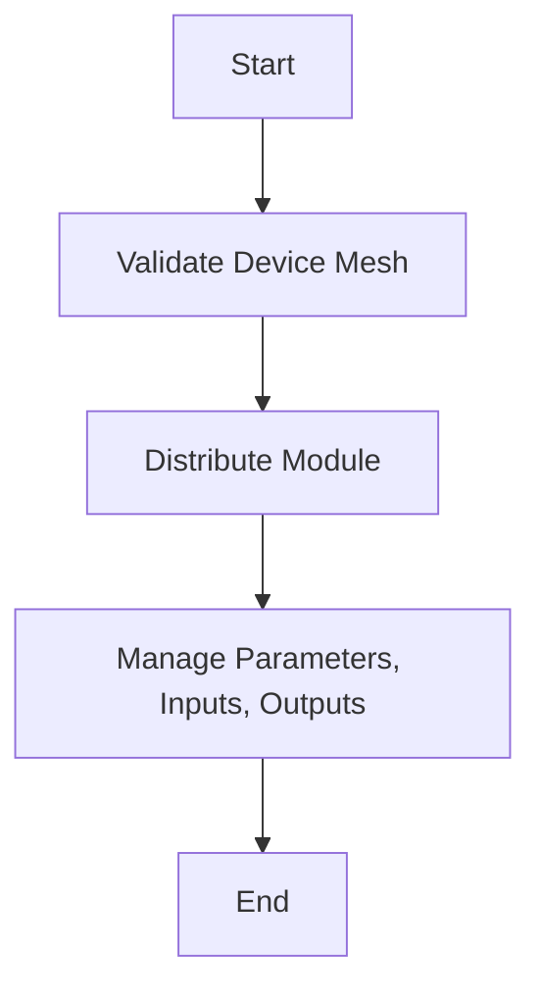

This document will cover the process of applying a module to a device mesh using the `_apply` function. We'll cover:

1. Validating the device mesh
2. Distributing the module across the device mesh
3. Managing module parameters, inputs, and outputs

Technical document: <SwmLink doc-title="Overview of the _apply Function">[Overview of the \_apply Function](/.swm/overview-of-the-_apply-function.cz2dkcnl.sw.md)</SwmLink>

# [Validating the Device Mesh](https://app.swimm.io/repos/Z2l0aHViJTNBJTNBcHl0b3JjaC1hdXRvZG9jcy1kZW1vJTNBJTNBU3dpbW0tRGVtbw==/docs/cz2dkcnl#_apply)

The first step in the `_apply` function is to validate the provided device mesh. This involves checking if the device mesh is an instance of `DeviceMesh` and ensuring its dimension is 1. This validation is crucial because it ensures that the module can be correctly distributed across the devices. If the device mesh is not valid, an error is raised, preventing further execution. This step ensures that the system only proceeds with a valid configuration, which is essential for maintaining the integrity and performance of the module distribution process.

# [Distributing the Module](https://app.swimm.io/repos/Z2l0aHViJTNBJTNBcHl0b3JjaC1hdXRvZG9jcy1kZW1vJTNBJTNBU3dpbW0tRGVtbw==/docs/cz2dkcnl#distribute_module)

Once the device mesh is validated, the next step is to distribute the module across the device mesh. This is done by calling the `distribute_module` function. The purpose of this function is to handle the distribution of the module's parameters, inputs, and outputs across the devices in the mesh. This distribution allows for efficient parallel processing, which can significantly improve performance. The function also ensures that the module's parameters are correctly sharded or replicated across the devices, depending on the specified configuration. This step is essential for leveraging the computational power of multiple devices, enabling more complex and resource-intensive operations to be performed efficiently.

# [Managing Parameters, Inputs, and Outputs](https://app.swimm.io/repos/Z2l0aHViJTNBJTNBcHl0b3JjaC1hdXRvZG9jcy1kZW1vJTNBJTNBU3dpbW0tRGVtbw==/docs/cz2dkcnl#replicate_module_params_buffers)

The final step involves managing the module's parameters, inputs, and outputs. This is done through functions like `replicate_module_params_buffers` and `distribute_tensor`. These functions ensure that all non-DTensor parameters and buffers of the module are replicated or distributed across the device mesh. This management is crucial for maintaining consistency and ensuring that the module operates correctly across all devices. By handling the parameters, inputs, and outputs in this way, the system can efficiently manage the data flow and ensure that all devices have the necessary information to perform their computations. This step is vital for achieving the desired performance and accuracy in distributed operations.

&nbsp;

*This is an auto-generated document by Swimm AI 🌊 and has not yet been verified by a human*

<SwmMeta version="3.0.0" repo-id="Z2l0aHViJTNBJTNBcHl0b3JjaC1hdXRvZG9jcy1kZW1vJTNBJTNBU3dpbW0tRGVtbw==" repo-name="pytorch-autodocs-demo">Powered by [Swimm](https://app.swimm.io/)</SwmMeta>
