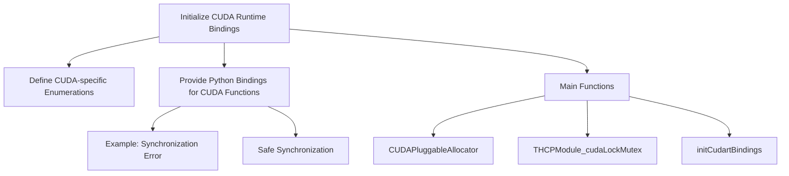

<SwmSnippet path="/torch/csrc/cuda/shared/cudart.cpp" line="23">

---

# Initialize CUDA Runtime Bindings

The function <SwmToken path="torch/csrc/cuda/shared/cudart.cpp" pos="23:2:2" line-data="void initCudartBindings(PyObject* module) {">`initCudartBindings`</SwmToken> initializes CUDA runtime bindings for Python modules. It creates a submodule <SwmToken path="torch/csrc/cuda/shared/cudart.cpp" pos="26:12:12" line-data="  auto cudart = m.def_submodule(&quot;_cudart&quot;, &quot;libcudart.so bindings&quot;);">`_cudart`</SwmToken> for <SwmToken path="torch/csrc/cuda/shared/cudart.cpp" pos="26:17:19" line-data="  auto cudart = m.def_submodule(&quot;_cudart&quot;, &quot;libcudart.so bindings&quot;);">`libcudart.so`</SwmToken> bindings.

```c++
void initCudartBindings(PyObject* module) {
  auto m = py::handle(module).cast<py::module>();

  auto cudart = m.def_submodule("_cudart", "libcudart.so bindings");
```

---

</SwmSnippet>

<SwmSnippet path="/torch/csrc/cuda/shared/cudart.cpp" line="31">

---

# Define CUDA-specific Enumerations

This section defines CUDA-specific enumerations such as <SwmToken path="torch/csrc/cuda/shared/cudart.cpp" pos="32:3:3" line-data="  // cudaOutputMode_t is used in cudaProfilerInitialize only. The latter is gone">`cudaOutputMode_t`</SwmToken> and <SwmToken path="torch/csrc/cuda/shared/cudart.cpp" pos="42:5:5" line-data="  py::enum_&lt;cudaError_t&gt;(">`cudaError_t`</SwmToken>. These enumerations are used for various CUDA runtime functions.

```c++
#if !defined(USE_ROCM) && defined(CUDA_VERSION) && CUDA_VERSION < 12000
  // cudaOutputMode_t is used in cudaProfilerInitialize only. The latter is gone
  // in CUDA 12.
  py::enum_<cudaOutputMode_t>(
      cudart,
      "cuda"
      "OutputMode")
      .value("KeyValuePair", cudaKeyValuePair)
      .value("CSV", cudaCSV);
#endif
```

---

</SwmSnippet>

<SwmSnippet path="/torch/csrc/cuda/shared/cudart.cpp" line="48">

---

# Provide Python Bindings for CUDA Functions

This section provides Python bindings for various CUDA runtime functions like <SwmToken path="torch/csrc/cuda/shared/cudart.cpp" pos="51:1:1" line-data="      cudaGetErrorString);">`cudaGetErrorString`</SwmToken>, <SwmToken path="torch/csrc/cuda/shared/cudart.cpp" pos="58:1:1" line-data="      cudaProfilerStart">`cudaProfilerStart`</SwmToken>, <SwmToken path="torch/csrc/cuda/shared/cudart.cpp" pos="67:1:1" line-data="      cudaProfilerStop">`cudaProfilerStop`</SwmToken>, and others.

```c++
  cudart.def(
      "cuda"
      "GetErrorString",
      cudaGetErrorString);
  cudart.def(
      "cuda"
      "ProfilerStart",
#ifdef USE_ROCM
      hipReturnSuccess
#else
      cudaProfilerStart
#endif
  );
  cudart.def(
      "cuda"
      "ProfilerStop",
#ifdef USE_ROCM
      hipReturnSuccess
#else
      cudaProfilerStop
#endif
```

---

</SwmSnippet>

## Example: Synchronization Error

This example demonstrates a simple synchronization error in <SwmToken path="tools/nightly.py" pos="306:1:1" line-data="    pytorch, platform = &quot;&quot;, &quot;&quot;">`pytorch`</SwmToken> when using CUDA. The tensor <SwmToken path="torch/csrc/cuda/Module.cpp" pos="486:11:11" line-data="  // This has to be a busy loop because we **absolutely need to** hold the GIL">`a`</SwmToken> is initialized on the default stream and modified on a new stream without synchronization, which can cause concurrent execution issues.

## Safe Synchronization

This snippet shows how to safely use gradients with CUDA streams by ensuring proper synchronization. The `torch.cuda.current_stream().wait_stream(s)` method is used to synchronize the streams.

# Main Functions

There are several main functions related to CUDA. Some of them are <SwmToken path="torch/csrc/cuda/CUDAPluggableAllocator.cpp" pos="7:10:10" line-data="#include &lt;torch/csrc/cuda/CUDAPluggableAllocator.h&gt;">`CUDAPluggableAllocator`</SwmToken>, <SwmToken path="torch/csrc/cuda/Module.cpp" pos="484:3:3" line-data="PyObject* THCPModule_cudaLockMutex(PyObject* module, PyObject* noargs) {">`THCPModule_cudaLockMutex`</SwmToken>, and <SwmToken path="torch/csrc/cuda/shared/cudart.cpp" pos="23:2:2" line-data="void initCudartBindings(PyObject* module) {">`initCudartBindings`</SwmToken>. We will dive a little into these functions.

<SwmSnippet path="/torch/csrc/cuda/CUDAPluggableAllocator.cpp" line="7">

---

## <SwmToken path="torch/csrc/cuda/CUDAPluggableAllocator.cpp" pos="7:10:10" line-data="#include &lt;torch/csrc/cuda/CUDAPluggableAllocator.h&gt;">`CUDAPluggableAllocator`</SwmToken>

The <SwmToken path="torch/csrc/cuda/CUDAPluggableAllocator.cpp" pos="7:10:10" line-data="#include &lt;torch/csrc/cuda/CUDAPluggableAllocator.h&gt;">`CUDAPluggableAllocator`</SwmToken> namespace provides functionalities for custom memory allocation in CUDA. It includes methods for managing device statistics, snapshots, and IPC handles.

```c++
#include <torch/csrc/cuda/CUDAPluggableAllocator.h>

namespace torch::cuda::CUDAPluggableAllocator {

CUDAPluggableAllocatorDeleterContext::CUDAPluggableAllocatorDeleterContext(
```

---

</SwmSnippet>

<SwmSnippet path="/torch/csrc/cuda/Module.cpp" line="484">

---

## <SwmToken path="torch/csrc/cuda/Module.cpp" pos="484:3:3" line-data="PyObject* THCPModule_cudaLockMutex(PyObject* module, PyObject* noargs) {">`THCPModule_cudaLockMutex`</SwmToken>

The <SwmToken path="torch/csrc/cuda/Module.cpp" pos="484:3:3" line-data="PyObject* THCPModule_cudaLockMutex(PyObject* module, PyObject* noargs) {">`THCPModule_cudaLockMutex`</SwmToken> function locks a mutex to ensure that CUDA operations are thread-safe. It uses a busy loop to hold the Global Interpreter Lock (GIL) and prevent deadlocks.

```c++
PyObject* THCPModule_cudaLockMutex(PyObject* module, PyObject* noargs) {
  auto mutex = c10::cuda::getFreeMutex();
  // This has to be a busy loop because we **absolutely need to** hold the GIL
  // or it's a recipe for a deadlock otherwise (if we let other Python threads
  // run while we have the cudaMutex, but not the GIL, they might try to e.g.
  // free a CUDA tensor and acquire the cudaMutex without giving up the GIL,
  // because it happens deep within THC).
  while (true) {
    if (mutex->try_lock())
      break;
    {
      pybind11::gil_scoped_release no_gil;
      std::this_thread::sleep_for(std::chrono::microseconds(10));
    }
  }

  cudaMutexGILState = PyGILState_Ensure();
  Py_RETURN_NONE;
}
```

---

</SwmSnippet>

&nbsp;

*This is an auto-generated document by Swimm AI 🌊 and has not yet been verified by a human*

<SwmMeta version="3.0.0" repo-id="Z2l0aHViJTNBJTNBcHl0b3JjaC1hdXRvZG9jcy1kZW1vJTNBJTNBU3dpbW0tRGVtbw==" repo-name="pytorch-autodocs-demo"><sup>Powered by [Swimm](/)</sup></SwmMeta>
