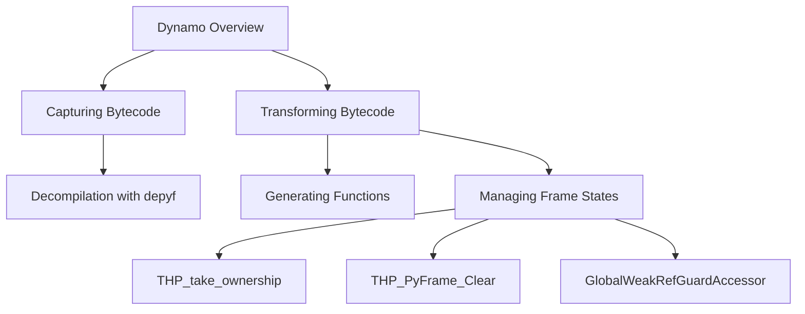

# Overview

Dynamo is a component responsible for capturing and transforming Python bytecode. It integrates with the Python interpreter at a low level, utilizing functions like <SwmToken path="torch/csrc/dynamo/cpython_defs.c" pos="334:0:0" line-data="THP_PyFrame_Clear(_PyInterpreterFrame *frame)">`THP_PyFrame_Clear`</SwmToken> and <SwmToken path="torch/csrc/dynamo/cpython_defs.c" pos="291:0:0" line-data="THP_take_ownership(PyFrameObject *f, _PyInterpreterFrame *frame)">`THP_take_ownership`</SwmToken> to manage frame states and ownership.

# Capturing and Transforming Bytecode

Dynamo captures Python bytecode and transforms it into human-readable source code using tools like `depyf`. This process involves generating functions such as `resume_at` to force the execution of code in a new Python frame, which helps in restarting its capture process.

# Guards in Dynamo

Dynamo includes various guards to ensure the correct execution environment and conditions for the bytecode being transformed. These guards are essential for maintaining the integrity and correctness of the transformed bytecode.

# Managing Frame States

Dynamo integrates with the Python interpreter at a low level to manage frame states and ownership. This is achieved through functions like <SwmToken path="torch/csrc/dynamo/cpython_defs.c" pos="334:0:0" line-data="THP_PyFrame_Clear(_PyInterpreterFrame *frame)">`THP_PyFrame_Clear`</SwmToken> and <SwmToken path="torch/csrc/dynamo/cpython_defs.c" pos="291:0:0" line-data="THP_take_ownership(PyFrameObject *f, _PyInterpreterFrame *frame)">`THP_take_ownership`</SwmToken>.

<SwmSnippet path="/torch/csrc/dynamo/cpython_defs.c" line="290">

---

## <SwmToken path="torch/csrc/dynamo/cpython_defs.c" pos="291:0:0" line-data="THP_take_ownership(PyFrameObject *f, _PyInterpreterFrame *frame)">`THP_take_ownership`</SwmToken>

The <SwmToken path="torch/csrc/dynamo/cpython_defs.c" pos="291:0:0" line-data="THP_take_ownership(PyFrameObject *f, _PyInterpreterFrame *frame)">`THP_take_ownership`</SwmToken> function is responsible for taking ownership of a Python frame object. It ensures that the frame is correctly linked and managed within the Python interpreter. This function is crucial for maintaining the integrity of frame states during execution.

```c
static void
THP_take_ownership(PyFrameObject *f, _PyInterpreterFrame *frame)
{
    CHECK(frame->owner != FRAME_OWNED_BY_FRAME_OBJECT);
    CHECK(frame->owner != FRAME_CLEARED);
    Py_ssize_t size = ((char*)&frame->localsplus[frame->stacktop]) - (char *)frame;
    memcpy((_PyInterpreterFrame *)f->_f_frame_data, frame, size);
    frame = (_PyInterpreterFrame *)f->_f_frame_data;
    f->f_frame = frame;
    frame->owner = FRAME_OWNED_BY_FRAME_OBJECT;
    if (_PyFrame_IsIncomplete(frame)) {
        // This may be a newly-created generator or coroutine frame. Since it's
        // dead anyways, just pretend that the first RESUME ran:
        PyCodeObject *code = F_CODE(frame);
        PREV_INSTR(frame) = _PyCode_CODE(code) + code->_co_firsttraceable;
    }
    CHECK(!_PyFrame_IsIncomplete(frame));
    CHECK(f->f_back == NULL);
    _PyInterpreterFrame *prev = frame->previous;
    while (prev && _PyFrame_IsIncomplete(prev)) {
        prev = prev->previous;
```

---

</SwmSnippet>

<SwmSnippet path="/torch/csrc/dynamo/cpython_defs.c" line="332">

---

## <SwmToken path="torch/csrc/dynamo/cpython_defs.c" pos="334:0:0" line-data="THP_PyFrame_Clear(_PyInterpreterFrame *frame)">`THP_PyFrame_Clear`</SwmToken>

The <SwmToken path="torch/csrc/dynamo/cpython_defs.c" pos="334:0:0" line-data="THP_PyFrame_Clear(_PyInterpreterFrame *frame)">`THP_PyFrame_Clear`</SwmToken> function clears a Python frame, ensuring that all references within the frame are properly decremented and managed. This function is essential for preventing memory leaks and ensuring that frames are correctly cleaned up after execution.

```c
// From https://github.com/python/cpython/blob/e715da6db1d1d70cd779dc48e1ba8110c51cc1bf/Python/frame.c#L120
void
THP_PyFrame_Clear(_PyInterpreterFrame *frame)
{
    /* It is the responsibility of the owning generator/coroutine
     * to have cleared the enclosing generator, if any. */
    CHECK(frame->owner != FRAME_OWNED_BY_GENERATOR ||
        _PyFrame_GetGenerator(frame)->gi_frame_state == FRAME_CLEARED);
    // GH-99729: Clearing this frame can expose the stack (via finalizers). It's
    // crucial that this frame has been unlinked, and is no longer visible:
#if IS_PYTHON_3_13_PLUS
    CHECK(_PyThreadState_GET()->current_frame != frame);
#else
    CHECK(_PyThreadState_GET()->cframe->current_frame != frame);
#endif
    if (frame->frame_obj) {
        PyFrameObject *f = frame->frame_obj;
        frame->frame_obj = NULL;
        if (Py_REFCNT(f) > 1) {
            THP_take_ownership(f, frame);
            Py_DECREF(f);
```

---

</SwmSnippet>

<SwmSnippet path="/torch/csrc/dynamo/guards.cpp" line="3265">

---

## <SwmToken path="torch/csrc/dynamo/guards.cpp" pos="3265:2:2" line-data="class GlobalWeakRefGuardAccessor : public GuardAccessor {">`GlobalWeakRefGuardAccessor`</SwmToken>

The <SwmToken path="torch/csrc/dynamo/guards.cpp" pos="3265:2:2" line-data="class GlobalWeakRefGuardAccessor : public GuardAccessor {">`GlobalWeakRefGuardAccessor`</SwmToken> class is used to manage weak references within the global scope of a Python frame. It ensures that weak references are correctly handled and that the underlying objects are accessed safely. This class is important for maintaining the integrity of global references during execution.

```c++
class GlobalWeakRefGuardAccessor : public GuardAccessor {
 public:
  GlobalWeakRefGuardAccessor(
      RootGuardManager* root,
      py::object global_name,
      std::string source,
      py::handle example_value,
      py::handle guard_manager_enum)
      : GuardAccessor(
            root,
            global_name,
            std::move(source),
            example_value,
            guard_manager_enum),
        _global_name(global_name.ptr()) {}

  // NB: Intentional duplication between check_nopybind and
  // check_verbose_nopybind.
  bool check_nopybind(PyObject* obj, bool matches_dict_tag = false)
      override { // borrowed ref
    // obj is globals dict because GlobalWeakRefGuardAccessor has to be a
```

---

</SwmSnippet>

&nbsp;

*This is an auto-generated document by Swimm AI 🌊 and has not yet been verified by a human*

<SwmMeta version="3.0.0" repo-id="Z2l0aHViJTNBJTNBcHl0b3JjaC1hdXRvZG9jcy1kZW1vJTNBJTNBU3dpbW0tRGVtbw==" repo-name="pytorch-autodocs-demo"><sup>Powered by [Swimm](/)</sup></SwmMeta>
