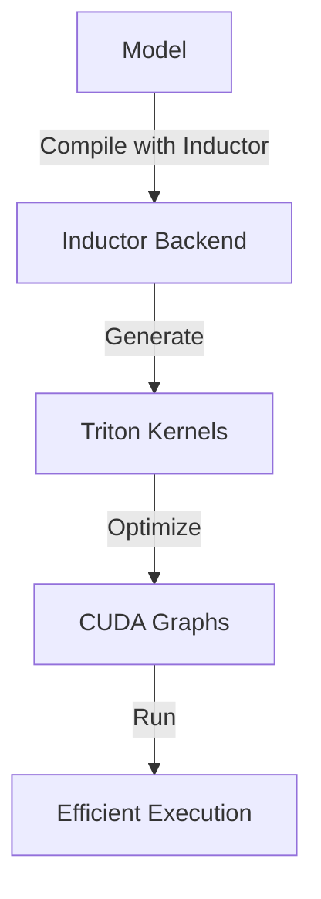

# Overview

Inductor is a component that provides major optimizations, including automatic support for CUDA graphs. CUDA graphs help eliminate the overhead from launching individual kernels from a Python program, which is especially relevant for newer GPUs.

# TorchInductor and Triton Kernels

TorchInductor works by generating Triton kernels. These kernels can be inspected by running a script with the `TORCH_COMPILE_DEBUG=1` environment variable set, which outputs the generated kernel code.

# Tensor Operations in Inductor

The file `torch/csrc/inductor/inductor_ops.h` defines several tensor operations within the `torch::inductor` namespace. These operations include `_mm_plus_mm_out`, `_mm_plus_mm`, `_alloc_from_pool`, and `_reinterpret_tensor`.

<SwmSnippet path="/torch/csrc/inductor/inductor_ops.h" line="1">

---

The header file `torch/csrc/inductor/inductor_ops.h` declares tensor operations such as `_mm_plus_mm_out` and `_mm_plus_mm`, which are used for matrix multiplication and addition.

```c
#pragma once

#include <ATen/Tensor.h>

namespace torch::inductor {

TORCH_API at::Tensor _mm_plus_mm_out(
    at::Tensor& out,
    const at::Tensor& a,
    const at::Tensor& b,
    const at::Tensor& c,
    const at::Tensor& d);

// After adding _mm_plus_mm_out, this should not be exposed and called by model
// code. Keeping it around for backward compatibility. Will be deprecated later.
TORCH_API at::Tensor _mm_plus_mm(
    const at::Tensor& a,
    const at::Tensor& b,
    const at::Tensor& c,
    const at::Tensor& d,
    at::Tensor& out);
```

---

</SwmSnippet>

# Implementation of Tensor Operations

The file `torch/csrc/inductor/inductor_ops.cpp` provides the implementation for the tensor operations defined in the header file. For example, `_mm_plus_mm_out` performs matrix multiplication and addition, while `_alloc_from_pool` allocates a tensor from a memory pool.

<SwmSnippet path="/torch/csrc/inductor/inductor_ops.cpp" line="93">

---

The `TORCH_LIBRARY_FRAGMENT` macro in `torch/csrc/inductor/inductor_ops.cpp` registers these tensor operations with the PyTorch library, making them available for use in models and other code.

```c++
TORCH_LIBRARY_FRAGMENT(inductor, m) {
  m.def(
      "_mm_plus_mm(Tensor a, Tensor b, Tensor c, Tensor d, Tensor(t!) out) -> Tensor(t!)",
      dispatch(c10::DispatchKey::CompositeExplicitAutograd, _mm_plus_mm),
      {at::Tag::pt2_compliant_tag});
  m.def(
      "_alloc_from_pool(Tensor self, int offset_bytes, ScalarType dtype, int[] size, int[] stride) -> Tensor",
      _alloc_from_pool,
      {at::Tag::pt2_compliant_tag});
  m.def(
      "_reinterpret_tensor(Tensor self, int[] size, int[] stride, int offset_increment=0) -> Tensor",
      dispatch(
          c10::DispatchKey::CompositeExplicitAutograd, _reinterpret_tensor),
      {at::Tag::pt2_compliant_tag});
  m.def(
      "accumulate_grad_(Tensor variable, Tensor new_grad) -> ()",
      dispatch(c10::DispatchKey::CompositeExplicitAutograd, accumulate_grad_),
      {at::Tag::pt2_compliant_tag});
}
```

---

</SwmSnippet>

# Inductor Compilation

TorchInductor has a built-in stats and trace function for displaying time spent in each compilation phase, output code, output graph visualization, and IR dump. This can be enabled by setting the `TORCH_COMPILE_DEBUG=1` environment variable and running your script.

# Compiling with Inductor Backend

You can compile your model with the Inductor backend by using the `lookup_backend` function and passing your model and example inputs.

&nbsp;

*This is an auto-generated document by Swimm AI 🌊 and has not yet been verified by a human*

<SwmMeta version="3.0.0" repo-id="Z2l0aHViJTNBJTNBcHl0b3JjaC1hdXRvZG9jcy1kZW1vJTNBJTNBU3dpbW0tRGVtbw==" repo-name="pytorch-autodocs-demo"><sup>Powered by [Swimm](https://app.swimm.io/)</sup></SwmMeta>
