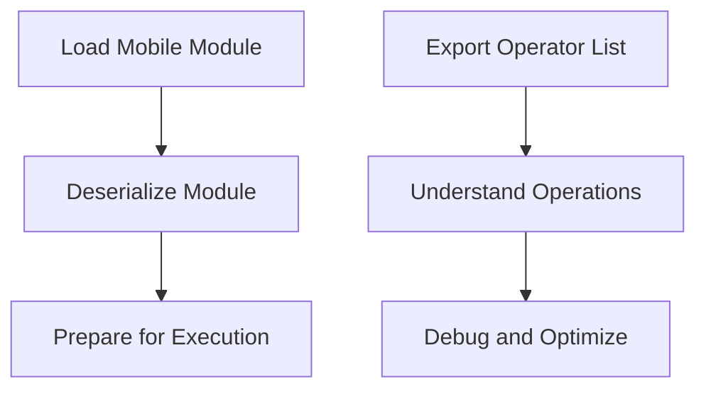

# Overview

Mobile refers to a subset of functionalities within the Jit namespace. It includes various components such as optimizers, samplers, and model runners. The <SwmToken path="torch/csrc/jit/mobile/import.cpp" pos="714:1:5" line-data="    torch::jit::mobile::Module&amp; module) {">`torch::jit::mobile`</SwmToken> namespace encapsulates these components to provide a lightweight and efficient execution environment. This environment is optimized for mobile devices, ensuring that models can be run efficiently on resource-constrained hardware.

# Components

Components like `SGDParamGroup`, <SwmToken path="torch/utils/data/sampler.py" pos="131:2:2" line-data="class RandomSampler(Sampler[int]):">`RandomSampler`</SwmToken>, and `MobileModelRunner` are part of this namespace. These components are designed to handle specific tasks such as parameter optimization, random sampling, and model execution.

# Mobile Endpoints

Mobile endpoints provide essential functionalities for loading and exporting mobile modules. These endpoints ensure that modules are correctly deserialized and ready for execution on mobile devices.

## <SwmToken path="torch/csrc/jit/mobile/import.cpp" pos="604:3:3" line-data="  return _load_for_mobile(in, device, extra_files);">`_load_for_mobile`</SwmToken>

The <SwmToken path="torch/csrc/jit/mobile/import.cpp" pos="604:3:3" line-data="  return _load_for_mobile(in, device, extra_files);">`_load_for_mobile`</SwmToken> function is used to load a mobile module from various sources such as an input stream or a file. This function ensures that the module is correctly deserialized and ready for execution on mobile devices.

<SwmSnippet path="/torch/csrc/jit/mobile/import.cpp" line="601">

---

The <SwmToken path="torch/csrc/jit/mobile/import.cpp" pos="604:3:3" line-data="  return _load_for_mobile(in, device, extra_files);">`_load_for_mobile`</SwmToken> function can load a mobile module from an input stream, a file, or a unique pointer to a <SwmToken path="torch/csrc/jit/mobile/import.cpp" pos="615:5:5" line-data="    std::unique_ptr&lt;ReadAdapterInterface&gt; rai,">`ReadAdapterInterface`</SwmToken>. This flexibility allows for various sources to be used for loading the module.

```c++
    std::istream& in,
    std::optional<at::Device> device) {
  ExtraFilesMap extra_files;
  return _load_for_mobile(in, device, extra_files);
}

mobile::Module _load_for_mobile(
    const std::string& filename,
    std::optional<at::Device> device) {
  ExtraFilesMap extra_files;
  return _load_for_mobile(filename, device, extra_files);
}

mobile::Module _load_for_mobile(
    std::unique_ptr<ReadAdapterInterface> rai,
    std::optional<c10::Device> device) {
  ExtraFilesMap extra_files;
  return _load_for_mobile(std::move(rai), device, extra_files);
}
```

---

</SwmSnippet>

## <SwmToken path="torch/csrc/jit/mobile/import.cpp" pos="713:9:9" line-data="std::set&lt;std::string&gt; _export_operator_list(">`_export_operator_list`</SwmToken>

The <SwmToken path="torch/csrc/jit/mobile/import.cpp" pos="713:9:9" line-data="std::set&lt;std::string&gt; _export_operator_list(">`_export_operator_list`</SwmToken> function exports a list of operators used in a given mobile module. This is useful for understanding the operations that the module relies on, which can be critical for debugging and optimization.

<SwmSnippet path="/torch/csrc/jit/mobile/import.cpp" line="713">

---

The <SwmToken path="torch/csrc/jit/mobile/import.cpp" pos="713:9:9" line-data="std::set&lt;std::string&gt; _export_operator_list(">`_export_operator_list`</SwmToken> function iterates over the methods in the module, extracts the operator names, and adds them to a set to ensure uniqueness. This list of operators can then be used for debugging and optimization purposes.

```c++
std::set<std::string> _export_operator_list(
    torch::jit::mobile::Module& module) {
  std::set<std::string> operator_list;
  for (Method func : module.get_methods()) {
    const Function& function = func.function();
    const auto& code = function.get_code();
    // op_names below isn't a list of unique operator names. In fact
    // it can contain the same operator name many many times, so we need
    // to de-dup the list by adding all the operator names into
    // an std::set<std::string>.
    std::vector<c10::OperatorName> const& op_names = code.op_names_;
    for (auto& op_name : op_names) {
      operator_list.insert(toString(op_name));
    }
  }
  return operator_list;
}
```

---

</SwmSnippet>

&nbsp;

*This is an auto-generated document by Swimm AI 🌊 and has not yet been verified by a human*

<SwmMeta version="3.0.0" repo-id="Z2l0aHViJTNBJTNBcHl0b3JjaC1hdXRvZG9jcy1kZW1vJTNBJTNBU3dpbW0tRGVtbw==" repo-name="pytorch-autodocs-demo"><sup>Powered by [Swimm](/)</sup></SwmMeta>
