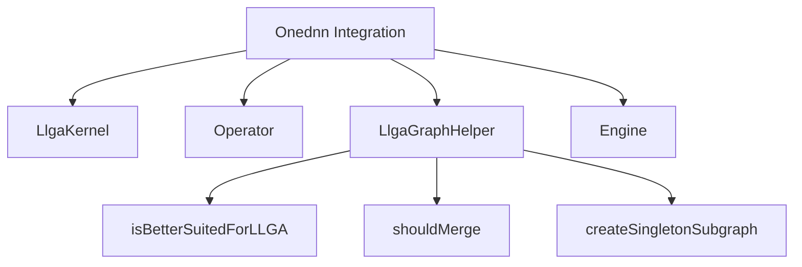

# Overview

Onednn is a namespace within the codegen directory that provides functionalities for integrating <SwmToken path="torch/csrc/jit/codegen/onednn/graph_helper.cpp" pos="470:25:25" line-data="// Except for conv &amp; GEMMs, which should always be handled by oneDNN Graph,">`oneDNN`</SwmToken> (Deep Neural Network Library) with PyTorch's JIT (Just-In-Time) compiler. It includes various components such as <SwmToken path="torch/csrc/jit/codegen/onednn/kernel.cpp" pos="15:0:0" line-data="LlgaKernel::LlgaKernel(const Node* fusionNode)">`LlgaKernel`</SwmToken>, <SwmToken path="torch/csrc/jit/codegen/onednn/operator.h" pos="12:2:2" line-data="class Operator {">`Operator`</SwmToken>, and <SwmToken path="torch/csrc/jit/codegen/onednn/kernel.cpp" pos="25:3:3" line-data="  auto llgaGraphHelper = LlgaGraphHelper(graph_);">`llgaGraphHelper`</SwmToken> to facilitate the creation, optimization, and execution of computational graphs using <SwmToken path="torch/csrc/jit/codegen/onednn/graph_helper.cpp" pos="470:25:25" line-data="// Except for conv &amp; GEMMs, which should always be handled by oneDNN Graph,">`oneDNN`</SwmToken>.

# <SwmToken path="torch/csrc/jit/codegen/onednn/kernel.cpp" pos="15:0:0" line-data="LlgaKernel::LlgaKernel(const Node* fusionNode)">`LlgaKernel`</SwmToken>

The <SwmToken path="torch/csrc/jit/codegen/onednn/kernel.cpp" pos="15:0:0" line-data="LlgaKernel::LlgaKernel(const Node* fusionNode)">`LlgaKernel`</SwmToken> class is responsible for compiling and running partitions of the computational graph, leveraging oneDNN's capabilities for optimized execution. It manages the inputs, outputs, and the compilation process of the graph partitions.

<SwmSnippet path="/torch/csrc/jit/codegen/onednn/kernel.cpp" line="15">

---

The constructor of <SwmToken path="torch/csrc/jit/codegen/onednn/kernel.cpp" pos="15:0:0" line-data="LlgaKernel::LlgaKernel(const Node* fusionNode)">`LlgaKernel`</SwmToken> initializes the kernel with the given fusion node and sets up the graph, inputs, and outputs.

```c++
LlgaKernel::LlgaKernel(const Node* fusionNode)
    : fusionNode_(fusionNode),
      graph_(fusionNode->g(attr::Subgraph)),
      nGraphInputs_(graph_->inputs().size()),
      nOutputs_(graph_->outputs().size()),
      debugName_(genDebugName()) {
  // TODO: This is a workaround to recreate the partitions here.
  // The ideal way is to use the partition serialization API (not available from
  // LLGA now) to carry a serialized string representation from graph rewrite
  // and deserialize it here.
  auto llgaGraphHelper = LlgaGraphHelper(graph_);
```

---

</SwmSnippet>

# Operator

The <SwmToken path="torch/csrc/jit/codegen/onednn/operator.h" pos="12:2:2" line-data="class Operator {">`Operator`</SwmToken> class maps <SwmToken path="torch/csrc/jit/codegen/onednn/LlgaTensorImpl.h" pos="17:23:23" line-data="// being created for each device. The device handle passed from PyTorch allows">`PyTorch`</SwmToken> operations to <SwmToken path="torch/csrc/jit/codegen/onednn/graph_helper.cpp" pos="470:25:25" line-data="// Except for conv &amp; GEMMs, which should always be handled by oneDNN Graph,">`oneDNN`</SwmToken> operations, ensuring that the computational graph can be executed efficiently using <SwmToken path="torch/csrc/jit/codegen/onednn/graph_helper.cpp" pos="470:25:25" line-data="// Except for conv &amp; GEMMs, which should always be handled by oneDNN Graph,">`oneDNN`</SwmToken>. It handles the setting of inputs and outputs for the operations.

<SwmSnippet path="/torch/csrc/jit/codegen/onednn/operator.h" line="12">

---

The constructor of <SwmToken path="torch/csrc/jit/codegen/onednn/operator.h" pos="12:2:2" line-data="class Operator {">`Operator`</SwmToken> initializes the operator with the given node and operation kind, setting up the necessary mappings.

```c
class Operator {
 public:
  Operator(const Node* node, dnnl::graph::op::kind kind)
      : n(node), o(getId(node), kind, node->kind().toQualString()), k(kind) {}

  // Returns output index if the Value is a graph output.
  // Otherwise returns -1
  int32_t graphOutputIdx(Value* v) {
    int32_t i = 0;
    for (const Value* output : v->owningGraph()->outputs()) {
      if (v == output) {
```

---

</SwmSnippet>

# <SwmToken path="torch/csrc/jit/codegen/onednn/kernel.cpp" pos="25:3:3" line-data="  auto llgaGraphHelper = LlgaGraphHelper(graph_);">`llgaGraphHelper`</SwmToken>

The <SwmToken path="torch/csrc/jit/codegen/onednn/kernel.cpp" pos="25:3:3" line-data="  auto llgaGraphHelper = LlgaGraphHelper(graph_);">`llgaGraphHelper`</SwmToken> class assists in creating and managing subgraphs that can be optimized and executed using <SwmToken path="torch/csrc/jit/codegen/onednn/graph_helper.cpp" pos="470:25:25" line-data="// Except for conv &amp; GEMMs, which should always be handled by oneDNN Graph,">`oneDNN`</SwmToken>. It includes functionalities for merging nodes, checking compatibility, and managing partitions of the computational graph.

# <SwmToken path="torch/csrc/jit/codegen/onednn/graph_helper.cpp" pos="474:4:4" line-data="static bool isBetterSuitedForLLGA(NodeKind kindOfOp) {">`isBetterSuitedForLLGA`</SwmToken> Function

The <SwmToken path="torch/csrc/jit/codegen/onednn/graph_helper.cpp" pos="474:4:4" line-data="static bool isBetterSuitedForLLGA(NodeKind kindOfOp) {">`isBetterSuitedForLLGA`</SwmToken> function determines if a node is better suited for execution using <SwmToken path="torch/csrc/jit/codegen/onednn/graph_helper.cpp" pos="470:25:25" line-data="// Except for conv &amp; GEMMs, which should always be handled by oneDNN Graph,">`oneDNN`</SwmToken> Graph. It checks specific operations that are more efficiently executed by <SwmToken path="torch/csrc/jit/codegen/onednn/graph_helper.cpp" pos="470:25:25" line-data="// Except for conv &amp; GEMMs, which should always be handled by oneDNN Graph,">`oneDNN`</SwmToken>.

<SwmSnippet path="/torch/csrc/jit/codegen/onednn/graph_helper.cpp" line="470">

---

The <SwmToken path="torch/csrc/jit/codegen/onednn/graph_helper.cpp" pos="474:4:4" line-data="static bool isBetterSuitedForLLGA(NodeKind kindOfOp) {">`isBetterSuitedForLLGA`</SwmToken> function lists specific operations that should be handled by <SwmToken path="torch/csrc/jit/codegen/onednn/graph_helper.cpp" pos="470:25:25" line-data="// Except for conv &amp; GEMMs, which should always be handled by oneDNN Graph,">`oneDNN`</SwmToken> Graph for better performance.

```c++
// Except for conv & GEMMs, which should always be handled by oneDNN Graph,
// only use single-op partitions for ops unsupported by NNC, or ops
// that oneDNN executes faster. prim::ListConstruct is an exception, since
// we simply want to fuse it with cat.
static bool isBetterSuitedForLLGA(NodeKind kindOfOp) {
  return (
      (kindOfOp == aten::layer_norm) || (kindOfOp == aten::avg_pool2d) ||
      (kindOfOp == aten::matmul) || (kindOfOp == aten::max_pool2d) ||
      (kindOfOp == aten::conv2d) || (kindOfOp == aten::_convolution) ||
      (kindOfOp == aten::mm) || (kindOfOp == aten::linear) ||
      (kindOfOp == aten::cat) || (kindOfOp == prim::ListConstruct));
}
```

---

</SwmSnippet>

# Engine Class

The <SwmToken path="torch/csrc/jit/codegen/onednn/LlgaTensorImpl.h" pos="14:2:2" line-data="// Engine represents a device and its context. From the device kind, the engine">`Engine`</SwmToken> class represents the device context for <SwmToken path="torch/csrc/jit/codegen/onednn/graph_helper.cpp" pos="470:25:25" line-data="// Except for conv &amp; GEMMs, which should always be handled by oneDNN Graph,">`oneDNN`</SwmToken>, ensuring that the correct device is used for execution. It manages the device-specific context and ensures that <SwmToken path="torch/csrc/jit/codegen/onednn/graph_helper.cpp" pos="470:25:25" line-data="// Except for conv &amp; GEMMs, which should always be handled by oneDNN Graph,">`oneDNN`</SwmToken> operates on the specified device.

<SwmSnippet path="/torch/csrc/jit/codegen/onednn/LlgaTensorImpl.h" line="14">

---

The <SwmToken path="torch/csrc/jit/codegen/onednn/LlgaTensorImpl.h" pos="14:2:2" line-data="// Engine represents a device and its context. From the device kind, the engine">`Engine`</SwmToken> class provides a singleton for the CPU engine and ensures that the correct device context is used for <SwmToken path="torch/csrc/jit/codegen/onednn/LlgaTensorImpl.h" pos="18:2:2" line-data="// oneDNN Graph implementation to work on the device specified by PyTorch, which">`oneDNN`</SwmToken> operations.

```c
// Engine represents a device and its context. From the device kind, the engine
// knows how to generate code for the target device and what kind of device
// object to be expected. The device id ensures that there is a unique engine
// being created for each device. The device handle passed from PyTorch allows
// oneDNN Graph implementation to work on the device specified by PyTorch, which
// is currently CPU, so we only have one engine.
// Ref: https://spec.oneapi.io/onednn-graph/latest/programming_model.html#engine
struct Engine {
  // CPU engine singleton
  static dnnl::engine& getEngine();
  Engine(const Engine&) = delete;
  void operator=(const Engine&) = delete;
};
```

---

</SwmSnippet>

# Enabling <SwmToken path="torch/csrc/jit/codegen/onednn/graph_helper.cpp" pos="470:25:25" line-data="// Except for conv &amp; GEMMs, which should always be handled by oneDNN Graph,">`oneDNN`</SwmToken> Graph Fusion

To enable <SwmToken path="torch/csrc/jit/codegen/onednn/graph_helper.cpp" pos="470:25:25" line-data="// Except for conv &amp; GEMMs, which should always be handled by oneDNN Graph,">`oneDNN`</SwmToken> graph fusion globally, use the function `torch.jit.enable_onednn_fusion(True)`. This function enables the fusion of computational graphs to optimize execution using <SwmToken path="torch/csrc/jit/codegen/onednn/graph_helper.cpp" pos="470:25:25" line-data="// Except for conv &amp; GEMMs, which should always be handled by oneDNN Graph,">`oneDNN`</SwmToken>.

&nbsp;

*This is an auto-generated document by Swimm AI 🌊 and has not yet been verified by a human*

<SwmMeta version="3.0.0" repo-id="Z2l0aHViJTNBJTNBcHl0b3JjaC1hdXRvZG9jcy1kZW1vJTNBJTNBU3dpbW0tRGVtbw==" repo-name="pytorch-autodocs-demo"><sup>Powered by [Swimm](/)</sup></SwmMeta>
