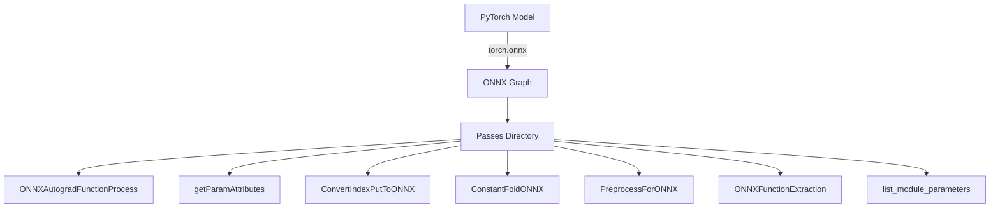

# Overview

ONNX is an open standard format for representing machine learning models. The `torch.onnx` module captures the computation graph from a native <SwmToken path="tools/nightly.py" pos="306:1:1" line-data="    pytorch, platform = &quot;&quot;, &quot;&quot;">`pytorch`</SwmToken> model and converts it into an ONNX graph. In the Passes directory, various functions and processes are implemented to facilitate the conversion of <SwmToken path="tools/nightly.py" pos="306:1:1" line-data="    pytorch, platform = &quot;&quot;, &quot;&quot;">`pytorch`</SwmToken> models to ONNX format.

# Torch->ONNX Converter

The `torch.onnx` module serves as a converter/exporter that allows users to convert <SwmToken path="tools/nightly.py" pos="306:1:1" line-data="    pytorch, platform = &quot;&quot;, &quot;&quot;">`pytorch`</SwmToken> models to the ONNX format. User-facing documentation can be found at <https://pytorch.org/docs/main/onnx.html>, and developer documentation is available at <https://github.com/pytorch/pytorch/wiki/PyTorch-ONNX-exporter>.

# Main Functions

The Passes directory contains several key functions that are essential for the conversion process from <SwmToken path="tools/nightly.py" pos="306:1:1" line-data="    pytorch, platform = &quot;&quot;, &quot;&quot;">`pytorch`</SwmToken> to ONNX. These functions handle various tasks such as transforming subgraphs, fetching model parameters, and converting indexing operations.

## ONNXAutogradFunctionProcess

The `ONNXAutogradFunctionProcess` function is used specifically for ONNX conversion, transforming subgraphs into subblocks.

## getParamAttributes

The `getParamAttributes` function fetches attributes for model parameters and prepares them for ONNX export.

## ConvertIndexPutToONNX

The `ConvertIndexPutToONNX` function converts indexing operations in <SwmToken path="tools/nightly.py" pos="306:1:1" line-data="    pytorch, platform = &quot;&quot;, &quot;&quot;">`pytorch`</SwmToken> to their ONNX equivalents.

<SwmSnippet path="/torch/csrc/jit/passes/onnx/constant_fold.cpp" line="615">

---

## <SwmToken path="torch/csrc/jit/passes/onnx/constant_fold.cpp" pos="623:2:2" line-data="void ConstantFoldONNX(Block* b, ParamMap&amp; paramsDict, int opset_version) {">`ConstantFoldONNX`</SwmToken>

The <SwmToken path="torch/csrc/jit/passes/onnx/constant_fold.cpp" pos="623:2:2" line-data="void ConstantFoldONNX(Block* b, ParamMap&amp; paramsDict, int opset_version) {">`ConstantFoldONNX`</SwmToken> function updates the computation graph to fold <SwmToken path="torch/csrc/jit/passes/onnx/constant_fold.cpp" pos="616:2:4" line-data="// constant-based computations/ops into an initializer node.">`constant-based`</SwmToken> computations into an initializer node. It is used to optimize the graph by evaluating operations on constant nodes earlier.

```c++
// This method updates the block in-place to fold all the one-time
// constant-based computations/ops into an initializer node.
//
// NB: This is not constant folding in the traditional sense, as we
// don't try particularly hard to evaluate operations on constant nodes.
// This is more of a partial evaluation analysis, where operations on constant
// nodes can be lifted so we run them earlier, before the usual parameters are
// known.
void ConstantFoldONNX(Block* b, ParamMap& paramsDict, int opset_version) {
  if (opset_version < ONNX_OPSET_9) {
    TORCH_WARN(
        "Constant folding supported for only opsets >= 9. "
        "Constant folding not applied.");
    return;
  }
  TORCH_INTERNAL_ASSERT(b->param_node());
  auto valsToParamsMap = buildValueToParamsMap(b, paramsDict);
  // Only the root block is constant-folded. Folding nested blocks is
  // not supported for now.
  for (auto it = b->nodes().begin(), end = b->nodes().end(); it != end; ++it) {
    auto node = *it;
```

---

</SwmSnippet>

<SwmSnippet path="/torch/csrc/jit/passes/onnx/preprocess_for_onnx.cpp" line="223">

---

## <SwmToken path="torch/csrc/jit/passes/onnx/preprocess_for_onnx.cpp" pos="223:2:2" line-data="void PreprocessForONNX(std::shared_ptr&lt;Graph&gt;&amp; graph) {">`PreprocessForONNX`</SwmToken>

The <SwmToken path="torch/csrc/jit/passes/onnx/preprocess_for_onnx.cpp" pos="223:2:2" line-data="void PreprocessForONNX(std::shared_ptr&lt;Graph&gt;&amp; graph) {">`PreprocessForONNX`</SwmToken> function prepares the computation graph for ONNX export by performing various transformations such as fusing nodes and replacing operations with their ONNX equivalents.

```c++
void PreprocessForONNX(std::shared_ptr<Graph>& graph) {
  FuseWithListUnpack(graph->block());
  GRAPH_DUMP("After FuseWithListUnpack: ", graph);
  ReplaceAddWithConcat(graph->block());
  GRAPH_DUMP("After ReplaceAddWithConcat: ", graph);
  fuseListAndListUnpack(graph->block());
  GRAPH_DUMP("After fuseListAndListUnpack: ", graph);
}
```

---

</SwmSnippet>

<SwmSnippet path="/torch/csrc/jit/passes/onnx/function_extraction.h" line="56">

---

## <SwmToken path="torch/csrc/jit/passes/onnx/function_extraction.h" pos="56:4:4" line-data="TORCH_API NodeAttrNameMap ONNXFunctionExtraction(">`ONNXFunctionExtraction`</SwmToken>

The <SwmToken path="torch/csrc/jit/passes/onnx/function_extraction.h" pos="56:4:4" line-data="TORCH_API NodeAttrNameMap ONNXFunctionExtraction(">`ONNXFunctionExtraction`</SwmToken> function is used to extract function information from a graph. It converts subgraph patterns of functions into local function nodes and replaces them with single nodes reflecting the local function node type.

```c
TORCH_API NodeAttrNameMap ONNXFunctionExtraction(
    std::shared_ptr<Graph>& graph,
    const std::unordered_set<std::string>& module_names,
    const std::vector<std::string>& param_names);
```

---

</SwmSnippet>

<SwmSnippet path="/torch/csrc/jit/passes/onnx/list_model_parameters.h" line="9">

---

## <SwmToken path="torch/csrc/jit/passes/onnx/list_model_parameters.h" pos="9:16:16" line-data="TORCH_API std::pair&lt;Module, std::vector&lt;IValue&gt;&gt; list_module_parameters(">`list_module_parameters`</SwmToken>

The <SwmToken path="torch/csrc/jit/passes/onnx/list_model_parameters.h" pos="9:16:16" line-data="TORCH_API std::pair&lt;Module, std::vector&lt;IValue&gt;&gt; list_module_parameters(">`list_module_parameters`</SwmToken> function lists the parameters of a given module. It returns a pair consisting of the module and a vector of its parameters.

```c
TORCH_API std::pair<Module, std::vector<IValue>> list_module_parameters(
    const Module& module);
```

---

</SwmSnippet>

&nbsp;

*This is an auto-generated document by Swimm AI 🌊 and has not yet been verified by a human*

<SwmMeta version="3.0.0" repo-id="Z2l0aHViJTNBJTNBcHl0b3JjaC1hdXRvZG9jcy1kZW1vJTNBJTNBU3dpbW0tRGVtbw==" repo-name="pytorch-autodocs-demo"><sup>Powered by [Swimm](/)</sup></SwmMeta>
