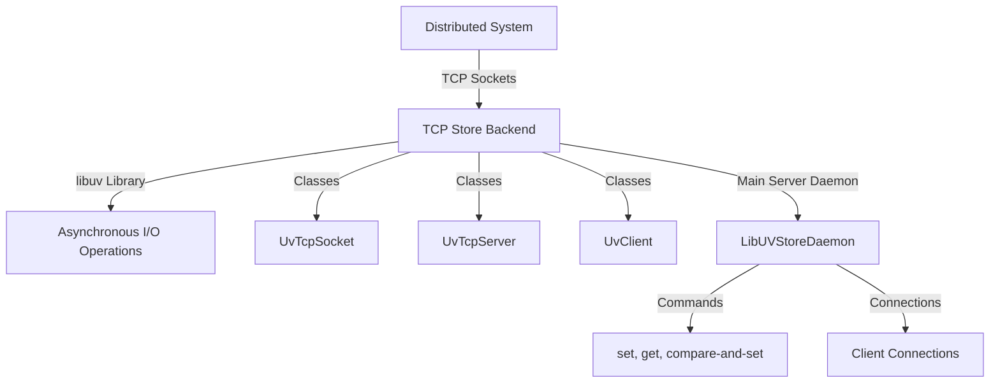

# Overview

The TCP Store Backend is a component that facilitates communication between different processes in a distributed system using TCP sockets. It is implemented using the libuv library, which provides asynchronous I/O operations.

# Key Classes

The backend includes several key classes to manage TCP connections and handle client-server interactions.

## <SwmToken path="torch/csrc/distributed/c10d/TCPStoreLibUvBackend.cpp" pos="90:2:2" line-data="class UvTcpSocket : public UvHandle {">`UvTcpSocket`</SwmToken>

The <SwmToken path="torch/csrc/distributed/c10d/TCPStoreLibUvBackend.cpp" pos="90:2:2" line-data="class UvTcpSocket : public UvHandle {">`UvTcpSocket`</SwmToken> class is used to manage individual TCP connections.

<SwmSnippet path="/torch/csrc/distributed/c10d/TCPStoreLibUvBackend.cpp" line="90">

---

The <SwmToken path="torch/csrc/distributed/c10d/TCPStoreLibUvBackend.cpp" pos="90:2:2" line-data="class UvTcpSocket : public UvHandle {">`UvTcpSocket`</SwmToken> class provides methods to manage TCP connections, such as <SwmToken path="torch/csrc/distributed/c10d/TCPStoreLibUvBackend.cpp" pos="93:8:8" line-data="  c10::intrusive_ptr&lt;UvTcpSocket&gt; iptr() {">`iptr`</SwmToken> and <SwmToken path="torch/csrc/distributed/c10d/TCPStoreLibUvBackend.cpp" pos="97:10:10" line-data="  static c10::intrusive_ptr&lt;UvTcpSocket&gt; borrow(uv_stream_t* handle) {">`borrow`</SwmToken>.

```c++
class UvTcpSocket : public UvHandle {
  uv_tcp_t client{};

  c10::intrusive_ptr<UvTcpSocket> iptr() {
    return c10::intrusive_ptr<UvTcpSocket>::reclaim_copy(this);
  }

  static c10::intrusive_ptr<UvTcpSocket> borrow(uv_stream_t* handle) {
    auto h = (UvTcpSocket*)uv_handle_get_data((uv_handle_t*)handle);
    return h->iptr();
  }
```

---

</SwmSnippet>

## <SwmToken path="torch/csrc/distributed/c10d/TCPStoreLibUvBackend.cpp" pos="184:2:2" line-data="class UvTcpServer : public UvTcpSocket {">`UvTcpServer`</SwmToken>

The <SwmToken path="torch/csrc/distributed/c10d/TCPStoreLibUvBackend.cpp" pos="184:2:2" line-data="class UvTcpServer : public UvTcpSocket {">`UvTcpServer`</SwmToken> class handles incoming client connections and manages server-side operations.

<SwmSnippet path="/torch/csrc/distributed/c10d/TCPStoreLibUvBackend.cpp" line="184">

---

The <SwmToken path="torch/csrc/distributed/c10d/TCPStoreLibUvBackend.cpp" pos="184:2:2" line-data="class UvTcpServer : public UvTcpSocket {">`UvTcpServer`</SwmToken> class includes methods like <SwmToken path="torch/csrc/distributed/c10d/TCPStoreLibUvBackend.cpp" pos="190:10:10" line-data="  static c10::intrusive_ptr&lt;UvTcpServer&gt; makeWithSocket(">`makeWithSocket`</SwmToken> to initialize the server with a given socket.

```c++
class UvTcpServer : public UvTcpSocket {
 public:
  typedef std::function<void(int)> OnConnectCallback;
  explicit UvTcpServer(uv_loop_t* loop)
      : UvTcpSocket(loop), onConnectCb(missingOnConnect) {}

  static c10::intrusive_ptr<UvTcpServer> makeWithSocket(
      uv_loop_t* loop,
      int socket) {
    auto res = c10::make_intrusive<UvTcpServer>(loop);
    res->handleReady();
    try {
      int uv_res = uv_tcp_open((uv_tcp_t*)res->unsafeGetStream(), socket);
      TORCH_CHECK(
          uv_res == 0,
          "Failed to open existing socket. ",
          "socket: ",
          socket,
          ", code: ",
          uv_res,
          ", name: ",
```

---

</SwmSnippet>

## <SwmToken path="torch/csrc/distributed/c10d/TCPStoreLibUvBackend.cpp" pos="1021:7:7" line-data="  auto client = UvClient::make(&amp;loop, this);">`UvClient`</SwmToken>

The <SwmToken path="torch/csrc/distributed/c10d/TCPStoreLibUvBackend.cpp" pos="1021:7:7" line-data="  auto client = UvClient::make(&amp;loop, this);">`UvClient`</SwmToken> class manages client-side operations and interactions with the server.

# Main Server Daemon

The <SwmToken path="torch/csrc/distributed/c10d/TCPStoreLibUvBackend.cpp" pos="596:2:2" line-data="class LibUVStoreDaemon : public BackgroundThread {">`LibUVStoreDaemon`</SwmToken> class acts as the main server daemon, managing client connections, storing key-value pairs, and handling various commands like set, get, and compare-and-set.

<SwmSnippet path="/torch/csrc/distributed/c10d/TCPStoreLibUvBackend.cpp" line="596">

---

The <SwmToken path="torch/csrc/distributed/c10d/TCPStoreLibUvBackend.cpp" pos="596:2:2" line-data="class LibUVStoreDaemon : public BackgroundThread {">`LibUVStoreDaemon`</SwmToken> class includes methods for managing key-value pairs and client connections.

```c++
class LibUVStoreDaemon : public BackgroundThread {
 public:
  explicit LibUVStoreDaemon(int port);
  ~LibUVStoreDaemon() override;

  uint16_t port() const override;

  void set(const std::string& key, const std::vector<uint8_t>& value);
  const std::vector<uint8_t>& compareAndSet(
      const std::string& key,
      const std::vector<uint8_t>& expectedValue,
      const std::vector<uint8_t>& newValue);
  const std::vector<uint8_t>& get(const std::string& key);
  int64_t add(const std::string& key, int64_t addVal);
  bool checkKeys(const std::vector<std::string>& keys);
  bool waitKeys(
      const std::vector<std::string>& keys,
      const c10::intrusive_ptr<UvHandle>& client);
  int64_t size();
  int64_t deleteKey(const std::string& key);
  void append(const std::string& key, const std::vector<uint8_t>& value);
```

---

</SwmSnippet>

# Core Functions

Several core functions are essential for the TCP Store Backend's operation.

## send

The <SwmToken path="torch/csrc/distributed/c10d/TCPStoreLibUvBackend.cpp" pos="398:3:3" line-data="  void send() {">`send`</SwmToken> function is responsible for writing data to a TCP connection, ensuring the data is properly buffered and sent asynchronously.

<SwmSnippet path="/torch/csrc/distributed/c10d/TCPStoreLibUvBackend.cpp" line="398">

---

The <SwmToken path="torch/csrc/distributed/c10d/TCPStoreLibUvBackend.cpp" pos="398:3:3" line-data="  void send() {">`send`</SwmToken> function handles the asynchronous writing of data to a TCP connection.

```c++
  void send() {
    buf = uv_buf_init((char*)data.data(), data.size());
    int res = uv_write(
        &req, (uv_stream_t*)handle->unsafeGetHandle(), &buf, 1, write_done);

    if (res) {
      C10D_WARNING(
          "Write setup to client failed. code:{} name:{} desc:{}.",
          res,
          uv_err_name(res),
          uv_strerror(res));
      handle->close();
    } else {
      /* This object was successfully registered with the event loop, so keep it
       * alive until it's unregistered. */
      registeredInLoop();
    }
  }
```

---

</SwmSnippet>

<SwmSnippet path="/torch/csrc/distributed/c10d/TCPStoreLibUvBackend.cpp" line="54">

---

The <SwmToken path="torch/csrc/distributed/c10d/TCPStoreLibUvBackend.cpp" pos="54:3:3" line-data="  void close() {">`close`</SwmToken> function ensures that TCP connections are closed gracefully.

```c++
  void close() {
    if (uv_is_closing(unsafeGetHandle())) {
      return;
    }
    uv_close(unsafeGetHandle(), on_close);
  }
```

---

</SwmSnippet>

## <SwmToken path="torch/csrc/distributed/c10d/TCPStoreLibUvBackend.cpp" pos="64:3:3" line-data="  void handleReady() {">`handleReady`</SwmToken>

The <SwmToken path="torch/csrc/distributed/c10d/TCPStoreLibUvBackend.cpp" pos="64:3:3" line-data="  void handleReady() {">`handleReady`</SwmToken> function registers a TCP handle with the event loop, making it ready for I/O operations.

<SwmSnippet path="/torch/csrc/distributed/c10d/TCPStoreLibUvBackend.cpp" line="64">

---

The <SwmToken path="torch/csrc/distributed/c10d/TCPStoreLibUvBackend.cpp" pos="64:3:3" line-data="  void handleReady() {">`handleReady`</SwmToken> function prepares a TCP handle for I/O operations.

```c++
  void handleReady() {
    /*
    This method must be called once the handle is ready and registered with the
    loop.

    Do not call this in the ctor, make_intrusive reset refcounts to one after
    construction.
    */
    uv_handle_set_data(unsafeGetHandle(), this);
    at::raw::intrusive_ptr::incref(this);
  }
```

---

</SwmSnippet>

## <SwmToken path="torch/csrc/distributed/c10d/TCPStoreLibUvBackend.cpp" pos="147:3:3" line-data="  void startRead() {">`startRead`</SwmToken>

The <SwmToken path="torch/csrc/distributed/c10d/TCPStoreLibUvBackend.cpp" pos="147:3:3" line-data="  void startRead() {">`startRead`</SwmToken> function sets up a read callback for a TCP connection, enabling the server to read data from the client.

<SwmSnippet path="/torch/csrc/distributed/c10d/TCPStoreLibUvBackend.cpp" line="147">

---

The <SwmToken path="torch/csrc/distributed/c10d/TCPStoreLibUvBackend.cpp" pos="147:3:3" line-data="  void startRead() {">`startRead`</SwmToken> function initializes the read callback for a TCP connection.

```c++
  void startRead() {
    int res = uv_read_start((uv_stream_t*)&client, alloc_buffer, read_callback);
    if (res) {
      C10D_WARNING(
          "Failed to setup read callback. client:{} code:{} name:{} desc:{}.",
          (void*)this,
          res,
          uv_err_name(res),
          uv_strerror(res));
      close();
    }
  }
```

---

</SwmSnippet>

## <SwmToken path="torch/csrc/distributed/c10d/TCPStoreLibUvBackend.cpp" pos="670:3:3" line-data="  void processBuf(const uv_buf_t* buf, size_t nread) override {">`processBuf`</SwmToken>

The <SwmToken path="torch/csrc/distributed/c10d/TCPStoreLibUvBackend.cpp" pos="670:3:3" line-data="  void processBuf(const uv_buf_t* buf, size_t nread) override {">`processBuf`</SwmToken> function processes the data read from a TCP connection, handling various commands like set, get, and compare-and-set.

<SwmSnippet path="/torch/csrc/distributed/c10d/TCPStoreLibUvBackend.cpp" line="670">

---

The <SwmToken path="torch/csrc/distributed/c10d/TCPStoreLibUvBackend.cpp" pos="670:3:3" line-data="  void processBuf(const uv_buf_t* buf, size_t nread) override {">`processBuf`</SwmToken> function handles the processing of data read from a TCP connection.

```c++
  void processBuf(const uv_buf_t* buf, size_t nread) override {
    auto tmp = *buf;
    tmp.len = nread;
    stream.append(tmp);

    while (true) {
      stream.reset();
      uint8_t command = -1;
      if (!stream.read1(command))
        break;
      if (store->isMiscellaneousClient(iptr())) {
        if ((QueryType)command != QueryType::VALIDATE)
          return;
        if (!parse_validate_command())
          return;
      } else {
        switch ((QueryType)command) {
          case QueryType::PING:
            if (!parse_ping_command())
              return;
            break;
```

---

</SwmSnippet>

## <SwmToken path="torch/csrc/distributed/c10d/TCPStoreLibUvBackend.cpp" pos="1020:4:4" line-data="void LibUVStoreDaemon::onConnect(int status) {">`onConnect`</SwmToken>

The <SwmToken path="torch/csrc/distributed/c10d/TCPStoreLibUvBackend.cpp" pos="1020:4:4" line-data="void LibUVStoreDaemon::onConnect(int status) {">`onConnect`</SwmToken> function handles new client connections, registering the client and starting the read process.

<SwmSnippet path="/torch/csrc/distributed/c10d/TCPStoreLibUvBackend.cpp" line="1020">

---

The <SwmToken path="torch/csrc/distributed/c10d/TCPStoreLibUvBackend.cpp" pos="1020:4:4" line-data="void LibUVStoreDaemon::onConnect(int status) {">`onConnect`</SwmToken> function manages new client connections and initiates the read process.

```c++
void LibUVStoreDaemon::onConnect(int status) {
  auto client = UvClient::make(&loop, this);
  registerClient(client);
  try {
    tcpServer->accept(client);
    client->startRead();
  } catch (std::exception& e) {
    C10D_WARNING("Failed to accept client due to {}", e.what());
    client->close();
  }
}
```

---

</SwmSnippet>

## init

The <SwmToken path="torch/csrc/distributed/c10d/TCPStoreLibUvBackend.cpp" pos="1038:4:4" line-data="void LibUVStoreDaemon::init(const TCPStoreOptions&amp; opts) {">`init`</SwmToken> function initializes the TCP server, setting up the server socket and the connection callback.

<SwmSnippet path="/torch/csrc/distributed/c10d/TCPStoreLibUvBackend.cpp" line="1038">

---

The <SwmToken path="torch/csrc/distributed/c10d/TCPStoreLibUvBackend.cpp" pos="1038:4:4" line-data="void LibUVStoreDaemon::init(const TCPStoreOptions&amp; opts) {">`init`</SwmToken> function sets up the TCP server and its connection callback.

```c++
void LibUVStoreDaemon::init(const TCPStoreOptions& opts) {
  if (opts.masterListenFd.has_value()) {
    tcpServer = UvTcpServer::makeWithSocket(&loop, *opts.masterListenFd);
  } else {
    try {
      tcpServer = UvTcpServer::makeWithPort(&loop, opts.port, /*useIpv6=*/true);
    } catch (std::exception& ex) {
      C10D_INFO(
          "Failed to bind to ipv6 address, trying ipv4. Error: {}", ex.what());
      tcpServer =
          UvTcpServer::makeWithPort(&loop, opts.port, /*useIpv6=*/false);
    }
  }
  tcpServer->setOnConnectCallback(
      [this](auto status) { this->onConnect(status); });

  port_ = tcpServer->port();
  TORCH_CHECK(
      port_ == opts.port || opts.port == 0, // zero means use any port
      "listen fd ",
      *opts.masterListenFd,
```

---

</SwmSnippet>

## stop

The <SwmToken path="torch/csrc/distributed/c10d/TCPStoreLibUvBackend.cpp" pos="1141:4:4" line-data="void LibUVStoreDaemon::stop() {">`stop`</SwmToken> function stops the TCP server, sending an exit signal and closing the event loop.

<SwmSnippet path="/torch/csrc/distributed/c10d/TCPStoreLibUvBackend.cpp" line="1141">

---

The <SwmToken path="torch/csrc/distributed/c10d/TCPStoreLibUvBackend.cpp" pos="1141:4:4" line-data="void LibUVStoreDaemon::stop() {">`stop`</SwmToken> function sends an exit signal and closes the event loop.

```c++
void LibUVStoreDaemon::stop() {
  int res = uv_async_send(&exit_handle);
  if (res) {
    C10D_WARNING(
        "uv_async_send failed with:{} errn:{} desc:{}\n",
        res,
        uv_err_name(res),
        uv_strerror(res));
  }
}
```

---

</SwmSnippet>

## append

The <SwmToken path="torch/csrc/distributed/c10d/TCPStoreLibUvBackend.cpp" pos="616:3:3" line-data="  void append(const std::string&amp; key, const std::vector&lt;uint8_t&gt;&amp; value);">`append`</SwmToken> function appends data to an existing key in the TCP store, waking up any clients waiting on that key.

<SwmSnippet path="/torch/csrc/distributed/c10d/TCPStoreLibUvBackend.cpp" line="1289">

---

The <SwmToken path="torch/csrc/distributed/c10d/TCPStoreLibUvBackend.cpp" pos="1289:4:4" line-data="void LibUVStoreDaemon::append(">`append`</SwmToken> function adds data to an existing key and wakes up waiting clients.

```c++
void LibUVStoreDaemon::append(
    const std::string& key,
    const std::vector<uint8_t>& value) {
  std::vector<uint8_t> oldData;
  auto it = tcpStore_.find(key);
  if (it != tcpStore_.end()) {
    it->second.insert(it->second.end(), value.begin(), value.end());
  } else {
    tcpStore_[key] = value;
  }

  // we should not have clients waiting if we're appending, so it's all fine
  wakeupWaitingClients(key);
}
```

---

</SwmSnippet>

&nbsp;

*This is an auto-generated document by Swimm AI 🌊 and has not yet been verified by a human*

<SwmMeta version="3.0.0" repo-id="Z2l0aHViJTNBJTNBcHl0b3JjaC1hdXRvZG9jcy1kZW1vJTNBJTNBU3dpbW0tRGVtbw==" repo-name="pytorch-autodocs-demo"><sup>Powered by [Swimm](/)</sup></SwmMeta>
