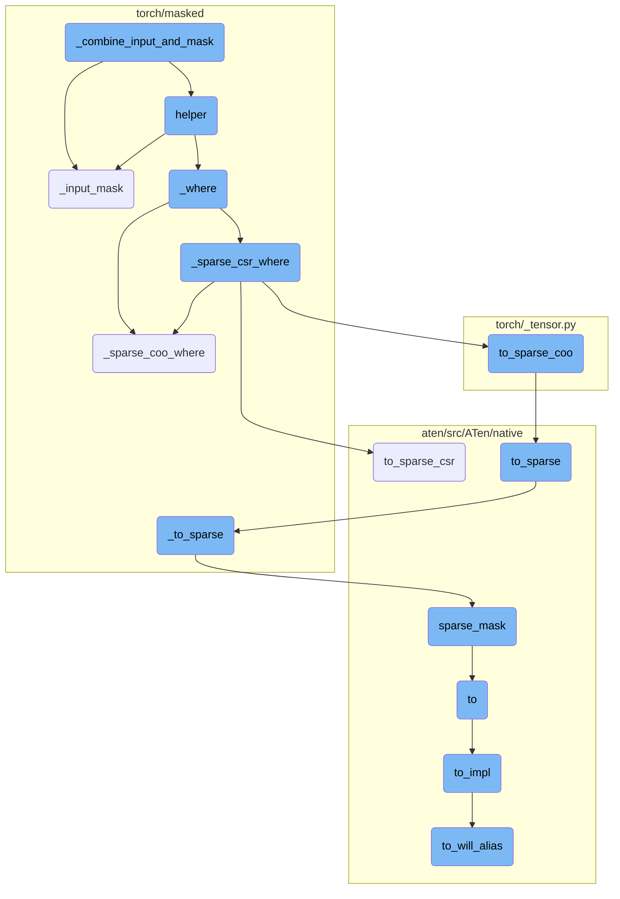
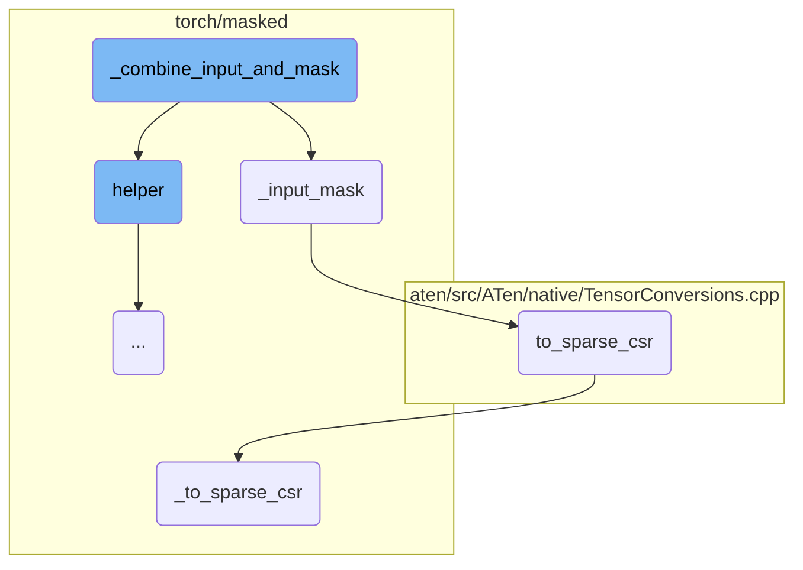
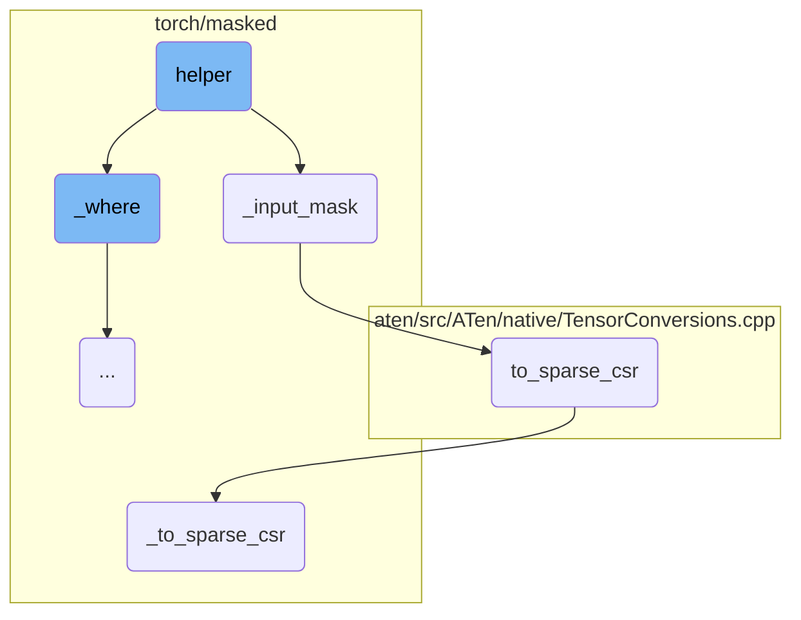
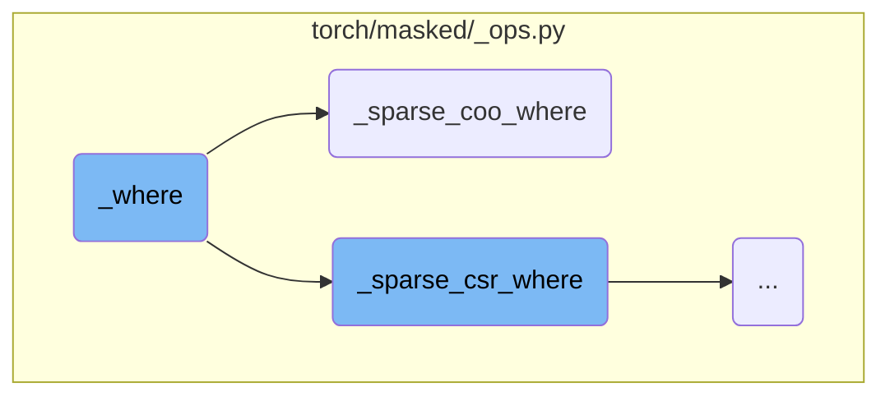
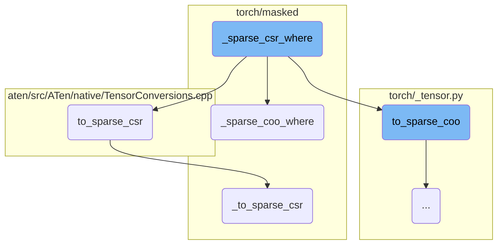
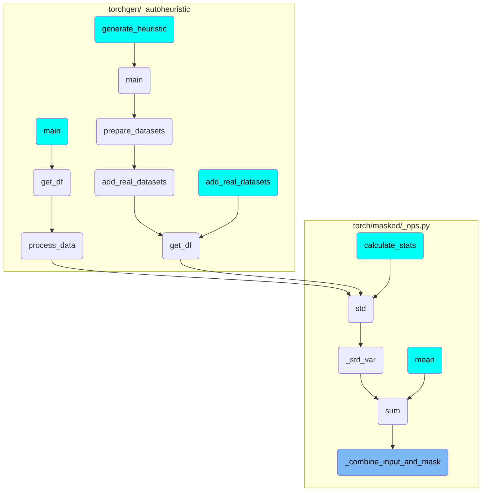

```mermaid
graph TD;
      subgraph atensrcATennative["aten/src/ATen/native"]
6ceef286defba2add1c403523e240219efa5af3dec1847c840021d70e6eb61b4(to_sparse_coo):::mainFlowStyle --> 7c47e548111ee66e0a3dc89d8f66130d48379126f808076838ee79154a8ce50f(to_sparse):::mainFlowStyle
end

7c47e548111ee66e0a3dc89d8f66130d48379126f808076838ee79154a8ce50f(to_sparse):::mainFlowStyle --> 5e324b1448304ef4994b5111bdbacfd1b9299fc9580aa322ee36a24edccd1fe3(_to_sparse):::mainFlowStyle

subgraph atensrcATennative["aten/src/ATen/native"]
5e324b1448304ef4994b5111bdbacfd1b9299fc9580aa322ee36a24edccd1fe3(_to_sparse):::mainFlowStyle --> ae295fb7162d0ba66aee2667db90fe99db5d9e02c4da7cbeb5684e0990169d07(sparse_mask):::mainFlowStyle
end

subgraph atensrcATennative["aten/src/ATen/native"]
ae295fb7162d0ba66aee2667db90fe99db5d9e02c4da7cbeb5684e0990169d07(sparse_mask):::mainFlowStyle --> bb7719c77d2cefb1b8a50cd80e92a322fa483d55f0c953b7e0b214fa58e6da6f(to):::mainFlowStyle
end

subgraph atensrcATennative["aten/src/ATen/native"]
bb7719c77d2cefb1b8a50cd80e92a322fa483d55f0c953b7e0b214fa58e6da6f(to):::mainFlowStyle --> b45ae6d7af4490a12513853ac6ee0c1f051818bc7d9a6e98d6cf5e983a482d38(to_impl):::mainFlowStyle
end

subgraph atensrcATennative["aten/src/ATen/native"]
b45ae6d7af4490a12513853ac6ee0c1f051818bc7d9a6e98d6cf5e983a482d38(to_impl):::mainFlowStyle --> feb53be770826b581f11d5c5067652460fd090707bc110d856720d44c46eb217(to_will_alias):::mainFlowStyle
end


      classDef mainFlowStyle color:#000000,fill:#7CB9F4
classDef rootsStyle color:#000000,fill:#00FFF4
classDef Style1 color:#000000,fill:#00FFAA
classDef Style2 color:#000000,fill:#FFFF00
classDef Style3 color:#000000,fill:#AA7CB9
```

This document explains the process of combining an input tensor with a mask. The process involves generating a canonical mask, applying the mask to the input tensor, and handling sparse tensor formats.

The flow starts by checking if a mask is provided. If no mask is given, the input tensor is returned as is. If a mask is provided, a canonical mask is generated to match the shape and layout of the input tensor. This canonical mask is then used to apply the mask to the input tensor, ensuring that masked elements are processed correctly. The process also handles sparse tensor formats, converting tensors to sparse formats when necessary and applying the mask accordingly.

Here is a high level diagram of the flow, showing only the most important functions:



# Flow drill down

First, we'll zoom into this section of the flow:



<SwmSnippet path="/torch/masked/_ops.py" line="989">

---

## \_combine_input_and_mask

`_combine_input_and_mask` is responsible for combining an input tensor with a mask. It uses a helper function to handle the mask and input, ensuring that masked elements are appropriately processed. If the mask is `None`, it returns the input directly. Otherwise, it calls `_input_mask` to get a canonical mask and applies the operation using `_where`.

```python
def _combine_input_and_mask(
    op, input: Union[MaskedTensor, Tensor], mask, *args
) -> Tensor:
    def helper(input, mask):
        if mask is None:
            return input
        canonical_mask = _input_mask(input, mask=mask)
        if callable(op):
            fill_value = _reduction_identity(op.__name__, input, *args)
            return _where(canonical_mask, input, fill_value)
        else:
            raise ValueError(
                f"_combine_input_and_mask expected masked operation (got {type(op).__name__} object)"
            )

    class Combine(torch.autograd.Function):
        @staticmethod
        def forward(ctx, input, mask):
            """Return input with masked-out elements eliminated for the given operations."""
            ctx.save_for_backward(mask)

```

---

</SwmSnippet>

<SwmSnippet path="/torch/masked/_ops.py" line="858">

---

## \_input_mask

`_input_mask` generates a canonical input mask that matches the shape and layout of the input tensor. It ensures the mask is a boolean tensor and handles broadcasting and layout conversions. This function is crucial for maintaining consistency between the input tensor and its mask, which is then used by `_combine_input_and_mask`.

```python
def _input_mask(input: Union[Tensor, MaskedTensor], *args, **kwargs) -> Tensor:
    """Return canonical input mask.

    A canonical input mask is defined as a boolean mask tensor that
    shape and layout matches with the shape and the layout of the
    input.

    The canonical input mask is computed from the :attr:`mask` tensor
    content to meet the following criteria:

    1. The shape of the canonical input mask is the same as the shape
       of :attr:`input` tensor. If the mask tensor has a smaller shape
       than the shape of the :attr:`input`, broadcasting rules will be
       applied. Downcasting of mask is not supported.

    2. The layout of the canonical input mask is the same as the
       layout of the :attr:`input` tensor. If the mask has different
       layout, it will be converted to the expected layout.  In the
       case of sparse COO layout, the canonical input mask will be
       coalesced.

```

---

</SwmSnippet>

<SwmSnippet path="/aten/src/ATen/native/TensorConversions.cpp" line="1979">

---

## to_sparse_csr

`to_sparse_csr` converts a tensor to a sparse CSR (Compressed Sparse Row) format. If the tensor is already in this format, it returns the tensor as is. Otherwise, it calls `_to_sparse_csr` to perform the conversion.

```c++
Tensor to_sparse_csr(const Tensor& self, std::optional<int64_t> dense_dim_opt) {
  auto layout_to = kSparseCsr;
  if (self.layout() == layout_to) {
    _to_sparse_check_arguments("to_sparse_csr", self, layout_to, {}, dense_dim_opt);
    return self;
  }
  return self._to_sparse_csr(dense_dim_opt);
}
```

---

</SwmSnippet>

<SwmSnippet path="/torch/masked/maskedtensor/_ops_refs.py" line="444">

---

## \_to_sparse_csr

`_to_sparse_csr` is a helper function that ensures the input is a tensor and converts it to a sparse CSR format if it is not already. It creates a new masked tensor with the data and mask in sparse CSR format.

```python
def _to_sparse_csr(func, *args, **kwargs):
    _check_args_kwargs_length(
        args, kwargs, f"__torch_dispatch__, {func}", len_args=1, len_kwargs=0
    )
    if not torch.is_tensor(args[0]):
        raise ValueError("__torch_dispatch__, {func}: expected args[0] to be a tensor")
    mt = args[0]
    if not is_masked_tensor(mt):
        mt = MaskedTensor(mt, torch.ones_like(mt).bool())
    if mt.is_sparse_csr():
        return mt
    new_mask = func(_maybe_get_mask(args[0]))
    new_data = _get_data(args[0]).sparse_mask(new_mask)
    return MaskedTensor(new_data, new_mask)
```

---

</SwmSnippet>

Now, lets zoom into this section of the flow:



<SwmSnippet path="/torch/masked/_ops.py" line="992">

---

## Handling Mask and Input

The `helper` function is responsible for processing the input and mask. If the mask is `None`, it simply returns the input. Otherwise, it generates a canonical mask using `_input_mask` and applies the `_where` function to combine the input and mask.

```python
    def helper(input, mask):
        if mask is None:
            return input
        canonical_mask = _input_mask(input, mask=mask)
        if callable(op):
            fill_value = _reduction_identity(op.__name__, input, *args)
            return _where(canonical_mask, input, fill_value)
        else:
            raise ValueError(
                f"_combine_input_and_mask expected masked operation (got {type(op).__name__} object)"
            )
```

---

</SwmSnippet>

<SwmSnippet path="/torch/masked/_ops.py" line="995">

---

### Generating Canonical Mask

The `helper` function calls `_input_mask` to generate a canonical mask from the input and mask.

```python
        canonical_mask = _input_mask(input, mask=mask)
```

---

</SwmSnippet>

<SwmSnippet path="/torch/masked/_ops.py" line="998">

---

### Applying the Where Function

If the operation is callable, the `helper` function uses `_where` to apply the canonical mask to the input, filling in values as needed.

```python
            return _where(canonical_mask, input, fill_value)
```

---

</SwmSnippet>

Now, lets zoom into this section of the flow:



<SwmSnippet path="/torch/masked/_ops.py" line="822">

---

## \_where

`_where` is a function that extends `torch.where` to support sparse inputs. It ensures that the resulting tensor maintains the values of the input tensor for masked-in elements and replaces masked-out elements with a specified fill value. Depending on the layout of the mask tensor, it delegates the operation to either `_sparse_coo_where` or `_sparse_csr_where`.

```python
def _where(mask: Tensor, input: Tensor, fill_value: Tensor) -> Tensor:
    """torch.where with sparse inputs support.

    _where implements the following invariant:

      _where(mask, input, fill_value).to_dense(fill_value) ==
        torch.where(mask.to_dense(), input.to_dense(), torch.full(input.shape, fill_value))

    where `a == b` means `assertEqual(a, b)`, mask is boolean sparse
    tensor, and `to_dense(fill_value)` is like `to_dense()` except
    that the unspecified elements are mapped to `fill_value` rather
    than to `0`.

    Returns a sparse tensor with the following features:

    - all specified elements correspond to masked-in elements that
      have the values of the input tensor. If there exists a masked-in
      element (as specified by mask) that is not specified in the
      input, in the result tensor, the corresponding element has value
      0. In the dense part of the sparse tensor, the masked-out
      elements are replaced with fill_value.
```

---

</SwmSnippet>

<SwmSnippet path="/torch/masked/_ops.py" line="496">

---

## \_sparse_coo_where

`_sparse_coo_where` handles the case where the mask tensor is in COO (Coordinate) format. It performs operations to determine the intersection and difference of indices between the mask and input tensors, ensuring that the resulting sparse tensor correctly reflects the masked-in and masked-out elements.

```python
def _sparse_coo_where(mask: Tensor, input: Tensor, fill_value: Tensor) -> Tensor:
    """Sparse variant of torch.where. Supports sparse COO and hybrid sparse COO tensors.

    _sparse_coo_where implements the following invariant:

      _sparse_coo_where(mask, input, fill_value).to_dense(fill_value) ==
        torch.where(mask.to_dense(), input.to_dense(), torch.full(input.shape, fill_value))

    where `a == b` means `assertEqual(a, b)`, mask is boolean sparse
    tensor, and `to_dense(fill_value)` is like `to_dense()` except
    that the unspecified elements are mapped to `fill_value` rather
    than to `0`.

    Returns a sparse COO tensor with the following features:

    - all specified elements correspond to masked-in elements that
      have the values of the input tensor. If there exists a masked-in
      element (as specified by mask) that is not specified in the
      input, in the result tensor, the corresponding element has value
      0. In the dense part of the sparse tensor, the masked-out
      elements are replaced with fill_value.
```

---

</SwmSnippet>

Now, lets zoom into this section of the flow:



<SwmSnippet path="/torch/masked/_ops.py" line="814">

---

## \_sparse_csr_where

The function `_sparse_csr_where` is a sparse variant of `torch.where` that supports sparse CSR tensors. It converts the input tensors to sparse COO format, applies the `_sparse_coo_where` function, and then converts the result back to sparse CSR format. This function is crucial for efficiently handling sparse data in CSR format.

```python
def _sparse_csr_where(mask: Tensor, input: Tensor, fill_value: Tensor) -> Tensor:
    """Sparse variant of torch.where. Supports sparse CSR tensors."""
    # TODO: implement sparse CSR specific where operator for efficiency
    return _sparse_coo_where(
        mask.to_sparse_coo(), input.to_sparse_coo(), fill_value
    ).to_sparse_csr()
```

---

</SwmSnippet>

Now, lets zoom into this section of the flow:



<SwmSnippet path="/torch/_tensor.py" line="1376">

---

## Converting to Sparse COO Format

The function `to_sparse_coo` converts a dense tensor to a sparse COO (Coordinate) format. This is useful for efficiently storing and manipulating tensors with a large number of zero elements. The function internally calls `self.to_sparse()` to perform the conversion.

```python
    def to_sparse_coo(self):
        """Convert a tensor to :ref:`coordinate format <sparse-coo-docs>`.

        Examples::

             >>> dense = torch.randn(5, 5)
             >>> sparse = dense.to_sparse_coo()
             >>> sparse._nnz()
             25

        """
        return self.to_sparse()
```

---

</SwmSnippet>

<SwmSnippet path="/aten/src/ATen/native/TensorConversions.cpp" line="1961">

---

## Handling Sparse Layout

The function `to_sparse` checks if the tensor is already in a sparse layout. If it is, it returns the tensor as is. Otherwise, it calls `_to_sparse` to convert the tensor to a sparse format.

```c++
Tensor to_sparse(const Tensor& self, const int64_t sparse_dim) {
  auto layout_to = kSparse;
  if (self.layout() == layout_to) {
    _to_sparse_check_arguments("to_sparse", self, sparse_dim);
    return self;
  }
  return self._to_sparse(sparse_dim);
}
```

---

</SwmSnippet>

<SwmSnippet path="/torch/masked/maskedtensor/_ops_refs.py" line="427">

---

### Sparse Tensor Conversion

The function `_to_sparse` ensures that the input is a tensor and converts it to a masked tensor if it is not already one. It then checks if the tensor is in sparse COO format and, if not, creates a new masked tensor with sparse data.

```python
def _to_sparse(func, *args, **kwargs):
    _check_args_kwargs_length(
        args, kwargs, f"__torch_dispatch__, {func}", len_args=1, len_kwargs=0
    )
    if not torch.is_tensor(args[0]):
        raise TypeError("__torch_dispatch__, {func}: expected args[0] to be a tensor")
    mt = args[0]
    if not is_masked_tensor(mt):
        mt = MaskedTensor(mt, torch.ones_like(mt, dtype=torch.bool))
    if mt.is_sparse_coo():
        return mt
    new_mask = func(_maybe_get_mask(args[0])).coalesce()
    new_data = _get_data(args[0]).sparse_mask(new_mask)
    return MaskedTensor(new_data, new_mask)
```

---

</SwmSnippet>

<SwmSnippet path="/aten/src/ATen/native/sparse/SparseTensor.cpp" line="780">

---

## Applying Sparse Mask

The function `sparse_mask` applies a sparse mask to a tensor. It checks for size compatibility between the tensor and the mask and performs the masking operation, returning a new sparse tensor.

```c++
SparseTensor sparse_mask(const Tensor& t, const SparseTensor& mask) {
  TORCH_CHECK(
      mask.sizes().equals(t.sizes()),
      "sparse_mask(): operands have incompatible sizes; self has size ",
      t.sizes(),
      " but mask has size ",
      mask.sizes());

  if (t.is_same(mask)) {
    return t;
  }

  if (!mask.numel() || !mask._nnz()) {
    return mask.clone().to(t.device(), t.scalar_type());
  }

  if (t.layout() == at::kSparse) {
    if (!t._nnz()) {
      auto res = mask.clone().to(t.device(), t.scalar_type());
      res._values().zero_();
      return res;
```

---

</SwmSnippet>

<SwmSnippet path="/aten/src/ATen/native/TensorConversions.cpp" line="472">

---

## Tensor Conversion

The function `to` handles the conversion of a tensor to a specified data type, layout, device, and memory format. It calls `to_impl` to perform the actual conversion.

```c++
Tensor to(
  const Tensor& self,
    std::optional<ScalarType> dtype,
    std::optional<Layout> layout,
    std::optional<Device> device,
    std::optional<bool> pin_memory,
  bool non_blocking,
  bool copy,
  std::optional<c10::MemoryFormat> optional_memory_format
) {
  return to_impl(
      self,
      dtype,
      layout,
      ensure_has_index(device),
      pin_memory,
      non_blocking,
      copy,
      optional_memory_format);
}
```

---

</SwmSnippet>

<SwmSnippet path="/aten/src/ATen/native/TensorConversions.cpp" line="417">

---

### Implementation of Tensor Conversion

The function `to_impl` checks if the conversion will result in an alias of the original tensor. If so, it returns the original tensor; otherwise, it performs a copy and returns the new tensor.

```c++
static inline Tensor to_impl(
    const Tensor& self,
    std::optional<ScalarType> dtype,
    std::optional<Layout> layout,
    std::optional<Device> device,
    std::optional<bool> pin_memory,
    bool non_blocking,
    bool copy,
    std::optional<c10::MemoryFormat> optional_memory_format) {

  // fast path
  if (to_will_alias(self, dtype, layout, device, copy, optional_memory_format)) {
    return self;
  }
  return at::_to_copy(
      self, dtype, layout, device, pin_memory, non_blocking, optional_memory_format);
}
```

---

</SwmSnippet>

<SwmSnippet path="/aten/src/ATen/native/TensorConversions.cpp" line="397">

---

### Alias Check

The function `to_will_alias` checks if the conversion parameters will result in an alias of the original tensor. This is used to optimize the conversion process by avoiding unnecessary copies.

```c++
// NOTE: static runtime's to_maybe_copy_out relies on details of this
// check; if you change how it works, please update static runtime as
// well.
bool to_will_alias(
    const Tensor& self,
    std::optional<ScalarType> dtype,
    std::optional<Layout> layout,
    std::optional<Device> device,
    bool copy,
    std::optional<c10::MemoryFormat> optional_memory_format) {
  auto memory_format = optional_memory_format.value_or(MemoryFormat::Preserve);

  return is_null_or_equal_to(dtype, self.dtype().toScalarType()) &&
    is_null_or_equal_to(layout, self.layout()) &&
    is_null_or_equal_to(device, self.device()) &&
    !copy &&
    (memory_format == MemoryFormat::Preserve ||
     self.suggest_memory_format() == memory_format);
}
```

---

</SwmSnippet>

# Where is this flow used?

This flow is used multiple times in the codebase as represented in the following diagram:

(Note - these are only some of the entry points of this flow)



&nbsp;

*This is an auto-generated document by Swimm AI 🌊 and has not yet been verified by a human*

<SwmMeta version="3.0.0" repo-id="Z2l0aHViJTNBJTNBcHl0b3JjaC1hdXRvZG9jcy1kZW1vJTNBJTNBU3dpbW0tRGVtbw==" repo-name="pytorch-autodocs-demo"><sup>Powered by [Swimm](https://app.swimm.io/)</sup></SwmMeta>
