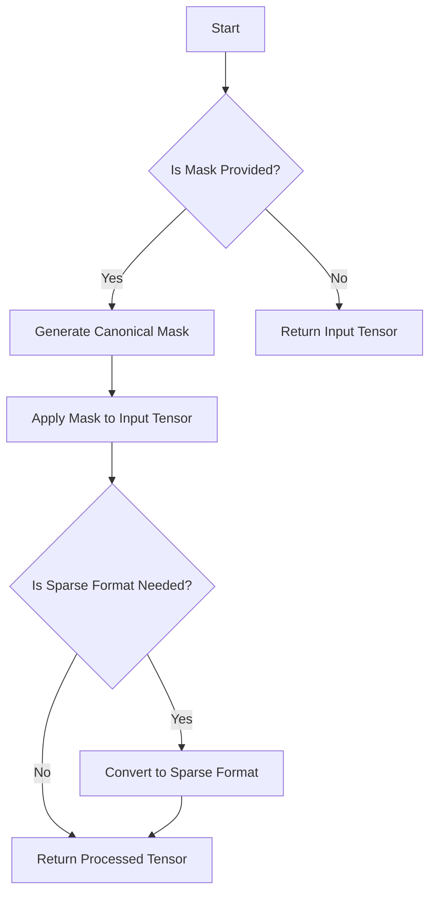

This document will cover the process of combining an input tensor with a mask, which includes:

1. Checking for the presence of a mask
2. Generating a canonical mask
3. Applying the mask to the input tensor
4. Handling sparse tensor formats.

Technical document: <SwmLink doc-title="Combining Input Tensor with Mask">[Combining Input Tensor with Mask](/.swm/combining-input-tensor-with-mask.680v0enj.sw.md)</SwmLink>

# [Checking for the Presence of a Mask](https://app.swimm.io/repos/Z2l0aHViJTNBJTNBcHl0b3JjaC1hdXRvZG9jcy1kZW1vJTNBJTNBU3dpbW0tRGVtbw==/docs/680v0enj#checking-if-a-mask-is-provided)

The process begins by determining whether a mask is provided. If no mask is given, the input tensor is returned as is. This step ensures that unnecessary processing is avoided when no mask is present.

# [Generating a Canonical Mask](https://app.swimm.io/repos/Z2l0aHViJTNBJTNBcHl0b3JjaC1hdXRvZG9jcy1kZW1vJTNBJTNBU3dpbW0tRGVtbw==/docs/680v0enj#generating-a-canonical-mask)

If a mask is provided, a canonical mask is generated to match the shape and layout of the input tensor. This canonical mask is a boolean tensor that ensures consistency between the input tensor and its mask. The mask is adjusted to match the input tensor's dimensions and layout, including handling broadcasting and layout conversions.

# [Applying the Mask to the Input Tensor](https://app.swimm.io/repos/Z2l0aHViJTNBJTNBcHl0b3JjaC1hdXRvZG9jcy1kZW1vJTNBJTNBU3dpbW0tRGVtbw==/docs/680v0enj#applying-the-mask-to-the-input-tensor)

Once the canonical mask is generated, it is used to apply the mask to the input tensor. This step ensures that the masked elements are processed correctly. The operation involves using a function that combines the input tensor and the mask, filling in values as needed.

# [Handling Sparse Tensor Formats](https://app.swimm.io/repos/Z2l0aHViJTNBJTNBcHl0b3JjaC1hdXRvZG9jcy1kZW1vJTNBJTNBU3dpbW0tRGVtbw==/docs/680v0enj#handling-sparse-tensor-formats)

The process also handles sparse tensor formats. If the input tensor or the mask is in a sparse format, the tensors are converted to the appropriate sparse format before applying the mask. This step ensures efficient storage and manipulation of tensors with a large number of zero elements.

&nbsp;

*This is an auto-generated document by Swimm AI 🌊 and has not yet been verified by a human*

<SwmMeta version="3.0.0" repo-id="Z2l0aHViJTNBJTNBcHl0b3JjaC1hdXRvZG9jcy1kZW1vJTNBJTNBU3dpbW0tRGVtbw==" repo-name="pytorch-autodocs-demo">Powered by [Swimm](https://app.swimm.io/)</SwmMeta>
