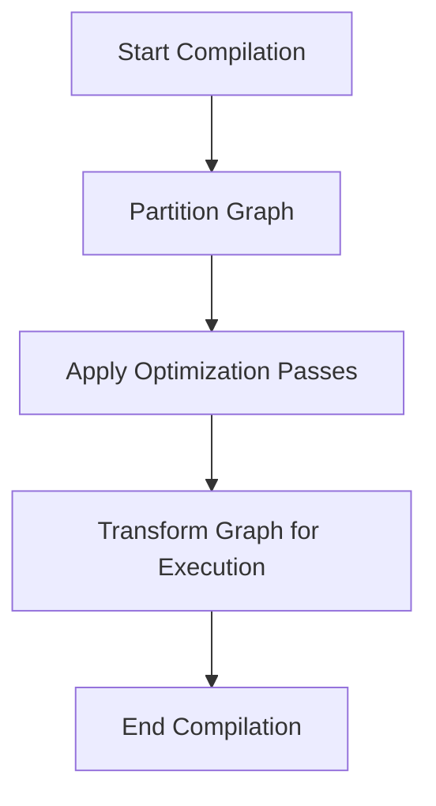

This document will cover the Compilation Process Overview, which includes:

1. Initializing the compilation process
2. Partitioning the graph
3. Applying optimization passes
4. Transforming the graph for execution.

Technical document: <SwmLink doc-title="Compilation Process Overview">[Compilation Process Overview](/.swm/compilation-process-overview.k75dkutg.sw.md)</SwmLink>

# [Initializing the Compilation Process](https://app.swimm.io/repos/Z2l0aHViJTNBJTNBcHl0b3JjaC1hdXRvZG9jcy1kZW1vJTNBJTNBU3dpbW0tRGVtbw==/docs/k75dkutg#compile)

The compilation process begins with the `compile` function. This function takes an FX graph and example inputs. It delegates the actual compilation to another function, `compile_fx`. This step is crucial as it sets up the initial conditions and prepares the graph for further processing.

# [Partitioning the Graph](https://app.swimm.io/repos/Z2l0aHViJTNBJTNBcHl0b3JjaC1hdXRvZG9jcy1kZW1vJTNBJTNBU3dpbW0tRGVtbw==/docs/k75dkutg#min_cut_rematerialization_partition)

The graph is partitioned to optimize memory usage. This involves dividing the graph into smaller subgraphs that can be processed independently. The partitioning is done in a way that balances memory and computation, ensuring that the overall process is efficient.

# [Applying Optimization Passes](https://app.swimm.io/repos/Z2l0aHViJTNBJTNBcHl0b3JjaC1hdXRvZG9jcy1kZW1vJTNBJTNBU3dpbW0tRGVtbw==/docs/k75dkutg#pre_grad_passes)

Optimization passes are applied to the graph to improve its performance. These passes include normalization, fusion, and removal of unnecessary operations. The goal is to prepare the graph for efficient execution by making it as streamlined as possible.

# [Transforming the Graph for Execution](https://app.swimm.io/repos/Z2l0aHViJTNBJTNBcHl0b3JjaC1hdXRvZG9jcy1kZW1vJTNBJTNBU3dpbW0tRGVtbw==/docs/k75dkutg#joint_graph_passes)

The final step involves transforming the graph into a form that can be executed efficiently. This includes applying custom pre and post passes, removing no-op operations, and ensuring the graph is topologically sorted. The transformed graph is then ready for execution.

&nbsp;

*This is an auto-generated document by Swimm AI 🌊 and has not yet been verified by a human*

<SwmMeta version="3.0.0" repo-id="Z2l0aHViJTNBJTNBcHl0b3JjaC1hdXRvZG9jcy1kZW1vJTNBJTNBU3dpbW0tRGVtbw==" repo-name="pytorch-autodocs-demo">Powered by [Swimm](https://app.swimm.io/)</SwmMeta>
