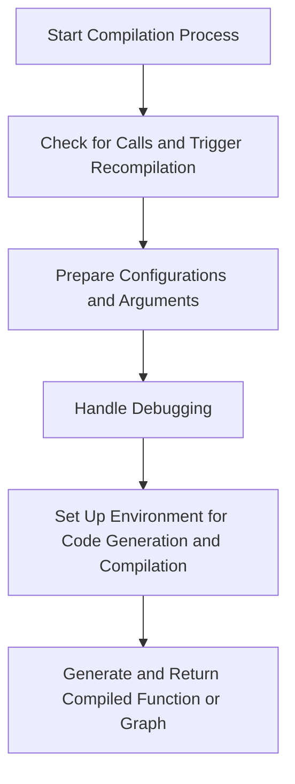

This document will cover the Compilation Process Overview, which includes:

1. Checking for calls and triggering recompilation
2. Preparing configurations and arguments
3. Handling debugging
4. Setting up the environment for code generation and compilation.

Technical document: <SwmLink doc-title="Compilation Process Overview">[Compilation Process Overview](/.swm/compilation-process-overview.xneyioh4.sw.md)</SwmLink>

# [Checking for Calls and Triggering Recompilation](https://app.swimm.io/repos/Z2l0aHViJTNBJTNBcHl0b3JjaC1hdXRvZG9jcy1kZW1vJTNBJTNBU3dpbW0tRGVtbw==/docs/xneyioh4#_compile_fx_inner)

The compilation process begins by examining the graph to see if it contains any calls. If calls are detected, the system triggers a recompilation. This step ensures that any changes or updates in the graph are accounted for, maintaining the accuracy and efficiency of the compiled output.

# [Preparing Configurations and Arguments](https://app.swimm.io/repos/Z2l0aHViJTNBJTNBcHl0b3JjaC1hdXRvZG9jcy1kZW1vJTNBJTNBU3dpbW0tRGVtbw==/docs/xneyioh4#_compile_fx_inner)

Next, the system prepares various configurations and arguments necessary for the compilation process. This includes setting up parameters that define how the compilation should proceed, ensuring that all required inputs are correctly configured. This step is crucial for tailoring the compilation process to the specific needs of the graph being compiled.

# [Handling Debugging](https://app.swimm.io/repos/Z2l0aHViJTNBJTNBcHl0b3JjaC1hdXRvZG9jcy1kZW1vJTNBJTNBU3dpbW0tRGVtbw==/docs/xneyioh4#_compile_fx_inner)

For debugging purposes, the system saves the arguments used in the compilation process. This allows developers to trace back and understand the compilation steps if any issues arise. By preserving this information, the system facilitates easier troubleshooting and debugging.

# [Setting Up the Environment for Code Generation and Compilation](https://app.swimm.io/repos/Z2l0aHViJTNBJTNBcHl0b3JjaC1hdXRvZG9jcy1kZW1vJTNBJTNBU3dpbW0tRGVtbw==/docs/xneyioh4#codegen_and_compile)

The environment is then set up for code generation and compilation. This involves configuring the necessary tools and resources to generate the compiled code. The system ensures that all dependencies and settings are correctly initialized to produce an optimized and functional compiled output.

# [Generate and Return Compiled Function or Graph](https://app.swimm.io/repos/Z2l0aHViJTNBJTNBcHl0b3JjaC1hdXRvZG9jcy1kZW1vJTNBJTNBU3dpbW0tRGVtbw==/docs/xneyioh4#compile_to_fn)

Finally, the system generates the compiled function or graph. This step involves converting the prepared configurations and arguments into executable code. The compiled output is then returned, ready for use in the application. This step marks the completion of the compilation process, providing a fully optimized and functional compiled graph.

&nbsp;

*This is an auto-generated document by Swimm AI 🌊 and has not yet been verified by a human*

<SwmMeta version="3.0.0" repo-id="Z2l0aHViJTNBJTNBcHl0b3JjaC1hdXRvZG9jcy1kZW1vJTNBJTNBU3dpbW0tRGVtbw==" repo-name="pytorch-autodocs-demo">Powered by [Swimm](https://app.swimm.io/)</SwmMeta>
