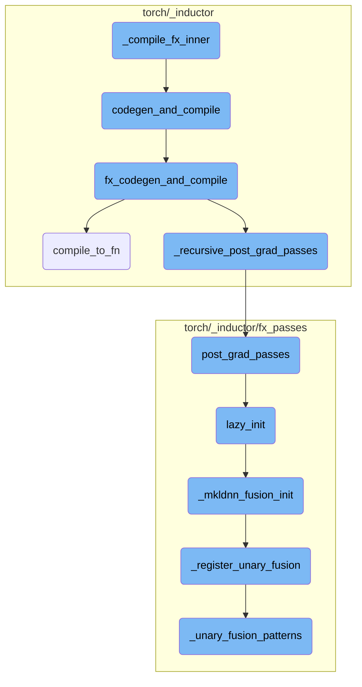
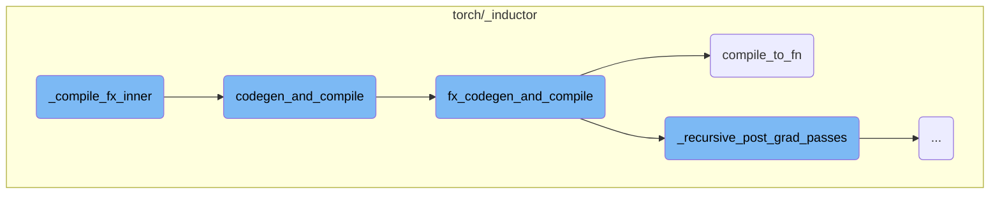

This document provides an overview of the compilation process within the Inductor API. It explains the main steps involved in compiling a single graph, including checking for calls, preparing configurations, handling debugging, and setting up the environment for code generation and compilation.

The compilation process starts by checking if the graph has any calls and triggers recompilation if needed. It then prepares various configurations and arguments required for the compilation. The process also involves saving arguments for debugging purposes and setting up the environment for code generation and compilation. The core compilation tasks are handled by functions that preserve the RNG state, adjust recursion limits, and apply various optimization passes. Finally, the compiled function or graph is generated and returned.

Here is a high level diagram of the flow, showing only the most important functions:



# Flow drill down

First, we'll zoom into this section of the flow:



<SwmSnippet path="/torch/_inductor/compile_fx.py" line="478">

---

## \_compile_fx_inner

The `_compile_fx_inner` function is responsible for compiling a single graph in the Inductor API. It first checks if the graph has any calls and triggers recompilation if necessary. It then prepares various configurations and arguments required for the compilation process. The function also handles saving arguments for debugging and sets up the environment for code generation and compilation.

```python
def _compile_fx_inner(
    gm: torch.fx.GraphModule,
    example_inputs: List[torch.Tensor],
    cudagraphs: Optional[BoxedBool] = None,
    static_input_idxs: Optional[List[int]] = None,
    is_backward: bool = False,
    graph_id: Optional[int] = None,
    cpp_wrapper: bool = False,
    aot_mode: bool = False,
    is_inference: bool = False,
    boxed_forward_device_index: Optional[BoxedDeviceIndex] = None,
    user_visible_outputs: Optional[Dict[str, None]] = None,
    layout_opt: Optional[bool] = None,
    extern_node_serializer: Optional[Callable[[List[ExternKernelNode]], Any]] = None,
) -> Union[CompiledFxGraph, str]:
    """
    Inductor API that compiles a single graph.

    If you change the argument list for this function, make sure you
    also update the call to save_args_for_compile_fx_inner below accordingly.
    """
```

---

</SwmSnippet>

<SwmSnippet path="/torch/_inductor/compile_fx.py" line="557">

---

### codegen_and_compile

The `codegen_and_compile` function is called within `_compile_fx_inner` to handle the actual code generation and compilation of the FX graph. It calls `fx_codegen_and_compile` and adds metadata to the resulting compiled graph. This function also manages cudagraphs and checks for any conditions that might disable cudagraphs.

```python
    def codegen_and_compile(
        gm,
        example_inputs,
        inputs_to_check,
        fx_kwargs,
    ):
        """
        This function calls fx_codegen_and_compile and also adds some extra metadata to the resulting
        compiled fx graph. The metadata is saved to FXGraphCache.
        """
        compiled_graph = fx_codegen_and_compile(gm, example_inputs, **fx_kwargs)
        if isinstance(compiled_graph, str):
            # We only return a string in aot mode, in which case we don't
            # need to do any post-compilation steps: we just return the string,
            # which is the filename of the compiled code.
            return compiled_graph
        cudagraph_info = None
        if cudagraphs:
            # check cudagraph disabling reasons from inductor lowering
            if compiled_graph.disabled_cudagraphs_reason:
                if "cuda" in compiled_graph.device_types:
```

---

</SwmSnippet>

<SwmSnippet path="/torch/_inductor/compile_fx.py" line="692">

---

### fx_codegen_and_compile

The `fx_codegen_and_compile` function performs the core compilation tasks. It preserves the RNG state, adjusts the recursion limit, and logs the compilation process. The function also converts view operations to reshape operations, runs FakeTensorProp, and applies various optimization passes. Finally, it generates the compiled function or graph.

```python
def fx_codegen_and_compile(
    gm: torch.fx.GraphModule,
    example_inputs: List[torch.Tensor],
    cudagraphs: Optional[BoxedBool] = None,
    static_input_idxs: Optional[List[int]] = None,
    is_backward: bool = False,
    graph_id: Optional[int] = None,
    cpp_wrapper: bool = False,
    aot_mode: bool = False,
    is_inference: bool = False,
    # Use a dict with None value rather than a set for deterministic
    # iteration order just in case.
    user_visible_outputs: Optional[Dict[str, None]] = None,
    layout_opt: Optional[bool] = None,
    extern_node_serializer: Optional[Callable[[List[ExternKernelNode]], Any]] = None,
) -> Union[CompiledFxGraph, str]:
    with dynamo_utils.preserve_rng_state():
        if is_tf32_warning_applicable(gm):
            _warn_tf32_disabled()

        inductor_counters = counters["inductor"].copy()
```

---

</SwmSnippet>

<SwmSnippet path="/torch/_inductor/graph.py" line="1831">

---

### compile_to_fn

The `compile_to_fn` function in `torch/_inductor/graph.py` is called by `fx_codegen_and_compile` to generate the final compiled function. It handles both AOT (Ahead-Of-Time) and regular compilation modes, generating the necessary code and returning either the compiled function or the path to the compiled code.

```python
    def compile_to_fn(self) -> Any:
        if self.aot_mode:
            from .codecache import AotCodeCompiler

            assert self.cpp_wrapper, "AOT mode only supports C++ wrapper"
            code, linemap = self.codegen_with_cpp_wrapper()
            output_code_log.debug("Output code: \n%s", code)

            serialized_extern_kernel_nodes = None
            if self.extern_kernel_nodes:
                serialized_extern_kernel_nodes = self.extern_node_serializer(
                    self.extern_kernel_nodes
                )
                output_code_log.debug(
                    "Serialized Extern Kernel Nodes: \n%s",
                    serialized_extern_kernel_nodes,
                )

            # Directly return the file path with the compiled code
            return AotCodeCompiler.compile(
                self, code, serialized_extern_kernel_nodes, cuda=self.cuda
```

---

</SwmSnippet>

Now, lets zoom into this section of the flow:

```mermaid
graph TD;
      subgraph torchinductorfxpasses["torch/_inductor/fx_passes"]
0882dac216d92bf3ae19a0dad3402b6a5242c31caaf7d3975a8e3505bb494305(_recursive_post_grad_passes):::mainFlowStyle --> 95eefc5a73100b1bf7e1121e65dcefd031c679a9bfdd5991288b59d86afdcd52(post_grad_passes):::mainFlowStyle
end

subgraph torchinductorfxpasses["torch/_inductor/fx_passes"]
95eefc5a73100b1bf7e1121e65dcefd031c679a9bfdd5991288b59d86afdcd52(post_grad_passes):::mainFlowStyle --> 911c574385c27f6c8256902b7eade99685459619827ea9d5c013d85356c1cbe0(lazy_init):::mainFlowStyle
end

subgraph torchinductorfxpasses["torch/_inductor/fx_passes"]
911c574385c27f6c8256902b7eade99685459619827ea9d5c013d85356c1cbe0(lazy_init):::mainFlowStyle --> 3bd78bf2b3a4d51d2367082691f2271bd71335b84f3edbae8571c04f0bf09201(_mkldnn_fusion_init):::mainFlowStyle
end

subgraph torchinductorfxpasses["torch/_inductor/fx_passes"]
3bd78bf2b3a4d51d2367082691f2271bd71335b84f3edbae8571c04f0bf09201(_mkldnn_fusion_init):::mainFlowStyle --> f5ce3addd3b1ca27f0d34f3113ec944cc22dc41caaa01f8604ddebd056efa8fd(_register_unary_fusion):::mainFlowStyle
end

subgraph torchinductorfxpasses["torch/_inductor/fx_passes"]
f5ce3addd3b1ca27f0d34f3113ec944cc22dc41caaa01f8604ddebd056efa8fd(_register_unary_fusion):::mainFlowStyle --> 43076afaa55373ae862f16721281a41771d914e0440d11779c8f46a250c5e708(_unary_fusion_patterns):::mainFlowStyle
end


      classDef mainFlowStyle color:#000000,fill:#7CB9F4
classDef rootsStyle color:#000000,fill:#00FFF4
classDef Style1 color:#000000,fill:#00FFAA
classDef Style2 color:#000000,fill:#FFFF00
classDef Style3 color:#000000,fill:#AA7CB9
```



<SwmSnippet path="/torch/_inductor/compile_fx.py" line="282">

---

## \_recursive_post_grad_passes

The `_recursive_post_grad_passes` function is responsible for recursively applying post-gradient passes to a graph module and its subgraphs. It first retrieves the subgraph names from the graph module and then recursively calls itself on each subgraph. Finally, it applies the `post_grad_passes` function to the graph module.

```python
    for subgraph_name in _get_subgraph_names(gm):
        subgraph = getattr(gm, subgraph_name)
        _recursive_post_grad_passes(subgraph, is_inference)
    post_grad_passes(gm, is_inference)
```

---

</SwmSnippet>

<SwmSnippet path="/torch/_inductor/fx_passes/post_grad.py" line="72">

---

## post_grad_passes

The `post_grad_passes` function performs various optimization passes on the graph module after gradient computation. These passes include eliminating dead code, reordering operations for locality, applying custom pre and post passes, and performing various fusion and optimization patterns. The function ensures that the graph is optimized for both inference and training scenarios, depending on the configuration.

```python
def post_grad_passes(gm: torch.fx.GraphModule, is_inference: bool):
    """
    Passes that run on after grad.  This is called once on the forwards
    graph and once on the backwards graph.

    The IR here has been normalized and functionalized.
    """
    if config.dce:
        # has some issues with mutation in inference mode
        gm.graph.eliminate_dead_code()

    if is_inference and config.reorder_for_locality:
        reorder_for_locality(gm.graph)

    fake_tensor_updater = FakeTensorUpdater(gm.graph)

    if config.post_grad_custom_pre_pass is not None:
        with GraphTransformObserver(
            gm, "post_grad_custom_pre_pass", config.trace.log_url_for_graph_xform
        ):
            config.post_grad_custom_pre_pass(gm.graph)
```

---

</SwmSnippet>

<SwmSnippet path="/torch/_inductor/fx_passes/post_grad.py" line="152">

---

## lazy_init

The `lazy_init` function initializes MKL-DNN fusion passes if the MKL-DNN backend is available. It imports necessary modules and calls the `_mkldnn_fusion_init` function to register various fusion patterns.

```python
def lazy_init():
    if torch._C._has_mkldnn:
        from . import decompose_mem_bound_mm  # noqa: F401
        from .mkldnn_fusion import _mkldnn_fusion_init

        _mkldnn_fusion_init()
```

---

</SwmSnippet>

<SwmSnippet path="/torch/_inductor/fx_passes/mkldnn_fusion.py" line="1246">

---

## \_mkldnn_fusion_init

The `_mkldnn_fusion_init` function registers various fusion patterns for unary, binary, and quantization operations if the MKL-DNN backend is enabled and available. This function ensures that the graph can leverage MKL-DNN optimizations for better performance.

```python
    def _mkldnn_fusion_init():
        # TODO: aarch64: enable op fusion for acl once it supports fused operators. Disabling it for now.
        # Otherwise even the matmul or innerproduct can not be accelerated with acl
        if (
            torch.backends.mkldnn.enabled
            and torch.backends.mkldnn.is_available()
            and not torch.ops.mkldnn._is_mkldnn_acl_supported()
        ):
            _register_unary_fusion()
            _register_inplace_fusion()
            _register_binary_unary_fusion()
            _register_binary_fusion()
            _register_quantization_lowerings()
            _register_woq_lowerings()
```

---

</SwmSnippet>

<SwmSnippet path="/torch/_inductor/fx_passes/mkldnn_fusion.py" line="561">

---

## \_register_unary_fusion

The `_register_unary_fusion` function defines and registers fusion patterns for unary operations like GELU, HardSwish, HardSigmoid, and others. These patterns are used to optimize the graph by combining multiple operations into a single fused operation, improving performance.

```python
    def _register_unary_fusion():
        computation_call_fns = [_conv_call, _linear_call, _conv_transpose_call]

        def _unary_fusion_patterns(lowp_dtype):
            replacement_unary_fusion_patterns = {
                UnaryAttr("gelu", algorithm_attr="tanh"): [
                    _unary_fusion_pattern(_gelu_fusion_2, call_fn, 4, lowp_dtype)
                    for call_fn in computation_call_fns
                ],
                UnaryAttr("gelu", algorithm_attr="none"): [
                    _unary_fusion_pattern(_gelu_fusion_1, call_fn, 2, lowp_dtype)
                    for call_fn in computation_call_fns
                ],
                UnaryAttr("hardswish"): [
                    _unary_fusion_pattern(_hardswish_fusion, call_fn, 2, lowp_dtype)
                    for call_fn in computation_call_fns
                ],
                UnaryAttr("hardsigmoid"): [
                    _unary_fusion_pattern(_hardsigmoid_fusion, call_fn, 1, lowp_dtype)
                    for call_fn in computation_call_fns
                ],
```

---

</SwmSnippet>

<SwmSnippet path="/torch/_inductor/fx_passes/mkldnn_fusion.py" line="564">

---

## \_unary_fusion_patterns

The `_unary_fusion_patterns` function generates a dictionary of fusion patterns for various unary operations based on the provided data type. These patterns are used to replace sequences of operations in the graph with more efficient fused operations.

```python
        def _unary_fusion_patterns(lowp_dtype):
            replacement_unary_fusion_patterns = {
                UnaryAttr("gelu", algorithm_attr="tanh"): [
                    _unary_fusion_pattern(_gelu_fusion_2, call_fn, 4, lowp_dtype)
                    for call_fn in computation_call_fns
                ],
                UnaryAttr("gelu", algorithm_attr="none"): [
                    _unary_fusion_pattern(_gelu_fusion_1, call_fn, 2, lowp_dtype)
                    for call_fn in computation_call_fns
                ],
                UnaryAttr("hardswish"): [
                    _unary_fusion_pattern(_hardswish_fusion, call_fn, 2, lowp_dtype)
                    for call_fn in computation_call_fns
                ],
                UnaryAttr("hardsigmoid"): [
                    _unary_fusion_pattern(_hardsigmoid_fusion, call_fn, 1, lowp_dtype)
                    for call_fn in computation_call_fns
                ],
                UnaryAttr("swish"): [
                    _unary_fusion_pattern(_silu_fusion, call_fn, 2, lowp_dtype)
                    for call_fn in computation_call_fns
```

---

</SwmSnippet>

&nbsp;

*This is an auto-generated document by Swimm AI 🌊 and has not yet been verified by a human*

<SwmMeta version="3.0.0" repo-id="Z2l0aHViJTNBJTNBcHl0b3JjaC1hdXRvZG9jcy1kZW1vJTNBJTNBU3dpbW0tRGVtbw==" repo-name="pytorch-autodocs-demo"><sup>Powered by [Swimm](https://app.swimm.io/)</sup></SwmMeta>
