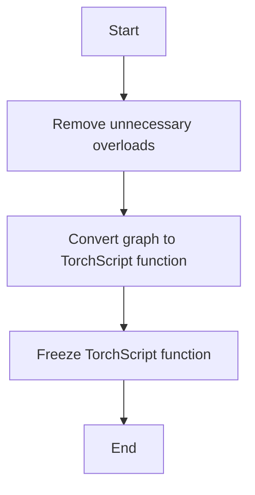

This document will cover the process of compiling and freezing a TorchScript function using the `simple_ts_compile` feature. We'll cover:

1. Removing unnecessary overloads
2. Converting the graph into a TorchScript function
3. Freezing the TorchScript function for optimization.

Technical document: <SwmLink doc-title="Overview of simple_ts_compile">[Overview of simple_ts_compile](/.swm/overview-of-simple_ts_compile.a0pi84fx.sw.md)</SwmLink>

# [Removing unnecessary overloads](https://app.swimm.io/repos/Z2l0aHViJTNBJTNBcHl0b3JjaC1hdXRvZG9jcy1kZW1vJTNBJTNBU3dpbW0tRGVtbw==/docs/a0pi84fx#compiling-and-freezing-a-torchscript-function)

The first step in the `simple_ts_compile` process is to remove any unnecessary overloads from the computational graph. Overloads are different versions of functions that can handle various types of inputs. By stripping these overloads, we simplify the graph, making it easier to convert into a more efficient representation. This step ensures that only the essential parts of the graph are retained, which helps in optimizing the subsequent steps.

# [Converting the graph into a TorchScript function](https://app.swimm.io/repos/Z2l0aHViJTNBJTNBcHl0b3JjaC1hdXRvZG9jcy1kZW1vJTNBJTNBU3dpbW0tRGVtbw==/docs/a0pi84fx#scripting-a-function)

After removing unnecessary overloads, the next step is to convert the simplified graph into a TorchScript function. TorchScript is a subset of Python that is designed to be more efficient for execution. This conversion involves inspecting the source code of the graph and compiling it using the TorchScript compiler. The result is a `ScriptFunction` or `ScriptModule`, which is a more optimized representation of the original graph. This step is crucial for improving the execution efficiency of the function.

# [Freezing the TorchScript function for optimization](https://app.swimm.io/repos/Z2l0aHViJTNBJTNBcHl0b3JjaC1hdXRvZG9jcy1kZW1vJTNBJTNBU3dpbW0tRGVtbw==/docs/a0pi84fx#freeze)

The final step in the `simple_ts_compile` process is to freeze the TorchScript function. Freezing involves optimizing the graph by converting certain parameters into constants and applying various optimization passes. This step helps in reducing the memory footprint and improving the execution speed of the function. By freezing the function, we ensure that it is ready for efficient execution in production environments. This step also includes discarding the original parameters of the module for memory efficiency if enabled.

&nbsp;

*This is an auto-generated document by Swimm AI 🌊 and has not yet been verified by a human*

<SwmMeta version="3.0.0" repo-id="Z2l0aHViJTNBJTNBcHl0b3JjaC1hdXRvZG9jcy1kZW1vJTNBJTNBU3dpbW0tRGVtbw==" repo-name="pytorch-autodocs-demo">Powered by [Swimm](https://app.swimm.io/)</SwmMeta>
