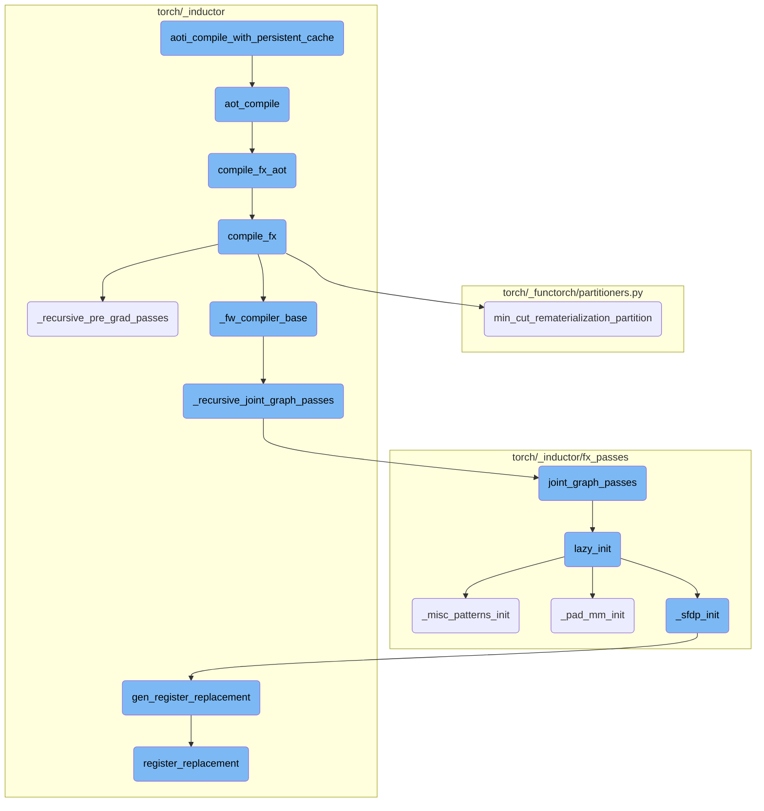
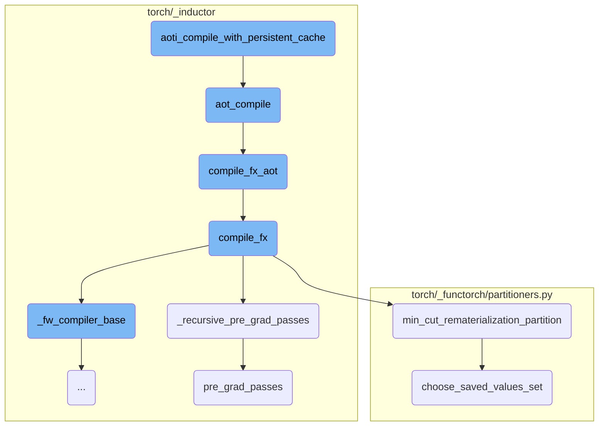
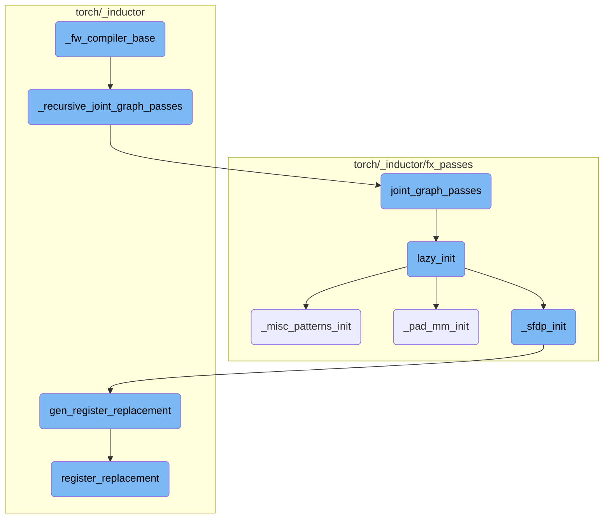

This document provides an overview of the process involved in compiling a function with a persistent cache for AOTI eager mode. It highlights the key steps and functions involved in this process, ensuring that only static shapes are supported and validating the input types.

The process starts by ensuring that only static shapes are supported and validating the input types. Necessary directories for the persistent cache are created, and an environment variable is set to the cache directory. The function then compiles the given function and generates metadata for the inputs, which is stored in a JSON file within the persistent cache directory. This ensures that the function can be efficiently reused without recompilation.

Here is a high level diagram of the flow, showing only the most important functions:



# Flow drill down

First, we'll zoom into this section of the flow:



<SwmSnippet path="/torch/_inductor/aoti_eager.py" line="168">

---

## aoti_compile_with_persistent_cache

The function `aoti_compile_with_persistent_cache` is responsible for compiling a given function with a persistent cache for AOTI eager mode. It ensures that only static shapes are supported and validates the input types. The function creates necessary directories for the persistent cache and sets the environment variable `TORCHINDUCTOR_CACHE_DIR` to the cache directory. It then calls `torch._export.aot_compile` to compile the function and generates metadata for the inputs. This metadata is stored in a JSON file within the persistent cache directory.

```python
def aoti_compile_with_persistent_cache(
    ns: str,
    op_func_name_with_overload: str,
    device_type: str,
    dynamic: bool,
    f: Callable[..., Any],
    args: Tuple[Any],
    kwargs: Dict[str, Any],
    *,
    dynamic_shapes: Optional[Dict[str, Any]] = None,
    options: Optional[Dict[str, Any]] = None,
    remove_runtime_assertions: bool = False,
    disable_constraint_solver: bool = False,
) -> str:
    """
    Compile the given function with persistent cache for AOTI eager mode.
    """
    assert not dynamic, "Only support static shape for now"
    flattened_inputs = list(args) + list(kwargs.values())
    if not all(
        isinstance(
```

---

</SwmSnippet>

<SwmSnippet path="/torch/_inductor/__init__.py" line="33">

---

## aot_compile

The function `aot_compile` takes an FX graph module and example arguments to ahead-of-time compile the graph with TorchInductor into a shared library. It ensures the graph output is a tuple and serializes the input and output specifications. The function flattens the arguments, replaces non-tensor inputs with `None`, and calls `compile_fx_aot` to perform the actual compilation.

```python
def aot_compile(
    gm: torch.fx.GraphModule,
    args: Tuple[Any],
    kwargs: Optional[Dict[str, Any]] = None,
    *,
    options: Optional[Dict[str, Any]] = None,
) -> str:
    """
    Ahead-of-time compile a given FX graph with TorchInductor into a shared library.

    Args:
        gm: The FX graph to compile.
        args:  Example arguments
        kwargs: Example keyword arguments
        options:  Optional dict of config options.  See `torch._inductor.config`.

    Returns:
        Path to the generated shared library
    """
    from .compile_fx import compile_fx_aot, graph_returns_tuple

```

---

</SwmSnippet>

<SwmSnippet path="/torch/_inductor/compile_fx.py" line="1111">

---

## compile_fx_aot

The function `compile_fx_aot` compiles an FX graph module using the provided example inputs and configuration patches. It sets the `cpp_wrapper` option to `True` and ensures the output path is set. The function then calls `compile_fx` with the appropriate parameters and returns the path to the compiled library.

```python
def compile_fx_aot(
    model_: torch.fx.GraphModule,
    example_inputs_: List[torch.Tensor],
    inner_compile: Callable[..., Any] = compile_fx_inner,
    config_patches: Optional[Dict[str, Any]] = None,
):
    config_patches: Dict[str, Any] = (
        {"cpp_wrapper": True}
        if config_patches is None
        else {**config_patches, "cpp_wrapper": True}
    )
    if (
        "aot_inductor.output_path" not in config_patches
        and not config.aot_inductor.output_path
    ):
        config_patches = {
            **config_patches,
            "aot_inductor.output_path": code_hash(model_.code),
        }

    extern_node_serializer = config_patches.pop("extern_node_serializer", None)
```

---

</SwmSnippet>

<SwmSnippet path="/torch/_inductor/compile_fx.py" line="1232">

---

## compile_fx

The function `compile_fx` is a lower-level function that handles the actual compilation process. It includes various steps such as partitioning the graph, applying optimization passes, and generating the forward and backward graph modules. This function is called by `compile_fx_aot` to perform the detailed compilation tasks.

```python
def compile_fx(
    model_: torch.fx.GraphModule,
    example_inputs_: List[torch.Tensor],
    inner_compile: Callable[..., Any] = compile_fx_inner,
    config_patches: Optional[Dict[str, Any]] = None,
    decompositions: Optional[Dict[OpOverload, Callable[..., Any]]] = None,
):
    with _use_lazy_graph_module(dynamo_config.use_lazy_graph_module):
        """Main entrypoint to a compile given FX graph"""
        if config_patches:
            with config.patch(config_patches):
                return compile_fx(
                    model_,
                    example_inputs_,
                    # need extra layer of patching as backwards is compiled out of scope
                    inner_compile=config.patch(config_patches)(inner_compile),
                    decompositions=decompositions,
                )

        if config.cpp_wrapper:
            with config.patch(
```

---

</SwmSnippet>

<SwmSnippet path="/torch/_inductor/compile_fx.py" line="265">

---

## \_recursive_pre_grad_passes

The function `_recursive_pre_grad_passes` applies pre-gradient passes recursively to subgraphs within the given graph module. It ensures that all subgraphs undergo the necessary transformations before the main pre-gradient passes are applied.

```python
def _recursive_pre_grad_passes(gm, example_inputs):
    for subgraph_name in _get_subgraph_names(gm):
        subgraph = getattr(gm, subgraph_name)
        # as we don't have recursive example inputs, passing None here
        new_subgraph = _recursive_pre_grad_passes(subgraph, example_inputs=None)
        setattr(gm, subgraph_name, new_subgraph)
    return pre_grad_passes(gm, example_inputs)
```

---

</SwmSnippet>

<SwmSnippet path="/torch/_functorch/partitioners.py" line="1682">

---

## min_cut_rematerialization_partition

The function `min_cut_rematerialization_partition` partitions a joint forward and backward graph such that the backward pass recomputes the forward pass. This helps trade off memory bandwidth with computation. The function eliminates dead code, classifies nodes, and extracts the forward and backward graph modules.

```python
def min_cut_rematerialization_partition(
    joint_module: fx.GraphModule,
    _joint_inputs,
    compiler="inductor",
    *,
    num_fwd_outputs,
) -> Tuple[fx.GraphModule, fx.GraphModule]:
    """
    Partitions the joint graph such that the backward recomputes the forward.
    Recomputing helps in trading off memory bandwidth with computation.

    To create the fwd and bwd graph, we copy the joint graph, manually set the
    outputs to just original forward or backward outputs. And then we run the
    resulting graphs through dead code elimination.

    .. warning::
        This API is experimental and likely to change.

    Args:
        joint_module(fx.GraphModule): The joint forward and backward graph. This
            is the result of AOT Autograd tracing.
```

---

</SwmSnippet>

<SwmSnippet path="/torch/_functorch/partitioners.py" line="1499">

---

## choose_saved_values_set

The function `choose_saved_values_set` selects the set of values to be saved during the forward pass for recomputation in the backward pass. It uses a knapsack algorithm to optimize the selection based on memory budget constraints.

```python
def choose_saved_values_set(
    joint_graph: fx.Graph, node_info: NodeInfo, memory_budget=1
) -> List[fx.Node]:
    if memory_budget > 1 or memory_budget < 0:
        raise RuntimeError(
            f"The valid ranges for memory budget are 0 <= m <= 1. The provided value is {memory_budget}"
        )
    min_cut_options = MinCutOptions(
        ban_if_used_far_apart=config.ban_recompute_used_far_apart,
        ban_if_long_fusible_chains=config.ban_recompute_long_fusible_chains,
        ban_if_materialized_backward=config.ban_recompute_materialized_backward,
        ban_if_not_in_allowlist=config.ban_recompute_not_in_allowlist,
        ban_if_reduction=config.ban_recompute_reductions,
    )

    if config.aggressive_recomputation:
        min_cut_options = replace(
            min_cut_options,
            ban_if_used_far_apart=False,
            ban_if_long_fusible_chains=False,
            ban_if_materialized_backward=False,
```

---

</SwmSnippet>

<SwmSnippet path="/torch/_inductor/fx_passes/pre_grad.py" line="95">

---

## pre_grad_passes

The function `pre_grad_passes` applies a series of optimization passes to the input FX graph before the gradient computation. These passes include normalization, fusion, and removal of unnecessary operations. The function ensures the graph is optimized for performance and memory efficiency before proceeding to the gradient computation phase.

```python
def pre_grad_passes(gm: torch.fx.GraphModule, example_inputs=None):
    """
    Apply passes on the input FX graph using Torch IR.

    WARNING:
    The IR before grad is not functional or normalized, so it is harder
    to write passes on this IR.  Passes must be safe with respect to
    aliasing and mutation and need to handle all possible arg schemas.

    Consider adding a new pass to post_grad.py or joint_graph.py which
    are after functionalization and normalization.
    """
    if config.pattern_matcher:
        lazy_init()
        if hasattr(
            config, "fx_passes_numeric_check"
        ) and config.fx_passes_numeric_check.get("pre_grad", False):
            gm_before_fx_passes = gm.__copy__()
        # explicitly run with predispatch atenIR based passes
        if config.is_predispatch:

```

---

</SwmSnippet>

Now, lets zoom into this section of the flow:



<SwmSnippet path="/torch/_inductor/compile_fx.py" line="1342">

---

## \_fw_compiler_base

The `_fw_compiler_base` function is responsible for compiling a forward graph module. It handles both inference and training modes. For inference, it calls `_recursive_joint_graph_passes` to apply necessary transformations. It also manages user-visible outputs and prepares the model for compilation by invoking `inner_compile`.

```python
        def _fw_compiler_base(
            model: torch.fx.GraphModule,
            example_inputs: List[torch.Tensor],
            is_inference: bool,
        ):
            if is_inference:
                # partition_fn won't be called
                _recursive_joint_graph_passes(model)

            fixed = torch._inductor.utils.num_fw_fixed_arguments(
                num_example_inputs, len(example_inputs)
            )

            user_visible_outputs = {}

            if config.keep_output_stride:
                model_outputs_node = output_node(model)
                model_outputs = pytree.arg_tree_leaves(*model_outputs_node.args)
                num_model_outputs = len(model_outputs)

                context = torch._guards.TracingContext.try_get()
```

---

</SwmSnippet>

<SwmSnippet path="/torch/_inductor/compile_fx.py" line="274">

---

## \_recursive_joint_graph_passes

The `_recursive_joint_graph_passes` function recursively applies `joint_graph_passes` to all subgraphs within a given graph module. This ensures that all parts of the graph undergo necessary transformations.

```python
def _recursive_joint_graph_passes(gm):
    for subgraph_name in _get_subgraph_names(gm):
        subgraph = getattr(gm, subgraph_name)
        _recursive_joint_graph_passes(subgraph)
    joint_graph_passes(gm)
```

---

</SwmSnippet>

<SwmSnippet path="/torch/_inductor/fx_passes/joint_graph.py" line="434">

---

## joint_graph_passes

The `joint_graph_passes` function performs various transformations on the joint forward and backward graph. It includes custom pre and post passes, constant folding, and pattern matching. The function ensures the graph is optimized and ready for execution.

```python
def joint_graph_passes(graph: torch.fx.GraphModule):
    """
    Run FX transformations on the joint forwards+backwards graph.
    """
    lazy_init()
    count = 0
    if config.joint_custom_pre_pass is not None:
        with GraphTransformObserver(
            graph, "joint_custom_pre_pass", config.trace.log_url_for_graph_xform
        ):
            config.joint_custom_pre_pass(graph.graph)
            count += 1

    from .post_grad import remove_noop_ops

    remove_noop_ops(graph.graph)

    if config.joint_graph_constant_folding:
        with GraphTransformObserver(
            graph, "constant_fold_uniform_value", config.trace.log_url_for_graph_xform
        ):
```

---

</SwmSnippet>

<SwmSnippet path="/torch/_inductor/fx_passes/joint_graph.py" line="43">

---

## lazy_init

The `lazy_init` function initializes various pattern matching and optimization routines. It calls `_pad_mm_init`, `_sfdp_init`, and `_misc_patterns_init` to set up the necessary components for graph transformations.

```python
def lazy_init():
    from .fuse_attention import _sfdp_init
    from .misc_patterns import _misc_patterns_init
    from .pad_mm import _pad_mm_init

    _pad_mm_init()
    _sfdp_init()
    _misc_patterns_init()
```

---

</SwmSnippet>

<SwmSnippet path="/torch/_inductor/fx_passes/misc_patterns.py" line="16">

---

## \_misc_patterns_init

The `_misc_patterns_init` function registers various pattern replacements for optimization. It defines patterns and their replacements, ensuring that specific operations are optimized during graph execution.

```python
def _misc_patterns_init():
    from .joint_graph import patterns as joint_graph_patterns
    from .post_grad import pass_patterns as post_grad_patterns_all

    post_grad_patterns = post_grad_patterns_all[1]  # medium priority

    if torch.cuda.is_available():
        # workaround https://github.com/pytorch/pytorch/issues/97894
        device = "cuda"
    else:
        device = "cpu"

    # These patterns do 2 things
    # 1. Since we know that index is completely unique, we can codegen it using
    # stores instead of atomic adds, which is quite a bit faster.
    # 2. Also, since we are guaranteed that they are completely within bounds,
    # we can use unsafe indexing and skip debug asserts
    def randperm_index_add_pattern(x, y):
        index = torch.randperm(x.shape[0], device=x.device)[: y.shape[0]]
        return torch.index_add(x, dim=0, source=y, index=index), index

```

---

</SwmSnippet>

<SwmSnippet path="/torch/_inductor/fx_passes/pad_mm.py" line="811">

---

## \_pad_mm_init

The `_pad_mm_init` function registers matrix multiplication patterns and their replacements. It ensures that matrix operations are optimized for performance, particularly on CUDA devices.

```python
def _pad_mm_init():
    from .joint_graph import patterns

    if torch.cuda.is_available():
        # workaround https://github.com/pytorch/pytorch/issues/97894
        device = "cuda"
    else:
        device = "cpu"

    # sizes/values dont actually matter for initial trace
    # once we get a possible match we re-trace with the actual values and verify the match still holds

    dim2a = functools.partial(torch.empty, (4, 4), device=device, requires_grad=True)
    dim2b = functools.partial(torch.empty, (4, 4), device=device, requires_grad=True)

    dim3a = functools.partial(torch.empty, (4, 4, 4), device=device, requires_grad=True)
    dim3b = functools.partial(torch.empty, (4, 4, 4), device=device, requires_grad=True)

    dim1a = functools.partial(torch.empty, (4), device=device, requires_grad=True)

    # workaround https://github.com/pytorch/pytorch/issues/97894
```

---

</SwmSnippet>

<SwmSnippet path="/torch/_inductor/fx_passes/fuse_attention.py" line="906">

---

## \_sfdp_init

The `_sfdp_init` function registers patterns related to self-attention fusion. It uses `gen_register_replacement` to set up the necessary replacements for optimizing attention mechanisms.

```python
@functools.lru_cache(None)
def _sfdp_init():
    for key, register_replacement_kwargs in _get_sfdp_patterns():
        gen_register_replacement(key, **register_replacement_kwargs)
```

---

</SwmSnippet>

<SwmSnippet path="/torch/_inductor/pattern_matcher.py" line="1463">

---

## gen_register_replacement

The `gen_register_replacement` function registers a pattern replacement with a unique name. It ensures that the example inputs are materialized and handles the registration of the search and replace functions for the given patterns.

```python
def gen_register_replacement(
    unique_name: str,
    search_fn: SearchFn,
    replace_fn: ReplaceFn,
    example_inputs: Iterable[Any],
    trace_fn: TraceFn,
    pass_dicts: Union[_PassDictsType, Sequence[_PassDictsType]],
    extra_check: Callable[[Match], bool] = _return_true,
    scalar_workaround: Union[Dict[str, Union[float, int]], None] = None,
    exclusive_arg_names: Sequence[str] = (),
    skip_duplicates: bool = False,
) -> None:
    # Make sure the example_inputs is materialized.
    example_inputs = tuple(example_inputs)

    if "PYTORCH_GEN_PATTERNS" in os.environ:
        pat = _serialize_pattern(
            unique_name, search_fn, example_inputs, trace_fn, scalar_workaround
        )
    else:
        pattern_name = search_fn.__name__
```

---

</SwmSnippet>

<SwmSnippet path="/torch/_inductor/pattern_matcher.py" line="1194">

---

## register_replacement

The `register_replacement` function is responsible for registering a search and replace pattern. It includes various checks and normalizations to ensure that the pattern replacement is correctly applied during graph transformations.

```python
def register_replacement(
    search_fn: SearchFn,
    replace_fn: ReplaceFn,
    example_inputs: Iterable[Any],
    trace_fn: TraceFn,
    pass_dicts: Union[_PassDictsType, Sequence[_PassDictsType]],
    extra_check: Callable[[Match], bool] = _return_true,
    scalar_workaround: Union[Dict[str, Union[float, int]], None] = None,
    exclusive_arg_names: Sequence[str] = (),
    search_fn_pattern: Union[PatternExpr, None] = None,
) -> bool:
    """
    Create a replacement rule based on example functions that get traced
    to create patterns.  This supports both training and inference when
    run on a joint forward+backward graph.

    Args:
        search_fn: traced to give original pattern
        replace_fn: traced to give replacement graph
        example_inputs: example inputs for initial trace
        trace_fn: fwd_only or joint_fwd_bwd
```

---

</SwmSnippet>

&nbsp;

*This is an auto-generated document by Swimm AI 🌊 and has not yet been verified by a human*

<SwmMeta version="3.0.0" repo-id="Z2l0aHViJTNBJTNBcHl0b3JjaC1hdXRvZG9jcy1kZW1vJTNBJTNBU3dpbW0tRGVtbw==" repo-name="pytorch-autodocs-demo"><sup>Powered by [Swimm](https://app.swimm.io/)</sup></SwmMeta>
