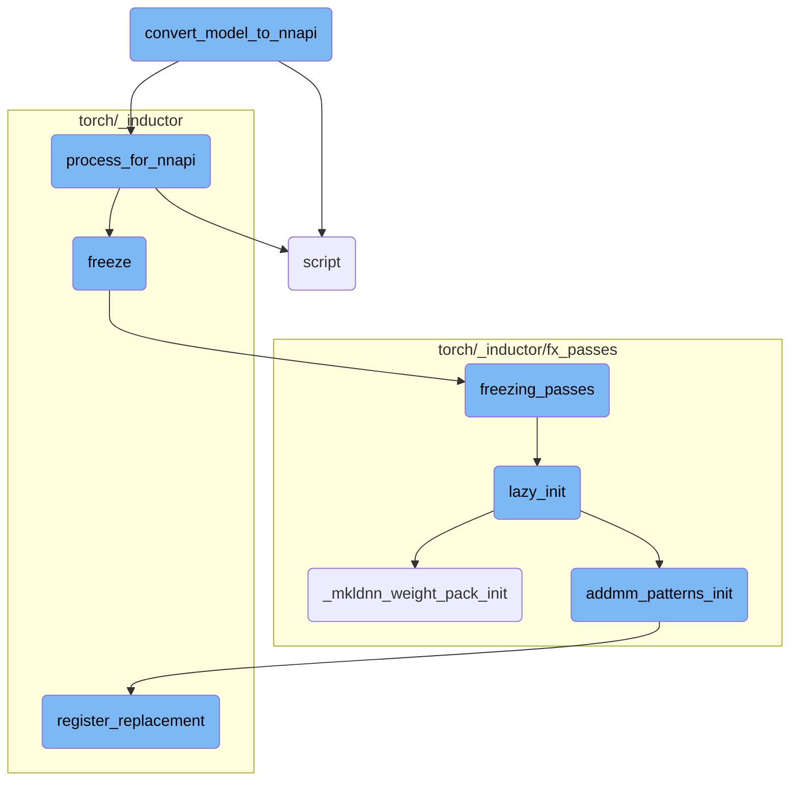
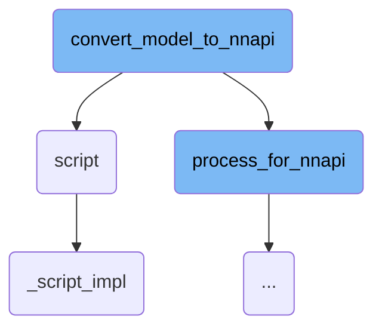
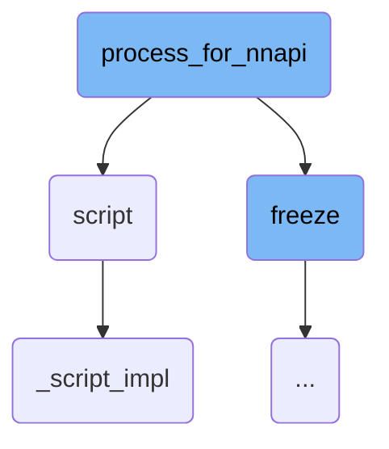
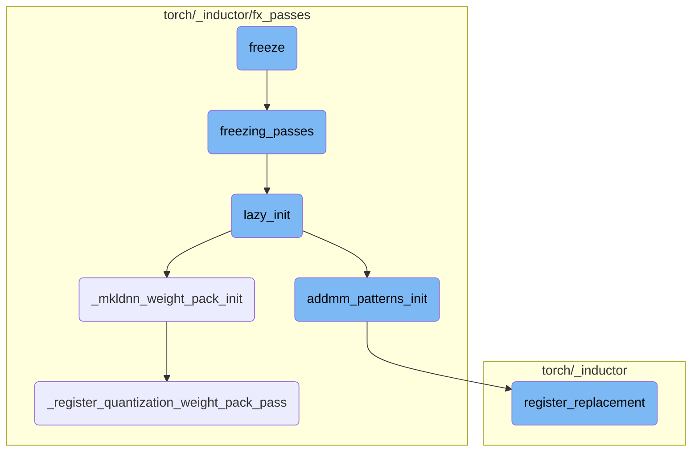

This document provides an overview of the process involved in converting a PyTorch model to the NNAPI format. The conversion process includes several steps such as processing the model for NNAPI, creating necessary modules, and scripting the model for execution on NNAPI.

The process of converting a model to NNAPI involves several steps. First, the model is prepared for NNAPI by computing shapes, serializing the model tensor, and gathering necessary weights and memory formats. Then, a specialized module is created with this processed data. To ensure compatibility with NNAPI, the module is wrapped to adjust input and output formats. Finally, the wrapped model is scripted to produce a format that can be executed on NNAPI.

Here is a high level diagram of the flow, showing only the most important functions:



# Flow drill down

First, we'll zoom into this section of the flow:



<SwmSnippet path="/torch/backends/_nnapi/prepare.py" line="106">

---

## Converting Model to NNAPI

The function `convert_model_to_nnapi` is responsible for converting a PyTorch model to the NNAPI format. It first processes the model using `process_for_nnapi`, which prepares the model for NNAPI conversion by computing shapes, serializing the model tensor, and gathering necessary weights and memory formats. Then, it creates an `NnapiModule` with the processed data. To ensure compatibility with NNAPI's input and output expectations, it wraps the `NnapiModule` in `NnapiInterfaceWrapper`, which adjusts the input and output formats. Finally, it scripts the wrapped model using `torch.jit.script` to produce a TorchScript module that can be executed on NNAPI.

```python
    (
        shape_compute_module,
        ser_model_tensor,
        used_weights,
        inp_mem_fmts,
        out_mem_fmts,
        retval_count,
    ) = process_for_nnapi(
        model, inputs, serializer, return_shapes, use_int16_for_qint16
    )

    nnapi_model = NnapiModule(
        shape_compute_module,
        ser_model_tensor,
        used_weights,
        inp_mem_fmts,
        out_mem_fmts,
        compilation_preference,
        relax_f32_to_f16,
    )

```

---

</SwmSnippet>

<SwmSnippet path="/torch/jit/_script.py" line="1217">

---

## Scripting the Model

The function `script` is used to convert a PyTorch model or function into TorchScript, a statically-typed subset of Python that can be optimized and run independently of Python. This function inspects the source code of the provided object, compiles it using the TorchScript compiler, and returns a `ScriptModule` or `ScriptFunction`. This conversion is crucial for enabling the model to run efficiently on different backends, including NNAPI.

```python
def script(
    obj,
    optimize=None,
    _frames_up=0,
    _rcb=None,
    example_inputs: Union[List[Tuple], Dict[Callable, List[Tuple]], None] = None,
):
    r"""Script the function.

    Scripting a function or ``nn.Module`` will inspect the source code, compile
    it as TorchScript code using the TorchScript compiler, and return a :class:`ScriptModule` or
    :class:`ScriptFunction`. TorchScript itself is a subset of the Python language, so not all
    features in Python work, but we provide enough functionality to compute on
    tensors and do control-dependent operations. For a complete guide, see the
    :ref:`language-reference`.

    Scripting a dictionary or list copies the data inside it into a TorchScript instance than can be
    subsequently passed by reference between Python and TorchScript with zero copy overhead.

    ``torch.jit.script`` can be used as a function for modules, functions, dictionaries and lists
     and as a decorator ``@torch.jit.script`` for :ref:`torchscript-classes` and functions.
```

---

</SwmSnippet>

<SwmSnippet path="/torch/jit/_script.py" line="1086">

---

### Implementing Script Conversion

The function `_script_impl` is the core implementation behind the `script` function. It handles various types of objects, including `nn.Module`, functions, classes, dictionaries, and lists. It ensures that the provided object is properly converted into a TorchScript representation. If example inputs are provided, it uses them to infer type annotations and generate call traces, which helps in optimizing the scripted model. This function is essential for the seamless conversion of PyTorch models and functions into TorchScript, enabling their execution on different backends.

```python
def _script_impl(
    obj,
    optimize=None,
    _frames_up=0,
    _rcb=None,
    example_inputs: Union[List[Tuple], Dict[Callable, List[Tuple]], None] = None,
):
    global type_trace_db

    if optimize is not None:
        warnings.warn(
            "`optimize` is deprecated and has no effect. "
            "Use `with torch.jit.optimized_execution()` instead",
            FutureWarning,
            stacklevel=3,
        )

    # No-op for modules, functions, class instances that are already scripted
    if isinstance(obj, RecursiveScriptClass):
        return obj
    if isinstance(obj, ScriptModule):
```

---

</SwmSnippet>

Now, lets zoom into this section of the flow:



<SwmSnippet path="/torch/backends/_nnapi/prepare.py" line="164">

---

## Serializing the Model

The model is serialized using the `_NnapiSerializer` class. This step converts the model into a serialized format that can be processed by NNAPI. The serializer also extracts useful information such as used weights, input and output memory formats, shape computation lines, and the return value count.

```python
    serializer = serializer or _NnapiSerializer(
        config=None, use_int16_for_qint16=use_int16_for_qint16
    )
    (
        ser_model,
        used_weights,
        inp_mem_fmts,
        out_mem_fmts,
        shape_compute_lines,
        retval_count,
    ) = serializer.serialize_model(model, inputs, return_shapes)
```

---

</SwmSnippet>

<SwmSnippet path="/torch/backends/_nnapi/prepare.py" line="177">

---

## Creating the Shape Computation Module

A new class `ShapeComputeModule` is defined to handle tensor shape computation. This class is scripted using `torch.jit.script` and a method `prepare` is dynamically added to it. The `prepare` method will mutate the serialized model according to the computed operand shapes based on the input arguments.

```python
    # We have to create a new class here every time this function is called
    # because module.define adds a method to the *class*, not the instance.
    class ShapeComputeModule(torch.nn.Module):
        """Code-gen-ed module for tensor shape computation.

        module.prepare will mutate ser_model according to the computed operand
        shapes, based on the shapes of args.  Returns a list of output templates.
        """

    shape_compute_module = torch.jit.script(ShapeComputeModule())
    real_shape_compute_lines = [
        "def prepare(self, ser_model: torch.Tensor, args: List[torch.Tensor]) -> List[torch.Tensor]:\n",
    ] + [f"    {line}\n" for line in shape_compute_lines]
    shape_compute_module.define("".join(real_shape_compute_lines))
```

---

</SwmSnippet>

Now, lets zoom into this section of the flow:



<SwmSnippet path="/torch/_inductor/freezing.py" line="66">

---

## Freeze

The `freeze` function inlines parameters that are not mutated into constants and optimizes the graph through constant propagation and other techniques. It also discards the original parameters of the module for memory efficiency if enabled. This function is crucial for optimizing the model by reducing its memory footprint and improving execution speed.

```python
def freeze(
    dynamo_gm: torch.fx.GraphModule,
    aot_autograd_gm: torch.fx.GraphModule,
    example_inputs: List[torch._subclasses.FakeTensor],
) -> Tuple[torch.fx.GraphModule, List[int]]:
    """
    Inlines parameters that are not mutated into constants and optimizes the graph through constant propagation
    and other techniques. If enabled, the function also discards the original parameters of the module for memory efficiency.

    Assumes that this function is run in dynamo tracing post aot_autograd.

    Args:
        dynamo_gm (torch.fx.GraphModule): The Dynamo constructed GraphModule.
        aot_autograd_gm (torch.fx.GraphModule): The aot_autograd constructed GraphModule to be frozen.
        example_inputs (List[torch.Tensor]): A list of example input tensors to be used in the freezing process.

    Returns:
        Tuple[torch.fx.GraphModule, List[int]]: A tuple containing the frozen GraphModule and a list of indices
        of the inputs that were preserved (not turned into constants).
    """
    # We have convert conv's weight to channels last which may meet error for .view
```

---

</SwmSnippet>

<SwmSnippet path="/torch/_inductor/fx_passes/freezing_patterns.py" line="36">

---

## Freezing Passes

The `freezing_passes` function applies various optimization passes to the graph to freeze it. This includes constant folding, binary folding, and applying specific patterns to optimize the graph further. These passes help in removing unnecessary nodes and ensuring that the graph is in its most optimized form.

```python
def freezing_passes(gm: torch.fx.GraphModule, aot_example_inputs):
    """
    Passes that are applied to the graph to freeze pass.
    """

    from ..freezing import constant_fold

    lazy_init()
    # We need a few rounds of binary folding to get rid of all the
    # unnecessary nodes, but may need a good method to chose the rounds number.
    # works like: conv+binary+binary.
    binary_folding = counters["inductor"]["binary_folding"]
    fake_tensor_prop(gm, aot_example_inputs, True)

    torch._inductor.fx_passes.binary_folding.mark_mixed_dtype_allowed_convs(gm)
    for _ in range(4):
        constant_fold(gm)
        # Make sure meta['val'] is properly set for all nodes
        fake_tensor_prop(gm, aot_example_inputs, True)
        binary_folding_pass.apply(gm.graph)  # type: ignore[arg-type]
        # If we don't have binary folding, we don't need to run the pass again.
```

---

</SwmSnippet>

<SwmSnippet path="/torch/_inductor/fx_passes/freezing_patterns.py" line="87">

---

## Lazy Initialization

The `lazy_init` function initializes various components required for the freezing process. This includes initializing MKL-DNN weight packing and binary folding. Lazy initialization ensures that these components are only initialized when needed, improving the efficiency of the freezing process.

```python
def lazy_init():
    if torch._C._has_mkldnn and config.cpp.weight_prepack:
        from .mkldnn_fusion import _mkldnn_weight_pack_init

        _mkldnn_weight_pack_init()

    from .binary_folding import binary_folding_init

    addmm_patterns_init()
    binary_folding_init()
```

---

</SwmSnippet>

<SwmSnippet path="/torch/_inductor/fx_passes/mkldnn_fusion.py" line="1262">

---

## MKL-DNN Weight Pack Initialization

The `_mkldnn_weight_pack_init` function initializes the MKL-DNN weight packing process. This involves registering various passes required for weight packing and recovering linear operations. This step is essential for optimizing the model for MKL-DNN backends.

```python
    def _mkldnn_weight_pack_init():
        if torch.backends.mkldnn.enabled and torch.backends.mkldnn.is_available():
            _register_weight_pack_pass()
            _recover_linear()
            _register_quantization_weight_pack_pass()
```

---

</SwmSnippet>

<SwmSnippet path="/torch/_inductor/fx_passes/freezing_patterns.py" line="116">

---

## AddMM Patterns Initialization

The `addmm_patterns_init` function initializes patterns for matrix multiplication (AddMM) operations. It registers replacement patterns that optimize matrix multiplication by concatenating weights and biases. This step is crucial for optimizing matrix multiplication operations in the graph.

```python
def addmm_patterns_init():
    if torch.cuda.is_available():
        # workaround https://github.com/pytorch/pytorch/issues/97894
        device = "cuda"
    else:
        device = "cpu"
    val = functools.partial(torch.empty, (10, 10), device=device, requires_grad=False)

    def check_concat_weights(match):
        weight_inputs = ["w1", "w2"]
        if "w3" in match.kwargs:
            weight_inputs.append("w3")

        equal_shape_inputs = [weight_inputs]

        if "b1" in match.kwargs:
            bias_inputs = ["b1", "b2"]
            if "b3" in match.kwargs:
                bias_inputs.append("b3")

            equal_shape_inputs.append(bias_inputs)
```

---

</SwmSnippet>

<SwmSnippet path="/torch/_inductor/pattern_matcher.py" line="1194">

---

## Register Replacement

The `register_replacement` function registers replacement patterns for various operations in the graph. These patterns help in optimizing the graph by replacing complex operations with more efficient ones. This function is essential for ensuring that the graph is in its most optimized form.

```python
def register_replacement(
    search_fn: SearchFn,
    replace_fn: ReplaceFn,
    example_inputs: Iterable[Any],
    trace_fn: TraceFn,
    pass_dicts: Union[_PassDictsType, Sequence[_PassDictsType]],
    extra_check: Callable[[Match], bool] = _return_true,
    scalar_workaround: Union[Dict[str, Union[float, int]], None] = None,
    exclusive_arg_names: Sequence[str] = (),
    search_fn_pattern: Union[PatternExpr, None] = None,
) -> bool:
    """
    Create a replacement rule based on example functions that get traced
    to create patterns.  This supports both training and inference when
    run on a joint forward+backward graph.

    Args:
        search_fn: traced to give original pattern
        replace_fn: traced to give replacement graph
        example_inputs: example inputs for initial trace
        trace_fn: fwd_only or joint_fwd_bwd
```

---

</SwmSnippet>

<SwmSnippet path="/torch/_inductor/fx_passes/quantization.py" line="2490">

---

## Register Quantization Weight Pack Pass

The `_register_quantization_weight_pack_pass` function registers passes required for quantization weight packing. This includes dequant promotion and weight prepacking for QConv and QLinear operations. This step is crucial for optimizing the model for quantized operations.

```python
def _register_quantization_weight_pack_pass():
    # Step 1: Dequant promotion for int8-mixed-fp32/bf16
    _register_dequant_promotion()

    # Step 2: QConv weight prepack
    _register_qconv_weight_prepack()

    # Step 3: QLinear weight prepack
    _register_qlinear_weight_prepack()
```

---

</SwmSnippet>

&nbsp;

*This is an auto-generated document by Swimm AI 🌊 and has not yet been verified by a human*

<SwmMeta version="3.0.0" repo-id="Z2l0aHViJTNBJTNBcHl0b3JjaC1hdXRvZG9jcy1kZW1vJTNBJTNBU3dpbW0tRGVtbw==" repo-name="pytorch-autodocs-demo"><sup>Powered by [Swimm](https://app.swimm.io/)</sup></SwmMeta>
