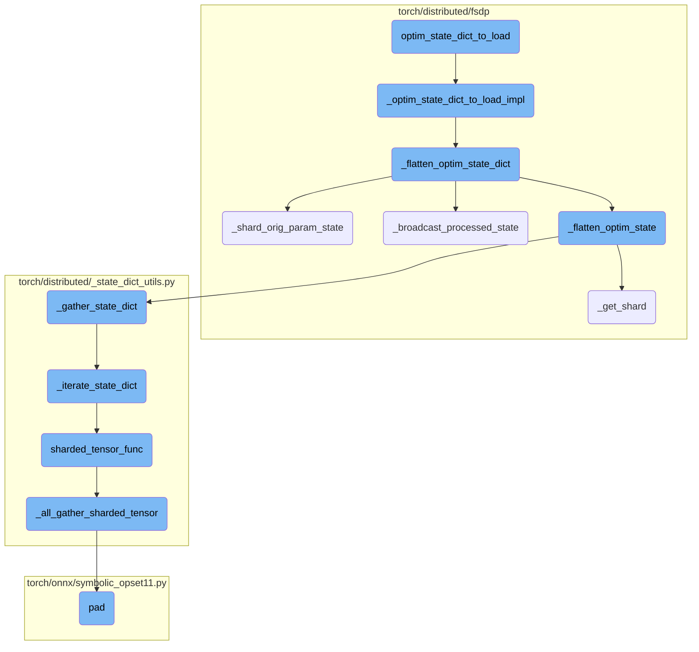
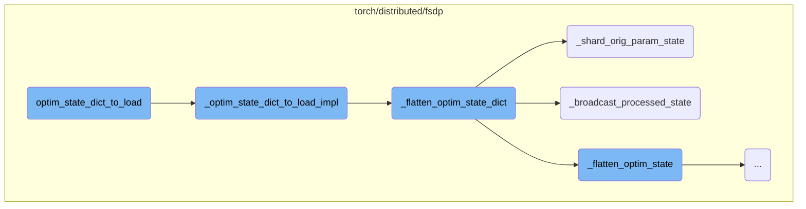
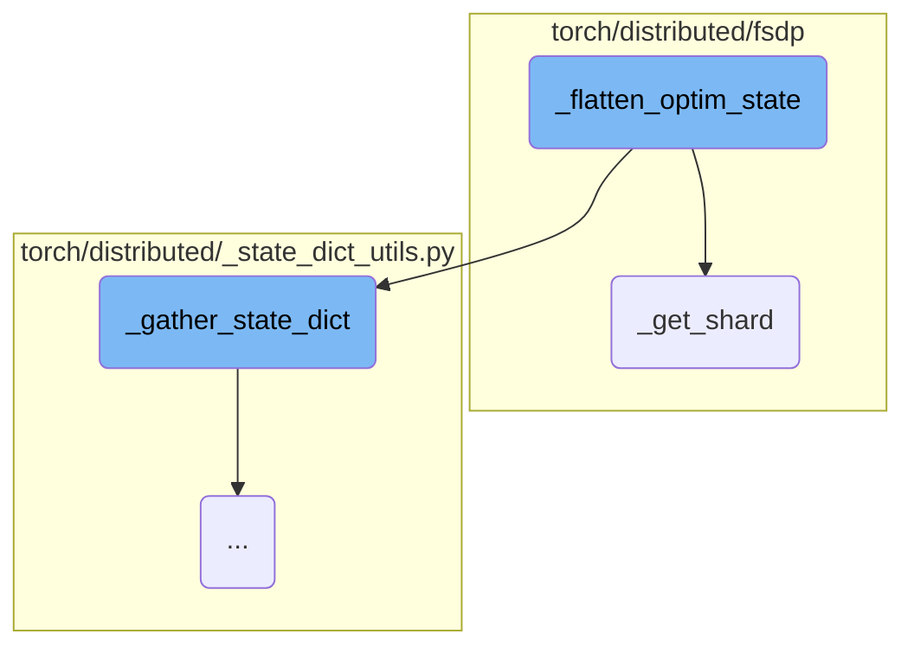
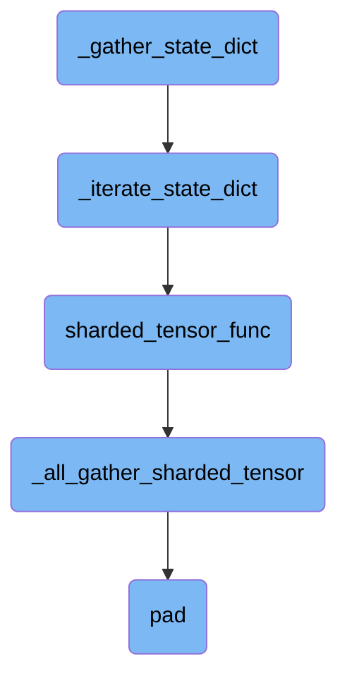
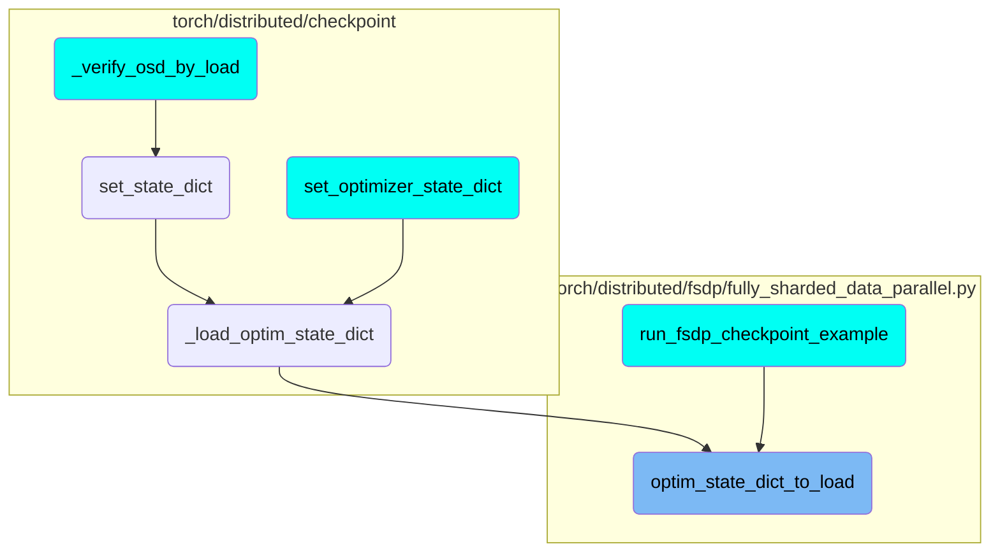

This document explains the process of converting an optimizer state dictionary so that it can be loaded into the optimizer associated with a Fully Sharded Data Parallel (FSDP) model. The process involves several steps, including flattening the optimizer state dictionary, sharding the original parameter state, and broadcasting the processed state across the specified process group.

The flow starts with converting the optimizer state dictionary to make it compatible with the FSDP model. This involves flattening the state dictionary, which means organizing it in a way that can be easily managed and loaded. Next, the original parameter state is divided into smaller parts (sharded) to match the FSDP model's structure. Finally, the processed state is shared across all the devices involved in the training to ensure they all have the same information.

Here is a high level diagram of the flow, showing only the most important functions:



# Flow drill down

First, we'll zoom into this section of the flow:



<SwmSnippet path="/torch/distributed/fsdp/fully_sharded_data_parallel.py" line="1891">

---

## Converting Optimizer State Dictionary

The function `optim_state_dict_to_load` converts an optimizer state dictionary so that it can be loaded into the optimizer associated with the Fully Sharded Data Parallel (FSDP) model. It takes the model, optimizer, and the optimizer state dictionary as inputs and returns a flattened optimizer state dictionary that can be loaded into the optimizer. This function ensures that the optimizer state dictionary is compatible with the FSDP model's sharded parameters.

```python
    def optim_state_dict_to_load(
        model: torch.nn.Module,
        optim: torch.optim.Optimizer,
        optim_state_dict: Dict[str, Any],
        is_named_optimizer: bool = False,
        load_directly: bool = False,
        group: Optional[dist.ProcessGroup] = None,
    ) -> Dict[str, Any]:
        """
        Convert an optimizer state-dict so that it can be loaded into the optimizer associated with the FSDP model.

        Given a ``optim_state_dict`` that is transformed through
        :meth:`optim_state_dict`, it gets converted to the flattened optimizer
        state_dict that can be loaded to ``optim`` which is the optimizer for
        ``model``. ``model`` must be sharded by FullyShardedDataParallel.

            >>> # xdoctest: +SKIP("undefined variables")
            >>> from torch.distributed.fsdp import FullyShardedDataParallel as FSDP
            >>> from torch.distributed.fsdp import StateDictType
            >>> from torch.distributed.fsdp import FullStateDictConfig
            >>> from torch.distributed.fsdp import FullOptimStateDictConfig
```

---

</SwmSnippet>

<SwmSnippet path="/torch/distributed/fsdp/fully_sharded_data_parallel.py" line="1298">

---

## Internal Implementation of State Dictionary Conversion

The function `_optim_state_dict_to_load_impl` is an internal API used by all load optimizer state dictionary implementations. It adds FSDP internal information and sharding to the optimizer state dictionary. This function handles the conversion of the optimizer state dictionary by checking the state dictionary type, using the appropriate parameters, and ensuring that the state dictionary is correctly sharded and keyed.

```python
    def _optim_state_dict_to_load_impl(
        optim_state_dict: Dict[str, Any],
        model: torch.nn.Module,
        optim_input: Optional[
            Union[
                List[Dict[str, Any]],
                Iterable[torch.nn.Parameter],
            ]
        ] = None,
        optim: Optional[torch.optim.Optimizer] = None,
        full_state_dict: bool = True,
        rank0_only: bool = False,
        is_named_optimizer: bool = False,
        group: Optional[dist.ProcessGroup] = None,
    ) -> Dict[str, Any]:
        """
        Convert an optimizer state-dict so that it can be loaded into the optimizer associated with the FSDP model.

        This is the internal API that is used by all the load optim_state_dict implementations.
        Given model, optim, and the saved optim_state_dict, this API adds the FSDP
        internal information and internal sharding to the optim_state_dict.
```

---

</SwmSnippet>

<SwmSnippet path="/torch/distributed/fsdp/_optim_utils.py" line="416">

---

## Flattening the Optimizer State Dictionary

The function `_flatten_optim_state_dict` flattens the full optimizer state dictionary while still keying by unflattened parameter names. It handles the aggregation of states across ranks, ensuring that the optimizer state dictionary is correctly flattened and sharded. This function is crucial for managing the optimizer states in a distributed setting, especially when using NamedOptimizer or KeyedOptimizer.

```python
def _flatten_optim_state_dict(
    optim_state_dict: Dict[str, Any],
    model: nn.Module,
    use_orig_params: bool = False,
    optim: Optional[torch.optim.Optimizer] = None,
    rank0_only: bool = False,
    group: Optional[dist.ProcessGroup] = None,
) -> Dict[str, Any]:
    """
    Flattens the full optimizer state dict, still keying by unflattened parameter
    names.

    If ``use_orig_params`` is True, each rank will have all FSDP-managed
    parameters but some of these parameters may be empty due to the sharding.
    For a regular optim.Optimizer, states for those empty parameters will
    not be initialized. So, when aggregating the FQNs across ranks, no assert
    will be raised on a rank even if it does not have all the states -- it is
    valid and FSDP know how to aggregate them. However, FSDP has to ignore
    handling those parameters that are not managed by FSDP and do not exist on
    the local rank -- it is managed by other parallelism and FSDP does not
    know ho to handle/aggregate them.
```

---

</SwmSnippet>

<SwmSnippet path="/torch/distributed/fsdp/_optim_utils.py" line="381">

---

## Sharding Original Parameter State

The function `_shard_orig_param_state` shards the optimizer state for the original parameter with the given name. This function is used when `use_orig_params` is set to True and ensures that the optimizer state is correctly sharded according to the FSDP model's sharding strategy.

```python
def _shard_orig_param_state(
    fsdp_param_info: FSDPParamInfo,
    fqn: str,
    optim_state: Dict[str, Any],
) -> Dict[str, Any]:
    """
    Shard the optimizer state for the original parameter with the name ``fqn``.
    This API should only be used when ``use_orig_params`` is True.
    """
    if not optim_state:
        return {}
    fsdp_state = fsdp_param_info.state
    flat_param = fsdp_param_info.handle.flat_param
    param_idx = fsdp_param_info.param_indices[fqn]
    shard_param_info = flat_param._shard_param_infos[param_idx]  # type: ignore[attr-defined]
    optim_state = _gather_state_dict(
        optim_state, pg=fsdp_state.process_group, device=fsdp_state.compute_device
    )
    if not shard_param_info.in_shard:
        return {}
    # Flatten and shard the state.
```

---

</SwmSnippet>

<SwmSnippet path="/torch/distributed/fsdp/_optim_utils.py" line="339">

---

## Broadcasting Processed State

The function `_broadcast_processed_state` broadcasts the processed optimizer state across the specified process group. This function ensures that all ranks have a consistent view of the optimizer state, which is essential for maintaining synchronization in a distributed training setup.

```python
def _broadcast_processed_state(
    fsdp_state: _FSDPState,
    optim_state: Dict[str, Any],
    group: Optional[dist.ProcessGroup],
) -> Dict[str, Any]:
    objects: List[Any] = [None]
    if dist.get_rank(group) == 0:
        objects[0] = tree_map_only(
            torch.Tensor,
            lambda v: v.cpu() if v.dim() == 0 else _PosDimTensorInfo(v.shape, v.dtype),  # type: ignore[union-attr]
            optim_state,
        )
    dist.broadcast_object_list(objects, src=0, group=group)
    if dist.get_rank(group) == 0:
        return optim_state
    else:
        return objects[0]
```

---

</SwmSnippet>

Now, lets zoom into this section of the flow:



<SwmSnippet path="/torch/distributed/fsdp/_optim_utils.py" line="598">

---

## Flattening Optimizer State

The `_flatten_optim_state` function is responsible for flattening the optimizer state for a single flat parameter. It first checks if any of the unflattened parameters have optimizer state. If none of them have state, it returns an empty dictionary, indicating no need to flatten any state.

```python
    # Check if these unflattened parameters have any optimizer state
    has_state = [
        bool(unflat_param_name in unflat_osd_state)
        for unflat_param_name in unflat_param_names
    ]
    # If none of the unflattened parameters comprising this flat parameter have
    # any state, then we do not want an entry in the optimizer state dict
    if not any(has_state):
        return {}  # no need to flatten any state
```

---

</SwmSnippet>

<SwmSnippet path="/torch/distributed/fsdp/_optim_utils.py" line="609">

---

## Gathering State Dictionary

The function then gathers the state dictionary for each unflattened parameter. This is done using the `_gather_state_dict` function, which collects the state from the optimizer state dictionary for each unflattened parameter name.

```python
    unflat_param_states = [
        _gather_state_dict(
            unflat_osd_state[unflat_param_name],
            pg=fsdp_state.process_group,
            device=fsdp_state.compute_device,
        )
        if unflat_param_name in unflat_osd_state
        else None
        for unflat_param_name in unflat_param_names
    ]
```

---

</SwmSnippet>

<SwmSnippet path="/torch/distributed/fsdp/_optim_utils.py" line="619">

---

## Checking State Names

The function checks that all unflattened parameters have the same state names. If there are differing state names, it raises a `ValueError`. This ensures consistency in the optimizer state across all unflattened parameters.

```python
    # Check that the unflattened parameters have the same state names
    state_names = None
    for unflat_param_state in unflat_param_states:
        if unflat_param_state is None:
            continue
        if state_names is None:
            state_names = set(unflat_param_state.keys())
        else:
            if state_names != set(unflat_param_state.keys()):
                raise ValueError(
                    "Differing optimizer state names for the unflattened "
                    f"parameters: {unflat_param_names}"
                )
    assert state_names is not None
```

---

</SwmSnippet>

<SwmSnippet path="/torch/distributed/fsdp/_optim_utils.py" line="634">

---

## Flattening the State

The function then proceeds to flatten the state for each state name. Depending on the type of state values (positive dimension tensors, zero-dimension tensors, or non-tensors), it uses different helper functions to flatten the state. If the state values are positive dimension tensors and sharding is enabled, it immediately shards the flattened tensor to minimize memory usage.

```python
    # Flatten the state
    flat_state: Dict[str, Any] = {}
    for state_name in state_names:
        state_values = [
            unflat_param_state[state_name] if unflat_param_state is not None else None
            for unflat_param_state in unflat_param_states
        ]
        non_none_state_values = [v for v in state_values if v is not None]
        # If all ranks have None, this is a None value
        if not non_none_state_values:
            flat_state[state_name] = None
            continue
        are_pos_dim_tensors = are_zero_dim_tensors = are_non_tensors = True
        for v in non_none_state_values:
            are_pos_dim_tensors &= torch.is_tensor(v) and v.dim() > 0
            are_zero_dim_tensors &= _is_zero_dim_tensor(v)
            are_non_tensors &= not torch.is_tensor(v)
        types = {type(v) for v in non_none_state_values}
        if len(types) != 1 or not (
            are_pos_dim_tensors or are_zero_dim_tensors or are_non_tensors
        ):
```

---

</SwmSnippet>

<SwmSnippet path="/torch/distributed/fsdp/_flat_param.py" line="1074">

---

## Getting Shard

The `_get_shard` function is used to return the shard of a tensor for a given rank and world size. It allocates new memory for the shard and pads it if necessary. This function is crucial for distributing the flattened optimizer state across different ranks in a distributed setting.

```python
        chunk, numel_to_pad = FlatParamHandle._get_unpadded_shard(
            tensor, rank, world_size
        )
        shard = chunk.clone()
        if numel_to_pad > 0:
            shard = F.pad(shard, [0, numel_to_pad])
        return shard, numel_to_pad
```

---

</SwmSnippet>

Now, lets zoom into this section of the flow:



<SwmSnippet path="/torch/distributed/_state_dict_utils.py" line="205">

---

## Gathering State Dictionary

The `_gather_state_dict` function is responsible for gathering all the ShardedTensors or DTensors in the provided state dictionary. It takes various parameters such as the state dictionary, process group, device, and other options to control the gathering process. The function applies specific operations to ShardedTensors and DTensors using helper functions like `sharded_tensor_func` and `dtensor_func`, and then iterates through the state dictionary using `_iterate_state_dict` to apply these operations.

```python
def _gather_state_dict(
    state_dict: Dict[str, Any],
    *,
    pg: Optional[dist.ProcessGroup] = None,
    device: Optional[torch.device] = None,
    cpu_offload: bool = False,
    ranks_only: Tuple[int, ...] = (),
    type_check: bool = True,
) -> Dict[str, Any]:
    """
    Given a state_dict, this API gathers all the ShardedTensors or DTensors in
    the state_dict.


    Args:
        state_dict (Dict[str, Any]): the target sharded state_dict.
        pg (Optional[dist.ProcessGroup]): the process group that is used to
            gather ShardedTensor. Note that gathering a DTensor will use
            the DeviceMesh. So this argument will be ignored when gathering a
            DTensor.
        device: (Optional[torch.device]): the device that is used to
```

---

</SwmSnippet>

<SwmSnippet path="/torch/distributed/_state_dict_utils.py" line="84">

---

### Iterating State Dictionary

The `_iterate_state_dict` function iterates through the state dictionary and applies the provided functions to each tensor type. It handles different types of objects such as ShardedTensors, DTensors, regular Tensors, and other supported data types. The function ensures that the appropriate operations are applied to each type and supports options like CPU offloading and non-blocking copy.

```python
def _iterate_state_dict(
    iter_object: Any,
    sharded_tensor_func: Callable,
    dtensor_func: Callable,
    tensor_func: Callable,
    *,
    pg: Optional[dist.ProcessGroup] = None,
    device: Optional[torch.device] = None,
    cpu_offload: bool = False,
    companion_obj: Any = None,
    ranks_only: Tuple[int, ...] = (),
    type_check: bool = True,
    non_blocking: bool = True,
) -> Dict[str, Any]:
    """Iterate through the state dict, applying the given functions to each tensor type.

    Args:
        iter_object (Any): the target state_dict.
        sharded_tensor_func (Callable): the function to apply to ShardedTensor
        dtensor_func (Callable): the function to apply to DTensor
        tensor_func (Callable): the function to apply to Tensor
```

---

</SwmSnippet>

<SwmSnippet path="/torch/distributed/_state_dict_utils.py" line="240">

---

### Handling Sharded Tensors

The `sharded_tensor_func` function handles the gathering of ShardedTensors. It gathers the tensor data across different devices and ensures that the gathered tensor is moved to the correct device if necessary. This function is crucial for correctly assembling the ShardedTensors from different shards.

```python
    """

    def sharded_tensor_func(value, pg, device, companion_obj):
        # ShardedTensor does not seem to record the original device type.
        # So if the tensor is moved to CPU, we won't know the original type.
        # As a result, we have to rely on the user to tell us the correct one.
        cpu_device = torch.device("cpu")
        output_tensor = _all_gather_sharded_tensor(value, pg, device)
        local_shard_device = (
            value.local_shards()[0].tensor.device
            if value.local_shards()
            else cpu_device
        )
        if output_tensor.device != local_shard_device:
            value = output_tensor.to(local_shard_device)
        else:
            value = output_tensor
        return value
```

---

</SwmSnippet>

<SwmSnippet path="/torch/distributed/_state_dict_utils.py" line="42">

---

### All-Gather Sharded Tensor

The `_all_gather_sharded_tensor` function performs the all-gather operation for ShardedTensors. It gathers the tensor data from all shards and assembles it into a single tensor. This function handles the necessary padding and device management to ensure that the gathered tensor is correctly formed.

```python
def _all_gather_sharded_tensor(
    sharded_tensor: "ShardedTensor",
    pg: Optional[dist.ProcessGroup] = None,
    device: Optional[torch.device] = None,
) -> torch.Tensor:
    if pg is None:
        pg = distributed_c10d._get_default_group()
    world_size = dist.get_world_size(pg)
    shards = sharded_tensor.local_shards()
    dim_0_size = sharded_tensor.size()[0]  # type: ignore[index]
    tensor_numel = sharded_tensor.size().numel()  # type: ignore[union-attr]
    chunk_size = math.ceil(dim_0_size / world_size) * tensor_numel // dim_0_size
    pg_device = (
        distributed_c10d._get_pg_default_device(pg) if device is None else device
    )
    if shards:
        local_tensor = shards[0].tensor.flatten()
        if local_tensor.device.type != pg_device.type:
            local_tensor = local_tensor.to(pg_device)
        num_padding = chunk_size - local_tensor.numel()
        if num_padding > 0:
```

---

</SwmSnippet>

<SwmSnippet path="/torch/onnx/symbolic_opset11.py" line="741">

---

### Padding

The `pad` function in the ONNX symbolic opset handles different padding modes such as replicate, reflect, constant, and circular. It applies the specified padding mode to the input tensor and returns the padded tensor. This function is used in the context of gathering tensors to ensure that the tensor dimensions match the expected sizes.

```python
def pad(
    g: jit_utils.GraphContext,
    input: _C.Value,
    pad: _C.Value,
    mode: _C.Value,
    value: _C.Value,
):
    mode = symbolic_helper._parse_arg(mode, "s")
    if mode == "replicate":
        return replication_pad(g, input, pad)
    elif mode == "reflect":
        return reflection_pad(g, input, pad)
    elif mode == "constant":
        return constant_pad_nd(g, input, pad, value)
    elif mode == "circular":
        return opset9._pad_circular(g, input, pad)
    else:
        raise errors.SymbolicValueError(f"Unrecognized padding mode {mode}", input)
```

---

</SwmSnippet>

# Where is this flow used?

This flow is used multiple times in the codebase as represented in the following diagram:



&nbsp;

*This is an auto-generated document by Swimm AI 🌊 and has not yet been verified by a human*

<SwmMeta version="3.0.0" repo-id="Z2l0aHViJTNBJTNBcHl0b3JjaC1hdXRvZG9jcy1kZW1vJTNBJTNBU3dpbW0tRGVtbw==" repo-name="pytorch-autodocs-demo"><sup>Powered by [Swimm](https://app.swimm.io/)</sup></SwmMeta>
