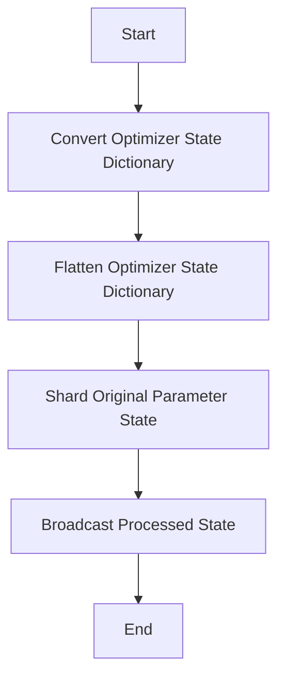

This document will cover the process of converting and loading an optimizer state dictionary for Fully Sharded Data Parallel (FSDP) models. We'll cover:

1. Converting the optimizer state dictionary
2. Flattening the optimizer state dictionary
3. Sharding the original parameter state
4. Broadcasting the processed state

Technical document: <SwmLink doc-title="Converting and Loading Optimizer State Dictionary">[Converting and Loading Optimizer State Dictionary](/.swm/converting-and-loading-optimizer-state-dictionary.bunt32s5.sw.md)</SwmLink>

# [Converting the Optimizer State Dictionary](https://app.swimm.io/repos/Z2l0aHViJTNBJTNBcHl0b3JjaC1hdXRvZG9jcy1kZW1vJTNBJTNBU3dpbW0tRGVtbw==/docs/bunt32s5#converting-optimizer-state-dictionary)

The process begins with converting the optimizer state dictionary to ensure compatibility with the FSDP model. This involves taking the model, optimizer, and the optimizer state dictionary as inputs and returning a flattened optimizer state dictionary. This step ensures that the optimizer state dictionary is compatible with the FSDP model's sharded parameters.

# [Flattening the Optimizer State Dictionary](https://app.swimm.io/repos/Z2l0aHViJTNBJTNBcHl0b3JjaC1hdXRvZG9jcy1kZW1vJTNBJTNBU3dpbW0tRGVtbw==/docs/bunt32s5#flattening-the-optimizer-state-dictionary)

Next, the optimizer state dictionary is flattened. Flattening involves organizing the state dictionary in a way that can be easily managed and loaded. This step handles the aggregation of states across ranks, ensuring that the optimizer state dictionary is correctly flattened and sharded. This is crucial for managing the optimizer states in a distributed setting.

# [Sharding the Original Parameter State](https://app.swimm.io/repos/Z2l0aHViJTNBJTNBcHl0b3JjaC1hdXRvZG9jcy1kZW1vJTNBJTNBU3dpbW0tRGVtbw==/docs/bunt32s5#sharding-original-parameter-state)

The original parameter state is then divided into smaller parts (sharded) to match the FSDP model's structure. This step ensures that the optimizer state is correctly sharded according to the FSDP model's sharding strategy. Sharding helps in distributing the optimizer state across different devices, which is essential for efficient parallel training.

# [Broadcasting the Processed State](https://app.swimm.io/repos/Z2l0aHViJTNBJTNBcHl0b3JjaC1hdXRvZG9jcy1kZW1vJTNBJTNBU3dpbW0tRGVtbw==/docs/bunt32s5#broadcasting-processed-state)

Finally, the processed state is shared across all the devices involved in the training to ensure they all have the same information. Broadcasting the processed state ensures that all ranks have a consistent view of the optimizer state, which is essential for maintaining synchronization in a distributed training setup.

&nbsp;

*This is an auto-generated document by Swimm AI 🌊 and has not yet been verified by a human*

<SwmMeta version="3.0.0" repo-id="Z2l0aHViJTNBJTNBcHl0b3JjaC1hdXRvZG9jcy1kZW1vJTNBJTNBU3dpbW0tRGVtbw==" repo-name="pytorch-autodocs-demo">Powered by [Swimm](https://app.swimm.io/)</SwmMeta>
