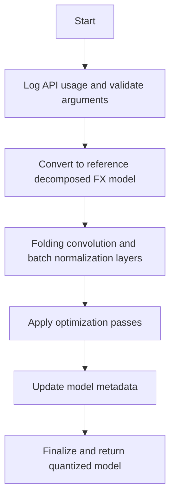

This document will cover the process of converting a trained or calibrated model into a quantized model using the convert_pt2e function. The main steps include:

1. Logging API usage and validating arguments
2. Converting the model to a reference decomposed FX model
3. Folding convolution and batch normalization layers
4. Applying optimization passes
5. Updating model metadata and finalizing the quantized model

Technical document: <SwmLink doc-title="Overview of the convert_pt2e Process">[Overview of the convert_pt2e Process](/.swm/overview-of-the-convert_pt2e-process.h4n1kro7.sw.md)</SwmLink>

# [Logging API usage and validating arguments](https://app.swimm.io/repos/Z2l0aHViJTNBJTNBcHl0b3JjaC1hdXRvZG9jcy1kZW1vJTNBJTNBU3dpbW0tRGVtbw==/docs/h4n1kro7#convert_pt2e)

The process begins with logging the usage of the API to ensure that the function's invocation is tracked for monitoring and debugging purposes. Following this, the function validates the provided arguments to ensure they meet the expected criteria. This step is crucial for preventing errors later in the process.

# [Converting to reference decomposed FX model](https://app.swimm.io/repos/Z2l0aHViJTNBJTNBcHl0b3JjaC1hdXRvZG9jcy1kZW1vJTNBJTNBU3dpbW0tRGVtbw==/docs/h4n1kro7#convert_pt2e)

The model is then converted into a reference decomposed FX model. This involves breaking down the model into a format that is easier to manipulate and optimize. This step is essential for enabling subsequent transformations and optimizations.

# [Folding convolution and batch normalization layers](https://app.swimm.io/repos/Z2l0aHViJTNBJTNBcHl0b3JjaC1hdXRvZG9jcy1kZW1vJTNBJTNBU3dpbW0tRGVtbw==/docs/h4n1kro7#_fold_conv_bn_qat)

In this step, convolution and batch normalization layers are folded together. This means that the batch normalization parameters are integrated into the convolution layers, which simplifies the model and can improve performance. This step is particularly important for models that have been trained with batch normalization.

# [Applying optimization passes](https://app.swimm.io/repos/Z2l0aHViJTNBJTNBcHl0b3JjaC1hdXRvZG9jcy1kZW1vJTNBJTNBU3dpbW0tRGVtbw==/docs/h4n1kro7#convert_pt2e)

Various optimization passes are applied to the model to enhance its efficiency. These passes include duplicating dequantize operations and porting node metadata. If the fold_quantize flag is set, constant folding is performed to further optimize the model. If the use_reference_representation flag is set, the model is rewritten to use reference representation.

# [Updating model metadata](https://app.swimm.io/repos/Z2l0aHViJTNBJTNBcHl0b3JjaC1hdXRvZG9jcy1kZW1vJTNBJTNBU3dpbW0tRGVtbw==/docs/h4n1kro7#convert_pt2e)

The model's metadata is updated to reflect the changes made during the conversion process. This includes disallowing evaluation and training modes to ensure the model is used correctly in its quantized form. This step is crucial for maintaining the integrity and usability of the quantized model.

# [Finalizing and returning the quantized model](https://app.swimm.io/repos/Z2l0aHViJTNBJTNBcHl0b3JjaC1hdXRvZG9jcy1kZW1vJTNBJTNBU3dpbW0tRGVtbw==/docs/h4n1kro7#convert_pt2e)

Finally, the quantized model is finalized and returned. This involves ensuring all transformations and optimizations have been correctly applied and that the model is ready for deployment. The end result is a model that is optimized for performance while maintaining accuracy.

&nbsp;

*This is an auto-generated document by Swimm AI 🌊 and has not yet been verified by a human*

<SwmMeta version="3.0.0" repo-id="Z2l0aHViJTNBJTNBcHl0b3JjaC1hdXRvZG9jcy1kZW1vJTNBJTNBU3dpbW0tRGVtbw==" repo-name="pytorch-autodocs-demo">Powered by [Swimm](https://app.swimm.io/)</SwmMeta>
