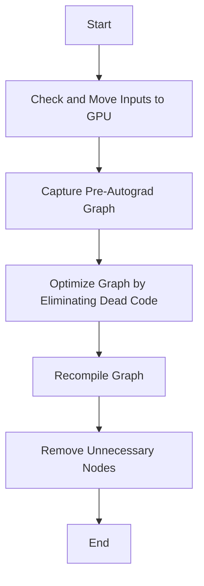

This document will cover the process of converting patterns to FX graphs, which includes:

1. Checking and moving inputs to GPU
2. Capturing the pre-autograd graph
3. Optimizing the graph by eliminating dead code
4. Recompiling the graph
5. Removing unnecessary nodes.

Technical document: <SwmLink doc-title="Converting Patterns to FX Graphs">[Converting Patterns to FX Graphs](/.swm/converting-patterns-to-fx-graphs.x51v18q1.sw.md)</SwmLink>

# [Checking and Moving Inputs to GPU](https://app.swimm.io/repos/Z2l0aHViJTNBJTNBcHl0b3JjaC1hdXRvZG9jcy1kZW1vJTNBJTNBU3dpbW0tRGVtbw==/docs/x51v18q1#the-flow-starts-by-checking-if-the-inputs-are-cuda-tensors-and-moves-them-to-the-gpu-if-necessary)

The process begins by verifying if the input data is in the form of CUDA tensors. If the inputs are not already on the GPU, they are moved there. This step ensures that the subsequent operations can leverage the GPU's computational power, leading to faster processing times and improved performance.

# [Capturing the Pre-Autograd Graph](https://app.swimm.io/repos/Z2l0aHViJTNBJTNBcHl0b3JjaC1hdXRvZG9jcy1kZW1vJTNBJTNBU3dpbW0tRGVtbw==/docs/x51v18q1#then-it-captures-the-pre-autograd-graph-which-is-a-representation-of-the-model-before-any-autograd-transformations-are-applied)

Next, the system captures the pre-autograd graph. This graph represents the model's structure and operations before any automatic differentiation (autograd) transformations are applied. Capturing this graph is crucial as it provides a clean and unaltered view of the model, which is necessary for accurate optimization and further processing.

# [Optimizing the Graph by Eliminating Dead Code](https://app.swimm.io/repos/Z2l0aHViJTNBJTNBcHl0b3JjaC1hdXRvZG9jcy1kZW1vJTNBJTNBU3dpbW0tRGVtbw==/docs/x51v18q1#this-graph-is-then-optimized-by-eliminating-dead-code)

The captured graph is then optimized by removing any dead code. Dead code refers to parts of the graph that do not contribute to the final output and can be safely eliminated. This optimization step ensures that the graph is more efficient, reducing unnecessary computations and improving overall performance.

# [Recompiling the Graph](https://app.swimm.io/repos/Z2l0aHViJTNBJTNBcHl0b3JjaC1hdXRvZG9jcy1kZW1vJTNBJTNBU3dpbW0tRGVtbw==/docs/x51v18q1#recompiling-the-graph)

After optimizing the graph, it is recompiled. Recompilation involves translating the optimized graph back into a form that can be executed efficiently. This step ensures that the graph is ready for execution with all the optimizations applied, leading to better runtime performance.

# [Removing Unnecessary Nodes](https://app.swimm.io/repos/Z2l0aHViJTNBJTNBcHl0b3JjaC1hdXRvZG9jcy1kZW1vJTNBJTNBU3dpbW0tRGVtbw==/docs/x51v18q1#finally-any-unnecessary-nodes-such-as-copy_-nodes-are-removed-to-ensure-the-graph-is-clean-and-efficient)

In the final step, any unnecessary nodes, such as `copy_` nodes, are removed from the graph. These nodes do not contribute to the final output and can clutter the graph, making it less efficient. Removing these nodes ensures that the graph is clean and optimized for execution.

&nbsp;

*This is an auto-generated document by Swimm AI 🌊 and has not yet been verified by a human*

<SwmMeta version="3.0.0" repo-id="Z2l0aHViJTNBJTNBcHl0b3JjaC1hdXRvZG9jcy1kZW1vJTNBJTNBU3dpbW0tRGVtbw==" repo-name="pytorch-autodocs-demo">Powered by [Swimm](https://app.swimm.io/)</SwmMeta>
