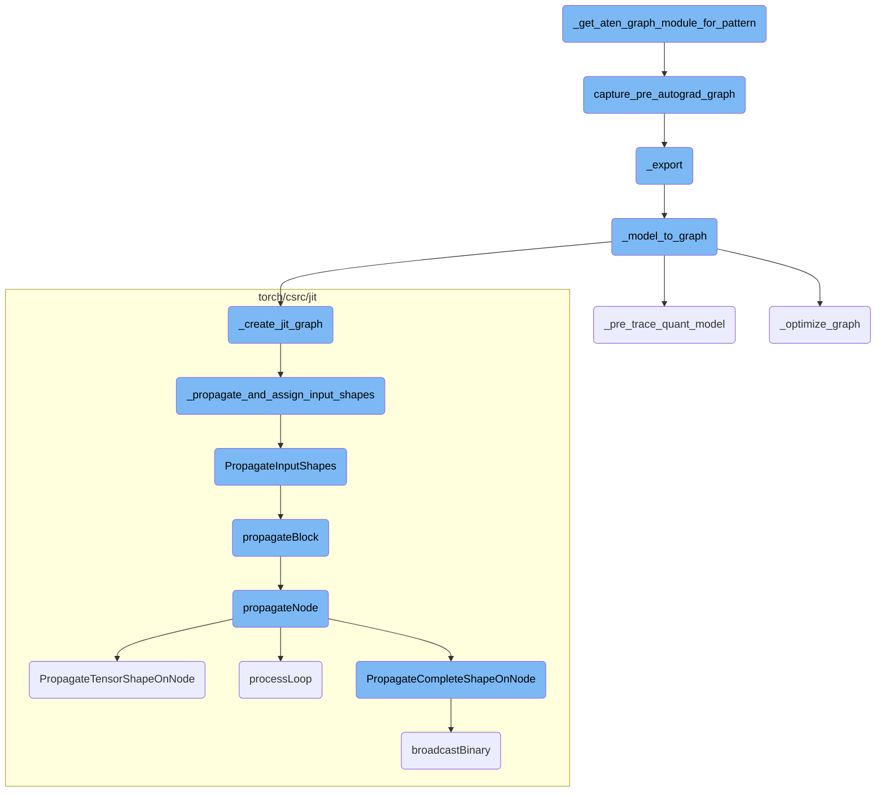
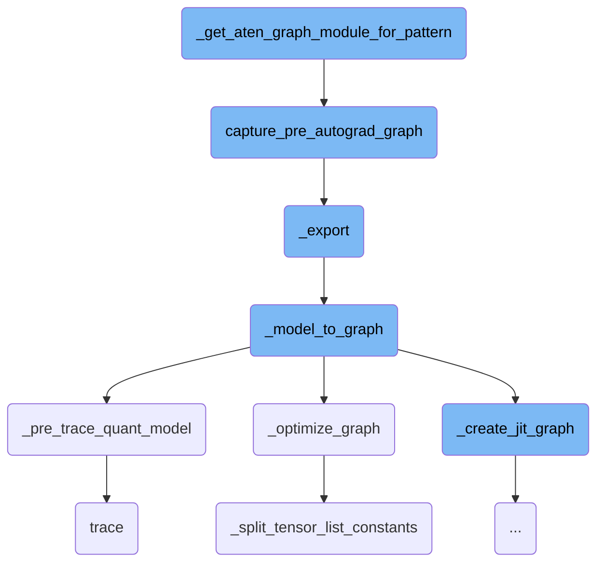
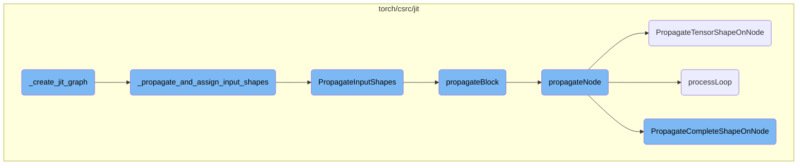
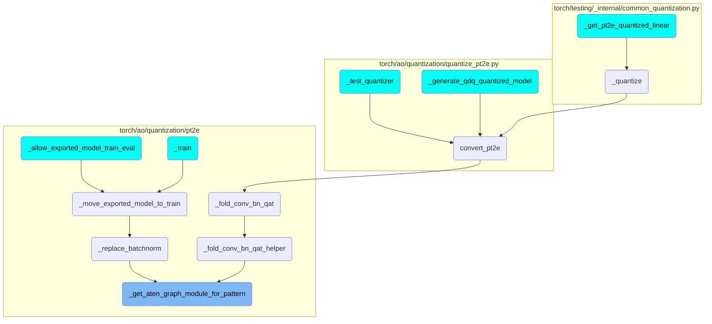

This document provides an overview of the process involved in converting a given pattern to an FX graph with decomposed aten operations. The process includes capturing the pre-autograd graph, eliminating dead code, recompiling the graph, and removing unnecessary nodes.

The flow starts by checking if the inputs are CUDA tensors and moves them to the GPU if necessary. Then, it captures the pre-autograd graph, which is a representation of the model before any autograd transformations are applied. This graph is then optimized by eliminating dead code and recompiling it. Finally, any unnecessary nodes, such as `copy_` nodes, are removed to ensure the graph is clean and efficient.

Here is a high level diagram of the flow, showing only the most important functions:



# Flow drill down

First, we'll zoom into this section of the flow:



<SwmSnippet path="/torch/ao/quantization/pt2e/utils.py" line="360">

---

## \_get_aten_graph_module_for_pattern

The function `_get_aten_graph_module_for_pattern` converts a given pattern to an FX graph with decomposed aten operations. It first checks if the inputs are CUDA tensors and moves them to the GPU if necessary. Then, it captures the pre-autograd graph using the `capture_pre_autograd_graph` function. The function also eliminates dead code and recompiles the graph to ensure it is optimized. Additionally, it removes any unnecessary `copy_` nodes from the graph.

```python
    if is_cuda:
        example_inputs = tuple(
            [x.cuda() if isinstance(x, torch.Tensor) else x for x in example_inputs]
        )
    aten_pattern = capture_pre_autograd_graph(
        pattern,
        example_inputs,
        kwargs,
    )
    aten_pattern.graph.eliminate_dead_code()
    aten_pattern.recompile()

    # ep.module() adds copy_ nodes for the mutated inputs.
    # For patterns, it doesn't matter
    for node in aten_pattern.graph.nodes:
        if (
            node.op == "call_function"
            and node.target == torch.ops.aten.copy_.default
            and len(node.users) == 0
        ):
            aten_pattern.graph.erase_node(node)
```

---

</SwmSnippet>

<SwmSnippet path="/torch/_export/__init__.py" line="72">

---

## capture_pre_autograd_graph

The function `capture_pre_autograd_graph` captures the graph of the model before the autograd transformations are applied. This is essential for converting the model into a format that can be further processed and optimized.

```python
def capture_pre_autograd_graph(
    f: torch.nn.Module,
    args: Tuple[Any],
    kwargs: Optional[Dict[str, Any]] = None,
    dynamic_shapes: Optional[Union[Dict[str, Any], Tuple[Any]]] = None,
) -> torch.nn.Module:
    """
    A helper function that is intended to trace a module before any pre-autograd
    decomposition is run. The produced module will be "non-functional" and
    composed of aten operators. Later this API will be deleted in favor of more general
    torch.export API.

    Args:
      f: nn.Module to be traced

      args: example positional inputs.

      kwargs: optional example keyword inputs.

      dynamic_shapes: Should either be:
         1) a dict from argument names of ``f`` to their dynamic shape specifications,
```

---

</SwmSnippet>

<SwmSnippet path="/torch/onnx/utils.py" line="1515">

---

## \_export

The `_export` function is responsible for exporting a model to the ONNX format. It handles various configurations and ensures that the model is correctly converted into an ONNX graph. This function is crucial for interoperability with other frameworks that support ONNX.

```python
def _export(
    model,
    args,
    f,
    export_params=True,
    verbose=False,
    training=_C_onnx.TrainingMode.EVAL,
    input_names=None,
    output_names=None,
    operator_export_type=_C_onnx.OperatorExportTypes.ONNX,
    export_type=None,
    opset_version=None,
    do_constant_folding=True,
    dynamic_axes=None,
    keep_initializers_as_inputs=None,
    fixed_batch_size=False,
    custom_opsets=None,
    add_node_names=True,
    onnx_shape_inference=True,
    export_modules_as_functions=False,
    autograd_inlining=True,
```

---

</SwmSnippet>

<SwmSnippet path="/torch/onnx/utils.py" line="1130">

---

## \_model_to_graph

The `_model_to_graph` function converts a PyTorch model into an ONNX graph. It handles the tracing of the model, optimization of the graph, and assignment of input and output shapes. This function is a key step in the process of exporting a model to ONNX.

```python
def _model_to_graph(
    model,
    args,
    verbose=False,
    input_names=None,
    output_names=None,
    operator_export_type=_C_onnx.OperatorExportTypes.ONNX,
    do_constant_folding=True,
    _disable_torch_constant_prop=False,
    fixed_batch_size=False,
    training=_C_onnx.TrainingMode.EVAL,
    dynamic_axes=None,
) -> tuple[
    _C.Graph,
    dict[str, torch.Tensor],
    torch.Tensor
    | tuple[torch.Tensor, ...]
    | list[torch.Tensor]
    | dict[str, torch.Tensor]
    | Any
    | None,
```

---

</SwmSnippet>

<SwmSnippet path="/torch/onnx/utils.py" line="1117">

---

## \_pre_trace_quant_model

The `_pre_trace_quant_model` function checks if the model is quantized and, if so, traces the model using `torch.jit.trace`. This step is necessary to handle quantized models correctly during the export process.

```python
def _pre_trace_quant_model(model, args):
    r"""Returns `torch.jit.trace(model, args)` if model is quantized. Otherwise do nothing and return
    original model.

    This is due to https://github.com/pytorch/pytorch/issues/75761.
    """
    if any(
        hasattr(m, "_packed_params") for m in getattr(model, "modules", list)()
    ) or any(getattr(arg, "is_quantized", False) for arg in args):
        return torch.jit.trace(model, args)
    return model
```

---

</SwmSnippet>

<SwmSnippet path="/torch/onnx/utils.py" line="615">

---

## \_optimize_graph

The `_optimize_graph` function performs various optimizations on the ONNX graph. It includes inlining, constant propagation, dead code elimination, and other passes to ensure the graph is efficient and ready for export.

```python
def _optimize_graph(
    graph: _C.Graph,
    operator_export_type: _C_onnx.OperatorExportTypes,
    _disable_torch_constant_prop: bool = False,
    fixed_batch_size: bool = False,
    params_dict=None,
    dynamic_axes=None,
    input_names=None,
    module=None,
):
    if params_dict is None:
        params_dict = {}

    # Inline everything
    _C._jit_pass_inline(graph)

    # Remove fork/wait nodes
    _C._jit_pass_inline_fork_wait(graph)
    _C._jit_pass_lint(graph)
    if GLOBALS.autograd_inlining:
        _C._jit_pass_onnx_autograd_function_process(graph)
```

---

</SwmSnippet>

<SwmSnippet path="/torch/onnx/utils.py" line="589">

---

## \_split_tensor_list_constants

The `_split_tensor_list_constants` function handles the splitting of tensor list constants into individual tensors. This step is necessary because ONNX cannot handle constants that are lists of tensors.

```python
# ONNX can't handle constants that are lists of tensors, which can
# get generated in constant prop. So we split them back into prim::ListConstructs


def _split_tensor_list_constants(g, block):
    for node in block.nodes():
        for subblock in node.blocks():
            _split_tensor_list_constants(g, subblock)
        if _is_constant_tensor_list(node):
            inputs = []
            for val in node.output().toIValue():
                input = g.insertConstant(val)
                input.node().moveBefore(node)
                input.node().copyMetadata(node)
                inputs.append(input)

            lc = (
                g.create("prim::ListConstruct", inputs)
                .insertBefore(node)
                .output()
                .setType(_C.ListType.ofTensors())
```

---

</SwmSnippet>

<SwmSnippet path="/torch/fx/_symbolic_trace.py" line="688">

---

## trace

The `trace` function in `torch.fx` is responsible for symbolically tracing a PyTorch model. This function captures the operations performed by the model, allowing for further transformations and optimizations.

```python
    def trace(
        self,
        root: Union[torch.nn.Module, Callable[..., Any]],
        concrete_args: Optional[Dict[str, Any]] = None,
    ) -> Graph:
        """
        Trace ``root`` and return the corresponding FX ``Graph`` representation. ``root``
        can either be an ``nn.Module`` instance or a Python callable.

        Note that after this call, ``self.root`` may be different from the ``root`` passed
        in here. For example, when a free function is passed to ``trace()``, we will
        create an ``nn.Module`` instance to use as the root and add embedded constants
        to.


        Args:

            root (Union[Module, Callable]): Either a ``Module`` or a function to be
                traced through. Backwards-compatibility for this parameter is
                guaranteed.
            concrete_args (Optional[Dict[str, any]]): Concrete arguments that should
```

---

</SwmSnippet>

Now, lets zoom into this section of the flow:



<SwmSnippet path="/torch/onnx/utils.py" line="1018">

---

## \_create_jit_graph

The `_create_jit_graph` function is responsible for creating a JIT graph from a given model and its arguments. It handles both `torch.jit.ScriptModule` and `torch.jit.ScriptFunction` types. For `ScriptModule`, it retrieves the forward method's graph, performs ONNX function substitution, freezes the module, and propagates input shapes. For `ScriptFunction`, it directly works with the graph and propagates input shapes. The function ensures that the graph is correctly set up for further processing and exporting to ONNX.

```python
    if isinstance(model, (torch.jit.ScriptFunction, torch.jit.ScriptModule)):
        flattened_args = tuple(torch.jit._flatten(tuple(args))[0])
        _check_flatten_did_not_remove(args, flattened_args)
        torch_out = None

        if isinstance(model, torch.jit.ScriptModule):
            try:
                graph = model.forward.graph  # type: ignore[attr-defined]
            except AttributeError as e:
                raise RuntimeError("'forward' method must be a script method") from e
            _C._jit_pass_onnx_function_substitution(graph)
            freezed_module = _C._freeze_module(
                cast(_C.ScriptModule, model._c), preserveParameters=True
            )
            module, params = _C._jit_onnx_list_model_parameters(freezed_module)
            method_graph = module._get_method("forward").graph
            args_params = tuple(args) + tuple(params)
            param_count_list = _get_param_count_list(method_graph, args_params)
            in_vars, _ = torch.jit._flatten(args_params)
            graph = _C._propagate_and_assign_input_shapes(
                method_graph, tuple(in_vars), param_count_list, False, False
```

---

</SwmSnippet>

<SwmSnippet path="/torch/csrc/jit/python/script_init.cpp" line="461">

---

## \_propagate_and_assign_input_shapes

The `_propagate_and_assign_input_shapes` function copies the input graph and sets the input tensor types. If propagation is enabled, it calls `PropagateInputShapes` to propagate the shapes through the graph. This function ensures that the input shapes are correctly assigned and propagated, which is crucial for subsequent operations on the graph.

```c++
static std::shared_ptr<Graph> _propagate_and_assign_input_shapes(
    Graph& graph,
    const std::vector<at::Tensor>& inputs,
    const std::vector<int>& param_count_list,
    bool with_grad = false,
    bool propagate = true) {
  auto retval = graph.copy();
  setInputTensorTypes(
      *retval, fmap<IValue>(inputs), /*complete=*/true, param_count_list);
  if (propagate) {
    PropagateInputShapes(retval);
  }
  return retval;
}
```

---

</SwmSnippet>

<SwmSnippet path="/torch/csrc/jit/passes/shape_analysis.cpp" line="2147">

---

## PropagateInputShapes

The `PropagateInputShapes` function initializes a `ShapePropagator` and calls its `propagateBlock` method on the graph's block. This function is essential for propagating the input shapes throughout the entire graph, ensuring that all nodes have the correct shape information.

```c++
void PropagateInputShapes(const std::shared_ptr<Graph>& graph) {
  ShapePropagator(graph).propagateBlock(graph->block());
}
```

---

</SwmSnippet>

<SwmSnippet path="/torch/csrc/jit/passes/shape_analysis.cpp" line="59">

---

### propagateBlock

The `propagateBlock` method iterates over all nodes in a block and calls `propagateNode` for each node. It handles exceptions and sets unshaped types if propagation fails. This method is a key part of the shape propagation process, ensuring that each node in the block has its shape correctly propagated.

```c++
void PropertyPropBase::propagateBlock(Block* block, bool insert_expands) {
  for (Node* node : block->nodes()) {
    try {
      propagateNode(node, insert_expands);
    } catch (propagation_error& e) {
      setUnshapedType(node);
    } catch (std::exception& e) {
      throw(
          ErrorReport(node->sourceRange())
          << ExceptionMessage(e)
          << "\nThe above operation failed shape propagation in this context");
    }
  }
}
```

---

</SwmSnippet>

<SwmSnippet path="/torch/csrc/jit/passes/shape_analysis.cpp" line="586">

---

### propagateNode

The `propagateNode` method handles the shape propagation for individual nodes. It processes different types of nodes, such as `prim::If`, `prim::Loop`, and various `aten` operations, by calling specific functions like `processIf`, `processLoop`, and `PropagateTensorShapeOnNode`. This method ensures that each node's shape is correctly propagated based on its operation type.

```c++
  void propagateNode(Node* node, bool insert_expands = true) override {
    // Certain ops like resize_ change the input tensors size. Because our
    // analysis is flow invariant, we set any Tensor that can alias a resized
    // Tensor to the base Tensor Type without size information.
    if (setUnshapedTypeIfAliasResizedSet(node->inputs())) {
      return setUnshapedType(node);
    }

    // These don't require the types, and have complicated schema. Return early
    // after we process them.
    switch (node->kind()) {
      case prim::If:
        return processIf(node);
      case prim::Loop: {
        return processLoop(node);
      }
      case aten::Bool:
      case aten::Int:
      case aten::Float:
      case aten::ScalarImplicit:
      case aten::FloatImplicit:
```

---

</SwmSnippet>

<SwmSnippet path="/torch/csrc/jit/passes/shape_analysis.cpp" line="768">

---

### PropagateTensorShapeOnNode

The `PropagateTensorShapeOnNode` function propagates the tensor shape for a given node. It handles various tensor operations and ensures that the output tensor has the correct shape based on the input tensors. This function is crucial for maintaining the correct tensor shapes throughout the graph.

```c++
  bool PropagateTensorShapeOnNode(Node* node, bool insert_expands) {
    static const auto broadcast =
        [](std::vector<TensorTypePtr>& tensor_types,
           std::optional<at::ScalarType> t) -> TensorTypePtr {
      if (tensor_types.size() == 1) {
        return tensor_types[0]->dimensionedOnly()->withScalarType(t);
      }
      AT_ASSERT(!tensor_types.empty());
      auto any_type = tensor_types[0];
      auto max_dims = any_type->dim();
      for (auto& type : tensor_types) {
        if (!max_dims || !type->dim()) {
          max_dims = std::nullopt;
        } else {
          max_dims = std::max(*max_dims, *type->dim());
        }
      }
      return TensorType::create(
          t,
          any_type->device(),
          max_dims,
```

---

</SwmSnippet>

<SwmSnippet path="/torch/csrc/jit/passes/shape_analysis.cpp" line="82">

---

### processLoop

The `processLoop` method handles the shape propagation for loop nodes. It propagates the counter type, applies types to carried inputs, and iteratively propagates the block until the types are stable. This method ensures that loop nodes have their shapes correctly propagated, even with changing types within the loop.

```c++
void PropertyPropBase::processLoop(Node* node) {
  LoopView loop(node);
  // propagate counter type
  loop.currentTripCount()->setType(loop.maxTripCount()->type());
  applyTypes(loop.carriedInputs(), loop.bodyCarriedInputs());

  do {
    propagateBlock(loop.bodyBlock(), /*insert_expands=*/false);
    // note: inserting expands is unsafe at this point, we don't know
    // if the types are stable yet, so the arguments to expand may change
  } while (mergeTypes(
      loop.bodyCarriedInputs(),
      loop.bodyCarriedOutputs(),
      loop.bodyCarriedInputs()));

  // now that the types are stable, we can insert the expands
  propagateBlock(loop.bodyBlock(), /*insert_expands=*/true);
  applyTypes(loop.bodyCarriedInputs(), loop.carriedOutputs());
}
```

---

</SwmSnippet>

<SwmSnippet path="/torch/csrc/jit/passes/shape_analysis.cpp" line="1872">

---

### PropagateCompleteShapeOnNode

The `PropagateCompleteShapeOnNode` function handles the shape propagation for nodes with complete tensor shapes. It directly encodes shape propagation for certain operations and falls back to running a fake version of the operation for others. This function ensures that nodes with complete shapes are accurately propagated, maintaining the integrity of the graph's shape information.

```c++
  bool PropagateCompleteShapeOnNode(
      Node* node,
      bool insert_expands,
      std::vector<TensorTypePtr> tensor_types) {
    // For expensive ops we can directly encode their shape propagation
    // here, otherwise we fallback to running a fake version of the op
    // to get a quick and dirty propagation.
    if (node->matches(
            "aten::add(Tensor self, Tensor other, *, Scalar alpha) -> Tensor") ||
        node->matches(
            "aten::sub(Tensor self, Tensor other, *, Scalar alpha) -> Tensor") ||
        node->matches("aten::mul(Tensor self, Tensor other) -> Tensor")) {
      // These nodes handle tensors of different shapes internally, so there's
      // no need to insert explicit expand nodes.
      return PropagateShapeOnNodeByRunningIt(node);
    } else if (node->matches(
                   "aten::div(Tensor self, Tensor other) -> Tensor")) {
      // "div" handle tensors of different shapes internally, so there's no need
      // to insert explicit expand nodes.
      // Note that this function could be merged to the one above , but "div" is
      // not always safe to run by itself due to integer divide-by-zero.
```

---

</SwmSnippet>

# Where is this flow used?

This flow is used multiple times in the codebase as represented in the following diagram:

(Note - these are only some of the entry points of this flow)



&nbsp;

*This is an auto-generated document by Swimm AI 🌊 and has not yet been verified by a human*

<SwmMeta version="3.0.0" repo-id="Z2l0aHViJTNBJTNBcHl0b3JjaC1hdXRvZG9jcy1kZW1vJTNBJTNBU3dpbW0tRGVtbw==" repo-name="pytorch-autodocs-demo"><sup>Powered by [Swimm](https://app.swimm.io/)</sup></SwmMeta>
