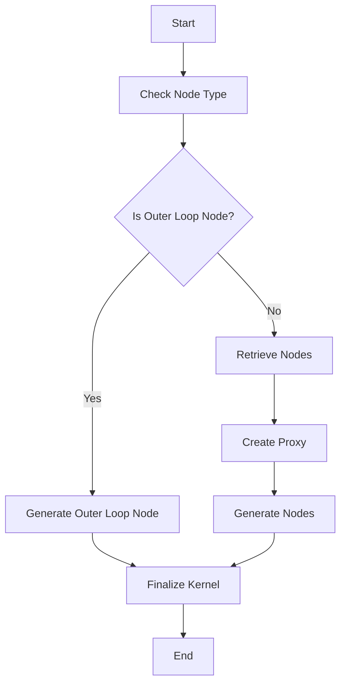

This document will cover the process of converting pre-fused nodes into a C++ kernel, which includes:

1. Checking the node type
2. Generating nodes
3. Finalizing the kernel.

Technical document: <SwmLink doc-title="Overview of Codegen Node">[Overview of Codegen Node](/.swm/overview-of-codegen-node.q90e4yjb.sw.md)</SwmLink>

# [Checking the Node Type](https://app.swimm.io/repos/Z2l0aHViJTNBJTNBcHl0b3JjaC1hdXRvZG9jcy1kZW1vJTNBJTNBU3dpbW0tRGVtbw==/docs/q90e4yjb#checking-the-node-type)

The process begins by determining the type of node being processed. If the node is an instance of `OuterLoopFusedSchedulerNode`, it indicates that the node involves an outer loop structure, which requires specific handling to optimize performance. This step ensures that the appropriate method is used for generating the code based on the node type.

# [Generating Nodes](https://app.swimm.io/repos/Z2l0aHViJTNBJTNBcHl0b3JjaC1hdXRvZG9jcy1kZW1vJTNBJTNBU3dpbW0tRGVtbw==/docs/q90e4yjb#generating-nodes)

If the node is not an outer loop node, the system retrieves the nodes that need to be converted into a C++ kernel. A proxy is then created to facilitate the generation of these nodes. This proxy acts as an intermediary, ensuring that the nodes are correctly transformed into the desired format. This step is crucial for maintaining the integrity and performance of the generated code.

# [Finalizing the Kernel](https://app.swimm.io/repos/Z2l0aHViJTNBJTNBcHl0b3JjaC1hdXRvZG9jcy1kZW1vJTNBJTNBU3dpbW0tRGVtbw==/docs/q90e4yjb#finalizing-the-kernel)

The final step in the process is to finalize the kernel. This involves adding the nodes to the scheduled nodes list and generating the necessary loops for the new kernel. The kernel is then prepared for execution, ensuring that it is optimized and ready to perform its tasks efficiently. This step is essential for ensuring that the generated code is both correct and performant.

&nbsp;

*This is an auto-generated document by Swimm AI 🌊 and has not yet been verified by a human*

<SwmMeta version="3.0.0" repo-id="Z2l0aHViJTNBJTNBcHl0b3JjaC1hdXRvZG9jcy1kZW1vJTNBJTNBU3dpbW0tRGVtbw==" repo-name="pytorch-autodocs-demo">Powered by [Swimm](https://app.swimm.io/)</SwmMeta>
