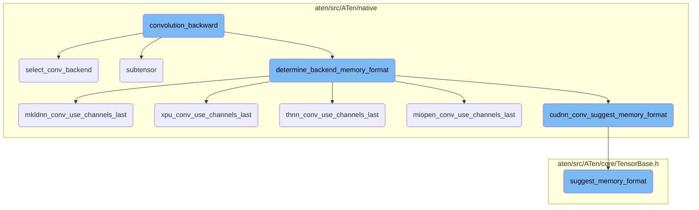
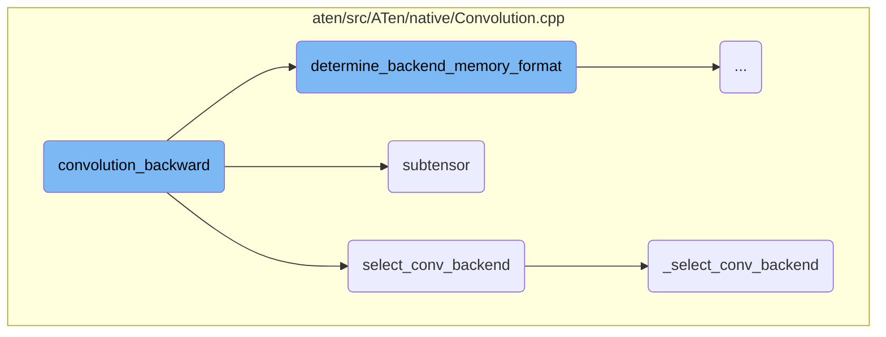
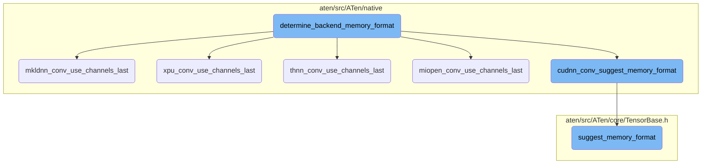

This document provides an overview of the backward pass for convolution operations. It explains how gradients for input, weight, and bias are computed during the backward pass, the selection of the appropriate backend for the convolution operation, and the determination of the most efficient memory format.

The backward pass for convolution operations involves several steps. First, the input shapes and parameters are validated. Then, the appropriate backend for the convolution operation is selected based on the input tensors and convolution parameters. After that, the function determines the most efficient memory format for the operation. Finally, the gradients for the input, weight, and bias are computed using the selected backend.

Here is a high level diagram of the flow, showing only the most important functions:



# Flow drill down

First, we'll zoom into this section of the flow:



<SwmSnippet path="/aten/src/ATen/native/Convolution.cpp" line="1965">

---

## Convolution Backward Pass

The `convolution_backward` function is responsible for computing the gradients for the input, weight, and bias during the backward pass of a convolution operation. It supports 1D, 2D, and 3D spatial convolutions and requires a single batch dimension. The function first validates the input shapes and parameters, then selects the appropriate backend for the convolution operation using the `select_conv_backend` function. Depending on the selected backend, it calls the corresponding backend-specific convolution backward function to compute the gradients.

```c++
// Backward pass for convolution. Computes gradients for input, weight, and bias depending on the
// output_mask setting. This function supports 1D, 2D, or 3D spatial convolution and currently requires
// a single batch dimension to be present.
//
// Args:
//   grad_output_: tensor of shape (N, C_out, L_out), (N, C_out, H_out, W_out), or (N, C_out, D_out, H_out, W_out)
//   input_: tensor of shape (N, C_in, L_in), (N, C_in, H_in, W_in), or (N, C_in, D_in, H_in, W_in)
//   weight_: tensor of shape (C_out, C_in // groups, *kernel_size); dimension of kernel_size must match the number
//       of input spatial dimensions
//   bias_sizes_opt: if specified, indicates that a bias was used in the forward pass and contains the shape
//       of the bias. While the bias shape can be computed from other inputs, it is provided to this function for
//       ease of use. The bias shape is (weight.shape[0]) for normal convolution and (weight.shape[1] * groups)
//       for transposed convolution.
//   stride: single value or an array with dimension matching the number of input spatial dimensions
//   padding: single value or an array with dimension matching the number of input spatial dimensions
//   dilation: single value or an array with dimension matching the number of input spatial dimensions
//   transposed: boolean indicating whether the convolution is transposed
//   output_padding: single value or dimension == number of input spatial dimensions; only supported when
//       transposed is true
//   groups: number of groups for grouped convolution
//   output_mask: 3-dim boolean array specifying which gradients to compute in input, weight, bias order
```

---

</SwmSnippet>

<SwmSnippet path="/aten/src/ATen/native/Convolution.cpp" line="1304">

---

## Selecting Convolution Backend

The `select_conv_backend` function determines the appropriate backend to use for the convolution operation based on the input tensors and convolution parameters. It first validates the input shapes and parameters, then expands 1D inputs to 2D if necessary. Finally, it calls the `_select_conv_backend` function to select the specific backend.

```c++
// Selects a backend for convolution based on the inputs and params.
ConvBackend select_conv_backend(
    const Tensor& input_r, const Tensor& weight_r, const std::optional<Tensor>& bias_opt,
    SymIntArrayRef stride_, SymIntArrayRef padding_, SymIntArrayRef dilation_,
    bool transposed_, SymIntArrayRef output_padding_, c10::SymInt groups_, const at::OptionalSymIntArrayRef bias_sizes_opt) {
  c10::MaybeOwned<Tensor> bias_maybe_owned = at::borrow_from_optional_tensor(bias_opt);
  const Tensor& bias = *bias_maybe_owned;

  auto& ctx = at::globalContext();
  auto k = weight_r.ndimension();
  int64_t dim = k - 2;
  ConvParams<c10::SymInt> params;
  params.stride = expand_param_if_needed(stride_, "stride", dim);
  params.padding = expand_param_if_needed(padding_, "padding", dim);
  params.dilation = expand_param_if_needed(dilation_, "dilation", dim);
  params.transposed = transposed_;
  params.output_padding = expand_param_if_needed(output_padding_, "output_padding", dim);
  params.groups = std::move(groups_);
  params.benchmark = ctx.benchmarkCuDNN();
  params.deterministic = ctx.deterministicCuDNN() || ctx.deterministicAlgorithms();
  params.cudnn_enabled = ctx.userEnabledCuDNN();
```

---

</SwmSnippet>

<SwmSnippet path="/aten/src/ATen/native/Convolution.cpp" line="820">

---

### Subtensor Extraction

The `subtensor` function extracts a subtensor from the given tensor along a specified dimension. This is useful for handling grouped convolutions where the input tensor is divided into smaller groups.

```c++
static at::Tensor subtensor(at::Tensor& tensor, int64_t dim, int64_t groups, int64_t g) {
  if (!tensor.defined()) {
    return at::Tensor();
  }
  const auto memory_format = tensor.suggest_memory_format();
  int64_t n = tensor.sizes()[dim] / groups;
  return tensor.narrow(dim, n * g, n).contiguous(memory_format);
}
```

---

</SwmSnippet>

<SwmSnippet path="/aten/src/ATen/native/Convolution.cpp" line="1196">

---

### Detailed Backend Selection

The `_select_conv_backend` function provides a detailed implementation for selecting the convolution backend. It considers various factors such as the input tensor dimensions, whether the convolution is transposed, and the specific backend capabilities (e.g., CuDNN, MIOpen, MKLDNN). This function ensures that the most efficient backend is chosen for the given convolution operation.

```c++
ConvBackend _select_conv_backend(
    const Tensor& input,
    const Tensor& weight,
    const std::optional<Tensor>& bias,
    const at::OptionalArrayRef<T> bias_sizes_opt,
    const bool need_backward,
    const ConvParams<T>& params) {

  // don't send empty inputs through backends
  if (at::symint::size<T>(input, 0) == 0 || at::symint::size<T>(input, 1) == 0) {
    return input.is_mkldnn() ? ConvBackend::MkldnnEmpty : ConvBackend::Empty;
  } else if (at::symint::numel<T>(input) == 0) {
    TORCH_CHECK(false, "Only zero batch or zero channel inputs are supported, but got input shape: ", at::symint::sizes<T>(input));
  }

  if (params.is_depthwise(input, weight)) {
    if (params.use_cudnn_depthwise(input, weight)) {
      return ConvBackend::Cudnn;
    } else if (params.use_miopen(input, weight, bias_sizes_opt.has_value())) {
      return ConvBackend::MiopenDepthwise;
    } else {
```

---

</SwmSnippet>

Now, lets zoom into this section of the flow:



<SwmSnippet path="/aten/src/ATen/native/Convolution.cpp" line="1410">

---

## Determine Backend Memory Format

The function `determine_backend_memory_format` is responsible for determining the appropriate memory format for a given convolution operation based on the backend being used. It checks the backend type and calls the corresponding function to suggest the memory format, such as `cudnn_conv_suggest_memory_format`, `miopen_conv_use_channels_last`, `mkldnn_conv_use_channels_last`, `thnn_conv_use_channels_last`, or `xpu_conv_use_channels_last`. This ensures that the convolution operation uses the most efficient memory format for the specific backend.

```c++
  at::MemoryFormat backend_memory_format = at::MemoryFormat::Contiguous;
#if !defined(C10_MOBILE)
  auto k = weight.ndimension();
  // See Note [Mobile check segfaults]
  switch(backend) {
    case ConvBackend::Cudnn:
    case ConvBackend::CudnnTranspose:
      if (detail::getCUDAHooks().compiledWithCuDNN()) {
        backend_memory_format = cudnn_conv_suggest_memory_format(input, weight);
      }
      break;
    case ConvBackend::Miopen:
    case ConvBackend::MiopenDepthwise:
    case ConvBackend::MiopenTranspose:
      if (detail::getCUDAHooks().compiledWithMIOpen() && miopen_conv_use_channels_last(input, weight)) {
        TORCH_INTERNAL_ASSERT((k == 4 || k == 5),
            "Expected 4D or 5D input for miopen memory format selection in determine_backend_memory_format()");
        backend_memory_format = (k == 5) ? at::MemoryFormat::Contiguous /*at::MemoryFormat::ChannelsLast3d*/ : at::MemoryFormat::ChannelsLast;
      }
      break;
    case ConvBackend::Mkldnn:
```

---

</SwmSnippet>

<SwmSnippet path="/aten/src/ATen/native/ConvUtils.h" line="383">

---

### MKLDNN Convolution

The function `mkldnn_conv_use_channels_last` checks if the MKLDNN backend can use the channels-last memory format. It verifies the data type and memory format of the input and weight tensors to determine if the channels-last format is suitable.

```c
inline bool mkldnn_conv_use_channels_last(const at::Tensor& input, const at::Tensor& weight) {

  // disable NHWC for float64 input.
  if (input.scalar_type() == at::kDouble ||
      weight.scalar_type() == at::kDouble) {
    return false;
  }

  // disable NHWC for MkldnnCPU tensor.
  if (input.is_mkldnn() || weight.is_mkldnn()) {
    return false;
  }

  auto input_memory_format = input.suggest_memory_format();
  auto weight_memory_format = weight.suggest_memory_format();

  bool can_use_mkldnn_channels_last_2d =
      (input_memory_format  == at::MemoryFormat::ChannelsLast) ||
      (weight_memory_format == at::MemoryFormat::ChannelsLast);

  bool can_use_mkldnn_channels_last_3d =
```

---

</SwmSnippet>

<SwmSnippet path="/aten/src/ATen/native/ConvUtils.h" line="422">

---

### XPU Convolution

The function `xpu_conv_use_channels_last` checks if the XPU backend can use the channels-last memory format. It ensures that both the input and weight tensors are XPU tensors and verifies their data type and memory format.

```c
inline bool xpu_conv_use_channels_last(const at::Tensor& input, const at::Tensor& weight) {

  // check layout only for xpu tensor.
  if (!input.is_xpu() || !weight.is_xpu()) {
    return false;
  }

  // disable NHWC for float64 input.
  if (input.scalar_type() == at::kDouble ||
      weight.scalar_type() == at::kDouble) {
    return false;
  }

  auto input_memory_format = input.suggest_memory_format();
  auto weight_memory_format = weight.suggest_memory_format();

  bool can_use_xpu_channels_last_2d =
      (input_memory_format  == at::MemoryFormat::ChannelsLast) ||
      (weight_memory_format == at::MemoryFormat::ChannelsLast);

  bool can_use_xpu_channels_last_3d =
```

---

</SwmSnippet>

<SwmSnippet path="/aten/src/ATen/native/ConvUtils.h" line="410">

---

### THNN Convolution

The function `thnn_conv_use_channels_last` checks if the THNN backend can use the channels-last memory format. It verifies the memory format of the input and weight tensors and ensures that the input tensor is on the CPU.

```c
inline bool thnn_conv_use_channels_last(const at::Tensor& input, const at::Tensor& weight) {

  auto input_memory_format = input.suggest_memory_format();
  auto weight_memory_format = weight.suggest_memory_format();

  bool can_use_thnn_channels_last_2d = input.device().is_cpu() && (
      (input_memory_format  == at::MemoryFormat::ChannelsLast) || (
       weight_memory_format == at::MemoryFormat::ChannelsLast));

  return can_use_thnn_channels_last_2d;
}
```

---

</SwmSnippet>

<SwmSnippet path="/aten/src/ATen/native/ConvUtils.h" line="356">

---

### MIOpen Convolution

The function `miopen_conv_use_channels_last` checks if the MIOpen backend can use the channels-last memory format. It verifies the data type and memory format of the input and weight tensors and checks if MIOpen is compiled with support for the channels-last format.

```c
inline bool miopen_conv_use_channels_last(const at::Tensor& input, const at::Tensor& weight) {

  // disable NHWC for float64 input.
  if (!at::detail::getCUDAHooks().compiledWithMIOpen() ||
      input.scalar_type() == at::kDouble ||
      weight.scalar_type() == at::kDouble) {
    return false;
  }

  bool can_use_miopen_channels_last_2d = false;
  // TODO: Remove PYTORCH_MIOPEN_SUGGEST_NHWC once ROCm officially supports NHWC in MIOpen
  // See #64427
  static std::optional<bool> PYTORCH_MIOPEN_SUGGEST_NHWC = c10::utils::check_env("PYTORCH_MIOPEN_SUGGEST_NHWC");

  auto input_memory_format = input.suggest_memory_format();
  auto weight_memory_format = weight.suggest_memory_format();

  can_use_miopen_channels_last_2d = PYTORCH_MIOPEN_SUGGEST_NHWC &&  *PYTORCH_MIOPEN_SUGGEST_NHWC && (
            ( (input_memory_format  == at::MemoryFormat::ChannelsLast) ||
            (weight_memory_format == at::MemoryFormat::ChannelsLast) )
        );
```

---

</SwmSnippet>

<SwmSnippet path="/aten/src/ATen/native/ConvUtils.h" line="320">

---

### CuDNN Convolution

The function `cudnn_conv_suggest_memory_format` suggests the appropriate memory format for the CuDNN backend. It checks the CuDNN version and the memory format of the input and weight tensors to determine if the channels-last format can be used.

```c
inline at::MemoryFormat cudnn_conv_suggest_memory_format(const at::Tensor& input, const at::Tensor& weight) {
  // disable NHWC for float64 input.
  if (!at::detail::getCUDAHooks().compiledWithCuDNN() ||
      input.scalar_type() == at::kDouble ||
      weight.scalar_type() == at::kDouble) {
    return at::MemoryFormat::Contiguous;
  }
  long cudnn_version = at::detail::getCUDAHooks().versionCuDNN();
  auto input_memory_format = input.suggest_memory_format();
  auto weight_memory_format = weight.suggest_memory_format();
  auto weight_ndim = weight.ndimension();

  bool can_use_cudnn_channels_last_2d = (cudnn_version >= 7603) && (weight_ndim == 4) && (
    (input_memory_format  == at::MemoryFormat::ChannelsLast) ||
    (weight_memory_format == at::MemoryFormat::ChannelsLast)
  );
  if (can_use_cudnn_channels_last_2d) {
    return at::MemoryFormat::ChannelsLast;
  }

  bool can_use_cudnn_channels_last_3d = (cudnn_version >= 8005) && (weight_ndim == 5) && (
```

---

</SwmSnippet>

<SwmSnippet path="/aten/src/ATen/core/TensorBase.h" line="271">

---

### Suggest Memory Format

The function `suggest_memory_format` suggests the most suitable memory format for a tensor based on its strides and dimensions. It checks if the tensor's strides match the channels-last or channels-last-3d format and returns the corresponding memory format.

```c
  at::MemoryFormat suggest_memory_format(
      bool channels_last_strides_exact_match = false) const {
    // Setting channels_last_strides_exact_match to true forces function to
    // check 0,1 - sized dimension strides.
    if (layout() == at::kStrided) {
      if (impl_->is_strides_like_channels_last()) {
        if (!channels_last_strides_exact_match ||
            get_channels_last_strides_2d(sizes()) == strides()) {
          return at::MemoryFormat::ChannelsLast;
        }
      }
      else if (impl_->is_strides_like_channels_last_3d()) {
        if (!channels_last_strides_exact_match ||
            get_channels_last_strides_3d(sizes()) == strides()) {
          return at::MemoryFormat::ChannelsLast3d;
        }
      }
    }
    return at::MemoryFormat::Contiguous;
  }
```

---

</SwmSnippet>

&nbsp;

*This is an auto-generated document by Swimm AI 🌊 and has not yet been verified by a human*

<SwmMeta version="3.0.0" repo-id="Z2l0aHViJTNBJTNBcHl0b3JjaC1hdXRvZG9jcy1kZW1vJTNBJTNBU3dpbW0tRGVtbw==" repo-name="pytorch-autodocs-demo"><sup>Powered by [Swimm](https://app.swimm.io/)</sup></SwmMeta>
