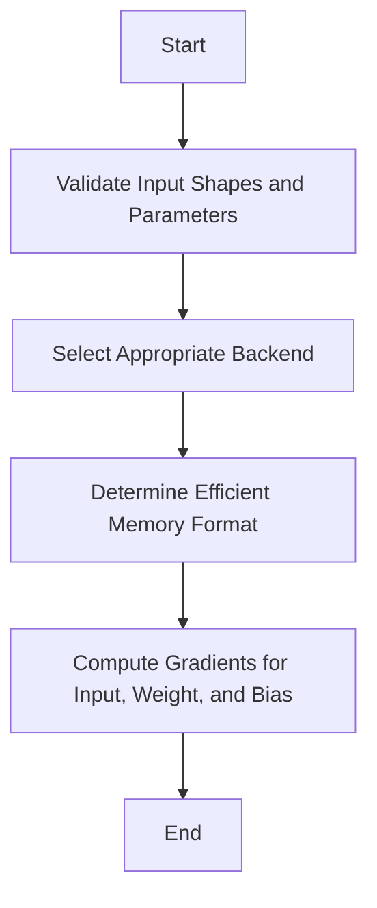

This document will cover the Convolution Backward Pass Overview, which includes:

1. Validating input shapes and parameters
2. Selecting the appropriate backend
3. Determining the most efficient memory format
4. Computing gradients for input, weight, and bias.

Technical document: <SwmLink doc-title="Convolution Backward Pass Overview">[Convolution Backward Pass Overview](/.swm/convolution-backward-pass-overview.nxvjx107.sw.md)</SwmLink>

# [Validating Input Shapes and Parameters](https://app.swimm.io/repos/Z2l0aHViJTNBJTNBcHl0b3JjaC1hdXRvZG9jcy1kZW1vJTNBJTNBU3dpbW0tRGVtbw==/docs/nxvjx107#input-validation)

The first step in the convolution backward pass is to validate the input shapes and parameters. This ensures that the input tensors and convolution parameters are correct and compatible. For example, the function checks if the input tensor has the correct dimensions and if the convolution parameters like stride, padding, and dilation are properly set. This step is crucial to prevent errors during the computation of gradients.

# [Selecting the Appropriate Backend](https://app.swimm.io/repos/Z2l0aHViJTNBJTNBcHl0b3JjaC1hdXRvZG9jcy1kZW1vJTNBJTNBU3dpbW0tRGVtbw==/docs/nxvjx107#selecting-convolution-backend)

After validating the inputs, the next step is to select the appropriate backend for the convolution operation. The backend is chosen based on the input tensors and convolution parameters. Different backends like CuDNN, MIOpen, MKLDNN, and THNN have different capabilities and performance characteristics. Selecting the right backend ensures that the convolution operation is performed efficiently. For instance, if the input tensor is on a GPU, a GPU-optimized backend like CuDNN might be selected.

# [Determining the Most Efficient Memory Format](https://app.swimm.io/repos/Z2l0aHViJTNBJTNBcHl0b3JjaC1hdXRvZG9jcy1kZW1vJTNBJTNBU3dpbW0tRGVtbw==/docs/nxvjx107#determine-backend-memory-format)

Once the backend is selected, the function determines the most efficient memory format for the convolution operation. This involves checking the backend type and calling the corresponding function to suggest the memory format. For example, if the CuDNN backend is selected, the function might suggest using the channels-last memory format for better performance. This step ensures that the convolution operation uses the most efficient memory format for the specific backend, which can significantly improve performance.

# [Computing Gradients for Input, Weight, and Bias](https://app.swimm.io/repos/Z2l0aHViJTNBJTNBcHl0b3JjaC1hdXRvZG9jcy1kZW1vJTNBJTNBU3dpbW0tRGVtbw==/docs/nxvjx107#convolution-backward-pass)

The final step in the convolution backward pass is to compute the gradients for the input, weight, and bias. This is done using the selected backend and the determined memory format. The gradients are essential for updating the model parameters during training. For example, the gradient for the input tensor helps in adjusting the input features, while the gradients for the weight and bias help in updating the convolution filters and biases. This step ensures that the model learns from the data and improves its performance over time.

&nbsp;

*This is an auto-generated document by Swimm AI 🌊 and has not yet been verified by a human*

<SwmMeta version="3.0.0" repo-id="Z2l0aHViJTNBJTNBcHl0b3JjaC1hdXRvZG9jcy1kZW1vJTNBJTNBU3dpbW0tRGVtbw==" repo-name="pytorch-autodocs-demo">Powered by [Swimm](https://app.swimm.io/)</SwmMeta>
