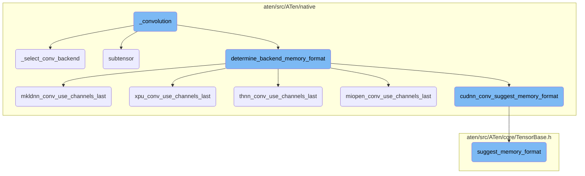
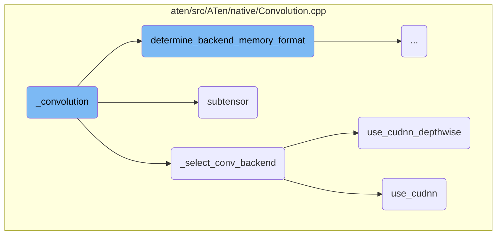
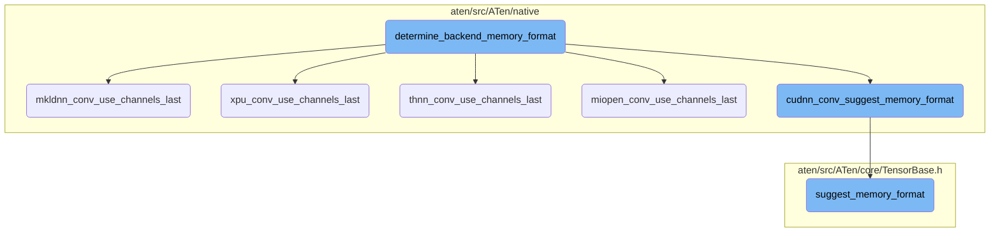

This document explains the flow of the `_convolution` function, which is the entry point for performing convolution operations. It initializes convolution parameters, checks the input tensor dimensions, and selects the appropriate backend for the convolution operation. The function then calls the selected backend to perform the convolution and returns the output tensor.

The flow starts with the `_convolution` function, which sets up the parameters and checks the input dimensions. It then determines which backend to use for the convolution operation. Depending on the backend, it may use different memory formats and optimizations to perform the convolution efficiently. Finally, the selected backend performs the convolution and the result is returned.

Here is a high level diagram of the flow, showing only the most important functions:



# Flow drill down

First, we'll zoom into this section of the flow:



<SwmSnippet path="/aten/src/ATen/native/Convolution.cpp" line="1462">

---

## \_convolution

The `_convolution` function is the entry point for performing convolution operations. It initializes convolution parameters, checks the input tensor dimensions, and selects the appropriate backend for the convolution operation. The function then calls the selected backend to perform the convolution and returns the output tensor.

```c++
at::Tensor _convolution(
    const Tensor& input_r, const Tensor& weight_r, const std::optional<Tensor>& bias_r_opt,
    IntArrayRef stride_, IntArrayRef padding_, IntArrayRef dilation_,
    bool transposed_, IntArrayRef output_padding_, int64_t groups_,
    bool benchmark, bool deterministic, bool cudnn_enabled, bool allow_tf32) {
  // See [Note: hacky wrapper removal for optional tensor]
  c10::MaybeOwned<Tensor> bias_r_maybe_owned = at::borrow_from_optional_tensor(bias_r_opt);
  const Tensor& bias_r = *bias_r_maybe_owned;

  auto input = input_r;
  auto weight = weight_r;
  auto bias = bias_r;
  auto k = weight.ndimension();
  c10::IntArrayRef weight_sizes = weight.sizes();
  int64_t dim = k - 2;

  TORCH_CHECK(dim > 0, "weight should have at least three dimensions");
  TORCH_CHECK(groups_ > 0, "non-positive groups is not supported");

  ConvParams<int64_t> params;
  params.stride = expand_param_if_needed(stride_, "stride", dim);
```

---

</SwmSnippet>

<SwmSnippet path="/aten/src/ATen/native/Convolution.cpp" line="1196">

---

## \_select_conv_backend

The `_select_conv_backend` function determines the appropriate backend to use for the convolution operation based on the input tensor, weight tensor, and convolution parameters. It checks various conditions to select the most suitable backend, such as CuDNN, MIOpen, MKLDNN, or other available backends.

```c++
ConvBackend _select_conv_backend(
    const Tensor& input,
    const Tensor& weight,
    const std::optional<Tensor>& bias,
    const at::OptionalArrayRef<T> bias_sizes_opt,
    const bool need_backward,
    const ConvParams<T>& params) {

  // don't send empty inputs through backends
  if (at::symint::size<T>(input, 0) == 0 || at::symint::size<T>(input, 1) == 0) {
    return input.is_mkldnn() ? ConvBackend::MkldnnEmpty : ConvBackend::Empty;
  } else if (at::symint::numel<T>(input) == 0) {
    TORCH_CHECK(false, "Only zero batch or zero channel inputs are supported, but got input shape: ", at::symint::sizes<T>(input));
  }

  if (params.is_depthwise(input, weight)) {
    if (params.use_cudnn_depthwise(input, weight)) {
      return ConvBackend::Cudnn;
    } else if (params.use_miopen(input, weight, bias_sizes_opt.has_value())) {
      return ConvBackend::MiopenDepthwise;
    } else {
```

---

</SwmSnippet>

<SwmSnippet path="/aten/src/ATen/native/Convolution.cpp" line="820">

---

## subtensor

The `subtensor` function extracts a sub-tensor from the given tensor along a specified dimension. This is useful for handling grouped convolutions where the input tensor is divided into smaller groups for separate convolution operations.

```c++
static at::Tensor subtensor(at::Tensor& tensor, int64_t dim, int64_t groups, int64_t g) {
  if (!tensor.defined()) {
    return at::Tensor();
  }
  const auto memory_format = tensor.suggest_memory_format();
  int64_t n = tensor.sizes()[dim] / groups;
  return tensor.narrow(dim, n * g, n).contiguous(memory_format);
}
```

---

</SwmSnippet>

<SwmSnippet path="/aten/src/ATen/native/Convolution.cpp" line="454">

---

## use_cudnn_depthwise

The `use_cudnn_depthwise` function checks if the CuDNN backend should be used for depthwise convolutions. It evaluates various conditions, such as tensor data types, dimensions, and CuDNN version, to determine if CuDNN is suitable for the given convolution operation.

```c++
  // Use cudnn for FP16 depthwise convolutions
  bool use_cudnn_depthwise(const at::Tensor& input, const at::Tensor& weight) const  {
    if (cudnn_conv_suggest_memory_format(input, weight) != at::MemoryFormat::Contiguous && use_cudnn(input, weight)) {
      // always use cudnn_depthwise for channels_last format
      return true;
    }
    if (detail::getCUDAHooks().supportsDepthwiseConvolutionWithCuDNN()) {
      long cudnn_version = detail::getCUDAHooks().versionCuDNN();
      if (cudnn_version >= 8200) {
        bool kernel_cond =  (use_cudnn(input, weight) &&
                             input.scalar_type() == kHalf && // only for FP16
                             weight.scalar_type() == kHalf &&
                             is_depthwise(input, weight) &&
                             input.ndimension() == 4 &&   // TODO: 5-D contiguous depthwise is not supported yet, need benchmarks
                             !is_dilated() && // no dilation supported
                             (stride[0] == stride[1] || at::symint::size<T>(input, 2) == 1) && // square or 1d
                             at::symint::size<T>(input, 1) >= 32); // min 32 channels supported)
        if (kernel_cond) {
          return check_cudnn_depthwise_workload_with_filter<T>(input, stride[1], weight);
        }
      }
```

---

</SwmSnippet>

<SwmSnippet path="/aten/src/ATen/native/Convolution.cpp" line="419">

---

## use_cudnn

The `use_cudnn` function checks if the CuDNN backend should be used for the convolution operation. It verifies conditions like tensor data types, device type, and CuDNN support to decide if CuDNN is appropriate for the given convolution.

```c++
  bool use_cudnn(const at::Tensor& input, const at::Tensor& weight) const {
  // Note [Mobile check segfaults]
  // cudnn and miopen are guaranteed not to be on mobile, and T102591915 / T110194934 suggest
  // that maybe the compiledWithCuDNN() check sometimes segfaults (though I can't imagine how)
#if !defined(C10_MOBILE)
    if (needs_64bit_indexing_no_split(input, weight)) {
      return false;
    }
    if (!detail::getCUDAHooks().compiledWithCuDNN()) {
      return false;
    }
    if (!input.is_cuda() || !cudnn_enabled) {
      return false;
    }
    if (input.scalar_type() == at::kBFloat16 || weight.scalar_type() == at::kBFloat16) {
      if (!(detail::getCUDAHooks().supportsBFloat16ConvolutionWithCuDNNv8() && at::native::cudnnv8_enabled_check_debug())) {
        return false;
      }
    }
    if (cudnn_conv_suggest_memory_format(input, weight) == at::MemoryFormat::Contiguous) {
      // bypass dilation checks for channels_last convolution
```

---

</SwmSnippet>

Now, lets zoom into this section of the flow:



<SwmSnippet path="/aten/src/ATen/native/Convolution.cpp" line="1410">

---

## determine_backend_memory_format

The function `determine_backend_memory_format` is responsible for determining the appropriate memory format for a given convolution operation based on the backend being used. It checks the backend type and calls the corresponding function to suggest the memory format, such as `cudnn_conv_suggest_memory_format`, `miopen_conv_use_channels_last`, `mkldnn_conv_use_channels_last`, `thnn_conv_use_channels_last`, or `xpu_conv_use_channels_last`. This ensures that the convolution operation uses the most efficient memory format for the specific backend.

```c++
  at::MemoryFormat backend_memory_format = at::MemoryFormat::Contiguous;
#if !defined(C10_MOBILE)
  auto k = weight.ndimension();
  // See Note [Mobile check segfaults]
  switch(backend) {
    case ConvBackend::Cudnn:
    case ConvBackend::CudnnTranspose:
      if (detail::getCUDAHooks().compiledWithCuDNN()) {
        backend_memory_format = cudnn_conv_suggest_memory_format(input, weight);
      }
      break;
    case ConvBackend::Miopen:
    case ConvBackend::MiopenDepthwise:
    case ConvBackend::MiopenTranspose:
      if (detail::getCUDAHooks().compiledWithMIOpen() && miopen_conv_use_channels_last(input, weight)) {
        TORCH_INTERNAL_ASSERT((k == 4 || k == 5),
            "Expected 4D or 5D input for miopen memory format selection in determine_backend_memory_format()");
        backend_memory_format = (k == 5) ? at::MemoryFormat::Contiguous /*at::MemoryFormat::ChannelsLast3d*/ : at::MemoryFormat::ChannelsLast;
      }
      break;
    case ConvBackend::Mkldnn:
```

---

</SwmSnippet>

<SwmSnippet path="/aten/src/ATen/native/ConvUtils.h" line="383">

---

### mkldnn_conv_use_channels_last

The function `mkldnn_conv_use_channels_last` checks if the MKL-DNN backend can use the channels-last memory format. It verifies the data types and memory formats of the input and weight tensors to determine if the channels-last format is suitable.

```c
inline bool mkldnn_conv_use_channels_last(const at::Tensor& input, const at::Tensor& weight) {

  // disable NHWC for float64 input.
  if (input.scalar_type() == at::kDouble ||
      weight.scalar_type() == at::kDouble) {
    return false;
  }

  // disable NHWC for MkldnnCPU tensor.
  if (input.is_mkldnn() || weight.is_mkldnn()) {
    return false;
  }

  auto input_memory_format = input.suggest_memory_format();
  auto weight_memory_format = weight.suggest_memory_format();

  bool can_use_mkldnn_channels_last_2d =
      (input_memory_format  == at::MemoryFormat::ChannelsLast) ||
      (weight_memory_format == at::MemoryFormat::ChannelsLast);

  bool can_use_mkldnn_channels_last_3d =
```

---

</SwmSnippet>

<SwmSnippet path="/aten/src/ATen/native/ConvUtils.h" line="422">

---

### xpu_conv_use_channels_last

The function `xpu_conv_use_channels_last` checks if the XPU backend can use the channels-last memory format. It ensures that both the input and weight tensors are XPU tensors and verifies their data types and memory formats.

```c
inline bool xpu_conv_use_channels_last(const at::Tensor& input, const at::Tensor& weight) {

  // check layout only for xpu tensor.
  if (!input.is_xpu() || !weight.is_xpu()) {
    return false;
  }

  // disable NHWC for float64 input.
  if (input.scalar_type() == at::kDouble ||
      weight.scalar_type() == at::kDouble) {
    return false;
  }

  auto input_memory_format = input.suggest_memory_format();
  auto weight_memory_format = weight.suggest_memory_format();

  bool can_use_xpu_channels_last_2d =
      (input_memory_format  == at::MemoryFormat::ChannelsLast) ||
      (weight_memory_format == at::MemoryFormat::ChannelsLast);

  bool can_use_xpu_channels_last_3d =
```

---

</SwmSnippet>

<SwmSnippet path="/aten/src/ATen/native/ConvUtils.h" line="410">

---

### thnn_conv_use_channels_last

The function `thnn_conv_use_channels_last` checks if the THNN backend can use the channels-last memory format. It verifies the memory formats of the input and weight tensors and ensures that the input tensor is on the CPU.

```c
inline bool thnn_conv_use_channels_last(const at::Tensor& input, const at::Tensor& weight) {

  auto input_memory_format = input.suggest_memory_format();
  auto weight_memory_format = weight.suggest_memory_format();

  bool can_use_thnn_channels_last_2d = input.device().is_cpu() && (
      (input_memory_format  == at::MemoryFormat::ChannelsLast) || (
       weight_memory_format == at::MemoryFormat::ChannelsLast));

  return can_use_thnn_channels_last_2d;
}
```

---

</SwmSnippet>

<SwmSnippet path="/aten/src/ATen/native/ConvUtils.h" line="356">

---

### miopen_conv_use_channels_last

The function `miopen_conv_use_channels_last` checks if the MIOpen backend can use the channels-last memory format. It verifies the data types and memory formats of the input and weight tensors and checks if the MIOpen library is compiled with support for the channels-last format.

```c
inline bool miopen_conv_use_channels_last(const at::Tensor& input, const at::Tensor& weight) {

  // disable NHWC for float64 input.
  if (!at::detail::getCUDAHooks().compiledWithMIOpen() ||
      input.scalar_type() == at::kDouble ||
      weight.scalar_type() == at::kDouble) {
    return false;
  }

  bool can_use_miopen_channels_last_2d = false;
  // TODO: Remove PYTORCH_MIOPEN_SUGGEST_NHWC once ROCm officially supports NHWC in MIOpen
  // See #64427
  static std::optional<bool> PYTORCH_MIOPEN_SUGGEST_NHWC = c10::utils::check_env("PYTORCH_MIOPEN_SUGGEST_NHWC");

  auto input_memory_format = input.suggest_memory_format();
  auto weight_memory_format = weight.suggest_memory_format();

  can_use_miopen_channels_last_2d = PYTORCH_MIOPEN_SUGGEST_NHWC &&  *PYTORCH_MIOPEN_SUGGEST_NHWC && (
            ( (input_memory_format  == at::MemoryFormat::ChannelsLast) ||
            (weight_memory_format == at::MemoryFormat::ChannelsLast) )
        );
```

---

</SwmSnippet>

<SwmSnippet path="/aten/src/ATen/native/ConvUtils.h" line="320">

---

### cudnn_conv_suggest_memory_format

The function `cudnn_conv_suggest_memory_format` suggests the appropriate memory format for the cuDNN backend. It checks the data types and memory formats of the input and weight tensors and the version of the cuDNN library to determine if the channels-last format can be used.

```c
inline at::MemoryFormat cudnn_conv_suggest_memory_format(const at::Tensor& input, const at::Tensor& weight) {
  // disable NHWC for float64 input.
  if (!at::detail::getCUDAHooks().compiledWithCuDNN() ||
      input.scalar_type() == at::kDouble ||
      weight.scalar_type() == at::kDouble) {
    return at::MemoryFormat::Contiguous;
  }
  long cudnn_version = at::detail::getCUDAHooks().versionCuDNN();
  auto input_memory_format = input.suggest_memory_format();
  auto weight_memory_format = weight.suggest_memory_format();
  auto weight_ndim = weight.ndimension();

  bool can_use_cudnn_channels_last_2d = (cudnn_version >= 7603) && (weight_ndim == 4) && (
    (input_memory_format  == at::MemoryFormat::ChannelsLast) ||
    (weight_memory_format == at::MemoryFormat::ChannelsLast)
  );
  if (can_use_cudnn_channels_last_2d) {
    return at::MemoryFormat::ChannelsLast;
  }

  bool can_use_cudnn_channels_last_3d = (cudnn_version >= 8005) && (weight_ndim == 5) && (
```

---

</SwmSnippet>

<SwmSnippet path="/aten/src/ATen/core/TensorBase.h" line="271">

---

### suggest_memory_format

The function `suggest_memory_format` suggests the most appropriate memory format for a tensor based on its strides and layout. It checks if the tensor's strides match the channels-last or channels-last-3d formats and returns the corresponding memory format.

```c
  at::MemoryFormat suggest_memory_format(
      bool channels_last_strides_exact_match = false) const {
    // Setting channels_last_strides_exact_match to true forces function to
    // check 0,1 - sized dimension strides.
    if (layout() == at::kStrided) {
      if (impl_->is_strides_like_channels_last()) {
        if (!channels_last_strides_exact_match ||
            get_channels_last_strides_2d(sizes()) == strides()) {
          return at::MemoryFormat::ChannelsLast;
        }
      }
      else if (impl_->is_strides_like_channels_last_3d()) {
        if (!channels_last_strides_exact_match ||
            get_channels_last_strides_3d(sizes()) == strides()) {
          return at::MemoryFormat::ChannelsLast3d;
        }
      }
    }
    return at::MemoryFormat::Contiguous;
  }
```

---

</SwmSnippet>

&nbsp;

*This is an auto-generated document by Swimm AI 🌊 and has not yet been verified by a human*

<SwmMeta version="3.0.0" repo-id="Z2l0aHViJTNBJTNBcHl0b3JjaC1hdXRvZG9jcy1kZW1vJTNBJTNBU3dpbW0tRGVtbw==" repo-name="pytorch-autodocs-demo"><sup>Powered by [Swimm](https://app.swimm.io/)</sup></SwmMeta>
