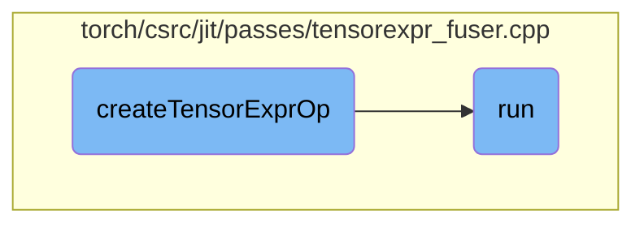

This document explains the process of creating a tensor expression operation. It involves checking for dynamic shape fusion attributes, creating a kernel, and handling symbolic shapes and strides.

The process starts by checking if the node has a dynamic shape fusion attribute. If it doesn't, a kernel is created and a function to run this kernel is returned. If dynamic shape fusion is enabled, a new kernel is compiled, symbolic shapes and strides are processed, and a stride map is set up. Finally, a function to run the kernel is returned, which can handle pre-allocated outputs based on the stack size.

# Flow drill down



<SwmSnippet path="/torch/csrc/jit/passes/tensorexpr_fuser.cpp" line="1355">

---

## createTensorExprOp

The `createTensorExprOp` function is responsible for creating a tensor expression operation based on the provided node. It checks if the node has a dynamic shape fusion attribute and handles it accordingly. If not, it creates a `TensorExprKernel` and returns a lambda function that runs the kernel. When dynamic shape fusion is enabled, it compiles a new kernel, processes symbolic shapes and strides, and sets up a stride map for the subgraph's inputs and outputs. Finally, it returns a lambda function that runs the kernel with or without pre-allocated outputs based on the stack size.

```c++
static Operation createTensorExprOp(const Node* node) {
  bool dynamic_shape_fusion_node =
      node->hasAttribute(attr::striding_inputs_desc);
  if (!dynamic_shape_fusion_node) {
    auto kernel =
        std::make_shared<tensorexpr::TensorExprKernel>(node->g(attr::Subgraph));
    return [kernel](Stack& stack) {
      RECORD_FUNCTION(kernel->getKernelName(), std::vector<c10::IValue>());
      kernel->run(stack);
      return 0;
    };
  }

  // Handle the case when dynamic shape fusion is enabled.
  VLOG(1) << "Compiling a new kernel for " << *node;
  std::vector<int64_t> sym_shapes;
  if (node->hasAttribute(attr::symbolic_shape_inputs)) {
    sym_shapes = node->is(attr::symbolic_shape_inputs);
  }
  bool allow_stack_outputs = false;
  if (node->hasAttribute(attr::allow_stack_outputs)) {
```

---

</SwmSnippet>

<SwmSnippet path="/torch/csrc/jit/passes/tensorexpr_fuser.cpp" line="549">

---

## run

The `run` function orchestrates the tensor expression fusion process. It initializes an alias database, removes redundant profile nodes, and creates fusion groups within the graph. After inlining small fusion groups, it either generalizes fusion groups for dynamic shapes or prepares and guards fusion groups based on the `fuse_to_dynamic_shapes_` flag. This function ensures the graph is optimized for tensor expression fusion.

```c++
  void run() {
    aliasDb_ = std::make_unique<AliasDb>(graph_);
    RemoveRedundantProfiles(graph_);
    GRAPH_DUMP("After removing redundant profile nodes: ", graph_);
    createFusionGroups(graph_->block());
    GRAPH_DUMP("After creating fusion groups: ", graph_);
    // we maintain alias db correctness during initial fusion, but it is
    // difficult to maintain correctness after inlining so inline only after
    // fusion is done.
    inlineSmallFusionGroups(graph_->block());
    GRAPH_DUMP("After inlining small fusion groups: ", graph_);
    if (fuse_to_dynamic_shapes_) {
      VLOG(1) << "TensorExpr fusion with dynamic shapes is enabled" << '\n';
      generalizeFusionGroups(graph_->block());
      GRAPH_DUMP("After generalizing fusion groups: ", graph_);
    } else {
      prepareFusionGroupAndGuardOutputs(graph_->block());
      GRAPH_DUMP("After guarding fusion groups: ", graph_);
    }
  }
```

---

</SwmSnippet>

&nbsp;

*This is an auto-generated document by Swimm AI 🌊 and has not yet been verified by a human*

<SwmMeta version="3.0.0" repo-id="Z2l0aHViJTNBJTNBcHl0b3JjaC1hdXRvZG9jcy1kZW1vJTNBJTNBU3dpbW0tRGVtbw==" repo-name="pytorch-autodocs-demo"><sup>Powered by [Swimm](https://app.swimm.io/)</sup></SwmMeta>
