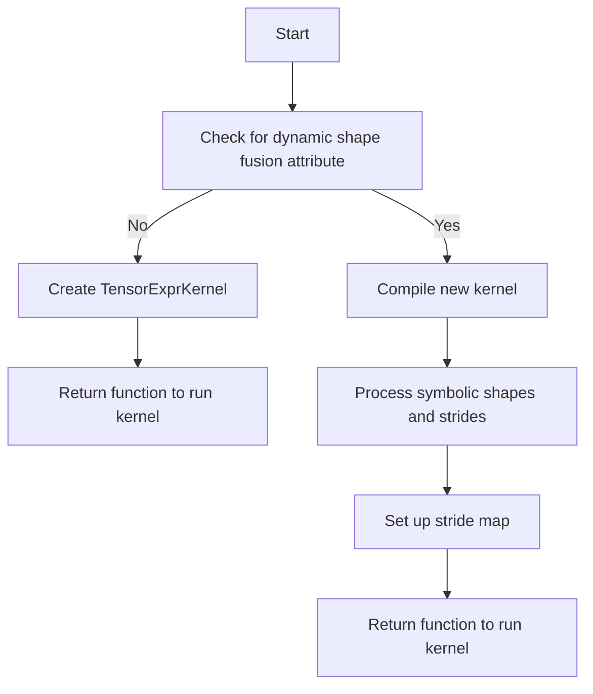

This document will cover the process of creating a Tensor Expression Operation, which includes:

1. Checking for dynamic shape fusion attributes
2. Creating a kernel
3. Handling symbolic shapes and strides.

Technical document: <SwmLink doc-title="Creating a Tensor Expression Operation">[Creating a Tensor Expression Operation](/.swm/creating-a-tensor-expression-operation.aaadyqwv.sw.md)</SwmLink>

# [Checking for Dynamic Shape Fusion Attributes](https://app.swimm.io/repos/Z2l0aHViJTNBJTNBcHl0b3JjaC1hdXRvZG9jcy1kZW1vJTNBJTNBU3dpbW0tRGVtbw==/docs/aaadyqwv#checking-for-dynamic-shape-fusion-attributes)

The process begins by examining whether the node has a dynamic shape fusion attribute. This attribute indicates if the tensor operation can handle dynamic shapes, which are shapes that can change during runtime. If the node does not have this attribute, the process moves to creating a kernel. This step ensures that the operation can adapt to dynamic shapes if necessary, providing flexibility and efficiency in handling various tensor operations.

# [Creating a Kernel](https://app.swimm.io/repos/Z2l0aHViJTNBJTNBcHl0b3JjaC1hdXRvZG9jcy1kZW1vJTNBJTNBU3dpbW0tRGVtbw==/docs/aaadyqwv#creating-a-kernel)

If the node does not have a dynamic shape fusion attribute, a TensorExprKernel is created. This kernel is responsible for executing the tensor operation. The kernel is designed to handle the specific subgraph of operations defined by the node. Once the kernel is created, a function is returned that can run this kernel. This function is essential for executing the tensor operation efficiently, ensuring that the operation is performed correctly and quickly.

# [Handling Symbolic Shapes and Strides](https://app.swimm.io/repos/Z2l0aHViJTNBJTNBcHl0b3JjaC1hdXRvZG9jcy1kZW1vJTNBJTNBU3dpbW0tRGVtbw==/docs/aaadyqwv#handling-symbolic-shapes-and-strides)

When dynamic shape fusion is enabled, the process involves compiling a new kernel that can handle symbolic shapes and strides. Symbolic shapes are abstract representations of tensor dimensions that can vary, and strides are the steps needed to move from one element to the next in the tensor. The process includes setting up a stride map, which helps in managing how data is accessed and manipulated within the tensor. Finally, a function is returned that can run the kernel, with the capability to handle pre-allocated outputs based on the stack size. This step ensures that the tensor operation can efficiently manage dynamic shapes and strides, providing robust performance for various tensor operations.

&nbsp;

*This is an auto-generated document by Swimm AI 🌊 and has not yet been verified by a human*

<SwmMeta version="3.0.0" repo-id="Z2l0aHViJTNBJTNBcHl0b3JjaC1hdXRvZG9jcy1kZW1vJTNBJTNBU3dpbW0tRGVtbw==" repo-name="pytorch-autodocs-demo">Powered by [Swimm](https://app.swimm.io/)</SwmMeta>
