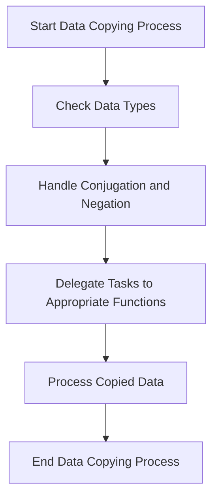

This document will cover the Data Copying Process, which includes:

1. Checking Data Types
2. Handling Conjugation and Negation
3. Delegating Tasks to Appropriate Functions
4. Processing Copied Data

Technical document: <SwmLink doc-title="Data Copying Process">[Data Copying Process](/.swm/data-copying-process.h9a3mst3.sw.md)</SwmLink>

# [Checking Data Types](https://app.swimm.io/repos/Z2l0aHViJTNBJTNBcHl0b3JjaC1hdXRvZG9jcy1kZW1vJTNBJTNBU3dpbW0tRGVtbw==/docs/h9a3mst3#copy_kernel)

The first step in the data copying process is to check the data types of the tensors involved. This ensures that the data is compatible for copying. If the data types match, the process can proceed smoothly. If they do not match, additional steps may be required to handle the data appropriately.

# [Handling Conjugation and Negation](https://app.swimm.io/repos/Z2l0aHViJTNBJTNBcHl0b3JjaC1hdXRvZG9jcy1kZW1vJTNBJTNBU3dpbW0tRGVtbw==/docs/h9a3mst3#copy_kernel)

In this step, the system checks if any special operations like conjugation or negation are needed. Conjugation is relevant for complex numbers, where the imaginary part is negated. Negation is simply flipping the sign of the data. These operations are essential for ensuring that the copied data maintains its intended properties.

# [Delegating Tasks to Appropriate Functions](https://app.swimm.io/repos/Z2l0aHViJTNBJTNBcHl0b3JjaC1hdXRvZG9jcy1kZW1vJTNBJTNBU3dpbW0tRGVtbw==/docs/h9a3mst3#copy_same_dtype)

Depending on the data types and the need for conjugation or negation, the system delegates the copying task to specific functions. For instance, if the data types match and no special operations are needed, a direct copy function is used. If conjugation or negation is required, specialized functions like `neg_conj_kernel`, `neg_kernel`, or `conj_kernel` are called to handle these operations efficiently.

# [Processing Copied Data](https://app.swimm.io/repos/Z2l0aHViJTNBJTNBcHl0b3JjaC1hdXRvZG9jcy1kZW1vJTNBJTNBU3dpbW0tRGVtbw==/docs/h9a3mst3#cast_outputs)

After the data has been copied, it is processed to ensure it has the correct size and type. This involves resizing the output tensor if necessary and copying the data from the current tensor to the original tensor. This step is crucial for maintaining consistency in tensor operations and ensuring that the copied data is ready for further use.

&nbsp;

*This is an auto-generated document by Swimm AI 🌊 and has not yet been verified by a human*

<SwmMeta version="3.0.0" repo-id="Z2l0aHViJTNBJTNBcHl0b3JjaC1hdXRvZG9jcy1kZW1vJTNBJTNBU3dpbW0tRGVtbw==" repo-name="pytorch-autodocs-demo">Powered by [Swimm](https://app.swimm.io/)</SwmMeta>
