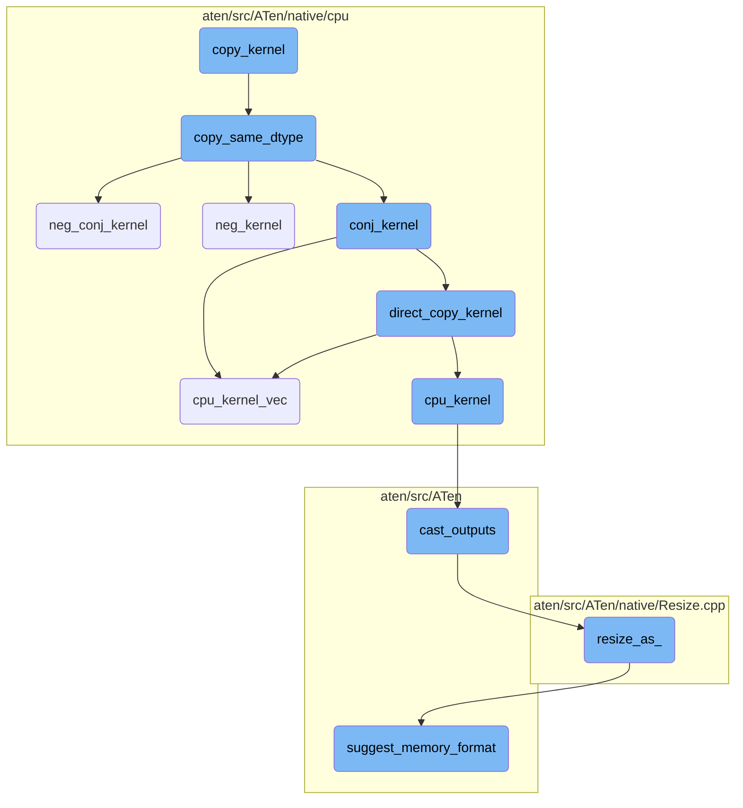
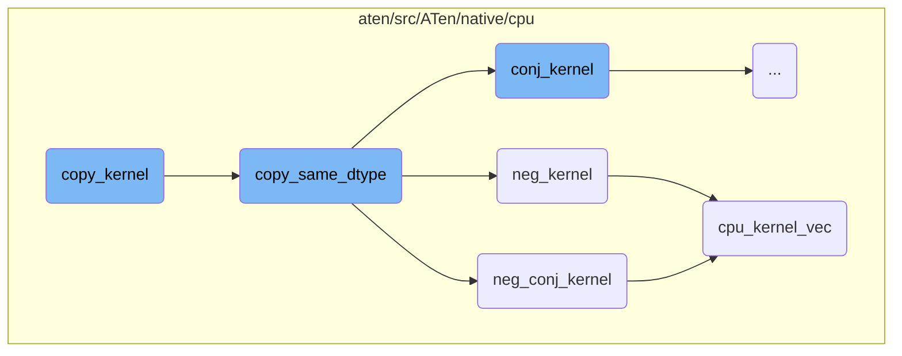
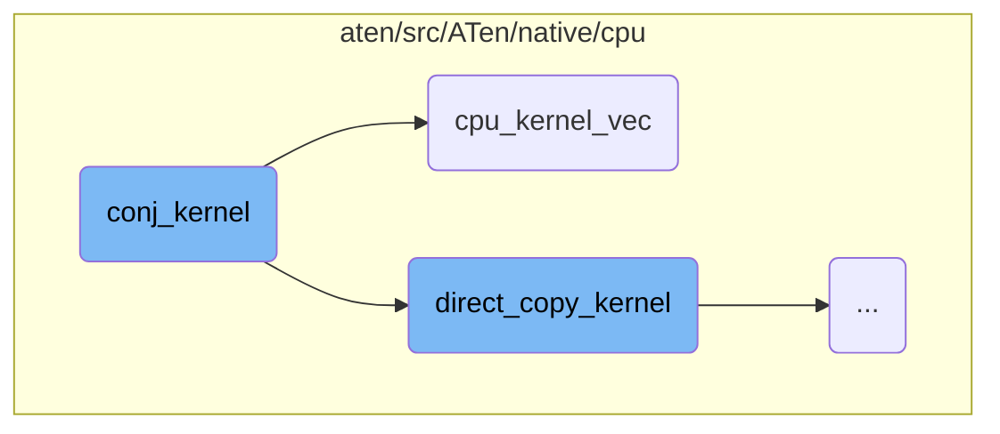
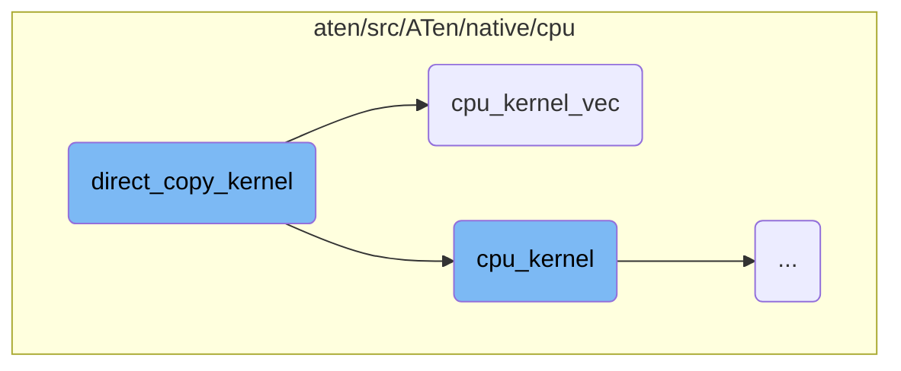
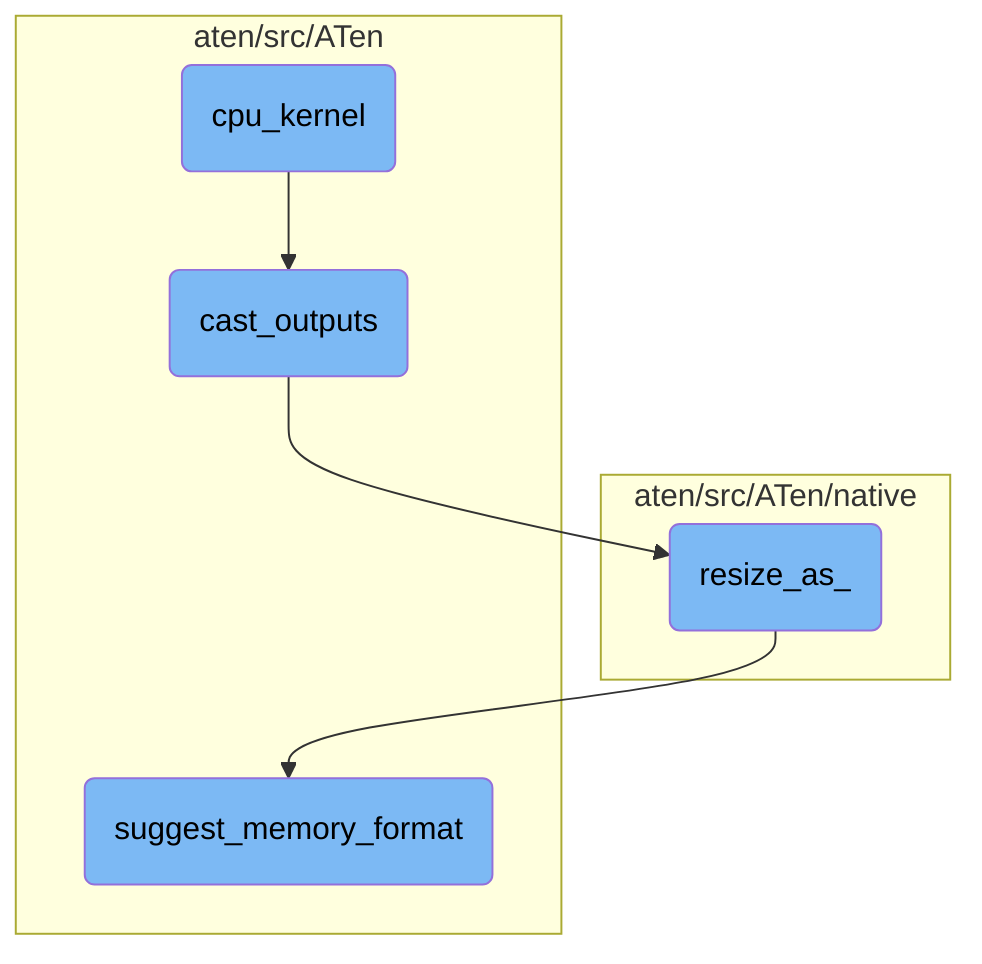

This document explains the `copy_kernel` function, which is responsible for copying data between tensors. It covers the main steps involved in the copying process, including checking data types, handling conjugation and negation, and delegating tasks to appropriate kernel functions.

The flow starts with the `copy_kernel` function, which checks the data type of the tensors and whether any special operations like conjugation or negation are needed. If the data types match, it uses the `copy_same_dtype` function to handle the copy. Depending on the requirements, this function may call other specialized functions like `neg_conj_kernel`, `neg_kernel`, or `conj_kernel`. If the data types don't match, the function may use `reduced_float_copy_kernel` or perform a direct copy using `cpu_kernel`. Finally, the copied data is processed to ensure it has the correct size and type.

Here is a high level diagram of the flow, showing only the most important functions:



# Flow drill down

First, we'll zoom into this section of the flow:



<SwmSnippet path="/aten/src/ATen/native/cpu/CopyKernel.cpp" line="286">

---

## copy_kernel

The `copy_kernel` function is responsible for copying data between tensors. It first checks the data type of the tensors and whether any conjugation or negation is required. Depending on these conditions, it delegates the task to `copy_same_dtype`, `reduced_float_copy_kernel`, or performs a direct copy using `cpu_kernel`. If conjugation or negation is needed after the initial copy, it performs an in-place operation to apply these transformations.

```c++
void copy_kernel(TensorIterator& iter, bool /*non_blocking*/) {
  ScalarType dtype = iter.dtype(0);
  const bool requires_conj = (
      isComplexType(dtype) && (iter.tensor_base(0).is_conj() != iter.tensor_base(1).is_conj()));
  const bool requires_neg = (iter.tensor_base(0).is_neg() != iter.tensor_base(1).is_neg());

  if (dtype == iter.dtype(1)) {
    copy_same_dtype(iter, requires_conj, requires_neg);
  } else if (reduced_float_type_copy(requires_conj, iter)) {
    reduced_float_copy_kernel(iter, requires_neg);
  } else {
    _AT_DISPATCH_ALL_TYPES(dtype, "copy_", [&] {
      using dest_t = scalar_t;
      _AT_DISPATCH_ALL_TYPES(iter.dtype(1), "copy_", [&] {
        if (iter.has_contiguous_first_dim()) {
          TORCH_INTERNAL_ASSERT(iter.ninputs() == 1);
          TORCH_INTERNAL_ASSERT(iter.noutputs() == 1);

          iter.for_each([](char **data, const int64_t *strides, int64_t size) {
            auto src = reinterpret_cast<const scalar_t*>(data[1]);
            auto dst = reinterpret_cast<dest_t*>(data[0]);
```

---

</SwmSnippet>

<SwmSnippet path="/aten/src/ATen/native/cpu/CopyKernel.cpp" line="268">

---

## copy_same_dtype

The `copy_same_dtype` function handles the copying of tensors that have the same data type. It checks if negation or conjugation is required and calls the appropriate kernel function (`neg_conj_kernel`, `neg_kernel`, `conj_kernel`, or `direct_copy_kernel`) to perform the operation.

```c++
static void copy_same_dtype(TensorIteratorBase &iter, bool requires_conj, bool requires_neg) {
  if (requires_neg) {
    // This case should never actually happen since currently there's no way to get a complex tensor
    // with negative bit.
    if (requires_conj) {
      neg_conj_kernel(iter);
    } else {
      neg_kernel(iter);
    }
  } else {
    if (requires_conj) {
      conj_kernel(iter);
    } else {
      direct_copy_kernel(iter);
    }
  }
}
```

---

</SwmSnippet>

<SwmSnippet path="/aten/src/ATen/native/cpu/CopyKernel.cpp" line="258">

---

### neg_conj_kernel

The `neg_conj_kernel` function is a specialized kernel that handles the negation and conjugation of complex tensors. It uses the `cpu_kernel_vec` function to apply these operations in a vectorized manner for efficiency.

```c++
static void neg_conj_kernel(TensorIteratorBase &iter) {
  // fused a = b.neg().conj_physical()
  AT_DISPATCH_COMPLEX_TYPES(iter.common_dtype(), "neg_conj_cpu", [&] {
    cpu_kernel_vec(
        iter,
        [=](scalar_t a) -> scalar_t { return -conj_impl(a); },
        [=](Vectorized<scalar_t> a) -> Vectorized<scalar_t> { return a.neg().conj(); });
  });
}
```

---

</SwmSnippet>

<SwmSnippet path="/aten/src/ATen/native/cpu/UnaryOpsKernel.cpp" line="287">

---

### neg_kernel

The `neg_kernel` function handles the negation of tensors. It uses the `cpu_kernel_vec` function to apply the negation operation in a vectorized manner, ensuring efficient computation.

```c++
// NB: Ignores the negative bit on tensors
void neg_kernel(TensorIteratorBase& iter) {
  AT_DISPATCH_ALL_TYPES_AND_COMPLEX_AND3(kComplexHalf, kBFloat16, kHalf, iter.dtype(), "neg_cpu", [&]() {
    cpu_kernel_vec(
        iter,
        [=](scalar_t a) -> scalar_t { return -a; },
        [=](Vectorized<scalar_t> a) { return a.neg(); });
  });
}
```

---

</SwmSnippet>

<SwmSnippet path="/aten/src/ATen/native/cpu/Loops.h" line="341">

---

### cpu_kernel_vec

The `cpu_kernel_vec` function is a utility that applies a given operation to each element of a tensor in a vectorized manner. It ensures that the operation is performed efficiently by leveraging CPU vectorization capabilities.

```c
void cpu_kernel_vec(TensorIteratorBase& iter, func_t&& op, vec_func_t&& vop, int64_t grain_size = at::internal::GRAIN_SIZE) {
  using traits = function_traits<func_t>;
  // this could be extended to work with void return types
  TORCH_INTERNAL_ASSERT(iter.ninputs() == traits::arity);
  TORCH_INTERNAL_ASSERT(iter.noutputs() == 1);
  // dynamic casting not currently supported on CPU, but some kernels (like Fill)
  // explicitly dynamic_cast, so we give the opt-out of checking.
  if constexpr (check_dynamic_cast) {
    TORCH_INTERNAL_ASSERT(!needs_dynamic_casting<func_t>::check(iter));
  }

  iter.for_each(make_vectorized_loop2d(std::forward<func_t>(op), std::forward<vec_func_t>(vop)), grain_size);
  iter.cast_outputs();
}
```

---

</SwmSnippet>

Now, lets zoom into this section of the flow:



<SwmSnippet path="/aten/src/ATen/native/cpu/UnaryOpsKernel.cpp" line="218">

---

## conj_kernel

The `conj_kernel` function is responsible for handling the conjugate operation on tensors. It uses the `AT_DISPATCH_SWITCH` macro to handle different data types. For non-complex types, it directly calls the `direct_copy_kernel` function, as the conjugate operation is a no-op. For complex types, it uses the `cpu_kernel_vec` function to apply the conjugate operation using the `conj_impl` function for scalar values and the `conj` method for vectorized values.

```c++
// NB: Ignores the negative bit on tensors
void conj_kernel(TensorIteratorBase& iter) {
  AT_DISPATCH_SWITCH(iter.common_dtype(), "conj_cpu",
    AT_DISPATCH_CASE_ALL_TYPES_AND3(kBool, kBFloat16, kHalf, [&] {
      // conj is a no-op for non-complex types
      direct_copy_kernel(iter);
    })
    AT_DISPATCH_CASE_COMPLEX_TYPES_AND(kComplexHalf, [&] {
      cpu_kernel_vec(
          iter,
          [=](scalar_t a) -> scalar_t { return conj_impl(a); },
          [=](Vectorized<scalar_t> a) { return a.conj(); });
    })
  );
}
```

---

</SwmSnippet>

Now, lets zoom into this section of the flow:



<SwmSnippet path="/aten/src/ATen/native/cpu/CopyKernel.cpp" line="224">

---

## Direct Copy Kernel

The `direct_copy_kernel` function is responsible for copying data directly between tensors. It handles different data types by dispatching to the appropriate kernel functions. For quantized types, it uses `cpu_kernel_vec` to perform the copy operation. For complex half types, it uses `cpu_kernel`. For bit types, it dispatches to `cpu_kernel` as well. For all other types, it uses `_AT_DISPATCH_ALL_TYPES_NO_CF` to select the appropriate kernel function.

```c++
void direct_copy_kernel(TensorIteratorBase &iter) {
  // TODO: we don't actually need separate instantiations per dtype;
  // we only need a separate instantiation per dtype size. This would
  // probably save us a little bit of code size here
  // TODO: not sure if optimizer is able to compile two levels of
  // conditionals into a single jump table.  We should have a
  // single jump table here; might be worth just writing out the
  // dispatch statement by hand instead of using AT_DISPATCH
  ScalarType dtype = iter.dtype(0);
  if (isQIntType(dtype)) {
    AT_DISPATCH_QINT_TYPES(dtype, "copy_kernel", [&] {
      cpu_kernel_vec(
          iter,
          [=](scalar_t a) -> scalar_t { return a; },
          [=](Vectorized<scalar_t> a) -> Vectorized<scalar_t> { return a; });
    });
  } else if (dtype == ScalarType::ComplexHalf) {
    cpu_kernel(iter, [=](c10::complex<at::Half> a) -> c10::complex<at::Half> { return a; });
  } else if (isBitsType(dtype)) {
    AT_DISPATCH_BIT_TYPES(dtype, "copy_kernel", [&] {
      cpu_kernel(
```

---

</SwmSnippet>

Now, lets zoom into this section of the flow:



<SwmSnippet path="/aten/src/ATen/native/cpu/Loops.h" line="304">

---

## cpu_kernel

The `cpu_kernel` function is responsible for executing a given operation over a tensor iterator on the CPU. It ensures that the number of inputs and outputs match the expected arity and that no dynamic casting is required. The function then iterates over the data, applying the operation in a loop, and finally casts the outputs.

```c
void cpu_kernel(TensorIteratorBase& iter, func_t&& op, int64_t grain_size = at::internal::GRAIN_SIZE) {
  using traits = function_traits<func_t>;
  // this could be extended to work with void return types
  TORCH_INTERNAL_ASSERT(iter.ninputs() == traits::arity);
  TORCH_INTERNAL_ASSERT(iter.noutputs() == 1);
  // dynamic casting not currently supported on CPU
  TORCH_INTERNAL_ASSERT(!needs_dynamic_casting<func_t>::check(iter));

  iter.for_each([&](char** data, const int64_t* strides, int64_t n) {
    // basic loop can handle 1d slices with arbitrary strides, and 1d slices is all that
    // iter.for_each is ever sending to the loop lambda
      basic_loop(data, strides, 0, n, op);
  }, grain_size);
  iter.cast_outputs();
}
```

---

</SwmSnippet>

<SwmSnippet path="/aten/src/ATen/TensorIterator.cpp" line="829">

---

## cast_outputs

The `cast_outputs` method in `TensorIteratorBase` ensures that the output tensors have the correct sizes and types. If the original tensor's size does not match the current tensor's size, it resizes the original tensor and copies the data from the current tensor. This step is crucial for maintaining consistency in tensor operations.

```c++
void TensorIteratorBase::cast_outputs() {
  for (auto& op : operands_) {
    if (op.is_output && op.original_tensor_base().defined() &&
        op.original_tensor_base().scalar_type() != op.current_dtype) {
      // TODO: Now that set_output resizes both the original_tensor
      // and tensor, this condition should no longer ever be true
      const auto &original_tensor = op.original_tensor();
      const auto &tensor = op.tensor();
      if (original_tensor.sizes() != tensor.sizes()) {
        original_tensor.resize_as_(tensor).as_strided_(tensor.sizes(), tensor.strides());
      }
      original_tensor.copy_(tensor);
      op.restore_original_tensor();
    }
  }
}
```

---

</SwmSnippet>

<SwmSnippet path="/aten/src/ATen/native/Resize.cpp" line="112">

---

## resize_as\_

The `resize_as_` function resizes a tensor to match the size of another tensor, optionally adjusting the memory format. It handles different memory formats, such as contiguous and channels last, ensuring that the output tensor's strides are set correctly based on the input tensor's memory format.

```c++
// TODO(VitalyFedyunin): Move it to HTML docs.
//
// Strides of the output tensor of `resize_as_` operator is defined by input
// tensor strides and the value of memory_format argument.
//
// If memory_format is omitted and input tensor have the same shape as output
// tensor, strides of the output will remain unchanged. Strides going to be
// set to contiguous if shapes are different.
//
// If memory_format is equals to MemoryFormat::Contiguous (torch.contiguous_format)
// output tensor will have contiguous strides.
//
// If memory_format is equal to MemoryFormat::ChannelsLast (torch.channels_last)
// and input tensor is 4D, output tensor will have channels last memory layout.
//
// If memory_format is equal to MemoryFormat::Preserve (torch.preserve_format)
// output tensor will be defined by strides of the input tensor, following
// memory format preservation rule:
//
//  - If input tensor strides are in channels last format, output tensor will
//    have channels last memory layout.
```

---

</SwmSnippet>

<SwmSnippet path="/aten/src/ATen/core/TensorBase.h" line="271">

---

## suggest_memory_format

The `suggest_memory_format` function suggests an appropriate memory format for a tensor based on its strides. It checks if the tensor's strides match the channels last format or the contiguous format and returns the corresponding memory format. This function helps in optimizing memory layout for tensor operations.

```c
  at::MemoryFormat suggest_memory_format(
      bool channels_last_strides_exact_match = false) const {
    // Setting channels_last_strides_exact_match to true forces function to
    // check 0,1 - sized dimension strides.
    if (layout() == at::kStrided) {
      if (impl_->is_strides_like_channels_last()) {
        if (!channels_last_strides_exact_match ||
            get_channels_last_strides_2d(sizes()) == strides()) {
          return at::MemoryFormat::ChannelsLast;
        }
      }
      else if (impl_->is_strides_like_channels_last_3d()) {
        if (!channels_last_strides_exact_match ||
            get_channels_last_strides_3d(sizes()) == strides()) {
          return at::MemoryFormat::ChannelsLast3d;
        }
      }
    }
    return at::MemoryFormat::Contiguous;
  }
```

---

</SwmSnippet>

&nbsp;

*This is an auto-generated document by Swimm AI 🌊 and has not yet been verified by a human*

<SwmMeta version="3.0.0" repo-id="Z2l0aHViJTNBJTNBcHl0b3JjaC1hdXRvZG9jcy1kZW1vJTNBJTNBU3dpbW0tRGVtbw==" repo-name="pytorch-autodocs-demo"><sup>Powered by [Swimm](https://app.swimm.io/)</sup></SwmMeta>
