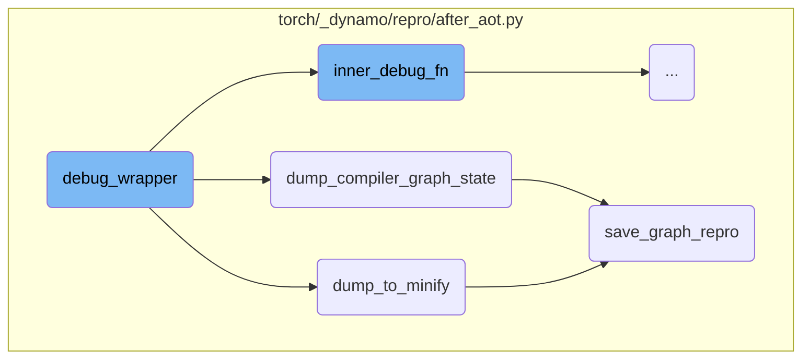
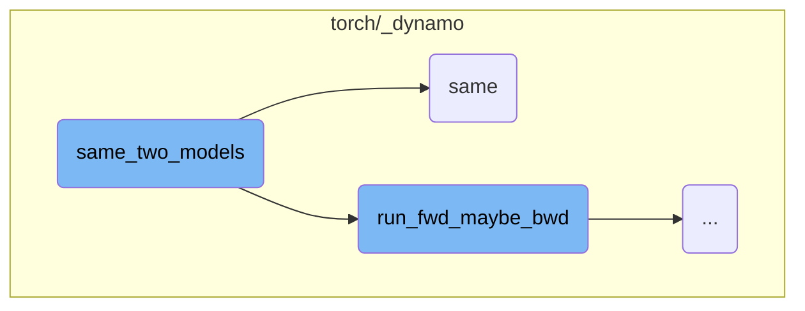

```mermaid
graph TD;
      subgraph torchdynamo["torch/_dynamo"]
45d3914ff219ac59d8791edb23592ffcf2198e42f21e9d2fa8d458122697dfbf(run_fwd_maybe_bwd):::mainFlowStyle --> b849fa0d966995c95bcc0dd289d11300f269a476fb0a889509ae0149e18ed3ef(reduce_to_scalar_loss):::mainFlowStyle
end

subgraph torchdynamo["torch/_dynamo"]
b849fa0d966995c95bcc0dd289d11300f269a476fb0a889509ae0149e18ed3ef(reduce_to_scalar_loss):::mainFlowStyle --> 155e3cc2d5c50ff89e280b9cdc1c9ae4e009632d190253b8d3364f817aed44c4(numel):::mainFlowStyle
end

subgraph torchdynamo["torch/_dynamo"]
155e3cc2d5c50ff89e280b9cdc1c9ae4e009632d190253b8d3364f817aed44c4(numel):::mainFlowStyle --> 0fe776e548d42ed0d2169b9051562848ccfee29509461e7e993ce542426370a7(call_function):::mainFlowStyle
end

subgraph torchdynamo["torch/_dynamo"]
0fe776e548d42ed0d2169b9051562848ccfee29509461e7e993ce542426370a7(call_function):::mainFlowStyle --> fde83ab941c6a2749f130ece53e7f65af2928d91723a63a01273d4e430a433bb(call_method):::mainFlowStyle
end

subgraph torchdynamo["torch/_dynamo"]
fde83ab941c6a2749f130ece53e7f65af2928d91723a63a01273d4e430a433bb(call_method):::mainFlowStyle --> 458008e74f18ebce47c64da5a4233a63dc2fd42ac18b14ae3f3aaea47313241b(inline_user_function_return):::mainFlowStyle
end

subgraph torchdynamo["torch/_dynamo"]
458008e74f18ebce47c64da5a4233a63dc2fd42ac18b14ae3f3aaea47313241b(inline_user_function_return):::mainFlowStyle --> fcd883700fffa007b56c5d346195884dc971b221f81f7154a62efec44b035ea5(inline_call):::mainFlowStyle
end

subgraph torchdynamo["torch/_dynamo"]
fcd883700fffa007b56c5d346195884dc971b221f81f7154a62efec44b035ea5(inline_call):::mainFlowStyle --> 15971f1e27fd627308a99bae241ac3eb113c6830b15353374d03323c5a30959c(inline_call_):::mainFlowStyle
end

subgraph torchdynamo["torch/_dynamo"]
15971f1e27fd627308a99bae241ac3eb113c6830b15353374d03323c5a30959c(inline_call_):::mainFlowStyle --> edf27ab967b775dcd6f62cb8a0fb2a87177da9406db5a99aad72cc627af839ac(run):::mainFlowStyle
end

subgraph torchdynamo["torch/_dynamo"]
edf27ab967b775dcd6f62cb8a0fb2a87177da9406db5a99aad72cc627af839ac(run):::mainFlowStyle --> 99e91bca7ea856f56e3f34579d72219ce35debd0d03d0aee37dedaffe5ac2a22(step):::mainFlowStyle
end

subgraph torchdynamo["torch/_dynamo"]
99e91bca7ea856f56e3f34579d72219ce35debd0d03d0aee37dedaffe5ac2a22(step):::mainFlowStyle --> a8cb423a5d16e220218eb2e3c35a54f64a0aaab6b5233dd0b33a8dae3657ca81(step_graph_break):::mainFlowStyle
end

subgraph torchdynamo["torch/_dynamo"]
a8cb423a5d16e220218eb2e3c35a54f64a0aaab6b5233dd0b33a8dae3657ca81(step_graph_break):::mainFlowStyle --> 2ba345a88495baf48df3654780e05d6be290f7d7a9d8f157cc7acee764a6ff02(compile_subgraph):::mainFlowStyle
end

subgraph torchdynamo["torch/_dynamo"]
2ba345a88495baf48df3654780e05d6be290f7d7a9d8f157cc7acee764a6ff02(compile_subgraph):::mainFlowStyle --> f04eb3af86dd9d49cdf4b5a53e7e367822569119516fff5eea0fed07fa4cd321(compile_and_call_fx_graph):::mainFlowStyle
end


      classDef mainFlowStyle color:#000000,fill:#7CB9F4
classDef rootsStyle color:#000000,fill:#00FFF4
classDef Style1 color:#000000,fill:#00FFAA
classDef Style2 color:#000000,fill:#FFFF00
classDef Style3 color:#000000,fill:#AA7CB9
```

This document explains the purpose and functionality of the `debug_wrapper` function. It covers how the function attempts to compile a graph module with fake inputs, handles failures by dumping the compiler graph state or minifying the graph, and ensures the compiled function is called with real inputs.

The `debug_wrapper` function is designed to help debug the compilation of a graph module. First, it tries to compile the graph using fake inputs. If this fails, it saves the current state of the graph or simplifies it to make debugging easier. Finally, it runs the compiled function with real inputs and handles any errors that occur during this process.

Here is a high level diagram of the flow, showing only the most important functions:

```mermaid
graph TD;
      subgraph torchdynamo["torch/_dynamo"]
d83ce744a1070c0116cd9b0cd0362a432f0508f2099f6287fb1e3b0409d943d7(debug_wrapper):::mainFlowStyle --> 4703e6ad8b428492edd9853148b75320a722949d547cf4cba2c4cd474e0cc195(dump_to_minify)
end

subgraph torchdynamo["torch/_dynamo"]
d83ce744a1070c0116cd9b0cd0362a432f0508f2099f6287fb1e3b0409d943d7(debug_wrapper):::mainFlowStyle --> cb634a00add2101934984dd33490166d61260c6d0e53443c52b4957fb21fb994(dump_compiler_graph_state)
end

subgraph torchdynamo["torch/_dynamo"]
d83ce744a1070c0116cd9b0cd0362a432f0508f2099f6287fb1e3b0409d943d7(debug_wrapper):::mainFlowStyle --> 9cecb781467cb293906b507dc37dadcc34e9be6d975365c8a3e3da265a364d5b(inner_debug_fn):::mainFlowStyle
end

subgraph torchdynamo["torch/_dynamo"]
9cecb781467cb293906b507dc37dadcc34e9be6d975365c8a3e3da265a364d5b(inner_debug_fn):::mainFlowStyle --> 4703e6ad8b428492edd9853148b75320a722949d547cf4cba2c4cd474e0cc195(dump_to_minify)
end

subgraph torchdynamo["torch/_dynamo"]
9cecb781467cb293906b507dc37dadcc34e9be6d975365c8a3e3da265a364d5b(inner_debug_fn):::mainFlowStyle --> cb634a00add2101934984dd33490166d61260c6d0e53443c52b4957fb21fb994(dump_compiler_graph_state)
end

subgraph torchdynamo["torch/_dynamo"]
9cecb781467cb293906b507dc37dadcc34e9be6d975365c8a3e3da265a364d5b(inner_debug_fn):::mainFlowStyle --> aeeefd782d30030b62d9079ee5b0d799932c917b6dddae9559db7cdbe67518ac(same_two_models):::mainFlowStyle
end

subgraph torchdynamo["torch/_dynamo"]
aeeefd782d30030b62d9079ee5b0d799932c917b6dddae9559db7cdbe67518ac(same_two_models):::mainFlowStyle --> eb0a9eb1d39824546c9563680642925b0af55a6c9bef3822592742b5943437b6(same)
end

subgraph torchdynamo["torch/_dynamo"]
aeeefd782d30030b62d9079ee5b0d799932c917b6dddae9559db7cdbe67518ac(same_two_models):::mainFlowStyle --> 45d3914ff219ac59d8791edb23592ffcf2198e42f21e9d2fa8d458122697dfbf(run_fwd_maybe_bwd):::mainFlowStyle
end

subgraph torchdynamo["torch/_dynamo"]
45d3914ff219ac59d8791edb23592ffcf2198e42f21e9d2fa8d458122697dfbf(run_fwd_maybe_bwd):::mainFlowStyle --> b849fa0d966995c95bcc0dd289d11300f269a476fb0a889509ae0149e18ed3ef(reduce_to_scalar_loss):::mainFlowStyle
end

subgraph torchdynamo["torch/_dynamo"]
b849fa0d966995c95bcc0dd289d11300f269a476fb0a889509ae0149e18ed3ef(reduce_to_scalar_loss):::mainFlowStyle --> 155e3cc2d5c50ff89e280b9cdc1c9ae4e009632d190253b8d3364f817aed44c4(numel):::mainFlowStyle
end

subgraph torchdynamo["torch/_dynamo"]
155e3cc2d5c50ff89e280b9cdc1c9ae4e009632d190253b8d3364f817aed44c4(numel):::mainFlowStyle --> 0fe776e548d42ed0d2169b9051562848ccfee29509461e7e993ce542426370a7(call_function):::mainFlowStyle
end

subgraph torchdynamo["torch/_dynamo"]
0fe776e548d42ed0d2169b9051562848ccfee29509461e7e993ce542426370a7(call_function):::mainFlowStyle --> fde83ab941c6a2749f130ece53e7f65af2928d91723a63a01273d4e430a433bb(call_method):::mainFlowStyle
end

subgraph torchdynamo["torch/_dynamo"]
fde83ab941c6a2749f130ece53e7f65af2928d91723a63a01273d4e430a433bb(call_method):::mainFlowStyle --> 458008e74f18ebce47c64da5a4233a63dc2fd42ac18b14ae3f3aaea47313241b(inline_user_function_return):::mainFlowStyle
end

subgraph torchdynamo["torch/_dynamo"]
458008e74f18ebce47c64da5a4233a63dc2fd42ac18b14ae3f3aaea47313241b(inline_user_function_return):::mainFlowStyle --> fcd883700fffa007b56c5d346195884dc971b221f81f7154a62efec44b035ea5(inline_call):::mainFlowStyle
end

subgraph torchdynamo["torch/_dynamo"]
fcd883700fffa007b56c5d346195884dc971b221f81f7154a62efec44b035ea5(inline_call):::mainFlowStyle --> 15971f1e27fd627308a99bae241ac3eb113c6830b15353374d03323c5a30959c(inline_call_):::mainFlowStyle
end

subgraph torchdynamo["torch/_dynamo"]
15971f1e27fd627308a99bae241ac3eb113c6830b15353374d03323c5a30959c(inline_call_):::mainFlowStyle --> edf27ab967b775dcd6f62cb8a0fb2a87177da9406db5a99aad72cc627af839ac(run):::mainFlowStyle
end

subgraph torchdynamo["torch/_dynamo"]
edf27ab967b775dcd6f62cb8a0fb2a87177da9406db5a99aad72cc627af839ac(run):::mainFlowStyle --> 99e91bca7ea856f56e3f34579d72219ce35debd0d03d0aee37dedaffe5ac2a22(step):::mainFlowStyle
end

subgraph torchdynamo["torch/_dynamo"]
99e91bca7ea856f56e3f34579d72219ce35debd0d03d0aee37dedaffe5ac2a22(step):::mainFlowStyle --> a8cb423a5d16e220218eb2e3c35a54f64a0aaab6b5233dd0b33a8dae3657ca81(step_graph_break):::mainFlowStyle
end

subgraph torchdynamo["torch/_dynamo"]
a8cb423a5d16e220218eb2e3c35a54f64a0aaab6b5233dd0b33a8dae3657ca81(step_graph_break):::mainFlowStyle --> 2ba345a88495baf48df3654780e05d6be290f7d7a9d8f157cc7acee764a6ff02(compile_subgraph):::mainFlowStyle
end

subgraph torchdynamo["torch/_dynamo"]
2ba345a88495baf48df3654780e05d6be290f7d7a9d8f157cc7acee764a6ff02(compile_subgraph):::mainFlowStyle --> f04eb3af86dd9d49cdf4b5a53e7e367822569119516fff5eea0fed07fa4cd321(compile_and_call_fx_graph):::mainFlowStyle
end


      classDef mainFlowStyle color:#000000,fill:#7CB9F4
classDef rootsStyle color:#000000,fill:#00FFF4
classDef Style1 color:#000000,fill:#00FFAA
classDef Style2 color:#000000,fill:#FFFF00
classDef Style3 color:#000000,fill:#AA7CB9
```



# Flow drill down

First, we'll zoom into this section of the flow:



<SwmSnippet path="/torch/_dynamo/repro/after_aot.py" line="69">

---

## debug_wrapper

The `debug_wrapper` function is designed to handle the debugging process for the compilation of a graph module (`gm`). It attempts to compile the graph with fake inputs and, in case of failure, it dumps the compiler graph state or minifies the graph for easier debugging. The function also ensures that the compiled function is called with real inputs, handling any exceptions that might occur during this process.

```python
    def debug_wrapper(gm, example_inputs, **kwargs):
        from torch._subclasses import FakeTensorMode

        compiler_fn = functools.partial(unconfigured_compiler_fn, **kwargs)

        from torch._functorch.aot_autograd import get_aot_graph_name

        graph_name = get_aot_graph_name()

        # TODO: why do we need to deepcopy the original graph?
        orig_graph = copy.deepcopy(gm.graph)
        assert config.repro_after in ("dynamo", "aot", None)

        try:
            # Call the compiler_fn - which is either aot_autograd or inductor
            # with fake inputs
            inner_compiled_fn = compiler_fn(gm, example_inputs)
        except Exception as e:
            # TODO: Failures here are troublesome because no real inputs,
            # need a different serialization strategy
            if config.repro_after == "aot":
```

---

</SwmSnippet>

<SwmSnippet path="/torch/_dynamo/repro/after_aot.py" line="333">

---

### dump_to_minify

The `dump_to_minify` function is responsible for saving the graph module and its arguments to a checkpoint directory. This is useful for debugging as it allows the developer to minify the graph and reproduce the issue with a smaller, more manageable graph.

```python
def dump_to_minify(gm, args, compiler_name: str):
    out = io.StringIO()
    # TODO: factor this out
    subdir = os.path.join(minifier_dir(), "checkpoints")
    if not os.path.exists(subdir):
        os.makedirs(subdir, exist_ok=True)
    save_graph_repro(out, gm, args, compiler_name, save_dir=subdir, command="minify")
    return helper_for_dump_minify(out.getvalue())
```

---

</SwmSnippet>

<SwmSnippet path="/torch/_dynamo/repro/after_aot.py" line="305">

---

### dump_compiler_graph_state

The `dump_compiler_graph_state` function saves the current state of the compiler graph to a file. This is particularly useful for debugging purposes, as it allows the developer to inspect the state of the graph at the point of failure.

```python
def dump_compiler_graph_state(gm, args, compiler_name, *, accuracy=None):
    subdir = os.path.join(minifier_dir(), "checkpoints")
    if not os.path.exists(subdir):
        os.makedirs(subdir, exist_ok=True)
    file_name = os.path.join(subdir, f"{len(gm.graph.nodes)}.py")
    log.warning(
        "Writing checkpoint with %s nodes to %s", len(gm.graph.nodes), file_name
    )
    with open(file_name, "w") as fd:
        save_graph_repro(
            fd, gm, args, compiler_name, save_dir=subdir, accuracy=accuracy
        )
    curdir = os.getcwd()
    repro_path = os.path.join(curdir, "repro.py")
    try:
        shutil.copyfile(file_name, repro_path)
        log.warning("Copying repro file for convenience to %s", repro_path)
        if use_buck:
            BuckTargetWriter(file_name).write()
    except OSError:
        log.warning("No write permissions for %s", repro_path)
```

---

</SwmSnippet>

<SwmSnippet path="/torch/_dynamo/repro/after_aot.py" line="257">

---

### save_graph_repro

The `save_graph_repro` function generates a reproducible script for the given graph module and its arguments. This script can be used to reproduce the issue outside of the current environment, making it easier to debug and fix the problem.

```python
def save_graph_repro(
    fd,
    gm,
    args,
    compiler_name,
    *,
    stable_output=False,
    save_dir=None,
    command="run",
    accuracy=None,
    tracing_mode=None,
    check_str=None,
):
    if any(
        isinstance(arg, torch.fx.experimental._backward_state.BackwardState)
        for arg in args
    ):
        fd.write(
            "Repro is not generated due to existence of BackwardState in graph input"
        )
        return
```

---

</SwmSnippet>

Now, lets zoom into this section of the flow:


<SwmSnippet path="/torch/_dynamo/repro/after_aot.py" line="127">

---

## Handling Fake and Real Tensors

The function `inner_debug_fn` starts by converting real tensors to fake tensors using `FakeTensorMode`. This is necessary because the compiler might clear the tensor list during code generation, and the example inputs are only available during the first invocation.

```python
            fake_mode = FakeTensorMode()
            copy_tensor_attrs = [
                fake_mode.from_tensor(x) if isinstance(x, torch.Tensor) else x
                for x in real_inputs
            ]
```

---

</SwmSnippet>

<SwmSnippet path="/torch/_dynamo/repro/after_aot.py" line="132">

---

## Dumping the Original Module

If the reproduction level is set to 3, the function `dump_to_minify` is called to dump the original module. This is useful for debugging purposes, especially in case of segmentation faults.

```python
            if config.repro_level == 3:
                # Always dump the original module in case we have segfaults
                dump_to_minify(
                    fx.GraphModule(gm, orig_graph), real_inputs, compiler_name
                )
```

---

</SwmSnippet>

<SwmSnippet path="/torch/_dynamo/repro/after_aot.py" line="138">

---

## Accuracy Check for Inductor

For reproduction level 4, the function checks the accuracy of the compiled model using `same_two_models`. If the accuracy check fails, it logs a warning and dumps the compiler graph state and the module for further investigation.

```python
            if config.repro_level == 4:
                if compiler_name != "inductor":
                    raise NotImplementedError(
                        "Accuracy minification is supported for inductor only"
                    )
                failed = not same_two_models(
                    gm,
                    inner_compiled_fn,
                    real_inputs,
                    only_fwd=True,
                    ignore_non_fp=config.repro_ignore_non_fp,
                )

                if failed:
                    log.warning(
                        "Accuracy failed for the AOT Autograd graph %s", graph_name
                    )
                    dump_compiler_graph_state(
                        fx.GraphModule(gm, orig_graph),
                        real_inputs,
                        f"{compiler_name}_accuracy",
```

---

</SwmSnippet>

<SwmSnippet path="/torch/_dynamo/repro/after_aot.py" line="167">

---

## Invoking the Compiled Function

If the reproduction level is not 3 or 4, the function attempts to call the compiled function with real inputs. It also synchronizes CUDA kernels to ensure proper detection of issues.

```python
                    # Call the compiled function with real inputs
                    return inner_compiled_fn(real_inputs)
            else:
                try:
                    # Call the compiled function with real inputs
                    out = inner_compiled_fn(real_inputs)
                    # sync cuda kernels to ensure IMA detection
                    for arg in example_inputs:
                        if isinstance(arg, torch.Tensor) and arg.is_cuda:
                            torch.cuda.synchronize()
                            break
                    return out
```

---

</SwmSnippet>

<SwmSnippet path="/torch/_dynamo/repro/after_aot.py" line="179">

---

## Exception Handling

In case of an exception, the function handles it based on the reproduction level. It either dumps the compiler graph state or the module to help with debugging.

```python
                except Exception as e:
                    if config.repro_level == 1:
                        dump_compiler_graph_state(
                            fx.GraphModule(gm, orig_graph),
                            copy_tensor_attrs,
                            compiler_name,
                        )
                    elif config.repro_level == 2:
                        dump_to_minify(
                            fx.GraphModule(gm, orig_graph),
                            copy_tensor_attrs,
                            compiler_name,
                        )
                    raise
```

---

</SwmSnippet>

Now, lets zoom into this section of the flow:



<SwmSnippet path="/torch/_dynamo/debug_utils.py" line="334">

---

## Comparing two models for accuracy

The function `same_two_models` is responsible for checking if two models have the same accuracy. It runs forward and possibly backward passes on both models and compares their outputs. If configured, it can also compare outputs in higher precision (fp64).

```python
def same_two_models(
    gm,
    opt_gm,
    example_inputs,
    only_fwd=False,
    *,
    require_fp64=False,
    ignore_non_fp=False,
):
    """
    Check two models have same accuracy.

    require_fp64: if True, raise an error if we unable to calculate the fp64 reference
    ignore_non_fp: if True, do not compare outputs which are not floating point.  This
        is mostly useful for the minifier (which wants to avoid quantizing floating point
        error into integer/boolean error)
    """
    from .utils import same

    ref = run_fwd_maybe_bwd(gm, example_inputs, only_fwd)

```

---

</SwmSnippet>

<SwmSnippet path="/torch/_dynamo/debug_utils.py" line="353">

---

### Running forward and backward passes

The function `run_fwd_maybe_bwd` is called to run forward and possibly backward passes on the models. This is done for both the original and optimized models to get their outputs.

```python
    ref = run_fwd_maybe_bwd(gm, example_inputs, only_fwd)

    fp64_ref = None
    if config.same_two_models_use_fp64:
        try:
            fp64_model, fp64_examples = cast_to_fp64(
                copy.deepcopy(gm), clone_inputs_retaining_gradness(example_inputs)
            )
            fp64_ref = run_fwd_maybe_bwd(fp64_model, fp64_examples, only_fwd)
        except Exception:
            if require_fp64:
                raise RuntimeError("Could not generate fp64 outputs")  # noqa: B904
            log.warning("Could not generate fp64 outputs")

    try:
        res = run_fwd_maybe_bwd(opt_gm, example_inputs, only_fwd)
    except Exception as e:
```

---

</SwmSnippet>

<SwmSnippet path="/torch/_dynamo/debug_utils.py" line="369">

---

### Handling exceptions

If an exception occurs while running the optimized model, it is logged, and the function returns `True`, indicating that the graph should be skipped.

```python
    except Exception as e:
        # This means that the minified graph is bad/exposes a different problem.
        # As we are checking accuracy here, lets log the exception and return True.
        log.exception(
            "While minifying the program in accuracy minification mode, "
            "ran into a runtime exception which is likely an unrelated issue."
            " Skipping this graph."
        )
        return True
```

---

</SwmSnippet>

<SwmSnippet path="/torch/_dynamo/utils.py" line="1487">

---

## Checking output similarity

The function `same` checks if the outputs of the two models match. It supports various data types and structures, including lists, tuples, dictionaries, and tensors.

```python
def same(
    ref,
    res,
    fp64_ref=None,
    cos_similarity=False,
    tol=1e-4,
    equal_nan=False,
    exact_dtype=True,
    relax_numpy_equality=False,
    ignore_non_fp=False,
    log_error=log.error,
    use_larger_multiplier_for_smaller_tensor=False,
):
    """Check correctness to see if ref and res match"""
```

---

</SwmSnippet>

<SwmSnippet path="/torch/_dynamo/utils.py" line="1569">

---

### Comparing tensors

For tensor comparisons, the function uses `torch.allclose` to check if the tensors are close within a specified tolerance. It also handles special cases like sparse tensors and boolean tensors.

```python
    elif isinstance(ref, (torch.Tensor, float)):
        assert not isinstance(ref, torch._subclasses.FakeTensor)
        assert not isinstance(res, torch._subclasses.FakeTensor)

        def to_tensor(t):
            return t if isinstance(t, torch.Tensor) else torch.tensor(t)

        ref, res, fp64_ref = (to_tensor(val) for val in (ref, res, fp64_ref))

        if ref.is_sparse:
            assert res.is_sparse
            ref = ref.to_dense()
            res = res.to_dense()
        assert isinstance(res, torch.Tensor), f"type mismatch {type(ref)} {type(res)}"
        if exact_dtype:
            if ref.dtype != res.dtype:
                log_error("dtype mismatch %s, %s", ref.dtype, res.dtype)
                return False
            if ref.dtype == torch.bool:
                if ignore_non_fp:
                    return True
```

---

</SwmSnippet>

Now, lets zoom into this section of the flow:



<SwmSnippet path="/torch/_dynamo/debug_utils.py" line="314">

---

## run_fwd_maybe_bwd

The function `run_fwd_maybe_bwd` is responsible for running a forward and possibly a backward iteration for a given model and arguments. It deep copies the model and clones the inputs if `disable_clone` is not set to True. If the model has a `zero_grad` method, it is called to zero out the gradients. The model is then executed with the provided arguments. If `only_fwd` is set to True, the function returns the output of the forward pass. Otherwise, if a backward pass is required, the output is reduced to a scalar loss using the `reduce_to_scalar_loss` function, and the loss's `backward` method is called to compute the gradients. Finally, the results are collected and returned.

```python
    from .testing import collect_results, reduce_to_scalar_loss, requires_bwd_pass

    gm = copy.deepcopy(gm)
    if not disable_clone:
        args = clone_inputs_retaining_gradness(args)

    if hasattr(gm, "zero_grad"):
        gm.zero_grad(True)

    # TorchInductor returned callable expects lists. So, may need a boxed calling convention.
    out = gm(args) if hasattr(gm, "_boxed_call") else gm(*args)

    if only_fwd:
        return out
    if requires_bwd_pass(out):
        loss = reduce_to_scalar_loss(out)
        loss.backward()
    return collect_results(gm, out, None, args)
```

---

</SwmSnippet>

<SwmSnippet path="/torch/_dynamo/testing.py" line="105">

---

### reduce_to_scalar_loss

The function `reduce_to_scalar_loss` reduces the output of a model to a scalar loss. It handles various types of outputs, including tensors, lists, tuples, and dictionaries. For tensor outputs, it computes the sum and divides by the number of elements. For lists and tuples, it recursively reduces each element and averages the results. For specific output types like `MaskedLMOutput`, it reduces the `logits` attribute. This function ensures that the output is in a form suitable for backpropagation.

```python
def reduce_to_scalar_loss(out):
    """Reduce the output of a model to get scalar loss"""
    if isinstance(out, torch.Tensor):
        # Mean does not work on integer tensors
        return out.sum() / out.numel()
    elif isinstance(out, (list, tuple)):
        return sum(reduce_to_scalar_loss(x) for x in out) / len(out)
    elif type(out).__name__ in (
        "MaskedLMOutput",
        "Seq2SeqLMOutput",
        "CausalLMOutputWithCrossAttentions",
    ):
        return reduce_to_scalar_loss(out.logits)
    elif type(out).__name__ == "SquashedNormal":
        return out.mean.sum()
    elif isinstance(out, dict):
        return sum(reduce_to_scalar_loss(value) for value in out.values()) / len(
            out.keys()
        )
    raise NotImplementedError("Don't know how to reduce", type(out))
```

---

</SwmSnippet>

<SwmSnippet path="/torch/_dynamo/variables/lists.py" line="612">

---

### numel

The function `numel` calculates the number of elements in a list of variables. It multiplies the sizes of the elements if they are constants or symbolic nodes. This function is used to determine the total number of elements in a list, which is useful for operations that require knowledge of the list's size.

```python
    def numel(self, tx):
        from .builtin import BuiltinVariable
        from .tensor import SymNodeVariable

        const_result = 1
        sym_sizes = []

        for v in self.items:
            if isinstance(v, ConstantVariable):
                const_result *= v.value
            else:
                assert isinstance(v, SymNodeVariable), type(v)
                # Delay proxy calls  until we know it will be necessary
                sym_sizes.append(v)

        result = ConstantVariable.create(const_result)
        if sym_sizes and const_result == 1:
            # Skip multiplying by 1
            result, *sym_sizes = sym_sizes

        if not sym_sizes or const_result == 0:
```

---

</SwmSnippet>

<SwmSnippet path="/torch/_dynamo/variables/lists.py" line="966">

---

### call_function

The function `call_function` is a wrapper that calls the `__call__` method on a list of variables. It delegates the actual method call to the `call_method` function. This function is used to invoke functions on lists of variables in a consistent manner.

```python
    def call_function(
        self,
        tx: "InstructionTranslator",
        args: "List[VariableTracker]",
        kwargs: "Dict[str, VariableTracker]",
    ) -> "VariableTracker":
```

---

</SwmSnippet>

<SwmSnippet path="/torch/_dynamo/variables/lists.py" line="111">

---

### call_method

The function `call_method` handles method calls on lists of variables. It supports various methods like `__getitem__`, `__contains__`, and `index`. Depending on the method name, it performs the appropriate operation and returns the result. This function is essential for enabling method calls on lists of variables within the framework.

```python
    def call_method(
        self,
        tx,
        name,
        args: List["VariableTracker"],
        kwargs: Dict[str, "VariableTracker"],
    ) -> "VariableTracker":
        if name == "__getitem__":
            from .tensor import TensorVariable

            assert not kwargs and len(args) == 1
            if isinstance(args[0], TensorVariable):
                value = get_fake_value(args[0].as_proxy().node, tx)
                if value.constant is not None and value.constant.numel() == 1:
                    value = variables.ConstantVariable.create(value.constant.item())
                else:
                    unimplemented("__getitem__ with non-constant tensor")
            else:
                value = args[0]
            return self.getitem_const(tx, value)
        elif name == "__contains__":
```

---

</SwmSnippet>

<SwmSnippet path="/torch/_dynamo/symbolic_convert.py" line="807">

---

### inline_user_function_return

The function `inline_user_function_return` inlines a user-defined function by calling the `inline_call` method of the `InliningInstructionTranslator` class. This function is used to inline user-defined functions within the framework, allowing for more efficient execution.

```python
    def inline_user_function_return(self, fn, args, kwargs):
        """
        A call to some user defined function by inlining it.
        """
        return InliningInstructionTranslator.inline_call(self, fn, args, kwargs)
```

---

</SwmSnippet>

<SwmSnippet path="/torch/_dynamo/symbolic_convert.py" line="2943">

---

### inline_call

The function `inline_call` is a class method that inlines a function call by delegating to the `inline_call_` method. It patches the counters to track unimplemented features and then calls the `inline_call_` method. This function is used to inline function calls within the framework.

```python
    @classmethod
    def inline_call(cls, parent, func, args, kwargs):
        with patch.dict(counters, {"unimplemented": counters["inline_call"]}):
            return cls.inline_call_(parent, func, args, kwargs)
```

---

</SwmSnippet>

<SwmSnippet path="/torch/_dynamo/symbolic_convert.py" line="2981">

---

### inline_call\_

The function `inline_call_` performs the actual inlining of a function call. It checks if the function is inlineable, binds the arguments, and runs the inlined code using an `InliningInstructionTranslator`. This function is crucial for inlining function calls and optimizing the execution flow.

```python
    def inline_call_(
        parent, func: VariableTracker, args: List[VariableTracker], kwargs
    ):
        if isinstance(func, SkipFunctionVariable):
            unimplemented("inline with functions in skip files")
        assert isinstance(
            func,
            (UserFunctionVariable, NestedUserFunctionVariable),
        )
        result = InliningInstructionTranslator.check_inlineable(func)
        assert result.skipped is False
        try:
            sub_locals, closure_cells = func.bind_args(parent, args, kwargs)
        except TypeError as e:
            # Wrap the general TypeError during bind_args() to the internal ArgsMismatchError with detailed info
            raise ArgsMismatchError(  # noqa: B904
                "{reason}.\n  func = {func}, args = {args}, kwargs = {kwargs}".format(
                    reason=str(e),
                    func=f"'{func.get_name()}' {func.get_filename()}:{func.get_code().co_firstlineno}",
                    args=[arg.python_type() for arg in args],
                    kwargs=kwargs,
```

---

</SwmSnippet>

<SwmSnippet path="/torch/_dynamo/symbolic_convert.py" line="954">

---

### run

The function `run` executes the instruction translator by processing instructions in a loop until completion. It handles exceptions and ensures that the output graph is cleaned up after execution. This function is the main entry point for running the instruction translator.

```python
    def run(self):
        with self.run_ctx_mgr():
            try:
                self.output.push_tx(self)
                while self.step():
                    pass
            except BackendCompilerFailed:
                raise
            except Exception as e:
                if self.exec_recorder:
                    e.exec_record = self.exec_recorder.get_record()  # type: ignore[attr-defined]
                raise
            finally:
                self.output.pop_tx()
                # Cleanup the outputGraph to delete the held tensors. We perform the
                # cleanup only for InstructionTranslator and not
                # InliningInstructionTranslator. The InliningInstructionTranslator
                # mutates the output object and is restored to original state if
                # there was an exception.
                if isinstance(self, InstructionTranslator):
                    self.output.cleanup()
```

---

</SwmSnippet>

<SwmSnippet path="/torch/_dynamo/symbolic_convert.py" line="842">

---

### step

The function `step` processes a single instruction and updates the instruction pointer. It handles various operations like starting new lines, updating the block stack, and dispatching instructions. This function is used to execute one instruction at a time within the instruction translator.

```python
    def step(self):
        """Process exactly one instruction, return False we should exit"""
        ip = self.instruction_pointer
        if ip is None:
            return False
        self.current_instruction = inst = self.instructions[ip]
        self.instruction_pointer = ip + 1

        if inst.starts_line:
            self.starts_line(inst.starts_line)

        if (
            not self.stack
            and self.should_compile_partial_graph()
            and self.is_non_empty_graph()
        ):
            self.current_speculation = self.speculate()
            if self.current_speculation.failed:
                return self.step_graph_break(inst)

        if trace_bytecode_log.isEnabledFor(logging.DEBUG):
```

---

</SwmSnippet>

<SwmSnippet path="/torch/_dynamo/symbolic_convert.py" line="935">

---

### step_graph_break

The function `step_graph_break` handles graph breaks by compiling the current subgraph and adding jump instructions to continue execution. This function is used to handle cases where the execution flow needs to be interrupted and resumed later.

```python
    def step_graph_break(self, continue_inst):
        # generate code from checkpoint
        assert not self.output.output_instructions
        assert self.current_speculation is not None
        self.output.compile_subgraph(
            self,
            partial_convert=True,
            reason=GraphCompileReason("step_unsupported", [self.frame_summary()]),
        )
        self.output.add_output_instructions(
            [create_jump_absolute(continue_inst)] + self.instructions
        )
```

---

</SwmSnippet>

<SwmSnippet path="/torch/_dynamo/output_graph.py" line="968">

---

### compile_subgraph

The function `compile_subgraph` generates a subgraph to continue execution on user code. It restores live variables, handles random calls, and compiles the graph using the user-defined compiler. This function is essential for compiling and executing subgraphs within the framework.

```python
    def compile_subgraph(
        self, tx, partial_convert=False, reason: Optional[GraphCompileReason] = None
    ):
        """
        Generate a subgraph to continue execution on user code.
        Automatically restore live variables.
        """
        assert reason is not None

        from .decorators import disable

        self.partial_convert = partial_convert
        self.compile_subgraph_reason = reason
        self.should_exit = True

        log.debug("COMPILING GRAPH due to %s", reason)

        if not all(block.can_restore() for block in tx.block_stack):
            unimplemented("compile_subgraph with block_depth != 0")

        prefix_insts: List[Instruction] = []
```

---

</SwmSnippet>

<SwmSnippet path="/torch/_dynamo/output_graph.py" line="1285">

---

### compile_and_call_fx_graph

The function `compile_and_call_fx_graph` generates code from the current graph and returns the instructions to call the generated code. It handles tracing context, removes unused graph arguments, and calls the user-defined compiler. This function is used to compile and execute the final graph within the framework.

```python
    def compile_and_call_fx_graph(self, tx, rv, root):
        """
        Generate code from self.graph and return the Instruction()s to
        call that generated code.
        """
        with torch._guards.TracingContext.clear_frame():
            from .decorators import disable

            assert self.should_exit

            self.run_compiler_collective(tx)

            name = unique_id("__compiled_fn")

            assert isinstance(rv, list)
            assert isinstance(root, FakeRootModule)
            output_node = self.create_node(
                "output",
                "output",
                (self.current_tracer.create_arg(tuple(x.as_proxy() for x in rv)),),
                {},
```

---

</SwmSnippet>

&nbsp;

*This is an auto-generated document by Swimm AI 🌊 and has not yet been verified by a human*

<SwmMeta version="3.0.0" repo-id="Z2l0aHViJTNBJTNBcHl0b3JjaC1hdXRvZG9jcy1kZW1vJTNBJTNBU3dpbW0tRGVtbw==" repo-name="pytorch-autodocs-demo"><sup>Powered by [Swimm](https://app.swimm.io/)</sup></SwmMeta>
