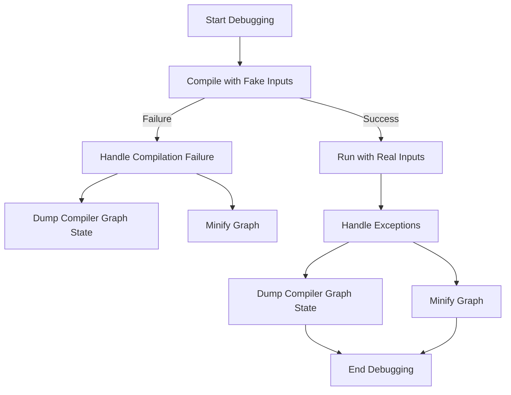

This document will cover the process of debugging graph compilation, which includes:

1. Attempting to compile the graph with fake inputs
2. Handling compilation failures
3. Running the compiled function with real inputs
4. Handling exceptions during the process.

Technical document: <SwmLink doc-title="Debugging Graph Compilation">[Debugging Graph Compilation](/.swm/debugging-graph-compilation.l3v9qua0.sw.md)</SwmLink>

# [Attempting to Compile the Graph with Fake Inputs](https://app.swimm.io/repos/Z2l0aHViJTNBJTNBcHl0b3JjaC1hdXRvZG9jcy1kZW1vJTNBJTNBU3dpbW0tRGVtbw==/docs/l3v9qua0#debug_wrapper)

The debugging process begins by attempting to compile the graph module using fake inputs. This step is crucial because it allows us to test the compilation process without needing real data, which might not be available or could be too large to handle efficiently during initial testing.

# [Handling Compilation Failures](https://app.swimm.io/repos/Z2l0aHViJTNBJTNBcHl0b3JjaC1hdXRvZG9jcy1kZW1vJTNBJTNBU3dpbW0tRGVtbw==/docs/l3v9qua0#dump_to_minify)

If the compilation with fake inputs fails, the system needs to handle this gracefully. One way to do this is by dumping the current state of the compiler graph. This involves saving the graph module and its arguments to a checkpoint directory. This step is essential for debugging because it allows developers to minify the graph and reproduce the issue with a smaller, more manageable graph.

# [Running the Compiled Function with Real Inputs](https://app.swimm.io/repos/Z2l0aHViJTNBJTNBcHl0b3JjaC1hdXRvZG9jcy1kZW1vJTNBJTNBU3dpbW0tRGVtbw==/docs/l3v9qua0#invoking-the-compiled-function)

Once the graph is successfully compiled, the next step is to run the compiled function with real inputs. This step ensures that the compiled function works correctly with actual data. It also helps in identifying any issues that might not have been apparent with fake inputs.

# [Handling Exceptions During the Process](https://app.swimm.io/repos/Z2l0aHViJTNBJTNBcHl0b3JjaC1hdXRvZG9jcy1kZW1vJTNBJTNBU3dpbW0tRGVtbw==/docs/l3v9qua0#exception-handling)

During the execution of the compiled function with real inputs, exceptions might occur. The system needs to handle these exceptions based on the configured reproduction level. For instance, it might dump the compiler graph state or the module to help with debugging. This step is crucial for ensuring that any issues encountered during the execution are logged and can be investigated further.

&nbsp;

*This is an auto-generated document by Swimm AI 🌊 and has not yet been verified by a human*

<SwmMeta version="3.0.0" repo-id="Z2l0aHViJTNBJTNBcHl0b3JjaC1hdXRvZG9jcy1kZW1vJTNBJTNBU3dpbW0tRGVtbw==" repo-name="pytorch-autodocs-demo">Powered by [Swimm](https://app.swimm.io/)</SwmMeta>
