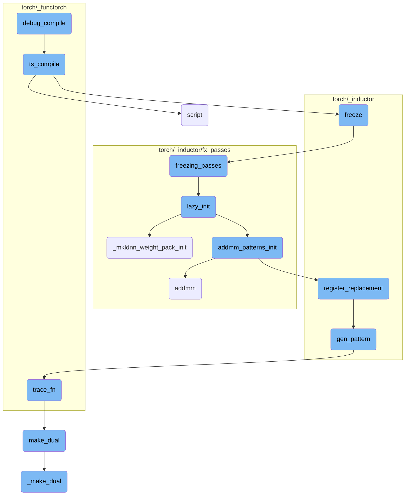
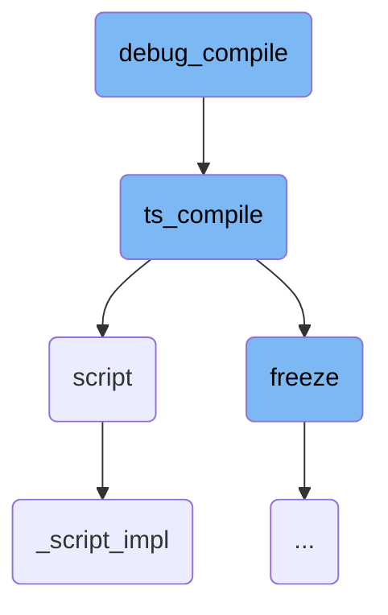
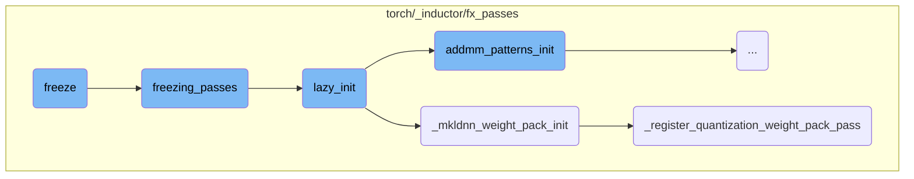
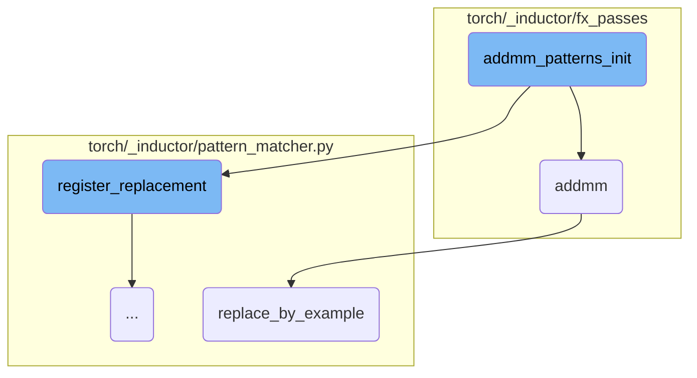
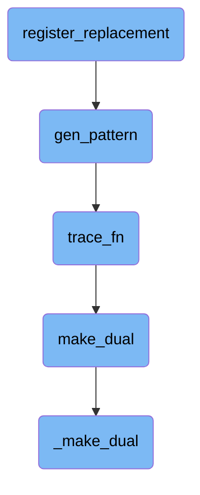

This document provides an overview of the `debug_compile` function, which is designed to assist in debugging the compilation process of an FX graph. The function saves the FX graph to a folder, prints instructions for minimizing the FX graph, and then compiles the graph using the `ts_compile` function. This process is crucial for debugging and optimizing the FX graph before it is compiled.

The `debug_compile` function helps in debugging the compilation of an FX graph. First, it saves the FX graph to a folder. Then, it prints out instructions that guide you on how to minimize the FX graph. Finally, it compiles the graph using another function called `ts_compile`. This entire process is essential for ensuring that the FX graph is optimized and free of errors before it gets compiled.

Here is a high level diagram of the flow, showing only the most important functions:



# Flow drill down

First, we'll zoom into this section of the flow:



<SwmSnippet path="/torch/_functorch/compilers.py" line="275">

---

## The debug_compile Function

The `debug_compile` function is designed to assist in debugging the compilation process of an FX graph. It saves the FX graph to a folder, prints instructions for minimizing the FX graph, and then compiles the graph using the `ts_compile` function. This function is crucial for debugging and optimizing the FX graph before it is compiled.

```python
def debug_compile(fx_g, inps):
    fx_g.to_folder("foo")
    print(
        f"""
##############################################################
# To minimize FX graph, copy and paste the below and run it  #
##############################################################

import torch
import torch.fx as fx
from functorch.compile import minifier, check_nvfuser_subprocess, check_nvfuser_correctness_subprocess

inps = {[(i.shape, i.dtype) for i in inps]}
inps = [torch.ones(shape, dtype=dtype, device='cuda') for (shape, dtype) in inps]
from foo import FxModule
mod = FxModule().cuda()

with torch.jit.fuser("fuser2"):
  # check_nvfuser_subprocess can be replaced with check_nvfuser_correctness_subprocess
  minifier(fx.symbolic_trace(mod), inps, check_nvfuser_subprocess)
"""
```

---

</SwmSnippet>

<SwmSnippet path="/torch/_functorch/compilers.py" line="55">

---

## The ts_compile Function

The `ts_compile` function takes an FX graph module and compiles it using the TorchScript compiler. It performs several transformations on the graph, such as stripping overloads and replacing certain operations. The function then scripts the graph, removes mutations, freezes the scripted model, and optimizes it for inference. This function is essential for converting the FX graph into an optimized TorchScript model.

```python
def ts_compile(fx_g: fx.GraphModule, inps) -> Callable:
    """
    Compiles the :attr:`fx_g` with Torchscript compiler.

    .. warning::
        This API is experimental and likely to change.

    Args:
        fx_g(fx.GraphModule): The input Fx graph module to be compiled.

    Returns:
        Torch scripted model.
    """

    with _disable_jit_autocast():
        strip_overloads(fx_g)

        for node in fx_g.graph.find_nodes(
            op="call_function", target=torch.ops.aten._to_copy
        ):
            if len(node.args) == 1 and len(node.kwargs) == 1 and "dtype" in node.kwargs:
```

---

</SwmSnippet>

<SwmSnippet path="/torch/jit/_script.py" line="1217">

---

## The script Function

The `script` function is responsible for converting a function or `nn.Module` into TorchScript code. It inspects the source code, compiles it using the TorchScript compiler, and returns a `ScriptModule` or `ScriptFunction`. This function is versatile and can handle various types of inputs, including functions, modules, dictionaries, and lists.

```python
def script(
    obj,
    optimize=None,
    _frames_up=0,
    _rcb=None,
    example_inputs: Union[List[Tuple], Dict[Callable, List[Tuple]], None] = None,
):
    r"""Script the function.

    Scripting a function or ``nn.Module`` will inspect the source code, compile
    it as TorchScript code using the TorchScript compiler, and return a :class:`ScriptModule` or
    :class:`ScriptFunction`. TorchScript itself is a subset of the Python language, so not all
    features in Python work, but we provide enough functionality to compute on
    tensors and do control-dependent operations. For a complete guide, see the
    :ref:`language-reference`.

    Scripting a dictionary or list copies the data inside it into a TorchScript instance than can be
    subsequently passed by reference between Python and TorchScript with zero copy overhead.

    ``torch.jit.script`` can be used as a function for modules, functions, dictionaries and lists
     and as a decorator ``@torch.jit.script`` for :ref:`torchscript-classes` and functions.
```

---

</SwmSnippet>

<SwmSnippet path="/torch/jit/_script.py" line="1086">

---

## The \_script_impl Function

The `_script_impl` function is the underlying implementation of the `script` function. It handles the actual process of scripting the provided object, whether it is a function, module, or class. This function also supports profile-directed type annotation using example inputs, making it a powerful tool for optimizing and scripting complex models.

```python
def _script_impl(
    obj,
    optimize=None,
    _frames_up=0,
    _rcb=None,
    example_inputs: Union[List[Tuple], Dict[Callable, List[Tuple]], None] = None,
):
    global type_trace_db

    if optimize is not None:
        warnings.warn(
            "`optimize` is deprecated and has no effect. "
            "Use `with torch.jit.optimized_execution()` instead",
            FutureWarning,
            stacklevel=3,
        )

    # No-op for modules, functions, class instances that are already scripted
    if isinstance(obj, RecursiveScriptClass):
        return obj
    if isinstance(obj, ScriptModule):
```

---

</SwmSnippet>

Now, lets zoom into this section of the flow:



<SwmSnippet path="/torch/_inductor/freezing.py" line="66">

---

## Freeze

The `freeze` function inlines parameters that are not mutated into constants and optimizes the graph through constant propagation and other techniques. It also discards the original parameters of the module for memory efficiency if enabled. This function is run in dynamo tracing post aot_autograd.

```python
def freeze(
    dynamo_gm: torch.fx.GraphModule,
    aot_autograd_gm: torch.fx.GraphModule,
    example_inputs: List[torch._subclasses.FakeTensor],
) -> Tuple[torch.fx.GraphModule, List[int]]:
    """
    Inlines parameters that are not mutated into constants and optimizes the graph through constant propagation
    and other techniques. If enabled, the function also discards the original parameters of the module for memory efficiency.

    Assumes that this function is run in dynamo tracing post aot_autograd.

    Args:
        dynamo_gm (torch.fx.GraphModule): The Dynamo constructed GraphModule.
        aot_autograd_gm (torch.fx.GraphModule): The aot_autograd constructed GraphModule to be frozen.
        example_inputs (List[torch.Tensor]): A list of example input tensors to be used in the freezing process.

    Returns:
        Tuple[torch.fx.GraphModule, List[int]]: A tuple containing the frozen GraphModule and a list of indices
        of the inputs that were preserved (not turned into constants).
    """
    # We have convert conv's weight to channels last which may meet error for .view
```

---

</SwmSnippet>

<SwmSnippet path="/torch/_inductor/fx_passes/freezing_patterns.py" line="36">

---

## Freezing Passes

The `freezing_passes` function applies several passes to the graph to optimize it further. This includes constant folding, binary folding, and applying specific patterns to the graph. It ensures that unnecessary nodes are removed and the graph is optimized for execution.

```python
def freezing_passes(gm: torch.fx.GraphModule, aot_example_inputs):
    """
    Passes that are applied to the graph to freeze pass.
    """

    from ..freezing import constant_fold

    lazy_init()
    # We need a few rounds of binary folding to get rid of all the
    # unnecessary nodes, but may need a good method to chose the rounds number.
    # works like: conv+binary+binary.
    binary_folding = counters["inductor"]["binary_folding"]
    fake_tensor_prop(gm, aot_example_inputs, True)

    torch._inductor.fx_passes.binary_folding.mark_mixed_dtype_allowed_convs(gm)
    for _ in range(4):
        constant_fold(gm)
        # Make sure meta['val'] is properly set for all nodes
        fake_tensor_prop(gm, aot_example_inputs, True)
        binary_folding_pass.apply(gm.graph)  # type: ignore[arg-type]
        # If we don't have binary folding, we don't need to run the pass again.
```

---

</SwmSnippet>

<SwmSnippet path="/torch/_inductor/fx_passes/freezing_patterns.py" line="87">

---

## Lazy Initialization

The `lazy_init` function initializes various components required for the freezing process. This includes initializing MKL-DNN weight packing and binary folding patterns.

```python
def lazy_init():
    if torch._C._has_mkldnn and config.cpp.weight_prepack:
        from .mkldnn_fusion import _mkldnn_weight_pack_init

        _mkldnn_weight_pack_init()

    from .binary_folding import binary_folding_init

    addmm_patterns_init()
    binary_folding_init()
```

---

</SwmSnippet>

<SwmSnippet path="/torch/_inductor/fx_passes/mkldnn_fusion.py" line="1262">

---

## MKL-DNN Weight Pack Initialization

The `_mkldnn_weight_pack_init` function registers the weight pack pass for MKL-DNN and recovers linear operations. It ensures that the weight packing is correctly set up for MKL-DNN optimizations.

```python
    def _mkldnn_weight_pack_init():
        if torch.backends.mkldnn.enabled and torch.backends.mkldnn.is_available():
            _register_weight_pack_pass()
            _recover_linear()
            _register_quantization_weight_pack_pass()
```

---

</SwmSnippet>

<SwmSnippet path="/torch/_inductor/fx_passes/quantization.py" line="2490">

---

## Register Quantization Weight Pack Pass

The `_register_quantization_weight_pack_pass` function registers various passes required for quantization weight packing. This includes dequant promotion, QConv weight prepack, and QLinear weight prepack.

```python
def _register_quantization_weight_pack_pass():
    # Step 1: Dequant promotion for int8-mixed-fp32/bf16
    _register_dequant_promotion()

    # Step 2: QConv weight prepack
    _register_qconv_weight_prepack()

    # Step 3: QLinear weight prepack
    _register_qlinear_weight_prepack()
```

---

</SwmSnippet>

Now, lets zoom into this section of the flow:



<SwmSnippet path="/torch/_inductor/fx_passes/freezing_patterns.py" line="116">

---

## addmm_patterns_init

The `addmm_patterns_init` function initializes patterns for matrix multiplication and addition operations. It first checks if CUDA is available and sets the device accordingly. It defines several patterns and their replacements, such as `matmul_fuse_pattern` and `matmul_replacement`, which fuse multiple matrix multiplications into a single operation and then split the result. The function also registers these patterns using `register_replacement`, ensuring that the replacements are applied during the compilation process. This optimization helps in improving the performance of matrix operations by reducing the number of separate operations.

```python
def addmm_patterns_init():
    if torch.cuda.is_available():
        # workaround https://github.com/pytorch/pytorch/issues/97894
        device = "cuda"
    else:
        device = "cpu"
    val = functools.partial(torch.empty, (10, 10), device=device, requires_grad=False)

    def check_concat_weights(match):
        weight_inputs = ["w1", "w2"]
        if "w3" in match.kwargs:
            weight_inputs.append("w3")

        equal_shape_inputs = [weight_inputs]

        if "b1" in match.kwargs:
            bias_inputs = ["b1", "b2"]
            if "b3" in match.kwargs:
                bias_inputs.append("b3")

            equal_shape_inputs.append(bias_inputs)
```

---

</SwmSnippet>

<SwmSnippet path="/torch/_inductor/fx_passes/freezing_patterns.py" line="150">

---

### matmul_fuse_pattern and matmul_replacement

The `matmul_fuse_pattern` function defines a pattern for fusing multiple matrix multiplications. The `matmul_replacement` function provides the replacement logic, which concatenates the weights and performs a single matrix multiplication, followed by splitting the result. This reduces the number of operations and improves performance.

```python
    def matmul_fuse_pattern(inp, w1, w2, w3):
        return (inp @ w1, inp @ w2, inp @ w3)

    def matmul_replacement(inp, w1, w2, w3):
        cat_t = torch.cat((w1, w2, w3), dim=1)
        mm = inp @ cat_t
        return mm.chunk(3, dim=1)

```

---

</SwmSnippet>

<SwmSnippet path="/torch/_inductor/fx_passes/freezing_patterns.py" line="186">

---

### addmm_fuse_pattern_second and addmm_fuse_replacement_second

The `addmm_fuse_pattern_second` function defines a pattern for fusing multiple `aten.addmm` operations. The `addmm_fuse_replacement_second` function provides the replacement logic, which concatenates the weights and biases, performs a single `aten.addmm` operation, and then splits the result. This optimization helps in reducing the number of separate `aten.addmm` operations.

```python
    def addmm_fuse_pattern_second(inp, w1, w2, w3, b1, b2, b3):
        return (
            aten.addmm(b1, inp, w1),
            aten.addmm(b2, inp, w2),
            aten.addmm(b3, inp, w3),
        )

    def addmm_fuse_replacement_second(inp, w1, w2, w3, b1, b2, b3):
        cat_w = torch.cat((w1, w2, w3), dim=1)
        cat_b = torch.cat((b1, b2, b3))
        return aten.addmm(cat_b, inp, cat_w).chunk(3, dim=1)
```

---

</SwmSnippet>

<SwmSnippet path="/torch/_inductor/fx_passes/post_grad.py" line="974">

---

## addmm

The `addmm` function is responsible for replacing a pattern match with a matrix multiplication and addition operation. It defines a replacement function `repl` that performs the `aten.addmm` operation and uses `replace_by_example` to apply this replacement in the computation graph. This ensures that the optimized operation is used during execution.

```python
def addmm(match, mat1, mat2, *, inp):
    def repl(inp, mat1, mat2):
        return aten.addmm(inp, mat1, mat2)

    match.replace_by_example(repl, [inp, mat1, mat2])
```

---

</SwmSnippet>

<SwmSnippet path="/torch/_inductor/pattern_matcher.py" line="224">

---

## replace_by_example

The `replace_by_example` function replaces a matched pattern in the computation graph with a specified replacement function. It uses tracing to generate the replacement graph and then applies this replacement in the original graph. This function is crucial for applying optimizations and ensuring that the computation graph uses the most efficient operations.

```python
    def replace_by_example(
        self,
        replacement_fn: ReplaceFn,
        args: Sequence[Any],
        trace_fn: Optional[TraceFn] = None,
        run_dce: bool = True,
    ) -> None:
        from torch._inductor.virtualized import V

        context = V.fake_mode if V.fake_mode is not None else contextlib.nullcontext

        with context:
            if trace_fn is None:
                trace_fn = functools.partial(fwd_only, run_dce=run_dce)
            replacement = trace_fn(
                replacement_fn, torch.fx.map_arg(args, lambda arg: arg.meta["val"])
            )
            ReplacementPatternEntry.replace_with_graph(
                self,
                self.ctx.graph,
                replacement,
```

---

</SwmSnippet>

Now, lets zoom into this section of the flow:



<SwmSnippet path="/torch/_inductor/pattern_matcher.py" line="1220">

---

## register_replacement

The function `register_replacement` is responsible for registering a replacement pattern in the pattern matcher. It ensures that shapes are correctly matched by ignoring certain types during the initial match.

```python
    def check_fn(match: Match) -> bool:
        """
        Often shapes get burned into the pattern, so our initial match ran with
        `ignore_types=(int, ...)`.
```

---

</SwmSnippet>

<SwmSnippet path="/torch/_inductor/pattern_matcher.py" line="1274">

---

The `search_fn_new` function is a helper within `register_replacement` that adjusts the arguments for the search function, ensuring that the correct subset of arguments is passed.

```python
                    def search_fn_new(*args_new: Any) -> Any:
                        return search_fn(*args_new[len(args_new) - len(args) :])
```

---

</SwmSnippet>

<SwmSnippet path="/torch/_inductor/pattern_matcher.py" line="1326">

---

The `normalize_args` function within `register_replacement` normalizes the arguments by extracting them from the keyword arguments, ensuring they are in the correct order for the pattern matching process.

```python
    def normalize_args(**kwargs: Any) -> List[Any]:
        args = []
        for name in argnames_static:
            args.append(kwargs.pop(name))
```

---

</SwmSnippet>

&nbsp;

*This is an auto-generated document by Swimm AI 🌊 and has not yet been verified by a human*

<SwmMeta version="3.0.0" repo-id="Z2l0aHViJTNBJTNBcHl0b3JjaC1hdXRvZG9jcy1kZW1vJTNBJTNBU3dpbW0tRGVtbw==" repo-name="pytorch-autodocs-demo"><sup>Powered by [Swimm](https://app.swimm.io/)</sup></SwmMeta>
