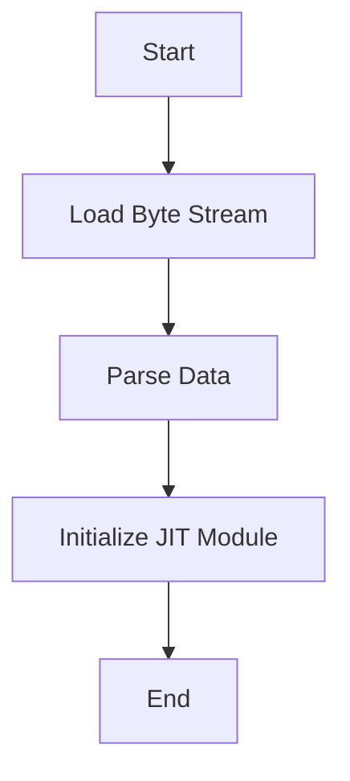

This document will cover the process of deserializing a JIT module from Flatbuffer data. We'll cover:

1. Loading the byte stream
2. Parsing the data
3. Initializing the JIT module

Technical document: <SwmLink doc-title="Deserializing JIT Module from Flatbuffer">[Deserializing JIT Module from Flatbuffer](/.swm/deserializing-jit-module-from-flatbuffer.sh33m5yu.sw.md)</SwmLink>

# [Loading the Byte Stream](https://app.swimm.io/repos/Z2l0aHViJTNBJTNBcHl0b3JjaC1hdXRvZG9jcy1kZW1vJTNBJTNBU3dpbW0tRGVtbw==/docs/sh33m5yu#loading-the-byte-stream)

The process begins by loading the byte stream of the Flatbuffer data. This involves reading the raw data from a file or a byte stream. The data is then prepared for parsing. This step is crucial as it ensures that the data is in the correct format and ready for the next stage.

# [Parsing the Data](https://app.swimm.io/repos/Z2l0aHViJTNBJTNBcHl0b3JjaC1hdXRvZG9jcy1kZW1vJTNBJTNBU3dpbW0tRGVtbw==/docs/sh33m5yu#parsing-and-initializing-jit-module)

Once the byte stream is loaded, the next step is to parse the data. This involves extracting the necessary information from the Flatbuffer format. The data is validated to ensure it is correctly formatted. This step is essential to ensure that the data can be correctly interpreted and used to initialize the JIT module.

# [Initializing the JIT Module](https://app.swimm.io/repos/Z2l0aHViJTNBJTNBcHl0b3JjaC1hdXRvZG9jcy1kZW1vJTNBJTNBU3dpbW0tRGVtbw==/docs/sh33m5yu#creating-jit-module-from-source-and-constants)

After parsing the data, the JIT module is initialized with the extracted information. This involves creating a module from the parsed source and constants. The module is then set up and made ready for use. This step is critical as it transforms the raw data into a usable JIT module that can be executed.

&nbsp;

*This is an auto-generated document by Swimm AI 🌊 and has not yet been verified by a human*

<SwmMeta version="3.0.0" repo-id="Z2l0aHViJTNBJTNBcHl0b3JjaC1hdXRvZG9jcy1kZW1vJTNBJTNBU3dpbW0tRGVtbw==" repo-name="pytorch-autodocs-demo">Powered by [Swimm](https://app.swimm.io/)</SwmMeta>
