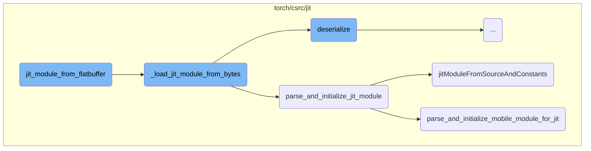
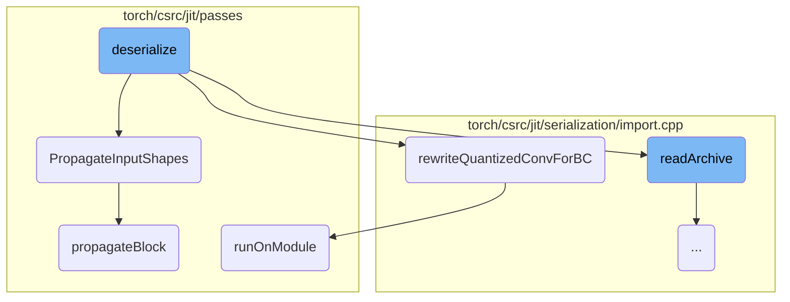

```mermaid
graph TD;
      subgraph torchcsrcjitserialization["torch/csrc/jit/serialization"]
a4ab282e7c5593db92c37af1111d82d51e89db2ff2ad71717254e3957096161a(readArchive):::mainFlowStyle --> dc4ab73d6c36e6b29142a024d63d9ad91df5b97878a680b91447a1e75db441ec(readArchiveAndTensors):::mainFlowStyle
end

subgraph torchcsrcjitserialization["torch/csrc/jit/serialization"]
dc4ab73d6c36e6b29142a024d63d9ad91df5b97878a680b91447a1e75db441ec(readArchiveAndTensors):::mainFlowStyle --> 264fa19be34b23a0a75c9526e8ae3eebbc629f352aa3e45769dae28633e9ee15(parse_ivalue):::mainFlowStyle
end

subgraph torchcsrcjitserialization["torch/csrc/jit/serialization"]
264fa19be34b23a0a75c9526e8ae3eebbc629f352aa3e45769dae28633e9ee15(parse_ivalue):::mainFlowStyle --> d977fb47d13cba935bdd57a4836e8d86eda08870034af022ed937ccdd3087566(run):::mainFlowStyle
end

subgraph torchcsrcjitserialization["torch/csrc/jit/serialization"]
d977fb47d13cba935bdd57a4836e8d86eda08870034af022ed937ccdd3087566(run):::mainFlowStyle --> 83bd1ab1ef67dec0622ed2a832fd674c6b5bfc6aa47d2e8d38521f39603b5313(readInstruction):::mainFlowStyle
end

subgraph torchcsrcjitserialization["torch/csrc/jit/serialization"]
83bd1ab1ef67dec0622ed2a832fd674c6b5bfc6aa47d2e8d38521f39603b5313(readInstruction):::mainFlowStyle --> d6015cf0891b43925aa18dcc5fc6b73e78f5288228c655b45f3b6e5d4794412b(readGlobal):::mainFlowStyle
end

subgraph torchcsrcjitserialization["torch/csrc/jit/serialization"]
d6015cf0891b43925aa18dcc5fc6b73e78f5288228c655b45f3b6e5d4794412b(readGlobal):::mainFlowStyle --> d1b401222faff66e48a376fbb86fbebeba39f180ac3acf28284a21d106fcfe3f(rebuildRRef):::mainFlowStyle
end

subgraph torchcsrcdistributedrpc["torch/csrc/distributed/rpc"]
d1b401222faff66e48a376fbb86fbebeba39f180ac3acf28284a21d106fcfe3f(rebuildRRef):::mainFlowStyle --> 38415e855af29cbaea761947bae237b18156b25fdfbf30ec84f9f965c474bdbd(notifyOwnerAndParentOfFork):::mainFlowStyle
end

subgraph torchcsrcdistributedrpc["torch/csrc/distributed/rpc"]
38415e855af29cbaea761947bae237b18156b25fdfbf30ec84f9f965c474bdbd(notifyOwnerAndParentOfFork):::mainFlowStyle --> 137102a08a7d1bf0dc6fb88c307e7929eb10c90d7d90acf5680f638a79492966(finishForkRequest):::mainFlowStyle
end

subgraph torchcsrcdistributedrpc["torch/csrc/distributed/rpc"]
137102a08a7d1bf0dc6fb88c307e7929eb10c90d7d90acf5680f638a79492966(finishForkRequest):::mainFlowStyle --> 06e23d4cc6309e2970575da3c78c61dd79bc30f031cfd057ac8a22d020a629ef(sendWithRetries):::mainFlowStyle
end

subgraph torchcsrcdistributedrpc["torch/csrc/distributed/rpc"]
06e23d4cc6309e2970575da3c78c61dd79bc30f031cfd057ac8a22d020a629ef(sendWithRetries):::mainFlowStyle --> bb976d64e73d7a00804a2cb58f6d524656780ab2e5fae2e9ba0e9368c915a915(send):::mainFlowStyle
end

subgraph torchcsrcdistributedrpc["torch/csrc/distributed/rpc"]
bb976d64e73d7a00804a2cb58f6d524656780ab2e5fae2e9ba0e9368c915a915(send):::mainFlowStyle --> d8f42a3956f98c9d84294ea2a0a2fa6f947ec8c2f115679ba99482a92410eb02(pipeWrite):::mainFlowStyle
end

subgraph torchcsrcdistributedrpc["torch/csrc/distributed/rpc"]
d8f42a3956f98c9d84294ea2a0a2fa6f947ec8c2f115679ba99482a92410eb02(pipeWrite):::mainFlowStyle --> bed1f86f42324ea75bc03516e81beb69099400218a7e6fad08f1ad003cf6ab4d(tensorpipeSerialize):::mainFlowStyle
end

subgraph torchcsrcjitserialization["torch/csrc/jit/serialization"]
bed1f86f42324ea75bc03516e81beb69099400218a7e6fad08f1ad003cf6ab4d(tensorpipeSerialize):::mainFlowStyle --> 23776825fa1f381e4a5fdb971565004fbb42cbdb44836b00b9d3a94fe5fe600e(pushIValue):::mainFlowStyle
end

subgraph torchcsrcjitserialization["torch/csrc/jit/serialization"]
23776825fa1f381e4a5fdb971565004fbb42cbdb44836b00b9d3a94fe5fe600e(pushIValue):::mainFlowStyle --> 9c792c27c5d93865a0a5ec747a901a1396efc7827842eb673729b5bd97d62e6c(pushIValueImpl):::mainFlowStyle
end


      classDef mainFlowStyle color:#000000,fill:#7CB9F4
classDef rootsStyle color:#000000,fill:#00FFF4
classDef Style1 color:#000000,fill:#00FFAA
classDef Style2 color:#000000,fill:#FFFF00
classDef Style3 color:#000000,fill:#AA7CB9
```

This document explains the process of deserializing a JIT module from Flatbuffer data. The process involves several steps, including loading the byte stream, parsing the data, and initializing the JIT module.

The flow starts by loading the byte stream of the Flatbuffer data. This data is then parsed to extract the necessary information. After parsing, the JIT module is initialized with the extracted data, making it ready for use.

Here is a high level diagram of the flow, showing only the most important functions:

```mermaid
graph TD;
      subgraph torchcsrcjitserialization["torch/csrc/jit/serialization"]
91501f549fbaafad1ff4804020d576535baef3051b5fa75e2b12c2254e83b7a2(jit_module_from_flatbuffer):::mainFlowStyle --> ecdc313f00aa059149ede21b3c166a1ec8903b8cfac72f549d517e7e8d10e28f(_load_jit_module_from_bytes):::mainFlowStyle
end

subgraph torchcsrcjitserialization["torch/csrc/jit/serialization"]
ecdc313f00aa059149ede21b3c166a1ec8903b8cfac72f549d517e7e8d10e28f(_load_jit_module_from_bytes):::mainFlowStyle --> 1d1e06558a0856dfc5b7765130ef34d14851c7900865897edfd3691eace94b29(parse_and_initialize_jit_module)
end

subgraph torchcsrcjitserialization["torch/csrc/jit/serialization"]
ecdc313f00aa059149ede21b3c166a1ec8903b8cfac72f549d517e7e8d10e28f(_load_jit_module_from_bytes):::mainFlowStyle --> c0bb980c714ba84c62bb2527ae5485b4166026e2c3c334ea4786c5efd07376d9(deserialize):::mainFlowStyle
end

subgraph torchcsrcjitpassesshapeanalysiscpp["torch/csrc/jit/passes/shape_analysis.cpp"]
c0bb980c714ba84c62bb2527ae5485b4166026e2c3c334ea4786c5efd07376d9(deserialize):::mainFlowStyle --> 1a9828465d96f90035b8b2a04d8ae79b73be5c02ae9caace4e804db703446dbf(PropagateInputShapes)
end

subgraph torchcsrcjitserialization["torch/csrc/jit/serialization"]
c0bb980c714ba84c62bb2527ae5485b4166026e2c3c334ea4786c5efd07376d9(deserialize):::mainFlowStyle --> cb8521ec0d4f8bcfef2f7f991ddee049eb42b0c46e6dbd01790421903ae51a9b(rewriteQuantizedConvForBC)
end

subgraph torchcsrcjitserialization["torch/csrc/jit/serialization"]
c0bb980c714ba84c62bb2527ae5485b4166026e2c3c334ea4786c5efd07376d9(deserialize):::mainFlowStyle --> a4ab282e7c5593db92c37af1111d82d51e89db2ff2ad71717254e3957096161a(readArchive):::mainFlowStyle
end

subgraph torchcsrcjitserialization["torch/csrc/jit/serialization"]
a4ab282e7c5593db92c37af1111d82d51e89db2ff2ad71717254e3957096161a(readArchive):::mainFlowStyle --> dc4ab73d6c36e6b29142a024d63d9ad91df5b97878a680b91447a1e75db441ec(readArchiveAndTensors):::mainFlowStyle
end

subgraph torchcsrcjitserialization["torch/csrc/jit/serialization"]
dc4ab73d6c36e6b29142a024d63d9ad91df5b97878a680b91447a1e75db441ec(readArchiveAndTensors):::mainFlowStyle --> 264fa19be34b23a0a75c9526e8ae3eebbc629f352aa3e45769dae28633e9ee15(parse_ivalue):::mainFlowStyle
end

subgraph torchcsrcjitserialization["torch/csrc/jit/serialization"]
264fa19be34b23a0a75c9526e8ae3eebbc629f352aa3e45769dae28633e9ee15(parse_ivalue):::mainFlowStyle --> d977fb47d13cba935bdd57a4836e8d86eda08870034af022ed937ccdd3087566(run):::mainFlowStyle
end

subgraph torchcsrcjitserialization["torch/csrc/jit/serialization"]
d977fb47d13cba935bdd57a4836e8d86eda08870034af022ed937ccdd3087566(run):::mainFlowStyle --> 83bd1ab1ef67dec0622ed2a832fd674c6b5bfc6aa47d2e8d38521f39603b5313(readInstruction):::mainFlowStyle
end

subgraph torchcsrcjitserialization["torch/csrc/jit/serialization"]
83bd1ab1ef67dec0622ed2a832fd674c6b5bfc6aa47d2e8d38521f39603b5313(readInstruction):::mainFlowStyle --> d6015cf0891b43925aa18dcc5fc6b73e78f5288228c655b45f3b6e5d4794412b(readGlobal):::mainFlowStyle
end

subgraph torchcsrcjitserialization["torch/csrc/jit/serialization"]
d6015cf0891b43925aa18dcc5fc6b73e78f5288228c655b45f3b6e5d4794412b(readGlobal):::mainFlowStyle --> d1b401222faff66e48a376fbb86fbebeba39f180ac3acf28284a21d106fcfe3f(rebuildRRef):::mainFlowStyle
end

subgraph torchcsrcdistributedrpc["torch/csrc/distributed/rpc"]
d1b401222faff66e48a376fbb86fbebeba39f180ac3acf28284a21d106fcfe3f(rebuildRRef):::mainFlowStyle --> 38415e855af29cbaea761947bae237b18156b25fdfbf30ec84f9f965c474bdbd(notifyOwnerAndParentOfFork):::mainFlowStyle
end

subgraph torchcsrcdistributedrpc["torch/csrc/distributed/rpc"]
38415e855af29cbaea761947bae237b18156b25fdfbf30ec84f9f965c474bdbd(notifyOwnerAndParentOfFork):::mainFlowStyle --> 137102a08a7d1bf0dc6fb88c307e7929eb10c90d7d90acf5680f638a79492966(finishForkRequest):::mainFlowStyle
end

subgraph torchcsrcdistributedrpc["torch/csrc/distributed/rpc"]
137102a08a7d1bf0dc6fb88c307e7929eb10c90d7d90acf5680f638a79492966(finishForkRequest):::mainFlowStyle --> 06e23d4cc6309e2970575da3c78c61dd79bc30f031cfd057ac8a22d020a629ef(sendWithRetries):::mainFlowStyle
end

subgraph torchcsrcdistributedrpc["torch/csrc/distributed/rpc"]
06e23d4cc6309e2970575da3c78c61dd79bc30f031cfd057ac8a22d020a629ef(sendWithRetries):::mainFlowStyle --> bb976d64e73d7a00804a2cb58f6d524656780ab2e5fae2e9ba0e9368c915a915(send):::mainFlowStyle
end

subgraph torchcsrcdistributedrpc["torch/csrc/distributed/rpc"]
bb976d64e73d7a00804a2cb58f6d524656780ab2e5fae2e9ba0e9368c915a915(send):::mainFlowStyle --> d8f42a3956f98c9d84294ea2a0a2fa6f947ec8c2f115679ba99482a92410eb02(pipeWrite):::mainFlowStyle
end

subgraph torchcsrcdistributedrpc["torch/csrc/distributed/rpc"]
d8f42a3956f98c9d84294ea2a0a2fa6f947ec8c2f115679ba99482a92410eb02(pipeWrite):::mainFlowStyle --> bed1f86f42324ea75bc03516e81beb69099400218a7e6fad08f1ad003cf6ab4d(tensorpipeSerialize):::mainFlowStyle
end

subgraph torchcsrcjitserialization["torch/csrc/jit/serialization"]
bed1f86f42324ea75bc03516e81beb69099400218a7e6fad08f1ad003cf6ab4d(tensorpipeSerialize):::mainFlowStyle --> 23776825fa1f381e4a5fdb971565004fbb42cbdb44836b00b9d3a94fe5fe600e(pushIValue):::mainFlowStyle
end

subgraph torchcsrcjitserialization["torch/csrc/jit/serialization"]
23776825fa1f381e4a5fdb971565004fbb42cbdb44836b00b9d3a94fe5fe600e(pushIValue):::mainFlowStyle --> 9c792c27c5d93865a0a5ec747a901a1396efc7827842eb673729b5bd97d62e6c(pushIValueImpl):::mainFlowStyle
end


      classDef mainFlowStyle color:#000000,fill:#7CB9F4
classDef rootsStyle color:#000000,fill:#00FFF4
classDef Style1 color:#000000,fill:#00FFAA
classDef Style2 color:#000000,fill:#FFFF00
classDef Style3 color:#000000,fill:#AA7CB9
```



# Flow drill down

First, we'll zoom into this section of the flow:



<SwmSnippet path="/torch/csrc/jit/serialization/import.cpp" line="518">

---

## Deserializing JIT Module

The function `_load_jit_module_from_bytes` is responsible for deserializing the JIT module from a byte stream. It checks the format of the data and calls the appropriate function to handle the deserialization. If the format is recognized as Flatbuffer, it calls `parse_and_initialize_jit_module`.

```c++
Module _load_jit_module_from_bytes(
    const std::shared_ptr<char>& data,
    size_t size,
    std::shared_ptr<CompilationUnit> cu,
    std::optional<c10::Device> device,
    ExtraFilesMap& extra_files,
    bool restore_shapes) {
  TORCH_CHECK(size >= kFileFormatHeaderSize, "Unrecognized data format");
  auto format = getFileFormat(data.get());
  switch (format) {
    case FileFormat::FlatbufferFileFormat: {
      return parse_and_initialize_jit_module(data, size, extra_files, device);
    }
    case FileFormat::ZipFileFormat: {
      auto rai = std::make_unique<MemoryReadAdapter>(data.get(), size);
      auto reader = std::make_unique<PyTorchStreamReader>(std::move(rai));
      ScriptModuleDeserializer deserializer(std::move(cu), std::move(reader));
      return deserializer.deserialize(device, extra_files, restore_shapes);
    }

    default:
```

---

</SwmSnippet>

<SwmSnippet path="/torch/csrc/jit/serialization/import.cpp" line="323">

---

## Parsing and Initializing JIT Module

The function `parse_and_initialize_jit_module` parses the data and initializes the JIT module. It first populates the upgraders graph map, then calls `parse_and_initialize_mobile_module_for_jit` to parse the mobile module. Finally, it creates a JIT module from the parsed source and constants using `jitModuleFromSourceAndConstants`.

```c++
Module parse_and_initialize_jit_module(
    const std::shared_ptr<char>& data,
    size_t size,
    ExtraFilesMap& extra_files,
    std::optional<at::Device> device) {
  populate_upgraders_graph_map();
  ExtraFilesMap jit_files;
  std::vector<IValue> jit_constants;
  mobile::Module mobilem = parse_and_initialize_mobile_module_for_jit(
      data.get(), size, jit_files, jit_constants, device, &extra_files);

  Module m = jitModuleFromSourceAndConstants(
      mobilem._ivalue(),
      jit_files,
      jit_constants,
      static_cast<int32_t>(mobilem.bytecode_version()));
  m.set_delete_memory(data);
  return m;
}
```

---

</SwmSnippet>

<SwmSnippet path="/torch/csrc/jit/serialization/import.cpp" line="585">

---

### Creating JIT Module from Source and Constants

The function `jitModuleFromSourceAndConstants` creates a JIT module from the given source and constants. It uses a `SourceImporter` to import the source and resolve types, then recreates the object from the IValue and returns the module.

```c++
Module jitModuleFromSourceAndConstants(
    const IValue& ivalue,
    const ExtraFilesMap& source,
    const std::vector<IValue>& constants,
    int32_t version) {
  auto compilation_unit = std::make_shared<CompilationUnit>();
  SourceImporter importer(
      compilation_unit,
      &constants,
      [&source](const std::string& qualifier) -> std::shared_ptr<Source> {
        auto source_iter = source.find(qualifier);
        if (source_iter == source.end()) {
          return nullptr;
        }
        return std::make_shared<Source>(
            source_iter->second, qualifier, 1, nullptr, Source::COPIES_STRING);
      },
      version);
  auto type_resolver = [&](const c10::QualifiedName& qn) {
    auto cls = importer.loadType(qn);
    return c10::StrongTypePtr(compilation_unit, std::move(cls));
```

---

</SwmSnippet>

<SwmSnippet path="/torch/csrc/jit/mobile/flatbuffer_loader.cpp" line="802">

---

## Parsing and Initializing Mobile Module for JIT

The function `parse_and_initialize_mobile_module_for_jit` parses the mobile module from the flatbuffer data. It validates the flatbuffer module, parses it using a `FlatbufferLoader`, and extracts JIT source and constants.

```c++
mobile::Module parse_and_initialize_mobile_module_for_jit(
    void* data,
    size_t size,
    ExtraFilesMap& jit_sources,
    std::vector<IValue>& jit_constants,
    std::optional<at::Device>,
    ExtraFilesMap* extra_files) {
  TORCH_CHECK(
      mobile::serialization::ModuleBufferHasIdentifier(data), "Format error");
  // TODO(T128189662): Enforce that data is aligned to
  // kFlatbufferDataAlignmentBytes, and add unit tests.

  // Validate Flatbuffer module before parsing.
  flatbuffers::Verifier verifier(reinterpret_cast<uint8_t*>(data), size);
  TORCH_CHECK(
      mobile::serialization::VerifyModuleBuffer(verifier),
      "Malformed Flatbuffer module");

  FlatbufferLoader loader;
  auto* flatbuffer_module = mobile::serialization::GetMutableModule(data);
  auto* end = static_cast<char*>(data) + size;
```

---

</SwmSnippet>

<SwmSnippet path="/torch/jit/_serialization.py" line="190">

---

## Wrapping C++ Module

The function `jit_module_from_flatbuffer` wraps the C++ module loaded from a flatbuffer. It checks if the input is a file path or a byte stream and calls the appropriate C++ function to load the JIT module, then wraps it in a Python module.

```python
def jit_module_from_flatbuffer(f):
    if isinstance(f, (str, os.PathLike)):
        f = os.fspath(f)
        return wrap_cpp_module(torch._C._load_jit_module_from_file(f))
    else:
        return wrap_cpp_module(torch._C._load_jit_module_from_bytes(f.read()))
```

---

</SwmSnippet>

Now, lets zoom into this section of the flow:



<SwmSnippet path="/torch/csrc/jit/serialization/import.cpp" line="248">

---

## Deserialization Process

The `deserialize` function is responsible for converting serialized data back into a usable module. It begins by populating the upgraders map and setting the device. It then loads extra files and constants, and reads the main data archive to create a module. The function also handles legacy model formats and restores input shapes if necessary.

```c++
Module ScriptModuleDeserializer::deserialize(
    std::optional<at::Device> device,
    ExtraFilesMap& extra_files,
    bool restore_shapes) {
  // we populate the upgraders map before any load starts
  populate_upgraders_graph_map();

  C10_LOG_API_USAGE_ONCE("torch.jit.load");
  device_ = device;
  // Load extra files.
  for (const auto& kv : extra_files) {
    const std::string& key = "extra/" + kv.first;
    if (reader_->hasRecord(key)) {
      auto [meta_ptr, meta_size] = reader_->getRecord(key);
      extra_files[kv.first] =
          std::string(static_cast<char*>(meta_ptr.get()), meta_size);
    }
  }
  if (reader_->hasRecord("model.json") && code_prefix_ == "code/") {
    AT_ERROR("Legacy model format is not supported on mobile.");
  }
```

---

</SwmSnippet>

<SwmSnippet path="/torch/csrc/jit/passes/shape_analysis.cpp" line="2147">

---

### Propagate Input Shapes

The `PropagateInputShapes` function is used to propagate the shapes of the input tensors through the graph. This is essential for ensuring that the shapes of tensors are correctly inferred throughout the model.

```c++
void PropagateInputShapes(const std::shared_ptr<Graph>& graph) {
  ShapePropagator(graph).propagateBlock(graph->block());
}
```

---

</SwmSnippet>

<SwmSnippet path="/torch/csrc/jit/serialization/import.cpp" line="189">

---

### Rewrite Quantized Convolution for Backward Compatibility

The `rewriteQuantizedConvForBC` function updates the graph of the module to replace old quantized convolution operations with new ones. This ensures backward compatibility with older models that use deprecated quantized convolution operations.

```c++
void rewriteQuantizedConvForBC(const Module& module) {
  const std::string& old_quantized_conv2d = R"(
graph(%x, %packed_params, %stride, %padding, %dilation, %groups, %r_scale, %r_zero_point):
         %r = quantized::conv2d(%x, %packed_params, %stride, %padding, %dilation, %groups, %r_scale, %r_zero_point)
         return (%r) )";

  const std::string& old_quantized_conv2d_relu = R"(
graph(%x, %packed_params, %stride, %padding, %dilation, %groups, %r_scale, %r_zero_point):
         %r = quantized::conv2d_relu(%x, %packed_params, %stride, %padding, %dilation, %groups, %r_scale, %r_zero_point)
         return (%r) )";

  const std::string& old_quantized_conv3d = R"(
graph(%x, %packed_params, %stride, %padding, %dilation, %groups, %r_scale, %r_zero_point):
         %r = quantized::conv3d(%x, %packed_params, %stride, %padding, %dilation, %groups, %r_scale, %r_zero_point)
         return (%r) )";

  const std::string& old_quantized_conv3d_relu = R"(
graph(%x, %packed_params, %stride, %padding, %dilation, %groups, %r_scale, %r_zero_point):
         %r = quantized::conv3d_relu(%x, %packed_params, %stride, %padding, %dilation, %groups, %r_scale, %r_zero_point)
         return (%r) )";

```

---

</SwmSnippet>

<SwmSnippet path="/torch/csrc/jit/passes/subgraph_rewrite.cpp" line="62">

---

### Run on Module

The `runOnModule` function applies graph rewriting patterns to all methods in the module. This is part of the process to update the module's graph to a newer format or to optimize it.

```c++
Module SubgraphRewriter::runOnModule(const Module& module) {
  nodes_to_delete_.clear();
  for (const auto& m : module.get_methods()) {
    auto g = toGraphFunction(m.function()).graph();
    runOnGraph(g);
  }
  return module;
}
```

---

</SwmSnippet>

<SwmSnippet path="/torch/csrc/jit/passes/shape_analysis.cpp" line="59">

---

### Propagate Block

The `propagateBlock` function iterates over all nodes in a block and propagates their shapes. It handles exceptions and ensures that any errors in shape propagation are reported.

```c++
void PropertyPropBase::propagateBlock(Block* block, bool insert_expands) {
  for (Node* node : block->nodes()) {
    try {
      propagateNode(node, insert_expands);
    } catch (propagation_error& e) {
      setUnshapedType(node);
    } catch (std::exception& e) {
      throw(
          ErrorReport(node->sourceRange())
          << ExceptionMessage(e)
          << "\nThe above operation failed shape propagation in this context");
    }
  }
}
```

---

</SwmSnippet>

Now, lets zoom into this section of the flow:



<SwmSnippet path="/torch/csrc/jit/serialization/import.cpp" line="171">

---

## Deserializing and reconstructing data from archives

The `readArchive` function is responsible for initiating the deserialization process of an archive. It sets up a type resolver and calls `readArchiveAndTensors` to handle the actual reading and deserialization of the archive and its associated tensors.

```c++
IValue ScriptModuleDeserializer::readArchive(const std::string& archive_name) {
  auto type_resolver = [&](const c10::QualifiedName& qn) {
    auto cls = source_importer_.loadType(qn);
    return c10::StrongTypePtr(compilation_unit_, std::move(cls));
  };

  return readArchiveAndTensors(
      /*archive_name=*/archive_name,
      /*pickle_prefix=*/pickle_dir_prefix_,
      /*tensor_prefix=*/tensor_dir_prefix_,
      type_resolver,
      ObjLoaderFunc,
      device_,
      *reader_,
      nullptr,
      storage_context_);
}
```

---

</SwmSnippet>

<SwmSnippet path="/torch/csrc/jit/serialization/import_read.cpp" line="8">

---

The `readArchiveAndTensors` function reads the archive's pickle file and tensor data. It uses a `Unpickler` to parse the data and reconstruct the original IValue objects. This function is crucial for converting the serialized data back into usable objects.

```c++
IValue readArchiveAndTensors(
    const std::string& archive_name,
    const std::string& pickle_prefix,
    const std::string& tensor_prefix,
    std::optional<TypeResolver> type_resolver,
    std::optional<ObjLoader> obj_loader,
    std::optional<at::Device> device,
    caffe2::serialize::PyTorchStreamReader& stream_reader,
    c10::TypePtr (*type_parser)(const std::string&),
    std::shared_ptr<DeserializationStorageContext> storage_context) {
  std::string picklename = pickle_prefix + archive_name + ".pkl";
  at::DataPtr pickle_ptr;
  size_t pickle_size = 0;
  std::tie(pickle_ptr, pickle_size) = stream_reader.getRecord(picklename);

  size_t bytes_read = 0;
  auto data = reinterpret_cast<const char*>(pickle_ptr.get());
  auto reader = [&](char* buffer, size_t len) -> size_t {
    if (bytes_read >= pickle_size) {
      return 0;
    }
```

---

</SwmSnippet>

<SwmSnippet path="/torch/csrc/jit/serialization/unpickler.cpp" line="206">

---

The `parse_ivalue` function in the `Unpickler` class is called to parse the IValue from the deserialized data. It ensures that the stack contains exactly one element, which is the reconstructed IValue.

```c++
IValue Unpickler::parse_ivalue() {
  run();
  TORCH_CHECK(
      stack_.size() == 1,
      "Unpickler expected 1 element on the stack, but found ",
      stack_.size());
  if (version_ <= 2) {
    // See [type tag serialization]
    restoreAccurateTypeTagsIfPossible(stack_[0]);
  }
  return stack_[0];
}
```

---

</SwmSnippet>

<SwmSnippet path="/torch/csrc/jit/serialization/unpickler.cpp" line="240">

---

The `run` function in the `Unpickler` class processes the opcodes in the pickle data. It reads instructions and handles them accordingly until it encounters a STOP opcode, indicating the end of the pickle data.

```c++
void Unpickler::run() {
  // Expect a PROTO opcode and protocol number at the start of blob
  auto opcode = readOpCode();
  TORCH_CHECK(
      opcode == PickleOpCode::PROTO,
      "Expected PROTO opcode at the start"
      " of pickle archive, found ",
      int(static_cast<uint8_t>(opcode)));
  uint8_t protocol = read<uint8_t>();
  TORCH_CHECK(
      protocol == 2,
      "Only Pickle protocol 2 is supported, found protocol = ",
      protocol);

  while (true) {
    PickleOpCode opcode = readInstruction();
    if (opcode == PickleOpCode::STOP) {
      return;
    }
  }
}
```

---

</SwmSnippet>

<SwmSnippet path="/torch/csrc/jit/serialization/unpickler.cpp" line="297">

---

The `readInstruction` function reads and processes individual opcodes from the pickle data. It handles various opcodes such as EMPTY_LIST, EMPTY_TUPLE, BINPUT, and more, reconstructing the corresponding IValue objects and pushing them onto the stack.

```c++
PickleOpCode Unpickler::readInstruction() {
  auto opcode = readOpCode();
  switch (opcode) {
    case PickleOpCode::EMPTY_LIST: {
      stack_.emplace_back(c10::impl::GenericList(AnyType::get()));
    } break;
    case PickleOpCode::EMPTY_TUPLE: {
      if (empty_tuple_.isNone()) {
        // we only need one object, since tuples are not mutable.
        empty_tuple_ = c10::ivalue::Tuple::create(std::vector<IValue>());
      }
      stack_.emplace_back(empty_tuple_);
    } break;
    case PickleOpCode::BINPUT: {
      size_t memo_id = read<uint8_t>();
      setInput(memo_id);
    } break;
    case PickleOpCode::LONG_BINPUT: {
      TORCH_CHECK(
          std::numeric_limits<size_t>::max() >=
              std::numeric_limits<uint32_t>::max(),
```

---

</SwmSnippet>

&nbsp;

*This is an auto-generated document by Swimm AI 🌊 and has not yet been verified by a human*

<SwmMeta version="3.0.0" repo-id="Z2l0aHViJTNBJTNBcHl0b3JjaC1hdXRvZG9jcy1kZW1vJTNBJTNBU3dpbW0tRGVtbw==" repo-name="pytorch-autodocs-demo"><sup>Powered by [Swimm](https://app.swimm.io/)</sup></SwmMeta>
