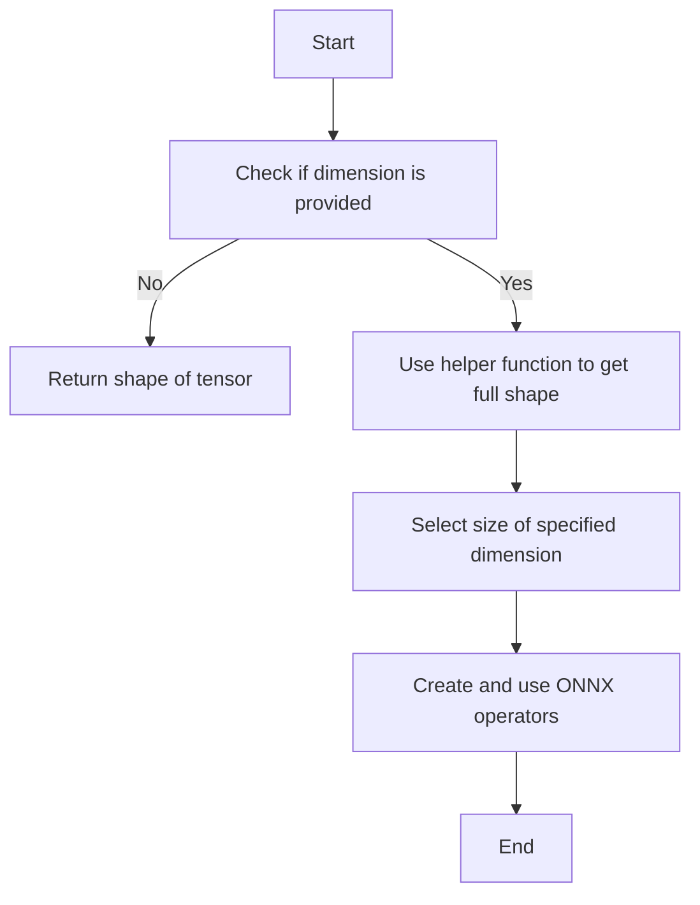

This document will cover the process of determining the size of a tensor, which includes:

1. Checking if a specific dimension is provided
2. Using helper functions to compute the size along a specific dimension
3. Extracting the size using ONNX operators.

Technical document: <SwmLink doc-title="Determining Tensor Size">[Determining Tensor Size](/.swm/determining-tensor-size.wua16vmt.sw.md)</SwmLink>

# [Checking if a specific dimension is provided](https://app.swimm.io/repos/Z2l0aHViJTNBJTNBcHl0b3JjaC1hdXRvZG9jcy1kZW1vJTNBJTNBU3dpbW0tRGVtbw==/docs/wua16vmt#determining-the-size-of-a-tensor)

The process begins by checking if a specific dimension is provided. If no dimension is specified, the system will return the overall shape of the tensor. This is important because it allows the user to understand the general structure of the tensor without focusing on a specific dimension.

# [Using helper functions to compute the size along a specific dimension](https://app.swimm.io/repos/Z2l0aHViJTNBJTNBcHl0b3JjaC1hdXRvZG9jcy1kZW1vJTNBJTNBU3dpbW0tRGVtbw==/docs/wua16vmt#helper-function-for-size)

If a dimension is specified, the system uses a helper function to compute the size along that specific dimension. This involves obtaining the full shape of the tensor first. The helper function then selects the size of the specified dimension. This step is crucial for users who need to understand the size of the tensor in a particular dimension, which can be important for various operations and optimizations.

# [Extracting the size using ONNX operators](https://app.swimm.io/repos/Z2l0aHViJTNBJTNBcHl0b3JjaC1hdXRvZG9jcy1kZW1vJTNBJTNBU3dpbW0tRGVtbw==/docs/wua16vmt#selecting-a-dimension)

To extract the size of the specified dimension, the system uses ONNX operators. These operators gather the required information from the tensor's shape. This step ensures that the size information is accurately extracted and can be used for further processing or analysis. The use of ONNX operators standardizes the process and makes it compatible with other ONNX-based tools and frameworks.

&nbsp;

*This is an auto-generated document by Swimm AI 🌊 and has not yet been verified by a human*

<SwmMeta version="3.0.0" repo-id="Z2l0aHViJTNBJTNBcHl0b3JjaC1hdXRvZG9jcy1kZW1vJTNBJTNBU3dpbW0tRGVtbw==" repo-name="pytorch-autodocs-demo">Powered by [Swimm](https://app.swimm.io/)</SwmMeta>
