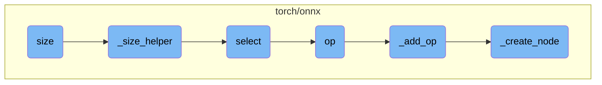

This document explains the process of determining the size of a tensor. It covers the main function responsible for this task and the helper functions that assist in computing the size along a specific dimension. The document also describes how the size is extracted using ONNX operators.

The process starts with a function that checks if a specific dimension is provided. If not, it returns the shape of the tensor. If a dimension is specified, it uses a helper function to get the full shape of the tensor and then selects the size of the specified dimension. This involves creating and using ONNX operators to gather the required information.

# Flow drill down



<SwmSnippet path="/torch/onnx/symbolic_opset11.py" line="855">

---

## Determining the Size of a Tensor

The `size` function is the entry point for determining the size of a tensor. If the dimension (`dim`) is not specified, it returns the shape of the tensor. Otherwise, it delegates the task to `_size_helper`.

```python
def size(g: jit_utils.GraphContext, self, dim=None):
    if dim is None:
        return g.op("Shape", self)
    return symbolic_helper._size_helper(g, self, dim)
```

---

</SwmSnippet>

<SwmSnippet path="/torch/onnx/symbolic_helper.py" line="1309">

---

## Helper Function for Size

The `_size_helper` function computes the size of the tensor along a specific dimension. It first obtains the full shape of the tensor and then uses the `select` function to extract the size of the specified dimension.

```python
def _size_helper(g: jit_utils.GraphContext, self, dim):
    full_shape = g.op("Shape", self)
    from torch.onnx.symbolic_opset9 import select

    return select(g, full_shape, g.op("Constant", value_t=torch.tensor([0])), dim)
```

---

</SwmSnippet>

<SwmSnippet path="/torch/onnx/symbolic_opset11.py" line="194">

---

## Selecting a Dimension

The `select` function is used to gather the size of a specific dimension from the tensor's shape. It uses the ONNX `Gather` operator to achieve this.

```python
@symbolic_helper.quantized_args(True)
@symbolic_helper.parse_args("v", "i", "v")
def select(g: jit_utils.GraphContext, self, dim, index):
    return g.op("Gather", self, index, axis_i=dim)
```

---

</SwmSnippet>

<SwmSnippet path="/torch/onnx/_internal/jit_utils.py" line="57">

---

## Creating an ONNX Operator

The `op` function is responsible for creating an ONNX operator. It takes the operator name, inputs, and attributes, and returns the output of the operator.

```python
    def op(
        self,
        opname: str,
        *raw_args: torch.Tensor | _C.Value,
        outputs: int = 1,
        **kwargs,
    ):
        """Creates an ONNX operator "opname", taking "raw_args" as inputs and "kwargs" as attributes.

        The set of operators and the inputs/attributes they take
        is documented at https://github.com/onnx/onnx/blob/master/docs/Operators.md

        Args:
            opname: The ONNX operator name, e.g., `Abs` or `Add`, or an operator qualified
                with a namespace, e.g., `aten::add`.
            raw_args: The inputs to the operator; usually provided
                as arguments to the `symbolic` definition.
            outputs: The number of outputs this operator returns.
                By default an operator is assumed to return a single output.
                If `outputs` is greater than one, this functions returns a tuple
                of output `Value`, representing each output of the ONNX operator
```

---

</SwmSnippet>

<SwmSnippet path="/torch/onnx/_internal/jit_utils.py" line="201">

---

## Adding an ONNX Operator

The `_add_op` function creates an ONNX operator with the given inputs and attributes. It constructs the operator and appends it to the graph context.

```python
def _add_op(
    graph_context: GraphContext,
    opname: str,
    *args: torch.Tensor | _C.Value,
    outputs: int = 1,
    **kwargs,
):
    """Creates an ONNX operator "opname", taking "args" as inputs and attributes "kwargs".

    The set of operators and the inputs/attributes they take
    is documented at https://github.com/onnx/onnx/blob/master/docs/Operators.md

    This function is monkey-patched onto Graph.

    Args:
        graph_context: The Torch Graph or Block.
        opname: The ONNX operator name, e.g., `Abs` or `Add`, or an operator qualified
            with a namespace, e.g., `aten::add`.
        args: The inputs to the operator; usually provided
            as arguments to the `symbolic` definition.
        outputs: The number of outputs this operator returns.
```

---

</SwmSnippet>

<SwmSnippet path="/torch/onnx/_internal/jit_utils.py" line="273">

---

## Creating a Node

The `_create_node` function is responsible for creating a node in the computation graph. It takes the graph or block, operator name, inputs, attributes, and other parameters to create and insert the node.

```python
def _create_node(
    graph_or_block: _C.Graph | _C.Block,
    domain_op: str,
    inputs: Sequence,
    attributes: dict,
    params_dict: dict,
    opset_version: int,
    n_outputs: int,
    shape_inference: bool = True,
) -> _C.Node:
    """Creates an node 'domain_op', taking inputs and attributes."""
    if isinstance(graph_or_block, _C.Graph):
        graph = graph_or_block
        node = graph.create(domain_op, inputs, n_outputs)
        node = graph.insertNode(node)
    elif isinstance(graph_or_block, _C.Block):
        block = graph_or_block
        node = block.addNode(domain_op, inputs)

        # Block does not have create defined, so we need to add outputs manually
        if n_outputs > 1:
```

---

</SwmSnippet>

&nbsp;

*This is an auto-generated document by Swimm AI 🌊 and has not yet been verified by a human*

<SwmMeta version="3.0.0" repo-id="Z2l0aHViJTNBJTNBcHl0b3JjaC1hdXRvZG9jcy1kZW1vJTNBJTNBU3dpbW0tRGVtbw==" repo-name="pytorch-autodocs-demo"><sup>Powered by [Swimm](https://app.swimm.io/)</sup></SwmMeta>
