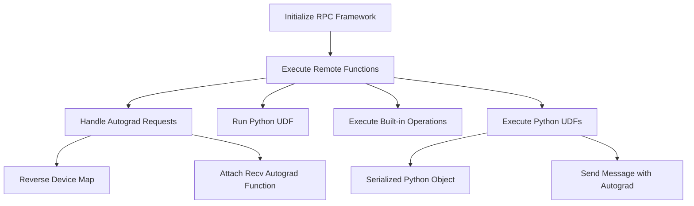

## Introduction

RPC refers to the Remote Procedure Call framework used in distributed computing. It allows functions to be executed remotely, enabling communication between different nodes in a distributed system. The framework supports referencing remote objects without copying the actual data, which is essential for efficiency. It also provides autograd and optimizer <SwmToken path="test/functorch/discover_coverage.py" pos="91:1:1" line-data="    apis = get_public_overridable_apis()">`apis`</SwmToken> to facilitate running backward passes and updating parameters across RPC boundaries.

## Initialization

Before using RPC and distributed autograd primitives, initialization must take place. To initialize the RPC framework, use `torch.distributed.rpc.init_rpc`, which sets up the necessary components like the <SwmToken path="torch/csrc/distributed/rpc/python_rpc_handler.h" pos="76:17:17" line-data="  // Return a set of Python functions for RRef helpers.">`RRef`</SwmToken> framework and distributed autograd.

<SwmSnippet path="/torch/csrc/distributed/rpc/request_callback_no_python.cpp" line="282">

---

The function <SwmToken path="torch/csrc/distributed/rpc/request_callback_no_python.cpp" pos="283:1:1" line-data="    processForwardAutogradReq(">`processForwardAutogradReq`</SwmToken> demonstrates how RPC is used to process autograd requests, including setting up device maps and handling nested RPC calls.

```c++
c10::intrusive_ptr<JitFuture> RequestCallbackNoPython::
    processForwardAutogradReq(
        RpcCommandBase& rpc,
        const std::vector<c10::Stream>& streams) const {
  auto& rpcWithAutograd = static_cast<RpcWithAutograd&>(rpc);

  // Need to reverse the device map for the backward pass of distributed
  // autograd.
  DeviceMap reverseDeviceMap;
  for (const auto& mapEntry : rpcWithAutograd.deviceMap()) {
    reverseDeviceMap.insert({mapEntry.second, mapEntry.first});
  }

  // Attach 'recv' autograd function.
  auto autogradContext = addRecvRpcBackward(
      rpcWithAutograd.autogradMetadata(),
      rpcWithAutograd.tensors(),
      rpcWithAutograd.fromWorkerId(),
      reverseDeviceMap);
  // For this recv thread on server side, before processRpc(),
  // set current_context_id_ to be context_id passed from client.
```

---

</SwmSnippet>

## Main Functions

The main functions in the RPC framework include <SwmToken path="torch/testing/_internal/distributed/_shard/sharded_tensor/__init__.py" pos="38:3:3" line-data="    def init_rpc(self):">`init_rpc`</SwmToken>, <SwmToken path="torch/csrc/distributed/rpc/python_rpc_handler.cpp" pos="139:6:6" line-data="py::object PythonRpcHandler::runPythonUdf(const py::object&amp; pythonUdf) {">`runPythonUdf`</SwmToken>, <SwmToken path="torch/csrc/distributed/rpc/python_functions.cpp" pos="195:7:7" line-data="c10::intrusive_ptr&lt;JitFuture&gt; pyRpcBuiltin(">`pyRpcBuiltin`</SwmToken>, and <SwmToken path="torch/csrc/distributed/rpc/python_functions.cpp" pos="216:7:7" line-data="c10::intrusive_ptr&lt;JitFuture&gt; pyRpcPythonUdf(">`pyRpcPythonUdf`</SwmToken>.

### <SwmToken path="torch/testing/_internal/distributed/_shard/sharded_tensor/__init__.py" pos="38:3:3" line-data="    def init_rpc(self):">`init_rpc`</SwmToken>

The <SwmToken path="torch/testing/_internal/distributed/_shard/sharded_tensor/__init__.py" pos="38:3:3" line-data="    def init_rpc(self):">`init_rpc`</SwmToken> function initializes the RPC framework, <SwmToken path="torch/csrc/distributed/rpc/python_rpc_handler.h" pos="76:17:17" line-data="  // Return a set of Python functions for RRef helpers.">`RRef`</SwmToken> framework, and distributed autograd.

<SwmSnippet path="/torch/csrc/distributed/rpc/python_rpc_handler.cpp" line="139">

---

The <SwmToken path="torch/csrc/distributed/rpc/python_rpc_handler.cpp" pos="139:6:6" line-data="py::object PythonRpcHandler::runPythonUdf(const py::object&amp; pythonUdf) {">`runPythonUdf`</SwmToken> function executes a Python UDF remotely and ensures the GIL is acquired.

```c++
py::object PythonRpcHandler::runPythonUdf(const py::object& pythonUdf) {
  PROFILE_GIL_SCOPED_ACQUIRE;
  // Throw a descriptive error message if pyRunFunction_ is already cleaned up.
  TORCH_INTERNAL_ASSERT(
      !pyRunFunction_.is_none(),
      "Cannot run python UDF since pyRunFunction_ is None. Check if python RPC "
      "handler is already cleaned up.");
  return pyRunFunction_(pythonUdf);
}
```

---

</SwmSnippet>

<SwmSnippet path="/torch/csrc/distributed/rpc/python_functions.cpp" line="195">

---

The <SwmToken path="torch/csrc/distributed/rpc/python_functions.cpp" pos="195:7:7" line-data="c10::intrusive_ptr&lt;JitFuture&gt; pyRpcBuiltin(">`pyRpcBuiltin`</SwmToken> function handles the execution of built-in operations remotely.

```c++
c10::intrusive_ptr<JitFuture> pyRpcBuiltin(
    const WorkerInfo& dst,
    const std::string& opName,
    const py::args& args,
    const py::kwargs& kwargs,
    const float rpcTimeoutSeconds) {
  DCHECK(PyGILState_Check());
  Stack stack;
  auto op = matchBuiltinOp(opName, args, kwargs, stack);
  // Release GIL since args and kwargs processing is done.
  py::gil_scoped_release release;
  auto scriptCall = std::make_unique<ScriptCall>(op, std::move(stack));
  auto agent = RpcAgent::getCurrentRpcAgent();
  return toPyJitFuture(sendMessageWithAutograd(
      *agent,
      dst,
      std::move(*scriptCall).toMessage(),
      false,
      rpcTimeoutSeconds));
}
```

---

</SwmSnippet>

<SwmSnippet path="/torch/csrc/distributed/rpc/python_functions.cpp" line="216">

---

The <SwmToken path="torch/csrc/distributed/rpc/python_functions.cpp" pos="216:7:7" line-data="c10::intrusive_ptr&lt;JitFuture&gt; pyRpcPythonUdf(">`pyRpcPythonUdf`</SwmToken> function handles the execution of Python UDFs remotely.

```c++
c10::intrusive_ptr<JitFuture> pyRpcPythonUdf(
    const WorkerInfo& dst,
    std::string& pickledPythonUDF,
    std::vector<torch::Tensor>& tensors,
    const float rpcTimeoutSeconds,
    const bool isAsyncExecution) {
  DCHECK(!PyGILState_Check());
  auto serializedPyObj =
      SerializedPyObj(std::move(pickledPythonUDF), std::move(tensors));
  auto pythonCall = std::make_unique<PythonCall>(
      std::move(serializedPyObj), isAsyncExecution);

  auto agent = RpcAgent::getCurrentRpcAgent();
  return toPyJitFuture(sendMessageWithAutograd(
      *agent,
      dst,
      std::move(*pythonCall).toMessage(),
      true /*forceGradRecording*/,
      rpcTimeoutSeconds));
}
```

---

</SwmSnippet>

## RPC Endpoints

RPC endpoints include functions like <SwmToken path="torch/csrc/distributed/rpc/python_rpc_handler.h" pos="77:6:6" line-data="  const RRefProxyFunctions&amp; getRRefProxyFunctions() const;">`getRRefProxyFunctions`</SwmToken> and <SwmToken path="torch/csrc/distributed/rpc/python_rpc_handler.h" pos="81:6:6" line-data="  const RRefTypeFunctions&amp; getRRefTypeFunctions() const;">`getRRefTypeFunctions`</SwmToken>.

<SwmSnippet path="/torch/csrc/distributed/rpc/python_rpc_handler.h" line="76">

---

The <SwmToken path="torch/csrc/distributed/rpc/python_rpc_handler.h" pos="77:6:6" line-data="  const RRefProxyFunctions&amp; getRRefProxyFunctions() const;">`getRRefProxyFunctions`</SwmToken> function returns a set of Python functions for <SwmToken path="torch/csrc/distributed/rpc/python_rpc_handler.h" pos="76:17:17" line-data="  // Return a set of Python functions for RRef helpers.">`RRef`</SwmToken> helpers. These functions include <SwmToken path="torch/csrc/distributed/rpc/python_rpc_handler.cpp" pos="86:3:3" line-data="    rrefProxyFunctions_.rpcSync_ = getFunction(rpcApi, &quot;rpc_sync&quot;);">`rpcSync_`</SwmToken>, <SwmToken path="torch/csrc/distributed/rpc/python_rpc_handler.cpp" pos="87:3:3" line-data="    rrefProxyFunctions_.rpcAsync_ = getFunction(rpcApi, &quot;rpc_async&quot;);">`rpcAsync_`</SwmToken>, and <SwmToken path="torch/csrc/distributed/rpc/python_rpc_handler.cpp" pos="88:3:3" line-data="    rrefProxyFunctions_.remote_ = getFunction(rpcApi, &quot;remote&quot;);">`remote_`</SwmToken>, which are essential for synchronous and asynchronous remote procedure calls and remote object referencing.

```c
  // Return a set of Python functions for RRef helpers.
  const RRefProxyFunctions& getRRefProxyFunctions() const;
```

---

</SwmSnippet>

<SwmSnippet path="/torch/csrc/distributed/rpc/python_rpc_handler.h" line="79">

---

The <SwmToken path="torch/csrc/distributed/rpc/python_rpc_handler.h" pos="81:6:6" line-data="  const RRefTypeFunctions&amp; getRRefTypeFunctions() const;">`getRRefTypeFunctions`</SwmToken> function returns a set of Python functions to retrieve the type of the object referenced by a given <SwmToken path="torch/csrc/distributed/rpc/python_rpc_handler.h" pos="80:11:11" line-data="  // referenced by a given RRef.">`RRef`</SwmToken>. These functions include <SwmToken path="torch/csrc/distributed/rpc/python_rpc_handler.cpp" pos="83:3:3" line-data="    rrefTypeFunctions_.onOwner_ = getFunction(rpcApi, &quot;_rref_typeof_on_owner&quot;);">`onOwner_`</SwmToken> and <SwmToken path="torch/csrc/distributed/rpc/python_rpc_handler.cpp" pos="84:3:3" line-data="    rrefTypeFunctions_.onUser_ = getFunction(rpcApi, &quot;_rref_typeof_on_user&quot;);">`onUser_`</SwmToken>, which help in determining the type of the object on the owner and user sides respectively.

```c
  // Return a set of Python functions to retrieve the type of the object
  // referenced by a given RRef.
  const RRefTypeFunctions& getRRefTypeFunctions() const;
```

---

</SwmSnippet>

&nbsp;

*This is an auto-generated document by Swimm AI 🌊 and has not yet been verified by a human*

<SwmMeta version="3.0.0" repo-id="Z2l0aHViJTNBJTNBcHl0b3JjaC1hdXRvZG9jcy1kZW1vJTNBJTNBU3dpbW0tRGVtbw==" repo-name="pytorch-autodocs-demo"><sup>Powered by [Swimm](/)</sup></SwmMeta>
