```mermaid
graph TD;
    A[Fuser] -->|Accepts subgraphs| B[Fusion Nodes];
    B -->|Executes by JIT compiling| C[Kernels];
    C -->|Runs graph operations| D[Device-specific logic];
    D -->|Found in subdirectory| E[Device's subdirectory];
    A -->|Device-independent logic| F[Interface];
    A -->|Device-independent logic| G[Compiler];
    A -->|Device-independent logic| H[Code Generator];
    A -->|Device-independent logic| I[Executor];
    A -->|Device-independent logic| J[Fallback];
    A -->|Device-independent logic| K[Kernel Specification Cache];
    F -->|Functions to register and run fusions| L[Register Fusions];
    F -->|Interrogate fusion functionality| M[Interrogate Fusion];
    F -->|Perform debugging| N[Debugging];
    G -->|Upfront compilation| O[Fallback Code];
    G -->|Runtime compilation| P[Code Generation];
    H -->|Produces string to be compiled| Q[Device Compilation];
    I -->|Runs requested fusions| R[Run Fusions];
    I -->|Performs shape inference| S[Shape Inference];
    I -->|Expands tensors| T[Expand Tensors];
    I -->|Determines device| U[Determine Device];
    I -->|Acquires cached kernel| V[Cached Kernel];
    I -->|Requests new kernel| W[Request Kernel];
    I -->|Launches kernel| X[Launch Kernel];
    I -->|Updates stack| Y[Update Stack];
    J -->|Runs subgraphs that can't be fused| Z[Run Subgraphs];
    K -->|Thread-safe cache| AA[Cache];
    K -->|Stores compiled kernels| AB[Compiled Kernels];
    K -->|Executor checks cache| AC[Check Cache];
```

# Overview

Fuser is a component that accepts subgraphs wrapped in 'fusion nodes' and attempts to execute them by just-in-time (JIT) compiling kernels that run all the graph operations. It is designed hierarchically with device-independent logic eventually deferring to device-specific logic and implementation. The device-specific code is mostly found in each device's subdirectory.

# Device-Independent Logic

The device-independent logic of the fuser has six components: Interface, Compiler, Code Generator, Executor, Fallback, and Kernel Specification Cache.

## Interface

The Interface component has functions to register and run fusions, interrogate fusion functionality, and perform debugging.

## Compiler

The Compiler component performs 'upfront' and 'runtime' compilation. Upfront compilation produces fallback code and performs some shape inference, while runtime compilation invokes code generation and device-specific compilation logic.

## Code Generator

The Code Generator component produces the string to be compiled on the device.

## Executor

The Executor component runs requested fusions, performs shape inference, expands tensors as necessary, determines the device to run on, acquires a cached compiled kernel or requests the Compiler to produce a new one, invokes device-specific code to launch the kernel, and updates the stack.

## Fallback

The Fallback component runs subgraphs that can't be fused because shape inference didn't determine a common tensor size or the device the tensors are on doesn't support fusion.

## Kernel Specification Cache

The Kernel Specification Cache is a thread-safe cache holding the device-independent specifications produced during upfront compilation. These specifications each have their own thread-safe stores of compiled kernels that the Executor checks before requesting runtime compilation.

# Fusion

Fusion merges operator kernels and compiles new kernels, reducing dispatcher overhead by combining multiple operator calls into a single call to the fused kernel. On GPU, it can reduce the number of reads and writes to global GPU memory, which can be a significant portion of the runtime for pointwise operators.

# JIT Technical Overview

Since fusers rely on specialized information that is only available at runtime - such as dtype, device, and shape - they are only applied after the first invocation of a torchscript function or module. As a result, the first invocation of a torchscript function can sometimes behave slightly differently from subsequent invocations.

&nbsp;

*This is an auto-generated document by Swimm AI 🌊 and has not yet been verified by a human*

<SwmMeta version="3.0.0" repo-id="Z2l0aHViJTNBJTNBcHl0b3JjaC1hdXRvZG9jcy1kZW1vJTNBJTNBU3dpbW0tRGVtbw==" repo-name="pytorch-autodocs-demo">Powered by [Swimm](https://app.swimm.io/)</SwmMeta>
