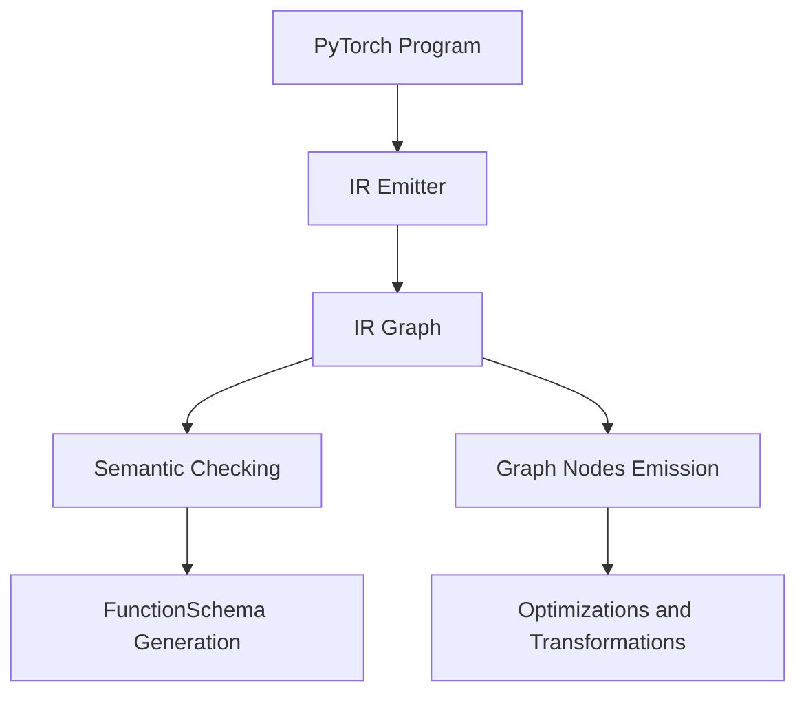

# Introduction

Intermediate Representation (IR) is a graph-based intermediate representation of <SwmToken path="tools/nightly.py" pos="306:1:1" line-data="    pytorch, platform = &quot;&quot;, &quot;&quot;">`pytorch`</SwmToken> programs, realized on top of `torch.fx.Graph`. It plays a vital role in the Just-In-Time (JIT) compilation process by enabling various optimizations and transformations.

# IR Emitter

The IR emitter translates Trees into Modules, adding function definitions as Methods to the module. During the lowering process, semantic checking occurs to ensure all used variables are defined and all values have compatible types. The IR emitter also emits the graph nodes corresponding to each statement in the Tree and generates a <SwmToken path="torchgen/model.py" pos="1369:2:2" line-data="class FunctionSchema:">`FunctionSchema`</SwmToken> for the whole definition.

# Use of IR in JIT Compilation

IR is crucial for the JIT compilation process as it allows for various optimizations and transformations. The IR emitter translates Trees into Modules, adding function definitions as Methods to the module. During the lowering process, semantic checking occurs to ensure all used variables are defined and all values have compatible types. The IR emitter also emits the graph nodes corresponding to each statement in the Tree and generates a <SwmToken path="torchgen/model.py" pos="1369:2:2" line-data="class FunctionSchema:">`FunctionSchema`</SwmToken> for the whole definition.

# The <SwmToken path="torch/csrc/jit/ir/ir.h" pos="110:4:4" line-data="// Each use is represented by this type, see &#39;Node::uses()&#39;">`use`</SwmToken> Struct

The <SwmToken path="torch/csrc/jit/ir/ir.h" pos="110:4:4" line-data="// Each use is represented by this type, see &#39;Node::uses()&#39;">`use`</SwmToken> struct represents each use of a value in the IR. It contains a pointer to the consumer node (<SwmToken path="torch/csrc/jit/ir/ir.h" pos="111:3:3" line-data="// &#39;user&#39; is the consumer of the value, &#39;offset&#39; is the index into">`user`</SwmToken>) and the index (<SwmToken path="torch/csrc/jit/ir/ir.h" pos="111:20:20" line-data="// &#39;user&#39; is the consumer of the value, &#39;offset&#39; is the index into">`offset`</SwmToken>) into the consumer's inputs where the producer will be found.

<SwmSnippet path="/torch/csrc/jit/ir/ir.h" line="110">

---

The <SwmToken path="torch/csrc/jit/ir/ir.h" pos="110:4:4" line-data="// Each use is represented by this type, see &#39;Node::uses()&#39;">`use`</SwmToken> struct is defined here, representing each use of a value in the IR. It includes a pointer to the consumer node and the index at which the value is used.

```c
// Each use is represented by this type, see 'Node::uses()'
// 'user' is the consumer of the value, 'offset' is the index into
// 'user's input this where the producers will be found.
struct Use {
  Use(Node* user, size_t offset) : user(user), offset(offset) {}
  Node* user;
  size_t offset;

  bool operator==(const Use& b) {
    return user == b.user && offset == b.offset;
  }
};
```

---

</SwmSnippet>

# Replacing IR Values

The method <SwmToken path="torch/csrc/jit/ir/ir.cpp" pos="928:4:4" line-data="void Value::replaceAllUsesAfterNodeWith(const Node* node, Value* newValue) {">`replaceAllUsesAfterNodeWith`</SwmToken> in the <SwmToken path="torch/csrc/jit/ir/ir.h" pos="111:16:16" line-data="// &#39;user&#39; is the consumer of the value, &#39;offset&#39; is the index into">`value`</SwmToken> class demonstrates how IR values can be replaced in the graph. This method replaces all uses of a value with a new value after a specified node.

<SwmSnippet path="/torch/csrc/jit/ir/ir.cpp" line="928">

---

The method <SwmToken path="torch/csrc/jit/ir/ir.cpp" pos="928:4:4" line-data="void Value::replaceAllUsesAfterNodeWith(const Node* node, Value* newValue) {">`replaceAllUsesAfterNodeWith`</SwmToken> replaces all uses of a value with a new value after a specified node.

```c++
void Value::replaceAllUsesAfterNodeWith(const Node* node, Value* newValue) {
  std::for_each(uses_.begin(), uses_.end(), [&node, newValue](Use& u) {
    if (u.user->isAfter(node)) {
      u.user->inputs_[u.offset] = newValue;
      newValue->uses_.push_back(u);
    }
  });

  uses_.erase(
      std::remove_if(
          uses_.begin(),
          uses_.end(),
          [&node](const Use& u) { return u.user->isAfter(node); }),
      uses_.end());
```

---

</SwmSnippet>

# Analyzing Aliasing and Write Information

The function <SwmToken path="torch/csrc/jit/ir/alias_analysis.cpp" pos="1196:4:4" line-data="bool AliasDb::functionalNonEscapingListUse(const Use&amp; use) const {">`functionalNonEscapingListUse`</SwmToken> in <SwmToken path="torch/csrc/jit/ir/alias_analysis.cpp" pos="1196:2:2" line-data="bool AliasDb::functionalNonEscapingListUse(const Use&amp; use) const {">`AliasDb`</SwmToken> shows how the <SwmToken path="torch/csrc/jit/ir/ir.h" pos="110:4:4" line-data="// Each use is represented by this type, see &#39;Node::uses()&#39;">`use`</SwmToken> struct is utilized to analyze aliasing and write information in the IR.

<SwmSnippet path="/torch/csrc/jit/ir/alias_analysis.cpp" line="1196">

---

The function <SwmToken path="torch/csrc/jit/ir/alias_analysis.cpp" pos="1196:4:4" line-data="bool AliasDb::functionalNonEscapingListUse(const Use&amp; use) const {">`functionalNonEscapingListUse`</SwmToken> demonstrates the use of the <SwmToken path="torch/csrc/jit/ir/alias_analysis.cpp" pos="1196:8:8" line-data="bool AliasDb::functionalNonEscapingListUse(const Use&amp; use) const {">`Use`</SwmToken> struct to analyze aliasing and write information in the IR.

```c++
bool AliasDb::functionalNonEscapingListUse(const Use& use) const {
  Node* n = use.user;
```

---

</SwmSnippet>

# Determining Order of Uses

The functions <SwmToken path="torch/csrc/jit/passes/canonicalize.cpp" pos="124:4:4" line-data="static bool isBefore(const Use&amp; a, const Use&amp; b) {">`isBefore`</SwmToken>, <SwmToken path="torch/csrc/jit/ir/ir.cpp" pos="930:8:8" line-data="    if (u.user-&gt;isAfter(node)) {">`isAfter`</SwmToken>, and <SwmToken path="torch/csrc/jit/passes/canonicalize.cpp" pos="144:9:9" line-data="std::optional&lt;const Use&gt; firstOrLastUse(Value* v, bool find_first) {">`firstOrLastUse`</SwmToken> in <SwmPath>[torch/csrc/jit/passes/canonicalize.cpp](torch/csrc/jit/passes/canonicalize.cpp)</SwmPath> illustrate how <SwmToken path="torch/csrc/jit/ir/ir.h" pos="110:4:4" line-data="// Each use is represented by this type, see &#39;Node::uses()&#39;">`use`</SwmToken> is employed to determine the order of uses and find the first or last use of a value in the IR.

<SwmSnippet path="/torch/csrc/jit/passes/canonicalize.cpp" line="124">

---

The functions <SwmToken path="torch/csrc/jit/passes/canonicalize.cpp" pos="124:4:4" line-data="static bool isBefore(const Use&amp; a, const Use&amp; b) {">`isBefore`</SwmToken>, <SwmToken path="torch/csrc/jit/passes/canonicalize.cpp" pos="133:4:4" line-data="static bool isAfter(const Use&amp; a, const Use&amp; b) {">`isAfter`</SwmToken>, and <SwmToken path="torch/csrc/jit/passes/canonicalize.cpp" pos="144:9:9" line-data="std::optional&lt;const Use&gt; firstOrLastUse(Value* v, bool find_first) {">`firstOrLastUse`</SwmToken> illustrate how <SwmToken path="torch/csrc/jit/passes/canonicalize.cpp" pos="124:8:8" line-data="static bool isBefore(const Use&amp; a, const Use&amp; b) {">`Use`</SwmToken> is employed to determine the order of uses and find the first or last use of a value in the IR.

```c++
static bool isBefore(const Use& a, const Use& b) {
  // If two uses are the same node, we order on offset
  if (a.user == b.user) {
    return a.offset < b.offset;
  }

  return isBefore(a.user, b.user);
}

static bool isAfter(const Use& a, const Use& b) {
  if (a.user == b.user && a.offset == b.offset) {
    return false;
  }
  return !isBefore(a, b);
}

bool isBeforeOrAfter(const Use& a, const Use& b, bool checking_before) {
  return checking_before ? isBefore(a, b) : isAfter(a, b);
}

std::optional<const Use> firstOrLastUse(Value* v, bool find_first) {
```

---

</SwmSnippet>

# Main Functions

There are several main functions in this folder. Some of them are <SwmToken path="torch/csrc/jit/ir/ir.h" pos="110:4:4" line-data="// Each use is represented by this type, see &#39;Node::uses()&#39;">`use`</SwmToken>, <SwmToken path="torch/csrc/jit/ir/ir.h" pos="166:2:2" line-data="struct Wrap {">`Wrap`</SwmToken>, and <SwmToken path="torch/csrc/jit/ir/ir.h" pos="111:16:16" line-data="// &#39;user&#39; is the consumer of the value, &#39;offset&#39; is the index into">`value`</SwmToken>. We will dive a little into <SwmToken path="torch/csrc/jit/ir/ir.h" pos="110:4:4" line-data="// Each use is represented by this type, see &#39;Node::uses()&#39;">`use`</SwmToken> and <SwmToken path="torch/csrc/jit/ir/ir.h" pos="166:2:2" line-data="struct Wrap {">`Wrap`</SwmToken>.

## Use

The <SwmToken path="torch/csrc/jit/ir/ir.h" pos="110:4:4" line-data="// Each use is represented by this type, see &#39;Node::uses()&#39;">`use`</SwmToken> struct represents each use of a value in the IR. It contains a pointer to the consumer node and the index at which the value is used.

<SwmSnippet path="/torch/csrc/jit/ir/ir.h" line="110">

---

The <SwmToken path="torch/csrc/jit/ir/ir.h" pos="110:4:4" line-data="// Each use is represented by this type, see &#39;Node::uses()&#39;">`use`</SwmToken> struct is defined here, representing each use of a value in the IR. It includes a pointer to the consumer node and the index at which the value is used.

```c
// Each use is represented by this type, see 'Node::uses()'
// 'user' is the consumer of the value, 'offset' is the index into
// 'user's input this where the producers will be found.
struct Use {
  Use(Node* user, size_t offset) : user(user), offset(offset) {}
  Node* user;
  size_t offset;

  bool operator==(const Use& b) {
    return user == b.user && offset == b.offset;
  }
};
```

---

</SwmSnippet>

## Wrap

The <SwmToken path="torch/csrc/jit/ir/ir.h" pos="166:2:2" line-data="struct Wrap {">`Wrap`</SwmToken> struct is a managing wrapper for Python to allow invalidation. It holds a pointer to an element and a callback function for clearing the element.

<SwmSnippet path="/torch/csrc/jit/ir/ir.h" line="166">

---

The <SwmToken path="torch/csrc/jit/ir/ir.h" pos="166:2:2" line-data="struct Wrap {">`Wrap`</SwmToken> struct is defined here, managing wrappers for Python to allow invalidation.

```c
struct Wrap {
  explicit Wrap(T* p) : elem(p) {}
  void clear() {
    if (clear_cb) {
      clear_cb(elem);
    }
    elem = nullptr;
  }
  T* elem;
  void (*clear_cb)(void*){nullptr};
};
```

---

</SwmSnippet>

## Value

The <SwmToken path="torch/csrc/jit/ir/ir.h" pos="111:16:16" line-data="// &#39;user&#39; is the consumer of the value, &#39;offset&#39; is the index into">`value`</SwmToken> struct represents an input or output to a node in the IR. It contains information about the node, its type, and its uses.

<SwmSnippet path="/torch/csrc/jit/ir/ir.h" line="178">

---

The <SwmToken path="torch/csrc/jit/ir/ir.h" pos="178:2:2" line-data="struct Value {">`Value`</SwmToken> struct is defined here, representing an input or output to a node in the IR. It contains information about the node, its type, and its uses.

```c
struct Value {
  AT_DISALLOW_COPY_AND_ASSIGN(Value);
  Value(Node* node_, size_t offset_);

 private:
  friend struct Node;
  friend struct Graph;
  Node* node_;
  size_t offset_;
  size_t unique_ = 0; // unique id
  use_list uses_;
  std::string unique_name_;
  TypePtr type_;
  // a managing wrapper for Python to allow invalidation
  std::shared_ptr<Wrap<Value>> wrap_;

 public:
  Value* setType(TypePtr type);
  TORCH_API void inferTypeFrom(const at::Tensor& output);
  TORCH_API void inferTypeFrom(
      const c10::intrusive_ptr<c10::ivalue::Object>& output);
```

---

</SwmSnippet>

# IR Endpoints

IR endpoints provide various functionalities to check the integrity and output the structure of the IR.

## lint

The <SwmToken path="torch/csrc/jit/ir/ir.cpp" pos="444:4:4" line-data="void Node::lint() const {">`lint`</SwmToken> function is used to check the integrity of a `Node` or <SwmToken path="torch/csrc/jit/ir/ir.h" pos="184:5:5" line-data="  friend struct Graph;">`Graph`</SwmToken>. It ensures that there are no unattached nodes and that the graph structure is valid.

<SwmSnippet path="/torch/csrc/jit/ir/ir.cpp" line="444">

---

The <SwmToken path="torch/csrc/jit/ir/ir.cpp" pos="444:4:4" line-data="void Node::lint() const {">`lint`</SwmToken> function checks the integrity of a `Node` or <SwmToken path="torch/csrc/jit/ir/ir.cpp" pos="448:7:7" line-data="  // - Owning graph is non-null and consistent">`graph`</SwmToken>, ensuring no unattached nodes and a valid graph structure.

```c++
void Node::lint() const {
  // Node invariants
  // - if node should live in list, nodes_iter is consistent
  // - Inputs are all marked as a use by the nodes they refer to
  // - Owning graph is non-null and consistent
  // - The "Select" invariant, when the node is MultiReturn
  //
  // The handle invariant:
  //    If a node takes a handle as an input, it is always the
  //    LAST input of the node.  There is at most one handle input.

  {
    size_t i = 0;
    for (auto input : inputs_) {
      // WARNING: O(n^2)
      // NOLINTNEXTLINE(cppcoreguidelines-pro-type-const-cast)
      AT_ASSERT(
          std::find(ALL_OF(input->uses_), Use(const_cast<Node*>(this), i)) !=
          input->uses_.end());
      AT_ASSERT(graph_->all_nodes.count(this) == 1);
      i++;
```

---

</SwmSnippet>

## dump

The <SwmToken path="torch/csrc/jit/ir/ir.cpp" pos="655:4:4" line-data="void Graph::dump() const {">`dump`</SwmToken> function is used to output a textual representation of a <SwmToken path="torch/csrc/jit/ir/ir.h" pos="184:5:5" line-data="  friend struct Graph;">`Graph`</SwmToken> or `Node`. This is useful for debugging and understanding the structure of the IR.

<SwmSnippet path="/torch/csrc/jit/ir/ir.cpp" line="655">

---

The <SwmToken path="torch/csrc/jit/ir/ir.cpp" pos="655:4:4" line-data="void Graph::dump() const {">`dump`</SwmToken> function outputs a textual representation of a <SwmToken path="torch/csrc/jit/ir/ir.cpp" pos="655:2:2" line-data="void Graph::dump() const {">`Graph`</SwmToken> or `Node`, useful for debugging and understanding the structure of the IR.

```c++
void Graph::dump() const {
  std::cout << *this << "\n";
}
```

---

</SwmSnippet>

&nbsp;

*This is an auto-generated document by Swimm AI 🌊 and has not yet been verified by a human*

<SwmMeta version="3.0.0" repo-id="Z2l0aHViJTNBJTNBcHl0b3JjaC1hdXRvZG9jcy1kZW1vJTNBJTNBU3dpbW0tRGVtbw==" repo-name="pytorch-autodocs-demo"><sup>Powered by [Swimm](/)</sup></SwmMeta>
