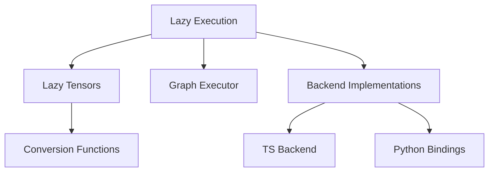

# Overview of Lazy Execution

Lazy execution in <SwmToken path="tools/nightly.py" pos="306:1:1" line-data="    pytorch, platform = &quot;&quot;, &quot;&quot;">`pytorch`</SwmToken> allows for the deferral of computation until the results are actually needed. This can optimize performance by reducing redundant calculations. The core components of Lazy include various utilities for handling tensors, operations, and shape inference.

# Core Components

Lazy execution includes a graph executor that manages the execution of deferred operations. The backend directory contains implementations specific to different backend devices, facilitating the integration of lazy execution with various hardware. The <SwmToken path="torch/csrc/lazy/ts_backend/ts_native_functions.cpp" pos="16:10:10" line-data="#include &lt;torch/csrc/lazy/ts_backend/config.h&gt;">`ts_backend`</SwmToken> directory includes specific implementations for <SwmToken path="torch/_dynamo/backends/debugging.py" pos="86:2:2" line-data="def torchscript(gm, fake_tensor_inputs):">`torchscript`</SwmToken>, enabling lazy execution within the <SwmToken path="torch/_dynamo/backends/debugging.py" pos="86:2:2" line-data="def torchscript(gm, fake_tensor_inputs):">`torchscript`</SwmToken> environment. The <SwmToken path="torch/utils/benchmark/utils/timer.py" pos="33:1:1" line-data="    PYTHON = 0">`PYTHON`</SwmToken> directory provides Python bindings and utilities to interact with the lazy execution framework from Python code.

# Lazy Tensor Tutorial

The tutorial provides an overview of Lazy Tensors, including common usage patterns and <SwmToken path="test/functorch/discover_coverage.py" pos="91:1:1" line-data="    apis = get_public_overridable_apis()">`apis`</SwmToken>.

<SwmSnippet path="/torch/csrc/lazy/ts_backend/ts_native_functions.cpp" line="140">

---

The function <SwmToken path="torch/csrc/lazy/ts_backend/ts_native_functions.cpp" pos="140:6:6" line-data="at::Tensor LazyNativeFunctions::_to_copy(">`_to_copy`</SwmToken> demonstrates how Lazy Tensors can be converted between eager and lazy modes, handling various device types and memory formats.

```c++
at::Tensor LazyNativeFunctions::_to_copy(
    const at::Tensor& self,
    std::optional<at::ScalarType> dtype,
    std::optional<at::Layout> layout,
    std::optional<at::Device> device,
    std::optional<bool> pin_memory,
    bool non_blocking,
    std::optional<at::MemoryFormat> memory_format) {
  if (force_eager_fallback(at::aten::_to_copy)) {
    TORCH_INTERNAL_ASSERT(
        false,
        "Fallback is currently impossible for _to_copy since the fallback helper itself reinvokes _to_copy");
  }

  auto options = self.options();
  if (dtype) {
    // I put each of these setters in a conditional instead of doing
    // `self.options().dtype(dtype).layout(layout)... because calling
    // .dtype(nullopt) on an options() that already has dtype appears to wipe it
    options = options.dtype(dtype);
  }
```

---

</SwmSnippet>

<SwmSnippet path="/torch/csrc/lazy/ts_backend/ts_native_functions.cpp" line="272">

---

The function <SwmToken path="torch/csrc/lazy/ts_backend/ts_native_functions.cpp" pos="272:6:6" line-data="at::Tensor LazyNativeFunctions::empty_symint(">`empty_symint`</SwmToken> shows how to create an empty Lazy Tensor with specific options like device type and memory format.

```c++
at::Tensor LazyNativeFunctions::empty_symint(
    at::SymIntArrayRef sym_size,
    std::optional<at::ScalarType> dtype,
    std::optional<at::Layout> layout,
    std::optional<at::Device> device,
    std::optional<bool> pin_memory,
    std::optional<at::MemoryFormat> memory_format) {
  // TODO: support this directly
  auto size = C10_AS_INTARRAYREF_SLOW(sym_size);
  const auto device_type = torch::lazy::getBackend()->EagerFallbackDeviceType();
  at::TensorOptions options = at::TensorOptions()
                                  .device(c10::Device(device_type))
                                  .layout(layout)
                                  .pinned_memory(pin_memory)
                                  .dtype(dtype);
  auto x_result = at::empty(size, options, memory_format);
  auto tensor = CreateLtcTensor(x_result, GetLtcDevice(device));
  // See Note [Lazy Tensor Functionalization]
  if (c10::impl::tls_local_dispatch_key_set().excluded_.has(
          c10::DispatchKey::Functionalize)) {
    // Invariant: if the functionalization key is in the exclude set, then we're
```

---

</SwmSnippet>

# Endpoints of Lazy

Endpoints in Lazy execution provide specific methods for interacting with the backend.

## Lower

The <SwmToken path="torch/csrc/lazy/ts_backend/ts_node.h" pos="55:5:5" line-data="  virtual TSOpVector Lower(">`Lower`</SwmToken> method in the <SwmToken path="torch/csrc/lazy/ts_backend/ts_node.h" pos="16:4:4" line-data="class TORCH_API TsNode : public lazy::Node {">`TsNode`</SwmToken> class is a <SwmToken path="torch/csrc/lazy/ts_backend/ts_node.h" pos="52:9:11" line-data="  // Lower is a backend-specific method since it returns a backend specific">`backend-specific`</SwmToken> method that returns a <SwmToken path="torch/csrc/lazy/ts_backend/ts_node.h" pos="52:9:11" line-data="  // Lower is a backend-specific method since it returns a backend specific">`backend-specific`</SwmToken> type. It is defined differently per backend to accommodate the specific requirements of each backend.

<SwmSnippet path="/torch/csrc/lazy/ts_backend/ts_node.h" line="55">

---

The <SwmToken path="torch/csrc/lazy/ts_backend/ts_node.h" pos="55:5:5" line-data="  virtual TSOpVector Lower(">`Lower`</SwmToken> method signature in the <SwmToken path="torch/csrc/lazy/ts_backend/ts_node.h" pos="16:4:4" line-data="class TORCH_API TsNode : public lazy::Node {">`TsNode`</SwmToken> class.

```c
  virtual TSOpVector Lower(
      std::shared_ptr<torch::jit::GraphFunction> function,
      TSLoweringContext* loctx) const;
```

---

</SwmSnippet>

## <SwmToken path="torch/csrc/lazy/ts_backend/ts_lowering_context.h" pos="101:8:8" line-data="  torch::jit::Value* GetOutputOp(const Output&amp; output) {">`GetOutputOp`</SwmToken>

The <SwmToken path="torch/csrc/lazy/ts_backend/ts_lowering_context.h" pos="101:8:8" line-data="  torch::jit::Value* GetOutputOp(const Output&amp; output) {">`GetOutputOp`</SwmToken> method in the <SwmToken path="torch/csrc/lazy/ts_backend/ts_node.h" pos="57:1:1" line-data="      TSLoweringContext* loctx) const;">`TSLoweringContext`</SwmToken> class retrieves the lowered operation for an output. If the requested output is not available yet, the graph behind the output's Node is lowered, and the corresponding TS operation is returned.

<SwmSnippet path="/torch/csrc/lazy/ts_backend/ts_lowering_context.h" line="101">

---

The <SwmToken path="torch/csrc/lazy/ts_backend/ts_lowering_context.h" pos="101:8:8" line-data="  torch::jit::Value* GetOutputOp(const Output&amp; output) {">`GetOutputOp`</SwmToken> method signature in the <SwmToken path="torch/csrc/lazy/ts_backend/ts_node.h" pos="57:1:1" line-data="      TSLoweringContext* loctx) const;">`TSLoweringContext`</SwmToken> class.

```c
  torch::jit::Value* GetOutputOp(const Output& output) {
    auto it = emitted_outputs_.find(output);
    if (it == emitted_outputs_.end()) {
      auto post_order = Util::ComputePostOrder(output.node, &emit_status_);
      for (auto node : post_order) {
        Lower(node);
      }
      // At this point the output better be present, otherwise there is an issue
      // with the lowering code.
      it = emitted_outputs_.find(output);
      TORCH_CHECK(
          it != emitted_outputs_.end(),
          "No TS operation emitted for output: ",
          output.ToString());
    }
    return it->second;
```

---

</SwmSnippet>

&nbsp;

*This is an auto-generated document by Swimm AI 🌊 and has not yet been verified by a human*

<SwmMeta version="3.0.0" repo-id="Z2l0aHViJTNBJTNBcHl0b3JjaC1hdXRvZG9jcy1kZW1vJTNBJTNBU3dpbW0tRGVtbw==" repo-name="pytorch-autodocs-demo"><sup>Powered by [Swimm](/)</sup></SwmMeta>
