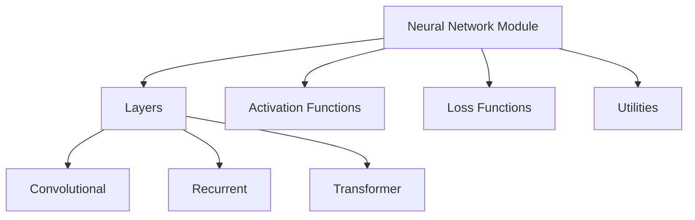

# Overview of Nn

The <SwmToken path="test/functorch/discover_coverage.py" pos="584:9:9" line-data="def print_coverage_info(th=100, nn=25):">`nn`</SwmToken> module in the API provides a wide range of functionalities for building and training neural networks. It includes various layers, activation functions, loss functions, and utilities. The module supports different types of neural network architectures such as convolutional, recurrent, and transformer networks. It is designed to be flexible and extensible, allowing users to create custom layers and functions.

# Main Functions

The <SwmToken path="test/functorch/discover_coverage.py" pos="584:9:9" line-data="def print_coverage_info(th=100, nn=25):">`nn`</SwmToken> module includes several main functions such as <SwmToken path="torch/backends/_coreml/preprocess.py" pos="43:1:1" line-data="    LINEAR = &quot;linear&quot;">`LINEAR`</SwmToken>, <SwmToken path="torch/_meta_registrations.py" pos="4662:1:1" line-data="    BILINEAR = 0">`BILINEAR`</SwmToken>, <SwmToken path="torch/nn/attention/__init__.py" pos="71:2:2" line-data="def sdpa_kernel(backends: Union[List[SDPBackend], SDPBackend]):">`sdpa_kernel`</SwmToken>, and `SDPBackend`. This section will focus on the <SwmToken path="torch/backends/_coreml/preprocess.py" pos="43:1:1" line-data="    LINEAR = &quot;linear&quot;">`LINEAR`</SwmToken> and <SwmToken path="torch/_meta_registrations.py" pos="4662:1:1" line-data="    BILINEAR = 0">`BILINEAR`</SwmToken> functions.

## Linear Functions

The <SwmToken path="torch/backends/_coreml/preprocess.py" pos="43:1:1" line-data="    LINEAR = &quot;linear&quot;">`LINEAR`</SwmToken> function applies a linear transformation to the incoming data. It is commonly used in fully connected layers of neural networks.

# Endpoints of Nn

The <SwmToken path="test/functorch/discover_coverage.py" pos="584:9:9" line-data="def print_coverage_info(th=100, nn=25):">`nn`</SwmToken> module has several important endpoints, including the <SwmToken path="torch/csrc/api/src/nn/modules/transformer.cpp" pos="63:4:4" line-data="Tensor TransformerEncoderLayerImpl::forward(">`forward`</SwmToken> methods in <SwmToken path="torch/csrc/api/src/nn/modules/transformer.cpp" pos="63:2:2" line-data="Tensor TransformerEncoderLayerImpl::forward(">`TransformerEncoderLayerImpl`</SwmToken> and <SwmToken path="torch/csrc/api/src/nn/modules/transformer.cpp" pos="164:2:2" line-data="Tensor TransformerDecoderLayerImpl::forward(">`TransformerDecoderLayerImpl`</SwmToken>.

<SwmSnippet path="/torch/csrc/api/src/nn/modules/transformer.cpp" line="63">

---

## <SwmToken path="torch/csrc/api/src/nn/modules/transformer.cpp" pos="63:2:4" line-data="Tensor TransformerEncoderLayerImpl::forward(">`TransformerEncoderLayerImpl::forward`</SwmToken>

The <SwmToken path="torch/csrc/api/src/nn/modules/transformer.cpp" pos="63:4:4" line-data="Tensor TransformerEncoderLayerImpl::forward(">`forward`</SwmToken> method in <SwmToken path="torch/csrc/api/src/nn/modules/transformer.cpp" pos="63:2:2" line-data="Tensor TransformerEncoderLayerImpl::forward(">`TransformerEncoderLayerImpl`</SwmToken> processes the input tensor through the encoder layer. It performs multi-head attention, followed by normalization and dropout, and then applies a feedforward neural network. The method returns the transformed tensor.

```c++
Tensor TransformerEncoderLayerImpl::forward(
    const Tensor& src,
    const Tensor& src_mask,
    const Tensor& src_key_padding_mask) {
  // multihead attention
  Tensor src2 = std::get<0>(self_attn(
      src, src, src, src_key_padding_mask, /*need_weights=*/true, src_mask));
  // add & norm
  Tensor ret = norm1(src + dropout1(src2));

  // feedforward
  if (std::holds_alternative<enumtype::kGELU>(options.activation())) {
    src2 = linear2(dropout(F::gelu(linear1(ret))));
  } else if (std::holds_alternative<enumtype::kReLU>(options.activation())) {
    src2 = linear2(dropout(F::relu(linear1(ret))));
  } else if (std::holds_alternative<std::function<Tensor(const Tensor&)>>(
                 options.activation())) {
    auto callable_activation =
        *std::get_if<std::function<Tensor(const Tensor&)>>(
            &options.activation());
    src2 = linear2(dropout(callable_activation(linear1(ret))));
```

---

</SwmSnippet>

<SwmSnippet path="/torch/csrc/api/src/nn/modules/transformer.cpp" line="164">

---

## <SwmToken path="torch/csrc/api/src/nn/modules/transformer.cpp" pos="164:2:4" line-data="Tensor TransformerDecoderLayerImpl::forward(">`TransformerDecoderLayerImpl::forward`</SwmToken>

The <SwmToken path="torch/csrc/api/src/nn/modules/transformer.cpp" pos="164:4:4" line-data="Tensor TransformerDecoderLayerImpl::forward(">`forward`</SwmToken> method in <SwmToken path="torch/csrc/api/src/nn/modules/transformer.cpp" pos="164:2:2" line-data="Tensor TransformerDecoderLayerImpl::forward(">`TransformerDecoderLayerImpl`</SwmToken> processes the input tensor through the decoder layer. It includes self-attention, multi-head attention, normalization, and dropout layers, followed by a feedforward neural network. The method returns the transformed tensor.

```c++
Tensor TransformerDecoderLayerImpl::forward(
    Tensor tgt,
    const Tensor& memory,
    const Tensor& tgt_mask,
    const Tensor& memory_mask,
    const Tensor& tgt_key_padding_mask,
    const Tensor& memory_key_padding_mask) {
  Tensor tgt2 = std::get<0>(self_attn(
      tgt, // query
      tgt, // key
      tgt, // value
      tgt_key_padding_mask, // key_padding_mask
      false, // need_weights
      tgt_mask) // attn_mask
  );
  tgt = tgt + dropout1(tgt2);
  tgt = norm1(tgt);

  tgt2 = std::get<0>(multihead_attn(
      tgt, // query
      memory, // key
```

---

</SwmSnippet>

&nbsp;

*This is an auto-generated document by Swimm AI 🌊 and has not yet been verified by a human*

<SwmMeta version="3.0.0" repo-id="Z2l0aHViJTNBJTNBcHl0b3JjaC1hdXRvZG9jcy1kZW1vJTNBJTNBU3dpbW0tRGVtbw==" repo-name="pytorch-autodocs-demo"><sup>Powered by [Swimm](/)</sup></SwmMeta>
