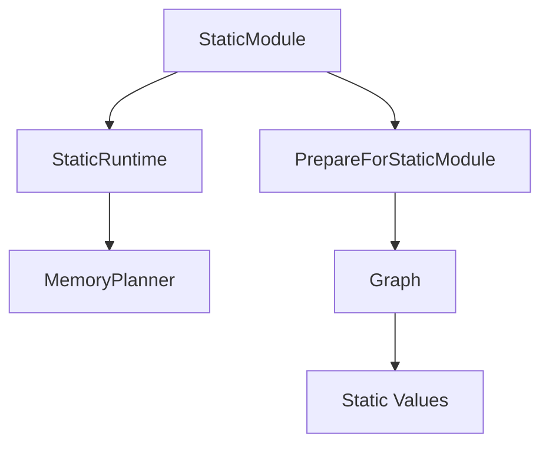

# Overview

This document explores the concept of static values in runtime, focusing on how they are managed and optimized within the <SwmToken path="tools/nightly.py" pos="306:1:1" line-data="    pytorch, platform = &quot;&quot;, &quot;&quot;">`pytorch`</SwmToken> framework. Static values refer to values that have been hard-coded into the graph, making the graph specialized to those values. In the runtime, static values include input tensor shapes, which are specialized unless specified as dynamic.

# <SwmToken path="torch/csrc/jit/runtime/static/impl.cpp" pos="137:2:2" line-data="    &quot;StaticRuntime&quot;,">`StaticRuntime`</SwmToken> Class

The <SwmToken path="torch/csrc/jit/runtime/static/impl.cpp" pos="137:2:2" line-data="    &quot;StaticRuntime&quot;,">`StaticRuntime`</SwmToken> class is responsible for managing the execution of models with static values. Instances of <SwmToken path="torch/csrc/jit/runtime/static/impl.cpp" pos="137:2:2" line-data="    &quot;StaticRuntime&quot;,">`StaticRuntime`</SwmToken> are created per running thread to handle model inference efficiently. It uses a synchronized stack to cache instances, avoiding the overhead of creating them on the fly. Additionally, <SwmToken path="torch/csrc/jit/runtime/static/impl.cpp" pos="137:2:2" line-data="    &quot;StaticRuntime&quot;,">`StaticRuntime`</SwmToken> works with a <SwmToken path="torch/_inductor/codegen/memory_planning.py" pos="602:2:2" line-data="class MemoryPlanner:">`MemoryPlanner`</SwmToken> to optimize memory allocation and deallocation during model execution.

<SwmSnippet path="/torch/csrc/jit/runtime/static/static_method.h" line="10">

---

The <SwmToken path="torch/csrc/jit/runtime/static/static_method.h" pos="10:1:1" line-data="  StaticMethod(">`StaticMethod`</SwmToken> constructor initializes the static method with a <SwmToken path="torch/csrc/jit/runtime/static/static_method.h" pos="11:5:5" line-data="      std::shared_ptr&lt;StaticModule&gt; static_module,">`StaticModule`</SwmToken> and a method name. It ensures that the <SwmToken path="torch/csrc/jit/runtime/static/static_method.h" pos="11:5:5" line-data="      std::shared_ptr&lt;StaticModule&gt; static_module,">`StaticModule`</SwmToken> is valid.

```c
  StaticMethod(
      std::shared_ptr<StaticModule> static_module,
      std::string method_name)
      : static_module_(std::move(static_module)),
        method_name_(std::move(method_name)) {
    TORCH_CHECK(static_module_);
  }
```

---

</SwmSnippet>

# <SwmToken path="torch/csrc/jit/runtime/static/static_method.h" pos="11:5:5" line-data="      std::shared_ptr&lt;StaticModule&gt; static_module,">`StaticModule`</SwmToken> Class

The <SwmToken path="torch/csrc/jit/runtime/static/static_method.h" pos="11:5:5" line-data="      std::shared_ptr&lt;StaticModule&gt; static_module,">`StaticModule`</SwmToken> class is constructed from a shared pointer to a graph and static module options. It prepares the graph for the static module and initializes the static module with the prepared graph and options.

<SwmSnippet path="/torch/csrc/jit/runtime/static/impl.cpp" line="529">

---

The <SwmToken path="torch/csrc/jit/runtime/static/impl.cpp" pos="529:0:0" line-data="StaticModule::StaticModule(">`StaticModule`</SwmToken> constructor prepares the module for static execution by calling <SwmToken path="torch/csrc/jit/runtime/static/impl.cpp" pos="534:1:1" line-data="          PrepareForStaticModule(g-&gt;copy(), opts, std::move(sample_inputs)),">`PrepareForStaticModule`</SwmToken> and initializing the module with the provided options and sample inputs.

```c++
StaticModule::StaticModule(
    const std::shared_ptr<torch::jit::Graph>& g,
    const StaticModuleOptions& opts,
    std::vector<IValue> sample_inputs)
    : StaticModule(
          PrepareForStaticModule(g->copy(), opts, std::move(sample_inputs)),
          opts) {}
```

---

</SwmSnippet>

# <SwmToken path="torch/csrc/jit/runtime/static/impl.cpp" pos="289:18:18" line-data="std::pair&lt;std::shared_ptr&lt;Graph&gt;, std::optional&lt;Module&gt;&gt; PrepareForStaticModule(">`PrepareForStaticModule`</SwmToken> Function

The <SwmToken path="torch/csrc/jit/runtime/static/impl.cpp" pos="289:18:18" line-data="std::pair&lt;std::shared_ptr&lt;Graph&gt;, std::optional&lt;Module&gt;&gt; PrepareForStaticModule(">`PrepareForStaticModule`</SwmToken> function prepares the graph for static execution by copying the module, freezing it if necessary, and preparing the graph with the provided options and sample inputs.

<SwmSnippet path="/torch/csrc/jit/runtime/static/impl.cpp" line="289">

---

The <SwmToken path="torch/csrc/jit/runtime/static/impl.cpp" pos="289:18:18" line-data="std::pair&lt;std::shared_ptr&lt;Graph&gt;, std::optional&lt;Module&gt;&gt; PrepareForStaticModule(">`PrepareForStaticModule`</SwmToken> function prepares the graph for static execution by copying the module, freezing it if necessary, and preparing the graph with the provided options and sample inputs.

```c++
std::pair<std::shared_ptr<Graph>, std::optional<Module>> PrepareForStaticModule(
    const torch::jit::Module& m,
    bool is_frozen,
    const StaticModuleOptions& opts,
    std::vector<IValue> sample_inputs) {
  LOG(INFO) << "StaticModuleOptions: enable_out_variant "
            << opts.enable_out_variant << ", optimize_memory "
            << opts.optimize_memory << ", manage_output_tensors "
            << opts.manage_output_tensors << ", use_copy_variants "
            << opts.use_copy_variants << ", use_maybe_copy_variants "
            << opts.use_maybe_copy_variants << ", enable_tensorexpr_fusion "
            << opts.enable_tensorexpr_fusion;

  Module module = m.copy();
  if (!is_frozen) {
    module.eval();
    module = freeze_module(module);
  }

  Method method = module.get_method("forward");
  auto graph = module.get_method("forward").graph();
```

---

</SwmSnippet>

# <SwmToken path="torch/csrc/jit/runtime/static/impl.cpp" pos="2047:0:0" line-data="StaticNodeInfo::StaticNodeInfo(">`StaticNodeInfo`</SwmToken> Constructor

The <SwmToken path="torch/csrc/jit/runtime/static/impl.cpp" pos="2047:0:0" line-data="StaticNodeInfo::StaticNodeInfo(">`StaticNodeInfo`</SwmToken> constructor initializes the static node information with the provided node, function, inputs, and output offset. It ensures that the number of outputs matches the expected size.

<SwmSnippet path="/torch/csrc/jit/runtime/static/impl.cpp" line="2047">

---

The <SwmToken path="torch/csrc/jit/runtime/static/impl.cpp" pos="2047:0:0" line-data="StaticNodeInfo::StaticNodeInfo(">`StaticNodeInfo`</SwmToken> constructor initializes the static node information with the provided node, function, inputs, and output offset. It ensures that the number of outputs matches the expected size.

```c++
StaticNodeInfo::StaticNodeInfo(
    Node* node,
    ProcessedFunction* fn,
    ProcessedNodeInputs inputs,
    uint16_t outputs_offset)
    : node_(node),
      fn_(fn),
      inputs_(std::move(inputs)),
      outputs_offset_(outputs_offset) {
  TORCH_CHECK(
      num_outputs() == node->outputs().size(),
      "Node ",
      node->kind().toQualString(),
      " has ",
      std::to_string(num_outputs()),
      " outputs, expected ",
      std::to_string(node->outputs().size()));
}
```

---

</SwmSnippet>

# Main Functions

There are several main functions in this folder. Some of them are <SwmToken path="torch/csrc/jit/runtime/static/impl.cpp" pos="268:2:2" line-data="void PrepareGraphForStaticModule(">`PrepareGraphForStaticModule`</SwmToken>, <SwmToken path="torch/csrc/jit/runtime/static/impl.cpp" pos="156:2:2" line-data="void OptimizeGraph(">`OptimizeGraph`</SwmToken>, <SwmToken path="torch/csrc/jit/runtime/static/static_method.h" pos="11:5:5" line-data="      std::shared_ptr&lt;StaticModule&gt; static_module,">`StaticModule`</SwmToken>, and <SwmToken path="torch/csrc/jit/runtime/static/impl.cpp" pos="137:2:2" line-data="    &quot;StaticRuntime&quot;,">`StaticRuntime`</SwmToken>. We will dive a little into <SwmToken path="torch/csrc/jit/runtime/static/impl.cpp" pos="268:2:2" line-data="void PrepareGraphForStaticModule(">`PrepareGraphForStaticModule`</SwmToken> and <SwmToken path="torch/csrc/jit/runtime/static/impl.cpp" pos="156:2:2" line-data="void OptimizeGraph(">`OptimizeGraph`</SwmToken>.

## <SwmToken path="torch/csrc/jit/runtime/static/impl.cpp" pos="268:2:2" line-data="void PrepareGraphForStaticModule(">`PrepareGraphForStaticModule`</SwmToken>

The <SwmToken path="torch/csrc/jit/runtime/static/impl.cpp" pos="268:2:2" line-data="void PrepareGraphForStaticModule(">`PrepareGraphForStaticModule`</SwmToken> function is responsible for preparing a graph for use with a static module. It checks if the static runtime can be enabled, optimizes the graph, creates owned references for special values, and ensures that each <SwmToken path="torch/csrc/jit/runtime/static/impl.cpp" pos="284:11:13" line-data="  // We assume that each sub-block has at least one output. If we">`sub-block`</SwmToken> has at least one output.

<SwmSnippet path="/torch/csrc/jit/runtime/static/impl.cpp" line="268">

---

The <SwmToken path="torch/csrc/jit/runtime/static/impl.cpp" pos="268:2:2" line-data="void PrepareGraphForStaticModule(">`PrepareGraphForStaticModule`</SwmToken> function is responsible for preparing a graph for use with a static module. It checks if the static runtime can be enabled, optimizes the graph, creates owned references for special values, and ensures that each <SwmToken path="torch/csrc/jit/runtime/static/impl.cpp" pos="284:11:13" line-data="  // We assume that each sub-block has at least one output. If we">`sub-block`</SwmToken> has at least one output.

```c++
void PrepareGraphForStaticModule(
    std::shared_ptr<torch::jit::Graph> graph,
    const StaticModuleOptions& opts,
    std::vector<IValue> sample_inputs) {
  TORCH_CHECK(canEnableStaticRuntime(graph));
  OptimizeGraph(graph, opts, std::move(sample_inputs));

  // Static runtime moves its outputs out of the runtime
  // by default. In some rare cases, this is not actually safe to
  // do - for example, if the value is a constant, static runtime
  // needs to hold onto a copy. Rather than adding special logic
  // to handle this rare case, we use this pass to detect it and
  // create an owned reference that can be safely moved out of the
  // runtime.
  CreateOwnedRefsForSpecialValues(*graph);

  // We assume that each sub-block has at least one output. If we
  // detect any that have 0, force the sub-block to return None.
  ForceNonEmptyOutputs(*graph);
}
```

---

</SwmSnippet>

## <SwmToken path="torch/csrc/jit/runtime/static/impl.cpp" pos="156:2:2" line-data="void OptimizeGraph(">`OptimizeGraph`</SwmToken>

The <SwmToken path="torch/csrc/jit/runtime/static/impl.cpp" pos="156:2:2" line-data="void OptimizeGraph(">`OptimizeGraph`</SwmToken> function performs various optimizations on the graph, such as inlining, constant propagation, and eliminating dead code. These optimizations help improve the performance of the static runtime.

<SwmSnippet path="/torch/csrc/jit/runtime/static/impl.cpp" line="156">

---

The <SwmToken path="torch/csrc/jit/runtime/static/impl.cpp" pos="156:2:2" line-data="void OptimizeGraph(">`OptimizeGraph`</SwmToken> function performs various optimizations on the graph, such as inlining, constant propagation, and eliminating dead code. These optimizations help improve the performance of the static runtime.

```c++
void OptimizeGraph(
    std::shared_ptr<torch::jit::Graph>& graph,
    const StaticModuleOptions& opts,
    std::vector<IValue> sample_inputs) {
  GRAPH_DUMP("Before optimizations: ", graph);
  if (opts.enable_tensorexpr_fusion) {
    if (sample_inputs.empty()) {
      VLOG(1) << "Cannot perform TensorExpr fusion - sample_inputs is empty";
    } else {
      VLOG(1) << "Performing TensorExpr fusion";
      performTensorExprFusion(graph, std::move(sample_inputs));
    }
  }
  Inline(*graph);
  ConstantPropagation(graph);
  Canonicalize(graph);
  ConstantPropagation(graph);
  RemoveTensorMutation(graph);
  ConstantPropagation(graph);
  EliminateNoOpSlice(graph);
  EliminateDeadCode(graph);
```

---

</SwmSnippet>

# Static Method API

The <SwmToken path="torch/csrc/jit/runtime/static/static_method.h" pos="8:2:2" line-data="class StaticMethod : public torch::IMethod {">`StaticMethod`</SwmToken> class defines an endpoint for invoking static methods within a static module. It overrides the <SwmToken path="torch/csrc/jit/runtime/static/static_method.h" pos="18:5:7" line-data="  c10::IValue operator()(">`operator()`</SwmToken> to execute the method with given arguments and keyword arguments.

<SwmSnippet path="/torch/csrc/jit/runtime/static/static_method.h" line="8">

---

The <SwmToken path="torch/csrc/jit/runtime/static/static_method.h" pos="8:2:2" line-data="class StaticMethod : public torch::IMethod {">`StaticMethod`</SwmToken> class defines an endpoint for invoking static methods within a static module. It overrides the <SwmToken path="torch/csrc/jit/runtime/static/static_method.h" pos="18:5:7" line-data="  c10::IValue operator()(">`operator()`</SwmToken> to execute the method with given arguments and keyword arguments.

```c
class StaticMethod : public torch::IMethod {
 public:
  StaticMethod(
      std::shared_ptr<StaticModule> static_module,
      std::string method_name)
      : static_module_(std::move(static_module)),
        method_name_(std::move(method_name)) {
    TORCH_CHECK(static_module_);
  }

  c10::IValue operator()(
      std::vector<IValue> args,
      const IValueMap& kwargs = IValueMap()) const override {
    return (*static_module_)(std::move(args), kwargs);
  }

  const std::string& name() const override {
    return method_name_;
  }

 protected:
```

---

</SwmSnippet>

&nbsp;

*This is an auto-generated document by Swimm AI 🌊 and has not yet been verified by a human*

<SwmMeta version="3.0.0" repo-id="Z2l0aHViJTNBJTNBcHl0b3JjaC1hdXRvZG9jcy1kZW1vJTNBJTNBU3dpbW0tRGVtbw==" repo-name="pytorch-autodocs-demo"><sup>Powered by [Swimm](/)</sup></SwmMeta>
