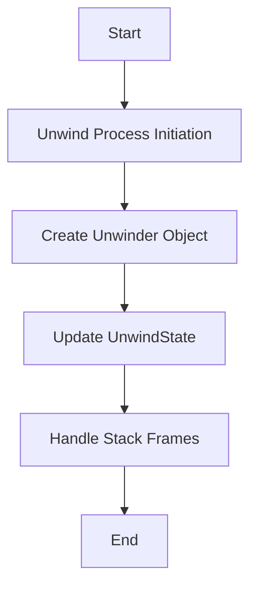

# Overview

Unwind refers to the process of gathering the current stack trace in a relatively fast manner. This document explores the various components and functions involved in the unwind process.

# Unwinder Class

The <SwmToken path="torch/csrc/profiler/unwind/unwinder.h" pos="13:2:2" line-data="struct Unwinder {">`Unwinder`</SwmToken> class encapsulates the logic for unwinding the stack, including handling different patterns of stack frames.

<SwmSnippet path="/torch/csrc/profiler/unwind/unwinder.h" line="13">

---

The <SwmToken path="torch/csrc/profiler/unwind/unwinder.h" pos="13:2:2" line-data="struct Unwinder {">`Unwinder`</SwmToken> class constructor initializes the unwinder with actions for the stack pointer (rsp), instruction pointer (rip), and base pointer (rbp). It also includes checks to ensure the validity of these actions.

```c
struct Unwinder {
  Unwinder(Action rsp, Action rip, Action rbp)
      : kind_(rip.kind == A_UNDEFINED ? END : STANDARD),
        reg_(rsp.reg),
        off_(rsp.data),
        rip_off_(rip.data),
        rbp_off_(
            rbp.kind == A_UNDEFINED ? std::numeric_limits<int64_t>::max()
                                    : rbp.data),
        deref_(rsp.kind == A_REG_PLUS_DATA_DEREF) {
    check(rsp.reg == D_RSP || rsp.reg == D_RBP);
    check(rip.kind == A_UNDEFINED || rip.kind == A_LOAD_CFA_OFFSET);
    if (rsp.kind == A_REG_PLUS_DATA) {
      check(rbp.kind == A_LOAD_CFA_OFFSET || rbp.kind == A_UNDEFINED);
    } else if (rsp.kind == A_REG_PLUS_DATA_DEREF) {
      if (rbp.kind == A_REG_PLUS_DATA_DEREF) {
        check(rbp.reg == rsp.reg);
        rbp_off_ -= rsp.data;
      } else {
        check(rbp.kind == A_UNDEFINED);
      }
```

---

</SwmSnippet>

# <SwmToken path="torch/csrc/profiler/unwind/unwinder.h" pos="54:1:1" line-data="  UnwindState run(const UnwindState&amp; cur) const {">`UnwindState`</SwmToken> Structure

The <SwmToken path="torch/csrc/profiler/unwind/unwinder.h" pos="54:1:1" line-data="  UnwindState run(const UnwindState&amp; cur) const {">`UnwindState`</SwmToken> structure holds the state of the stack, including the instruction pointer (rip), base pointer (rbp), and stack pointer (rsp).

# <SwmToken path="torch/csrc/profiler/unwind/unwind.cpp" pos="94:3:3" line-data="  Unwinder unwinderFor(uint64_t addr) const {">`unwinderFor`</SwmToken> Function

The function <SwmToken path="torch/csrc/profiler/unwind/unwind.cpp" pos="94:3:3" line-data="  Unwinder unwinderFor(uint64_t addr) const {">`unwinderFor`</SwmToken> is responsible for creating an <SwmToken path="torch/csrc/profiler/unwind/unwinder.h" pos="13:2:2" line-data="struct Unwinder {">`Unwinder`</SwmToken> object for a given address.

<SwmSnippet path="/torch/csrc/profiler/unwind/unwind.cpp" line="94">

---

The <SwmToken path="torch/csrc/profiler/unwind/unwind.cpp" pos="94:3:3" line-data="  Unwinder unwinderFor(uint64_t addr) const {">`unwinderFor`</SwmToken> function reads the frame description entry (FDE) data and the table state to create an <SwmToken path="torch/csrc/profiler/unwind/unwind.cpp" pos="94:1:1" line-data="  Unwinder unwinderFor(uint64_t addr) const {">`Unwinder`</SwmToken> object for a given address.

```c++
  Unwinder unwinderFor(uint64_t addr) const {
    void* fde_data = eh_frame_hdr_.entryForAddr(addr);
    FDE fde(fde_data, name().c_str(), load_bias());
    TableState state = fde.readUpTo(addr);
    return Unwinder(state.cfa, state.registers[D_RIP], state.registers[D_RBP]);
  }
```

---

</SwmSnippet>

# run Method

The <SwmToken path="torch/csrc/profiler/unwind/unwinder.h" pos="54:3:3" line-data="  UnwindState run(const UnwindState&amp; cur) const {">`run`</SwmToken> method in the <SwmToken path="torch/csrc/profiler/unwind/unwinder.h" pos="13:2:2" line-data="struct Unwinder {">`Unwinder`</SwmToken> class updates the <SwmToken path="torch/csrc/profiler/unwind/unwinder.h" pos="54:1:1" line-data="  UnwindState run(const UnwindState&amp; cur) const {">`UnwindState`</SwmToken> based on the current state and the unwinding actions.

<SwmSnippet path="/torch/csrc/profiler/unwind/unwinder.h" line="54">

---

The <SwmToken path="torch/csrc/profiler/unwind/unwinder.h" pos="54:3:3" line-data="  UnwindState run(const UnwindState&amp; cur) const {">`run`</SwmToken> method updates the <SwmToken path="torch/csrc/profiler/unwind/unwinder.h" pos="54:1:1" line-data="  UnwindState run(const UnwindState&amp; cur) const {">`UnwindState`</SwmToken> by adjusting the stack pointer (rsp), base pointer (rbp), and instruction pointer (rip) based on the current state and the unwinding actions.

```c
  UnwindState run(const UnwindState& cur) const {
    UnwindState r = cur;
    r.rsp = (reg_ == D_RSP ? cur.rsp : cur.rbp) + off_;
    r.rbp = rbp_off_ == std::numeric_limits<int64_t>::max()
        ? cur.rbp
        // NOLINTNEXTLINE(performance-no-int-to-ptr)
        : *(int64_t*)(r.rsp + rbp_off_);
    if (deref_) {
      // NOLINTNEXTLINE(performance-no-int-to-ptr)
      r.rsp = *(int64_t*)r.rsp;
    }
    // NOLINTNEXTLINE(performance-no-int-to-ptr)
    r.rip = *(int64_t*)(r.rsp + rip_off_);

    return r;
  }
```

---

</SwmSnippet>

# Main Functions

Several main functions are involved in the unwind process, including <SwmToken path="torch/csrc/profiler/unwind/unwind.cpp" pos="9:7:7" line-data="std::vector&lt;void*&gt; unwind() {">`unwind`</SwmToken>, <SwmToken path="torch/csrc/profiler/unwind/unwind.cpp" pos="29:0:0" line-data="Stats stats() {">`Stats`</SwmToken>, <SwmToken path="torch/csrc/profiler/unwind/unwind.cpp" pos="77:2:2" line-data="struct LibraryInfo {">`LibraryInfo`</SwmToken>, <SwmToken path="torch/csrc/profiler/unwind/unwind.cpp" pos="94:3:3" line-data="  Unwinder unwinderFor(uint64_t addr) const {">`unwinderFor`</SwmToken>, <SwmToken path="torch/csrc/profiler/unwind/unwind.cpp" pos="142:3:3" line-data="  void refreshLibraries() {">`refreshLibraries`</SwmToken>, <SwmToken path="torch/csrc/profiler/unwind/unwind.cpp" pos="317:2:2" line-data="struct Symbolizer {">`Symbolizer`</SwmToken>, <SwmToken path="torch/csrc/profiler/unwind/unwinder.h" pos="54:1:1" line-data="  UnwindState run(const UnwindState&amp; cur) const {">`UnwindState`</SwmToken>, and <SwmToken path="torch/csrc/profiler/unwind/unwinder.h" pos="13:2:2" line-data="struct Unwinder {">`Unwinder`</SwmToken>.

## unwind

The <SwmToken path="torch/csrc/profiler/unwind/unwind.cpp" pos="9:7:7" line-data="std::vector&lt;void*&gt; unwind() {">`unwind`</SwmToken> function is responsible for gathering the current stack trace.

<SwmSnippet path="/torch/csrc/profiler/unwind/unwind.cpp" line="9">

---

The <SwmToken path="torch/csrc/profiler/unwind/unwind.cpp" pos="9:7:7" line-data="std::vector&lt;void*&gt; unwind() {">`unwind`</SwmToken> function throws an error if the platform is not supported.

```c++
std::vector<void*> unwind() {
  TORCH_CHECK(
      false,
      "record_context_cpp is not support on non-linux non-x86_64 platforms");
}
```

---

</SwmSnippet>

<SwmSnippet path="/torch/csrc/profiler/unwind/unwind.cpp" line="289">

---

&nbsp;

```c++
std::vector<void*> unwind() {
  std::vector<void*> frames;
  unwind_entry(&frames);
  return frames;
}
```

---

</SwmSnippet>

## stats

<SwmSnippet path="torch/csrc/profiler/unwind/unwind.cpp" line="494">

---

The `stats` function provides statistics related to the unwinding process, such as the number of hits, misses, and resets.

```
Stats stats() {
  return unwind_cache.stats();
}
```

---

</SwmSnippet>

## <SwmToken path="torch/csrc/profiler/unwind/unwind.cpp" pos="77:2:2" line-data="struct LibraryInfo {">`LibraryInfo`</SwmToken>

The <SwmToken path="torch/csrc/profiler/unwind/unwind.cpp" pos="77:2:2" line-data="struct LibraryInfo {">`LibraryInfo`</SwmToken> class holds information about a library, including its name, load bias, and last address. It also provides a method to get an <SwmToken path="torch/csrc/profiler/unwind/unwinder.h" pos="13:2:2" line-data="struct Unwinder {">`Unwinder`</SwmToken> for a given address.

<SwmSnippet path="/torch/csrc/profiler/unwind/unwind.cpp" line="77">

---

The <SwmToken path="torch/csrc/profiler/unwind/unwind.cpp" pos="77:2:2" line-data="struct LibraryInfo {">`LibraryInfo`</SwmToken> class constructor initializes the library information and provides the <SwmToken path="torch/csrc/profiler/unwind/unwind.cpp" pos="94:3:3" line-data="  Unwinder unwinderFor(uint64_t addr) const {">`unwinderFor`</SwmToken> method to create an <SwmToken path="torch/csrc/profiler/unwind/unwind.cpp" pos="94:1:1" line-data="  Unwinder unwinderFor(uint64_t addr) const {">`Unwinder`</SwmToken> object for a given address.

```c++
struct LibraryInfo {
  LibraryInfo(
      std::string name,
      uint64_t load_bias,
      uint64_t last_addr,
      void* eh_frame_hdr_ptr_)
      : name_(std::move(name)),
        load_bias_(load_bias),
        last_addr_(last_addr),
        eh_frame_hdr_(eh_frame_hdr_ptr_) {}

  uint64_t load_bias() const {
    return load_bias_;
  }
  uint64_t last_addr() const {
    return last_addr_;
  }
  Unwinder unwinderFor(uint64_t addr) const {
    void* fde_data = eh_frame_hdr_.entryForAddr(addr);
    FDE fde(fde_data, name().c_str(), load_bias());
    TableState state = fde.readUpTo(addr);
```

---

</SwmSnippet>

## <SwmToken path="torch/csrc/profiler/unwind/unwind.cpp" pos="142:3:3" line-data="  void refreshLibraries() {">`refreshLibraries`</SwmToken>

The <SwmToken path="torch/csrc/profiler/unwind/unwind.cpp" pos="142:3:3" line-data="  void refreshLibraries() {">`refreshLibraries`</SwmToken> function in the <SwmToken path="torch/csrc/profiler/unwind/unwind.cpp" pos="150:8:8" line-data="          auto self = (UnwindCache*)data;">`UnwindCache`</SwmToken> class refreshes the list of libraries and their unwind information by iterating over the program headers.

<SwmSnippet path="/torch/csrc/profiler/unwind/unwind.cpp" line="142">

---

The <SwmToken path="torch/csrc/profiler/unwind/unwind.cpp" pos="142:3:3" line-data="  void refreshLibraries() {">`refreshLibraries`</SwmToken> function clears the current library and IP cache and iterates over the program headers to refresh the list of libraries and their unwind information.

```c++
  void refreshLibraries() {
    ++stats_.resets;
    all_libraries_.clear();
    ip_cache_.clear();
    dl_iterate_phdr(
        [](struct dl_phdr_info* info,
           size_t size [[maybe_unused]],
           void* data) {
          auto self = (UnwindCache*)data;
          uint64_t last_addr = 0;
          auto segments = (Elf64_Phdr*)info->dlpi_phdr;
          for (auto i : c10::irange(info->dlpi_phnum)) {
            if (segments[i].p_type == PT_LOAD) {
              auto begin = ((uint64_t)info->dlpi_addr + segments[i].p_vaddr);
              auto end = (begin + segments[i].p_memsz);
              last_addr = std::max(end, last_addr);
            }
            if (segments[i].p_type == PT_GNU_EH_FRAME) {
              std::string library_name = info->dlpi_name;
              if (library_name.empty()) {
                library_name = process_name();
```

---

</SwmSnippet>

## Symbolizer

The <SwmToken path="torch/csrc/profiler/unwind/unwind.cpp" pos="317:2:2" line-data="struct Symbolizer {">`Symbolizer`</SwmToken> class is responsible for symbolizing addresses to provide human-readable function names and file locations. It uses the <SwmToken path="torch/csrc/profiler/unwind/unwind.cpp" pos="323:8:8" line-data="      TORCH_WARN(&quot;Use custom addr2line binary: &quot;, addr2line_binary_);">`addr2line`</SwmToken> binary to achieve this.

<SwmSnippet path="/torch/csrc/profiler/unwind/unwind.cpp" line="317">

---

The <SwmToken path="torch/csrc/profiler/unwind/unwind.cpp" pos="317:2:2" line-data="struct Symbolizer {">`Symbolizer`</SwmToken> class constructor initializes the <SwmToken path="torch/csrc/profiler/unwind/unwind.cpp" pos="323:8:8" line-data="      TORCH_WARN(&quot;Use custom addr2line binary: &quot;, addr2line_binary_);">`addr2line`</SwmToken> binary and provides methods to symbolize addresses.

```c++
struct Symbolizer {
  Symbolizer() {
    auto envar = std::getenv("TORCH_ADDR2LINE_BINARY");
    if (envar != nullptr) {
      // currently we take user's input as is without checking
      addr2line_binary_ = envar;
      TORCH_WARN("Use custom addr2line binary: ", addr2line_binary_);
    } else {
      addr2line_binary_ = "addr2line"; // default
    }
  }
  static std::lock_guard<std::mutex> guard() {
    static std::mutex mutex;
    return std::lock_guard<std::mutex>(mutex);
  }
  static Symbolizer& get() {
    static Symbolizer singleton;
    return singleton;
  }

  void request(void* addr) {
```

---

</SwmSnippet>

## <SwmToken path="torch/csrc/profiler/unwind/unwinder.h" pos="54:1:1" line-data="  UnwindState run(const UnwindState&amp; cur) const {">`UnwindState`</SwmToken>

The <SwmToken path="torch/csrc/profiler/unwind/unwinder.h" pos="54:1:1" line-data="  UnwindState run(const UnwindState&amp; cur) const {">`UnwindState`</SwmToken> structure holds the state of the stack, including the instruction pointer (rip), base pointer (rbp), and stack pointer (rsp).

## Unwinder

The <SwmToken path="torch/csrc/profiler/unwind/unwinder.h" pos="13:2:2" line-data="struct Unwinder {">`Unwinder`</SwmToken> class encapsulates the logic for unwinding the stack. It handles different patterns of stack frames and updates the <SwmToken path="torch/csrc/profiler/unwind/unwinder.h" pos="54:1:1" line-data="  UnwindState run(const UnwindState&amp; cur) const {">`UnwindState`</SwmToken> based on the current state and the unwinding actions.

<SwmSnippet path="/torch/csrc/profiler/unwind/unwinder.h" line="13">

---

The <SwmToken path="torch/csrc/profiler/unwind/unwinder.h" pos="13:2:2" line-data="struct Unwinder {">`Unwinder`</SwmToken> class constructor initializes the unwinder with actions for the stack pointer (rsp), instruction pointer (rip), and base pointer (rbp). It also includes checks to ensure the validity of these actions.

```c
struct Unwinder {
  Unwinder(Action rsp, Action rip, Action rbp)
      : kind_(rip.kind == A_UNDEFINED ? END : STANDARD),
        reg_(rsp.reg),
        off_(rsp.data),
        rip_off_(rip.data),
        rbp_off_(
            rbp.kind == A_UNDEFINED ? std::numeric_limits<int64_t>::max()
                                    : rbp.data),
        deref_(rsp.kind == A_REG_PLUS_DATA_DEREF) {
    check(rsp.reg == D_RSP || rsp.reg == D_RBP);
    check(rip.kind == A_UNDEFINED || rip.kind == A_LOAD_CFA_OFFSET);
    if (rsp.kind == A_REG_PLUS_DATA) {
      check(rbp.kind == A_LOAD_CFA_OFFSET || rbp.kind == A_UNDEFINED);
    } else if (rsp.kind == A_REG_PLUS_DATA_DEREF) {
      if (rbp.kind == A_REG_PLUS_DATA_DEREF) {
        check(rbp.reg == rsp.reg);
        rbp_off_ -= rsp.data;
      } else {
        check(rbp.kind == A_UNDEFINED);
      }
```

---

</SwmSnippet>

&nbsp;

*This is an auto-generated document by Swimm AI 🌊 and has not yet been verified by a human*

<SwmMeta version="3.0.0" repo-id="Z2l0aHViJTNBJTNBcHl0b3JjaC1hdXRvZG9jcy1kZW1vJTNBJTNBU3dpbW0tRGVtbw==" repo-name="pytorch-autodocs-demo"><sup>Powered by [Swimm](https://app.swimm.io/)</sup></SwmMeta>
