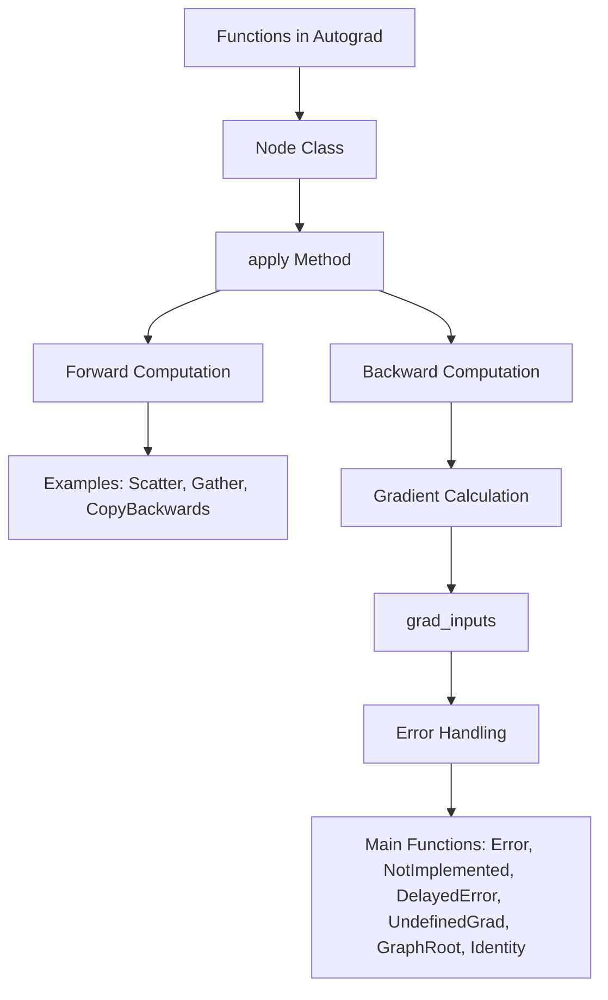

# Functions in Autograd

Functions in Autograd are used to define operations that are part of the computational graph for automatic differentiation. They are implemented as classes derived from the `Node` class, which represents a node in the computational graph. Each function class typically overrides the <SwmToken path="torch/csrc/autograd/functions/basic_ops.h" pos="20:3:3" line-data="  variable_list apply(variable_list&amp;&amp; inputs) override;">`apply`</SwmToken> method, which defines the forward computation and returns the result. These functions also handle the backward computation, which is essential for calculating gradients during backpropagation. Examples of such functions include <SwmToken path="torch/_inductor/ir.py" pos="648:2:2" line-data="class Scatter(Pointwise):">`Scatter`</SwmToken>, <SwmToken path="torch/backends/_nnapi/serializer.py" pos="89:1:1" line-data="    GATHER = 51">`GATHER`</SwmToken>, and <SwmToken path="torch/csrc/autograd/functions/tensor.h" pos="16:4:4" line-data="struct TORCH_API CopyBackwards : public Node {">`CopyBackwards`</SwmToken>, each serving specific purposes in the graph.

# <SwmToken path="torch/csrc/autograd/functions/tensor.h" pos="89:6:6" line-data="// With the TensorGeometry information we can use `as_strided` call which">`TensorGeometry`</SwmToken> and <SwmToken path="torch/csrc/autograd/functions/tensor.h" pos="89:17:17" line-data="// With the TensorGeometry information we can use `as_strided` call which">`as_strided`</SwmToken>

This file contains comments explaining the use of <SwmToken path="torch/csrc/autograd/functions/tensor.h" pos="89:6:6" line-data="// With the TensorGeometry information we can use `as_strided` call which">`TensorGeometry`</SwmToken> and <SwmToken path="torch/csrc/autograd/functions/tensor.h" pos="89:17:17" line-data="// With the TensorGeometry information we can use `as_strided` call which">`as_strided`</SwmToken> calls, which are part of the forward view operations in Autograd functions.

<SwmSnippet path="/torch/csrc/autograd/functions/tensor.h" line="89">

---

The <SwmToken path="torch/csrc/autograd/functions/tensor.h" pos="89:17:17" line-data="// With the TensorGeometry information we can use `as_strided` call which">`as_strided`</SwmToken> call is more efficient for recovering views in backward operations. In <SwmToken path="torch/csrc/autograd/functions/tensor.h" pos="99:4:6" line-data="// In CPU/CUDA case where we support efficient as_strided implementation,">`CPU/CUDA`</SwmToken> cases, <SwmToken path="torch/csrc/autograd/functions/tensor.h" pos="100:2:2" line-data="// grad_view_n can be calculated through 1 step.">`grad_view_n`</SwmToken> can be calculated through one step using <SwmToken path="torch/csrc/autograd/functions/tensor.h" pos="102:6:17" line-data="//   grad_view_n = grad_base.as_strided(view_sizes, view_strides, view_offset);">`grad_base.as_strided(view_sizes, view_strides, view_offset)`</SwmToken>. However, in the XLA backend, where full support for <SwmToken path="torch/csrc/autograd/functions/tensor.h" pos="89:17:17" line-data="// With the TensorGeometry information we can use `as_strided` call which">`as_strided`</SwmToken> is not available, a chained lambda function <SwmToken path="torch/csrc/autograd/functions/tensor.h" pos="105:18:18" line-data="// it has to save a chained lambda function view_fn_, to exactly">`view_fn_`</SwmToken> is used to replay the view operations done in the forward pass.

```c
// With the TensorGeometry information we can use `as_strided` call which
// is more efficient to recover views in backward.
//
// For example:
//   view_1 = view_op_1(base)
//   view_2 = view_op_2(view_1)
//   ...
//   view_n = view_op_n(view_n-1)
//   view_n = inplace_op(view_n)
//
// In CPU/CUDA case where we support efficient as_strided implementation,
// grad_view_n can be calculated through 1 step.
//
//   grad_view_n = grad_base.as_strided(view_sizes, view_strides, view_offset);
//
// But in XLA backend where we don't have full support of as_strided,
// it has to save a chained lambda function view_fn_, to exactly
// replay how the view was done in forward.
//
//   view_fn_ = view_op_n(...(view_op_2(view_op_1())))
//   grad_view_n = view_fn_(grad_base)
```

---

</SwmSnippet>

# Main Functions

There are several main functions in this folder. Some of them are <SwmToken path="torch/csrc/autograd/functions/basic_ops.h" pos="14:4:4" line-data="struct TORCH_API Error : public Node {">`Error`</SwmToken>, <SwmToken path="torch/csrc/autograd/functions/basic_ops.h" pos="33:4:4" line-data="struct TORCH_API NotImplemented : public Error {">`NotImplemented`</SwmToken>, <SwmToken path="torch/csrc/autograd/functions/basic_ops.h" pos="45:4:4" line-data="struct TORCH_API DelayedError : public Node {">`DelayedError`</SwmToken>, <SwmToken path="torch/csrc/autograd/functions/basic_ops.h" pos="57:4:4" line-data="struct TORCH_API UndefinedGrad : public Node {">`UndefinedGrad`</SwmToken>, <SwmToken path="torch/csrc/autograd/functions/basic_ops.h" pos="80:4:4" line-data="struct TORCH_API GraphRoot : public Node {">`GraphRoot`</SwmToken>, and <SwmToken path="torch/csrc/autograd/functions/basic_ops.h" pos="103:4:4" line-data="struct TORCH_API Identity : public Node {">`Identity`</SwmToken>. We will dive a little into each of these functions.

## Error

The <SwmToken path="torch/csrc/autograd/functions/basic_ops.h" pos="14:4:4" line-data="struct TORCH_API Error : public Node {">`Error`</SwmToken> function is used to handle errors in the computational graph. It inherits from the `Node` class and overrides the <SwmToken path="torch/csrc/autograd/functions/basic_ops.h" pos="20:3:3" line-data="  variable_list apply(variable_list&amp;&amp; inputs) override;">`apply`</SwmToken> and <SwmToken path="torch/csrc/autograd/functions/basic_ops.h" pos="22:3:3" line-data="  void compiled_args(CompiledNodeArgs&amp; args) override;">`compiled_args`</SwmToken> methods to manage error messages and propagate them through the graph.

<SwmSnippet path="/torch/csrc/autograd/functions/basic_ops.h" line="14">

---

The <SwmToken path="torch/csrc/autograd/functions/basic_ops.h" pos="14:4:4" line-data="struct TORCH_API Error : public Node {">`Error`</SwmToken> function's implementation shows how it manages error messages and propagates them through the graph.

```c
struct TORCH_API Error : public Node {
  Error(std::string msg, edge_list&& next_edges)
      : Node(std::move(next_edges)), msg(std::move(msg)) {}

  Error(std::string msg) : msg(std::move(msg)) {}

  variable_list apply(variable_list&& inputs) override;

  void compiled_args(CompiledNodeArgs& args) override;
  variable_list apply_with_saved(
      const variable_list& inputs,
      SwapSavedVariables& saved) override;

  std::string msg;
};
```

---

</SwmSnippet>

## <SwmToken path="torch/csrc/autograd/functions/basic_ops.h" pos="33:4:4" line-data="struct TORCH_API NotImplemented : public Error {">`NotImplemented`</SwmToken>

The <SwmToken path="torch/csrc/autograd/functions/basic_ops.h" pos="33:4:4" line-data="struct TORCH_API NotImplemented : public Error {">`NotImplemented`</SwmToken> function is a specialized version of <SwmToken path="torch/csrc/autograd/functions/basic_ops.h" pos="14:4:4" line-data="struct TORCH_API Error : public Node {">`Error`</SwmToken> that indicates a derivative for a forward function is not implemented.

<SwmSnippet path="/torch/csrc/autograd/functions/basic_ops.h" line="33">

---

The <SwmToken path="torch/csrc/autograd/functions/basic_ops.h" pos="33:4:4" line-data="struct TORCH_API NotImplemented : public Error {">`NotImplemented`</SwmToken> function's implementation shows how it provides clear error messages for unimplemented backward operations.

```c
struct TORCH_API NotImplemented : public Error {
  NotImplemented(const std::string& forward_fn, edge_list&& next_edges)
      : Error(
            "derivative for " + forward_fn + " is not implemented",
            std::move(next_edges)) {}

  NotImplemented(const std::string& forward_fn)
      : Error("derivative for " + forward_fn + " is not implemented") {}
};
```

---

</SwmSnippet>

## <SwmToken path="torch/csrc/autograd/functions/basic_ops.h" pos="45:4:4" line-data="struct TORCH_API DelayedError : public Node {">`DelayedError`</SwmToken>

<SwmSnippet path="/torch/csrc/autograd/functions/basic_ops.h" line="45">

---

The <SwmToken path="torch/csrc/autograd/functions/basic_ops.h" pos="45:4:4" line-data="struct TORCH_API DelayedError : public Node {">`DelayedError`</SwmToken> function acts as an identity in the forward pass and an error in the backward pass. It is used to implement the <SwmToken path="torch/csrc/autograd/functions/basic_ops.h" pos="44:2:3" line-data="// @once_differentiable">`@once_differentiable`</SwmToken> decorator, ensuring that certain operations are only differentiable once.

```c
struct TORCH_API DelayedError : public Node {
  DelayedError(std::string msg, int64_t num_inputs) : msg(std::move(msg)) {
    for (const auto _ [[maybe_unused]] : c10::irange(num_inputs)) {
      add_input_metadata(Node::undefined_input());
    }
  }

  variable_list apply(variable_list&& inputs) override;

  std::string msg;
};
```

---

</SwmSnippet>

## <SwmToken path="torch/csrc/autograd/functions/basic_ops.h" pos="57:4:4" line-data="struct TORCH_API UndefinedGrad : public Node {">`UndefinedGrad`</SwmToken>

<SwmSnippet path="/torch/csrc/autograd/functions/basic_ops.h" line="57">

---

The <SwmToken path="torch/csrc/autograd/functions/basic_ops.h" pos="57:4:4" line-data="struct TORCH_API UndefinedGrad : public Node {">`UndefinedGrad`</SwmToken> function represents a node with undefined gradients. It is used to handle cases where gradients are not defined for certain operations, ensuring the computational graph remains consistent.

```c
struct TORCH_API UndefinedGrad : public Node {
  UndefinedGrad() {
    add_input_metadata(Node::undefined_input());
  }

  variable_list apply(variable_list&& inputs) override;
};
```

---

</SwmSnippet>

## <SwmToken path="torch/csrc/autograd/functions/basic_ops.h" pos="80:4:4" line-data="struct TORCH_API GraphRoot : public Node {">`GraphRoot`</SwmToken>

<SwmSnippet path="/torch/csrc/autograd/functions/basic_ops.h" line="80">

---

The <SwmToken path="torch/csrc/autograd/functions/basic_ops.h" pos="80:4:4" line-data="struct TORCH_API GraphRoot : public Node {">`GraphRoot`</SwmToken> function represents the root of the computational graph. It stores the outputs of the graph and ensures that calls to <SwmToken path="torch/csrc/autograd/functions/basic_ops.h" pos="83:9:11" line-data="    // Ensures calls to stream() on a GraphRoot instance reflect current">`stream()`</SwmToken> reflect the current state of the root gradient tensors.

```c
struct TORCH_API GraphRoot : public Node {
  GraphRoot(edge_list functions, variable_list inputs)
      : Node(std::move(functions)), outputs(std::move(inputs)) {
    // Ensures calls to stream() on a GraphRoot instance reflect current
    // stream(s) on devices of root grad tensors at the time the instance is
    // constructed.
    for (const auto& t : outputs) {
      add_input_metadata(t);
    }
  }

  variable_list apply(variable_list&& inputs) override {
    return outputs;
  }

  void compiled_args(CompiledNodeArgs& args) override;
  variable_list apply_with_saved(
      const variable_list& inputs,
      SwapSavedVariables& saved) override;

```

---

</SwmSnippet>

## Identity

<SwmSnippet path="/torch/csrc/autograd/functions/basic_ops.h" line="103">

---

The <SwmToken path="torch/csrc/autograd/functions/basic_ops.h" pos="103:4:4" line-data="struct TORCH_API Identity : public Node {">`Identity`</SwmToken> function is a simple node that returns its inputs as outputs. It is used in the computational graph to represent operations that do not change the input data.

```c
struct TORCH_API Identity : public Node {
  variable_list apply(variable_list&& inputs) override;
};
```

---

</SwmSnippet>

&nbsp;

*This is an auto-generated document by Swimm AI 🌊 and has not yet been verified by a human*

<SwmMeta version="3.0.0" repo-id="Z2l0aHViJTNBJTNBcHl0b3JjaC1hdXRvZG9jcy1kZW1vJTNBJTNBU3dpbW0tRGVtbw==" repo-name="pytorch-autodocs-demo"><sup>Powered by [Swimm](https://app.swimm.io/)</sup></SwmMeta>
