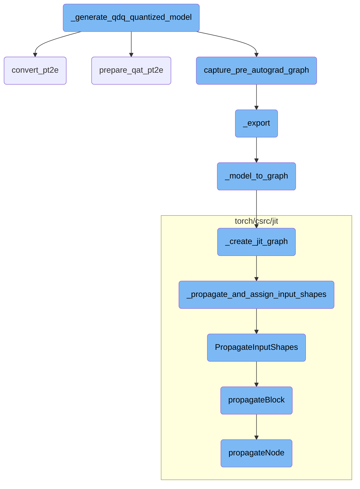
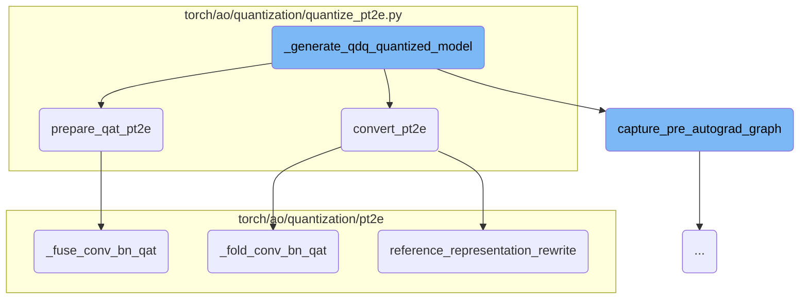
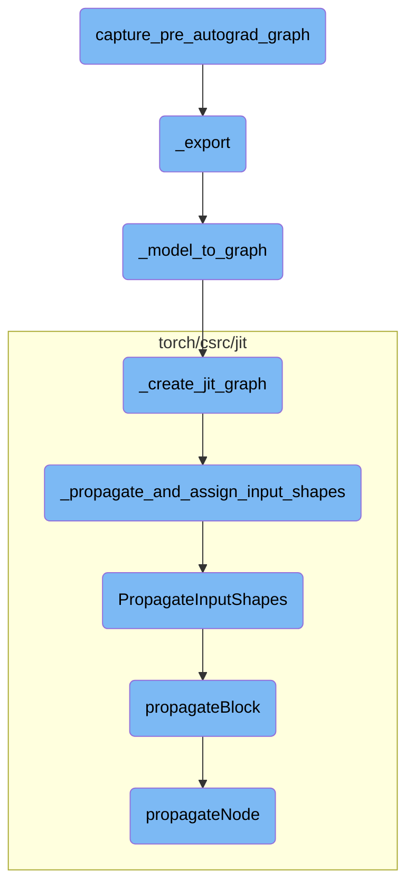

This document provides an overview of the process involved in generating a quantized model using Quantize-DeQuantize (QDQ) operations. The process includes capturing the pre-autograd graph, preparing the model for Quantization Aware Training (QAT) if needed, and converting the model to a quantized version.

The flow starts by capturing the model's computational graph before any automatic differentiation occurs. If Quantization Aware Training (QAT) is required, the model is prepared accordingly. The model is then moved to evaluation mode and converted into a quantized model. This involves several steps like folding convolution and batch normalization layers, and optionally rewriting the model to use a reference representation.

Here is a high level diagram of the flow, showing only the most important functions:



# Flow drill down

First, we'll zoom into this section of the flow:



<SwmSnippet path="/torch/testing/_internal/common_quantization.py" line="2947">

---

## \_generate_qdq_quantized_model

The function `_generate_qdq_quantized_model` is responsible for generating a quantized model using Quantize-DeQuantize (QDQ) operations. It first captures the pre-autograd graph of the model using `capture_pre_autograd_graph`. Depending on whether Quantization Aware Training (QAT) is enabled, it prepares the model using either `prepare_qat_pt2e` or `prepare_pt2e`. The prepared model is then moved to evaluation mode and converted to a quantized model using `convert_pt2e`.

```python
    maybe_no_grad = contextlib.nullcontext() if is_qat else torch.no_grad()
    with maybe_no_grad:
        export_model = capture_pre_autograd_graph(
            mod,
            inputs,
        )
        quantizer = (
            quantizer if quantizer else get_default_quantizer(is_qat, is_dynamic)
        )
        prepare_model = (
            prepare_qat_pt2e(export_model, quantizer)
            if is_qat
            else prepare_pt2e(export_model, quantizer)
        )
        prepare_model(*inputs)
        torch.ao.quantization.move_exported_model_to_eval(prepare_model)
        convert_model = convert_pt2e(prepare_model)
        return convert_model
```

---

</SwmSnippet>

<SwmSnippet path="/torch/ao/quantization/quantize_pt2e.py" line="225">

---

## convert_pt2e

The function `convert_pt2e` converts a calibrated or trained model into a quantized model. It can produce a model with quantize-dequantize (QDQ) operations or a reference representation based on the flags provided. The function also handles folding of convolution and batch normalization layers using `_fold_conv_bn_qat` and applies various passes to optimize the graph.

```python
    torch._C._log_api_usage_once("quantization_api.quantize_pt2e.convert_pt2e")
    if not isinstance(use_reference_representation, bool):
        raise ValueError(
            "Unexpected argument type for `use_reference_representation`, "
            f"please make sure you intend to pass argument {use_reference_representation} to convert_pt2e"
        )
    original_graph_meta = model.meta
    model = _convert_to_reference_decomposed_fx(model)
    model = _fold_conv_bn_qat(model)

    pm = PassManager([DuplicateDQPass()])
    model = pm(model).graph_module

    pm = PassManager([PortNodeMetaForQDQ()])
    model = pm(model).graph_module

    if fold_quantize:
        constant_fold(model, _quant_node_constraint)

    if use_reference_representation:
        model = reference_representation_rewrite(model)
```

---

</SwmSnippet>

<SwmSnippet path="/torch/ao/quantization/quantize_pt2e.py" line="165">

---

## prepare_qat_pt2e

The function `prepare_qat_pt2e` prepares a model for Quantization Aware Training (QAT). It annotates the model with quantization information, validates it, and performs necessary fusions such as convolution and batch normalization fusion using `_fuse_conv_bn_qat`. The prepared model is then ready for QAT.

```python
    torch._C._log_api_usage_once("quantization_api.quantize_pt2e.prepare_qat_pt2e")
    original_graph_meta = model.meta
    node_name_to_scope = _get_node_name_to_scope(model)
    model = quantizer.transform_for_annotation(model)
    quantizer.annotate(model)
    quantizer.validate(model)
    # Perform fusion after annotate to avoid quantizing ops in the new
    # subgraph that don't need to be quantized
    # TODO: only fuse if conv and bn are both configured to be quantized
    _fuse_conv_bn_qat(model)
    model = prepare(model, node_name_to_scope, is_qat=True)
    model.meta.update(original_graph_meta)
    model = _disallow_eval_train(model)
    return model
```

---

</SwmSnippet>

<SwmSnippet path="/torch/ao/quantization/pt2e/qat_utils.py" line="619">

---

### \_fuse_conv_bn_qat

The function `_fuse_conv_bn_qat` fuses convolution and batch normalization layers in the model. This fusion is essential for optimizing the model for quantization. The function iterates over different convolution types and applies the fusion helper function to each.

```python
def _fuse_conv_bn_qat(m: GraphModule) -> GraphModule:
    has_bn = any(_is_bn_node(n) for n in m.graph.nodes)
    if not has_bn:
        return m
    is_cuda_options = [True, False] if torch.cuda.is_available() else [False]
    for is_cuda in is_cuda_options:
        m = _fuse_conv_bn_qat_helper(
            m, F.conv1d, _conv1d_bn_example_inputs, is_cuda=is_cuda
        )
        m = _fuse_conv_bn_qat_helper(
            m, F.conv2d, _conv2d_bn_example_inputs, is_cuda=is_cuda
        )
        m = _fuse_conv_bn_qat_helper(
            m, F.conv_transpose1d, _conv1d_bn_example_inputs, is_cuda=is_cuda
        )
        m = _fuse_conv_bn_qat_helper(
            m, F.conv_transpose2d, _conv2d_bn_example_inputs, is_cuda=is_cuda
        )
    return m
```

---

</SwmSnippet>

<SwmSnippet path="/torch/ao/quantization/pt2e/qat_utils.py" line="825">

---

### \_fold_conv_bn_qat

The function `_fold_conv_bn_qat` folds convolution and batch normalization layers in the model. This folding is crucial for reducing the computational complexity of the model. The function also removes unnecessary operations and eliminates dead code from the graph.

```python
def _fold_conv_bn_qat(m: GraphModule) -> GraphModule:
    has_bn = any(_is_bn_node(n) for n in m.graph.nodes)
    if not has_bn:
        return m
    is_cuda_options = [True, False] if torch.cuda.is_available() else [False]
    for is_cuda in is_cuda_options:
        m = _fold_conv_bn_qat_helper(
            m, F.conv1d, _quantized_conv1d_bn_example_inputs, is_cuda=is_cuda
        )
        m = _fold_conv_bn_qat_helper(
            m, F.conv2d, _quantized_conv2d_bn_example_inputs, is_cuda=is_cuda
        )
        m = _fold_conv_bn_qat_helper(
            m, F.conv_transpose1d, _quantized_conv1d_bn_example_inputs, is_cuda=is_cuda
        )
        m = _fold_conv_bn_qat_helper(
            m, F.conv_transpose2d, _quantized_conv2d_bn_example_inputs, is_cuda=is_cuda
        )

    # remove in place add from batchnorm tracking traning stats
    for node in m.graph.nodes:
```

---

</SwmSnippet>

<SwmSnippet path="/torch/ao/quantization/pt2e/representation/rewrite.py" line="808">

---

### reference_representation_rewrite

The function `reference_representation_rewrite` rewrites the model to use a reference representation. It replaces patterns in the model graph with optimized versions and recompiles the graph. This step is optional and is controlled by the `use_reference_representation` flag in `convert_pt2e`.

```python
def reference_representation_rewrite(model: GraphModule) -> GraphModule:
    remove_tensor_overload_for_qdq_ops(model)
    for rewrite_info in _REWRITE_INFO_LIST:
        example_inputs = rewrite_info.example_inputs
        pattern = rewrite_info.pattern
        replacement = rewrite_info.replacement
        pattern_post_trans = rewrite_info.pattern_post_trans
        replacement_post_trans = rewrite_info.replacement_post_trans
        pattern = _get_aten_graph_module_for_pattern(pattern, example_inputs)  # type: ignore[arg-type, assignment]
        remove_tensor_overload_for_qdq_ops(pattern)  # type: ignore[arg-type]
        replacement = _get_aten_graph_module_for_pattern(replacement, example_inputs)  # type: ignore[arg-type, assignment]
        remove_tensor_overload_for_qdq_ops(replacement)  # type: ignore[arg-type]
        if pattern_post_trans:
            pattern = pattern_post_trans(pattern)
        if replacement_post_trans:
            replacement = replacement_post_trans(replacement)
        pattern.recompile()  # type: ignore[attr-defined]
        replacement.recompile()  # type: ignore[attr-defined]
        matches = replace_pattern(model, pattern, replacement)
    return model
```

---

</SwmSnippet>

Now, lets zoom into this section of the flow:



<SwmSnippet path="/torch/_export/__init__.py" line="72">

---

## capture_pre_autograd_graph

The function `capture_pre_autograd_graph` is responsible for capturing the computational graph before the autograd (automatic differentiation) process begins. This is crucial for scenarios where the graph needs to be exported or analyzed without the modifications introduced by autograd. The function ensures that the graph is in its original state, preserving the structure and operations as defined by the model.

```python
def capture_pre_autograd_graph(
    f: torch.nn.Module,
    args: Tuple[Any],
    kwargs: Optional[Dict[str, Any]] = None,
    dynamic_shapes: Optional[Union[Dict[str, Any], Tuple[Any]]] = None,
) -> torch.nn.Module:
    """
    A helper function that is intended to trace a module before any pre-autograd
    decomposition is run. The produced module will be "non-functional" and
    composed of aten operators. Later this API will be deleted in favor of more general
    torch.export API.

    Args:
      f: nn.Module to be traced

      args: example positional inputs.

      kwargs: optional example keyword inputs.

      dynamic_shapes: Should either be:
         1) a dict from argument names of ``f`` to their dynamic shape specifications,
```

---

</SwmSnippet>

<SwmSnippet path="/torch/onnx/utils.py" line="1515">

---

## \_export

The `_export` function handles the export of a PyTorch model to the ONNX (Open Neural Network Exchange) format. This function takes care of various configurations and settings required for the export, such as handling dynamic axes, constant folding, and shape inference. It ensures that the model is correctly converted into an ONNX graph, which can then be used for inference in different environments.

```python
def _export(
    model,
    args,
    f,
    export_params=True,
    verbose=False,
    training=_C_onnx.TrainingMode.EVAL,
    input_names=None,
    output_names=None,
    operator_export_type=_C_onnx.OperatorExportTypes.ONNX,
    export_type=None,
    opset_version=None,
    do_constant_folding=True,
    dynamic_axes=None,
    keep_initializers_as_inputs=None,
    fixed_batch_size=False,
    custom_opsets=None,
    add_node_names=True,
    onnx_shape_inference=True,
    export_modules_as_functions=False,
    autograd_inlining=True,
```

---

</SwmSnippet>

<SwmSnippet path="/torch/onnx/utils.py" line="1130">

---

## \_model_to_graph

The `_model_to_graph` function converts a PyTorch model into an ONNX graph. It performs several optimizations and adjustments to ensure that the graph is compatible with ONNX. This includes handling input and output shapes, constant folding, and eliminating unused items. The function returns the ONNX graph along with a dictionary of parameters and the model's output.

```python
def _model_to_graph(
    model,
    args,
    verbose=False,
    input_names=None,
    output_names=None,
    operator_export_type=_C_onnx.OperatorExportTypes.ONNX,
    do_constant_folding=True,
    _disable_torch_constant_prop=False,
    fixed_batch_size=False,
    training=_C_onnx.TrainingMode.EVAL,
    dynamic_axes=None,
) -> tuple[
    _C.Graph,
    dict[str, torch.Tensor],
    torch.Tensor
    | tuple[torch.Tensor, ...]
    | list[torch.Tensor]
    | dict[str, torch.Tensor]
    | Any
    | None,
```

---

</SwmSnippet>

<SwmSnippet path="/torch/onnx/utils.py" line="1015">

---

## \_create_jit_graph

The `_create_jit_graph` function creates a JIT (Just-In-Time) graph from a PyTorch model. This involves tracing the model's operations and converting them into a TorchScript IR (Intermediate Representation) graph. The function also handles parameter extraction and shape propagation, ensuring that the resulting graph is ready for further processing or export.

```python
def _create_jit_graph(
    model: torch.nn.Module | torch.jit.ScriptFunction, args: Sequence[Any]
) -> tuple[_C.Graph, list[_C.IValue], Any | None, _C.ScriptModule | None]:
    if isinstance(model, (torch.jit.ScriptFunction, torch.jit.ScriptModule)):
        flattened_args = tuple(torch.jit._flatten(tuple(args))[0])
        _check_flatten_did_not_remove(args, flattened_args)
        torch_out = None

        if isinstance(model, torch.jit.ScriptModule):
            try:
                graph = model.forward.graph  # type: ignore[attr-defined]
            except AttributeError as e:
                raise RuntimeError("'forward' method must be a script method") from e
            _C._jit_pass_onnx_function_substitution(graph)
            freezed_module = _C._freeze_module(
                cast(_C.ScriptModule, model._c), preserveParameters=True
            )
            module, params = _C._jit_onnx_list_model_parameters(freezed_module)
            method_graph = module._get_method("forward").graph
            args_params = tuple(args) + tuple(params)
            param_count_list = _get_param_count_list(method_graph, args_params)
```

---

</SwmSnippet>

<SwmSnippet path="/torch/csrc/jit/python/script_init.cpp" line="461">

---

## \_propagate_and_assign_input_shapes

The `_propagate_and_assign_input_shapes` function propagates and assigns input shapes within a graph. This is essential for ensuring that all operations within the graph have the correct input shapes, which is necessary for accurate execution and optimization. The function can optionally perform shape propagation, which updates the shapes of all tensors in the graph based on the input shapes.

```c++
static std::shared_ptr<Graph> _propagate_and_assign_input_shapes(
    Graph& graph,
    const std::vector<at::Tensor>& inputs,
    const std::vector<int>& param_count_list,
    bool with_grad = false,
    bool propagate = true) {
  auto retval = graph.copy();
  setInputTensorTypes(
      *retval, fmap<IValue>(inputs), /*complete=*/true, param_count_list);
  if (propagate) {
    PropagateInputShapes(retval);
  }
  return retval;
}
```

---

</SwmSnippet>

<SwmSnippet path="/torch/csrc/jit/passes/shape_analysis.cpp" line="2147">

---

## PropagateInputShapes

The `PropagateInputShapes` function is responsible for propagating input shapes throughout the entire graph. It uses a `ShapePropagator` to traverse the graph's blocks and update the shapes of all tensors based on the input shapes. This ensures that the graph has consistent and accurate shape information, which is crucial for optimization and execution.

```c++
void PropagateInputShapes(const std::shared_ptr<Graph>& graph) {
  ShapePropagator(graph).propagateBlock(graph->block());
}
```

---

</SwmSnippet>

<SwmSnippet path="/torch/csrc/jit/passes/shape_analysis.cpp" line="59">

---

## propagateBlock

The `propagateBlock` function iterates over all nodes in a given block and propagates their shapes. It handles various types of nodes and ensures that each node's shape is correctly updated. If an error occurs during shape propagation, the function sets the node's type to unshaped, indicating that the shape could not be determined.

```c++
void PropertyPropBase::propagateBlock(Block* block, bool insert_expands) {
  for (Node* node : block->nodes()) {
    try {
      propagateNode(node, insert_expands);
    } catch (propagation_error& e) {
      setUnshapedType(node);
    } catch (std::exception& e) {
      throw(
          ErrorReport(node->sourceRange())
          << ExceptionMessage(e)
          << "\nThe above operation failed shape propagation in this context");
    }
  }
}
```

---

</SwmSnippet>

<SwmSnippet path="/torch/csrc/jit/passes/shape_analysis.cpp" line="586">

---

## propagateNode

The `propagateNode` function handles shape propagation for individual nodes within a graph. It processes different types of nodes, updating their shapes based on their inputs and operations. The function includes special handling for certain operations, such as tensor concatenation and tuple construction, ensuring that their shapes are correctly propagated.

```c++
  void propagateNode(Node* node, bool insert_expands = true) override {
    // Certain ops like resize_ change the input tensors size. Because our
    // analysis is flow invariant, we set any Tensor that can alias a resized
    // Tensor to the base Tensor Type without size information.
    if (setUnshapedTypeIfAliasResizedSet(node->inputs())) {
      return setUnshapedType(node);
    }

    // These don't require the types, and have complicated schema. Return early
    // after we process them.
    switch (node->kind()) {
      case prim::If:
        return processIf(node);
      case prim::Loop: {
        return processLoop(node);
      }
      case aten::Bool:
      case aten::Int:
      case aten::Float:
      case aten::ScalarImplicit:
      case aten::FloatImplicit:
```

---

</SwmSnippet>

&nbsp;

*This is an auto-generated document by Swimm AI 🌊 and has not yet been verified by a human*

<SwmMeta version="3.0.0" repo-id="Z2l0aHViJTNBJTNBcHl0b3JjaC1hdXRvZG9jcy1kZW1vJTNBJTNBU3dpbW0tRGVtbw==" repo-name="pytorch-autodocs-demo"><sup>Powered by [Swimm](https://app.swimm.io/)</sup></SwmMeta>
