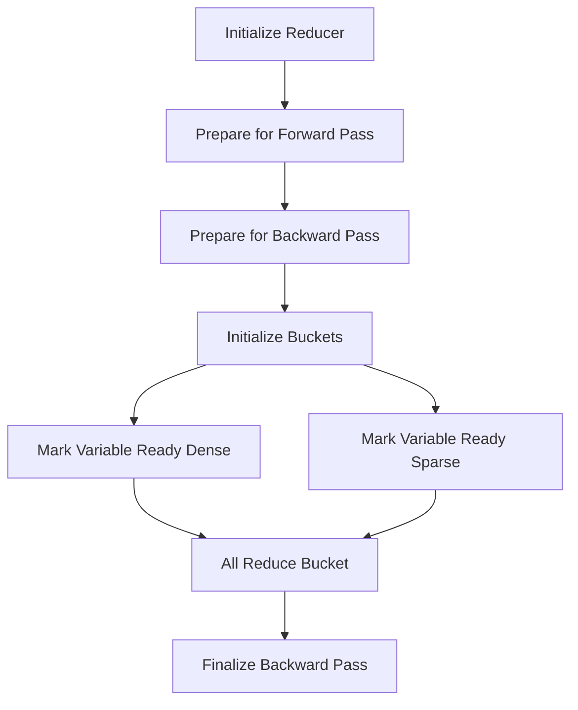

# Getting Started with Gradient Reducer

The <SwmToken path="torch/csrc/distributed/c10d/reducer.cpp" pos="90:0:0" line-data="Reducer::Reducer(">`Reducer`</SwmToken> class is responsible for handling the reduction of gradients across multiple devices in a distributed training setup. It ensures that gradients are properly synchronized and reduced across different devices, which is essential for maintaining model consistency during training. The <SwmToken path="torch/csrc/distributed/c10d/reducer.cpp" pos="90:0:0" line-data="Reducer::Reducer(">`Reducer`</SwmToken> also provides mechanisms to handle sparse gradients and supports mixed precision training.

## Initializing the Reducer

The <SwmToken path="torch/csrc/distributed/c10d/reducer.cpp" pos="90:0:0" line-data="Reducer::Reducer(">`Reducer`</SwmToken> constructor initializes the reducer with parameters, bucket indices, and other configurations necessary for gradient reduction.

<SwmSnippet path="/torch/csrc/distributed/c10d/reducer.cpp" line="90">

---

The constructor sets up the initial state of the <SwmToken path="torch/csrc/distributed/c10d/reducer.cpp" pos="90:0:0" line-data="Reducer::Reducer(">`Reducer`</SwmToken> with the provided parameters and configurations.

```c++
Reducer::Reducer(
    std::vector<at::Tensor> params,
    std::vector<std::vector<size_t>> bucket_indices,
    const std::vector<size_t>& per_bucket_size_limits,
    c10::intrusive_ptr<c10d::ProcessGroup> process_group,
    std::vector<bool> expect_sparse_gradients,
    int64_t bucket_bytes_cap,
    bool find_unused_parameters,
    bool gradient_as_bucket_view,
    std::unordered_map<size_t, std::string> param_names,
    int64_t first_bucket_bytes_cap)
    : params_(std::move(params)),
      process_group_(std::move(process_group)),
      expect_sparse_gradients_(std::move(expect_sparse_gradients)),
      expect_autograd_hooks_(false),
      require_finalize_(false),
      next_bucket_(0),
      has_marked_unused_parameters_(false),
      find_unused_parameters_(find_unused_parameters),
      gradient_as_bucket_view_(gradient_as_bucket_view),
      local_used_map_reduced_(false),
```

---

</SwmSnippet>

## Preparing for Forward Pass

The <SwmToken path="torch/csrc/distributed/c10d/reducer.cpp" pos="1316:4:4" line-data="void Reducer::prepare_for_forward() {">`prepare_for_forward`</SwmToken> method prepares the reducer for the forward pass by incrementing the iteration count and recording the start time if runtime stats collection is enabled.

<SwmSnippet path="/torch/csrc/distributed/c10d/reducer.cpp" line="1316">

---

This method is called before the forward pass to set up necessary state and metrics.

```c++
void Reducer::prepare_for_forward() {
  std::lock_guard<std::mutex> lock(mutex_);
  num_iterations_++;
  if (should_collect_runtime_stats()) {
    record_forward_compute_start_time();
  }
}
```

---

</SwmSnippet>

## Preparing for Backward Pass

The <SwmToken path="torch/csrc/distributed/c10d/reducer.cpp" pos="1425:4:4" line-data="void Reducer::prepare_for_backward(">`prepare_for_backward`</SwmToken> method prepares the reducer for the backward pass by resetting accounting variables and searching for unused parameters if necessary.

<SwmSnippet path="/torch/csrc/distributed/c10d/reducer.cpp" line="1425">

---

This method is called before the backward pass to reset state and prepare for gradient reduction.

```c++
void Reducer::prepare_for_backward(
    const std::vector<torch::autograd::Variable>& outputs) {
  std::lock_guard<std::mutex> lock(mutex_);

  backward_compute_start_time_ = current_time_in_nanos();
  if (should_collect_runtime_stats()) {
    record_backward_compute_start_time();
  }

  // Reset accounting.
  expect_autograd_hooks_ = true;
  // Clear gradient ready order as it can be different in the next iteration.
  grad_ready_order_indices_.clear();

  reset_bucket_counting();

  // Reset unused parameter accounting.
  has_marked_unused_parameters_ = false;
  // Reset per iteration marked ready parameters.
  perIterationReadyParams_.clear();
```

---

</SwmSnippet>

## Initializing Buckets

The <SwmToken path="torch/csrc/distributed/c10d/reducer.cpp" pos="1057:4:4" line-data="void Reducer::initialize_buckets(">`initialize_buckets`</SwmToken> method sets up the buckets used for gradient reduction, ensuring that all variables are properly assigned to buckets.

<SwmSnippet path="/torch/csrc/distributed/c10d/reducer.cpp" line="1057">

---

This method organizes the parameters into buckets for efficient gradient reduction.

```c++
void Reducer::initialize_buckets(
    std::vector<std::vector<size_t>> bucket_indices) {
  // If initialize_buckets is called inside DDP constructor, then
  // it does not matter rpc context ptr is nullptr or not, as grad
  // will not be mutated.
  // If initialize_buckets is called during training loop, e.g, inside
  // rebuild_buckets(), since grad could be mutated and be pointed to
  // bucket_view, then it needs to check rpc context ptr is nullptr or not,
  // If rpc context ptr is nullptr, mutate variable.grad(); otherwise,
  // mutate grad in rpc context.
#ifndef _WIN32
  using torch::distributed::autograd::ThreadLocalDistAutogradContext;
  this->rpc_context_.set(ThreadLocalDistAutogradContext::getContextPtr());
#endif
```

---

</SwmSnippet>

## Marking Variables Ready

The <SwmToken path="torch/csrc/distributed/c10d/reducer.cpp" pos="348:4:4" line-data="void Reducer::mark_variable_ready_dense(size_t variable_index) {">`mark_variable_ready_dense`</SwmToken> and <SwmToken path="torch/csrc/distributed/c10d/reducer.cpp" pos="437:4:4" line-data="void Reducer::mark_variable_ready_sparse(size_t variable_index) {">`mark_variable_ready_sparse`</SwmToken> functions are responsible for marking dense and sparse variables as ready for reduction, respectively.

<SwmSnippet path="/torch/csrc/distributed/c10d/reducer.cpp" line="348">

---

The <SwmToken path="torch/csrc/distributed/c10d/reducer.cpp" pos="348:4:4" line-data="void Reducer::mark_variable_ready_dense(size_t variable_index) {">`mark_variable_ready_dense`</SwmToken> function handles dense gradient tensors.

```c++
void Reducer::mark_variable_ready_dense(size_t variable_index) {
  const auto& bucket_index = variable_locators_[variable_index];
  auto& bucket = buckets_[bucket_index.bucket_index];
  auto& variable = bucket.variables[bucket_index.intra_bucket_index];
  auto& bucket_view = bucket.bucket_views_in[bucket_index.intra_bucket_index];

  // Copy the contents of the gradient tensor to the corresponding part of the
  // bucket's flattened gradient tensor.
  // If the gradient is not set, we assume it wasn't computed as part of the
  // current backwards pass, and we zero the part of the bucket it would
  // otherwise hold.
  runGradCallbackForVariable(variable, [&](auto& grad) {
    if (grad.defined()) {
      this->check_grad_layout(grad, bucket_view);
      // When gradient_as_bucket_view_ is false, or even when
      // gradient_as_bucket_view_ is true, in rare cases users may set grad to
      // be None after every iteration. In these cases, grad and bucket_view are
      // pointing to different storages and thus need to copy grads to
      // bucket_view. If gradient_as_bucket_view_ is set as true, let grad point
      // to bucket_view. If grad has already been set as views of buckets in
      // previous iterations, no copy is needed.
```

---

</SwmSnippet>

<SwmSnippet path="/torch/csrc/distributed/c10d/reducer.cpp" line="437">

---

The <SwmToken path="torch/csrc/distributed/c10d/reducer.cpp" pos="437:4:4" line-data="void Reducer::mark_variable_ready_sparse(size_t variable_index) {">`mark_variable_ready_sparse`</SwmToken> function handles sparse gradient tensors.

```c++
void Reducer::mark_variable_ready_sparse(size_t variable_index) {
  const auto& bucket_index = variable_locators_[variable_index];
  auto& bucket = buckets_[bucket_index.bucket_index];
  auto& variable = bucket.variables[bucket_index.intra_bucket_index];

  runGradCallbackForVariable(variable, [&](auto& grad) {
    REDUCER_CHECK(
        grad.defined(), logger_, "Expected sparse gradient to be defined.");
    REDUCER_CHECK(
        grad.options().layout() == c10::kSparse,
        logger_,
        "Expected variable to have sparse gradient.");

    // Copy the indices of sparse metadata
    if (sparse_metadata_) {
      grad = grad.coalesce();
      REDUCER_CHECK(
          !param_names_.empty(), logger_, "No parameter names were found");
      std::string& param_name = param_names_[variable_index];
      auto iter = sparse_metadata_->find(param_name);
      REDUCER_CHECK(
```

---

</SwmSnippet>

## All Reduce Bucket

The <SwmToken path="torch/csrc/distributed/c10d/reducer.cpp" pos="948:4:4" line-data="void Reducer::all_reduce_bucket(Bucket&amp; bucket) {">`all_reduce_bucket`</SwmToken> function performs the all-reduce operation on a bucket of gradients. It ensures proper synchronization and handles special cases for different device types.

<SwmSnippet path="/torch/csrc/distributed/c10d/reducer.cpp" line="948">

---

This function ensures that gradients are reduced across all devices.

```c++
void Reducer::all_reduce_bucket(Bucket& bucket) {
  auto variables_for_bucket = get_variables_for_bucket(next_bucket_, bucket);
  // TODO(@pietern): Ensure proper synchronization with the CUDA events
  // that recorded copies into this `gradients` tensor. If these copies are
  // executed on non-default streams, the current stream for the device
  // that holds the `gradients` tensor must wait on these events.
  //
  // As long as autograd uses the default stream for every device,
  // these operations are implicitly sequenced, and we don't need to
  // do any extra synchronization here.
  const auto& tensor = bucket.gradients;

  // TODO(@egienvalue): remove special case after view ops are fully
  // supported on MTIA.
  // If the bucket.gradients is on MTIA, bucket.bucket_views_in might not
  // point to the same storage as bucket.gradients due to the special
  // memory layout. It has to explicitly copy the data back to 1-D gradients.
  if (tensor.is_mtia()) {
    for (const auto i : c10::irange(bucket.variables.size())) {
      const auto offset = bucket.offsets[i];
      const auto length = bucket.lengths[i];
```

---

</SwmSnippet>

## Finalizing Backward Pass

The <SwmToken path="torch/csrc/distributed/c10d/reducer.cpp" pos="1601:4:4" line-data="void Reducer::finalize_backward() {">`finalize_backward`</SwmToken> function finalizes the backward pass by waiting for asynchronous reductions to complete and unflattening the bucket's flattened gradients tensor. It ensures all gradients are properly reduced and prepares the reducer for the next iteration.

<SwmSnippet path="/torch/csrc/distributed/c10d/reducer.cpp" line="1601">

---

This function is called at the end of the backward pass to finalize gradient reduction.

```c++
void Reducer::finalize_backward() {
  // No longer expect autograd hooks to fire after this function returns.
  TORCH_INTERNAL_ASSERT(expect_autograd_hooks_);
  expect_autograd_hooks_ = false;
  // reset for the next iteration
  first_autograd_hook_called_ = false;

  // No longer require call to finalize after this function returns.
  TORCH_INTERNAL_ASSERT(require_finalize_);
  require_finalize_ = false;

  // Wait for asynchronous reduction to complete, and unflatten the bucket's
  // flattened `gradients` tensor.
  for (auto& bucket : buckets_) {
    // See Note [DDP Communication Hook]
    TORCH_INTERNAL_ASSERT(
        bucket.future_work,
        "Expected bucket.future_work not to be null. "
        "This may indicate that communication hook was not properly installed.");
    bucket.future_work->wait();
    auto future_result = comm_hook_ == nullptr
```

---

</SwmSnippet>

&nbsp;

*This is an auto-generated document by Swimm AI 🌊 and has not yet been verified by a human*

<SwmMeta version="3.0.0" repo-id="Z2l0aHViJTNBJTNBcHl0b3JjaC1hdXRvZG9jcy1kZW1vJTNBJTNBU3dpbW0tRGVtbw==" repo-name="pytorch-autodocs-demo"><sup>Powered by [Swimm](/)</sup></SwmMeta>
