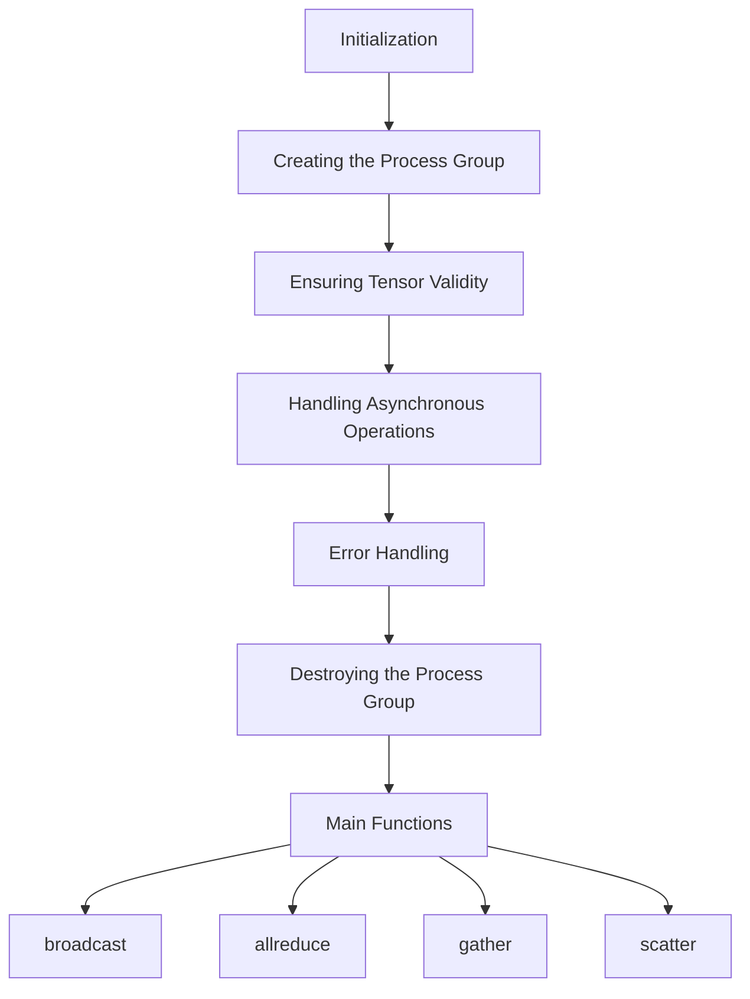

# Getting Started with MPI Process Group in <SwmToken path="test/inductor/test_snode_runtime.py" pos="17:0:0" line-data="c10d = torch.ops.c10d_functional">`c10d`</SwmToken>

The MPI Process Group is an implementation of the <SwmToken path="torch/_C/_distributed_c10d.pyi" pos="298:2:2" line-data="class ProcessGroup:">`ProcessGroup`</SwmToken> abstract class in the <SwmToken path="test/inductor/test_snode_runtime.py" pos="17:0:0" line-data="c10d = torch.ops.c10d_functional">`c10d`</SwmToken> library. It facilitates communication between multiple processes in a distributed environment using the Message Passing Interface (MPI). The MPI Process Group supports various collective communication operations such as broadcast, allreduce, and gather.

# Initialization

The <SwmToken path="torch/csrc/distributed/c10d/ProcessGroupMPI.cpp" pos="259:1:1" line-data="  initMPIOnce();">`initMPIOnce`</SwmToken> method initializes the MPI environment, ensuring it is only done once. It checks if MPI is already initialized and sets up the necessary threading support.

# Creating the Process Group

The <SwmToken path="torch/csrc/distributed/c10d/ProcessGroupMPI.cpp" pos="256:9:9" line-data="c10::intrusive_ptr&lt;ProcessGroupMPI&gt; ProcessGroupMPI::createProcessGroupMPI(">`createProcessGroupMPI`</SwmToken> method creates the MPI process group with the specified ranks. It initializes the MPI environment and sets up the group communication.

<SwmSnippet path="/torch/csrc/distributed/c10d/ProcessGroupMPI.cpp" line="256">

---

The <SwmToken path="torch/csrc/distributed/c10d/ProcessGroupMPI.cpp" pos="256:9:9" line-data="c10::intrusive_ptr&lt;ProcessGroupMPI&gt; ProcessGroupMPI::createProcessGroupMPI(">`createProcessGroupMPI`</SwmToken> method creates the MPI process group with the specified ranks. It initializes the MPI environment and sets up the group communication.

```c++
c10::intrusive_ptr<ProcessGroupMPI> ProcessGroupMPI::createProcessGroupMPI(
    std::vector<int> ranks) {
  // Once initialization
  initMPIOnce();

  MPI_Comm groupComm = MPI_COMM_WORLD;
  int rank = -1;
  int size = -1;

  {
    std::lock_guard<std::mutex> globalLock(pgGlobalMutex_);

    // If no ranks are specified, assume we're creating the root group
    if (!ranks.empty()) {
      MPI_Group worldGroup{};
      MPI_Group ranksGroup{};
      MPI_CHECK(MPI_Comm_group(MPI_COMM_WORLD, &worldGroup));
      MPI_CHECK(
          MPI_Group_incl(worldGroup, ranks.size(), ranks.data(), &ranksGroup));
      // `MPI_Comm_create` can be flaky in certain cases.
      // See: https://github.com/pytorch/pytorch/issues/53899
```

---

</SwmSnippet>

# Ensuring Tensor Validity

The <SwmToken path="torch/csrc/distributed/c10d/ProcessGroupMPI.cpp" pos="64:2:2" line-data="void checkSingleTensorHelper(const at::Tensor&amp; tensor) {">`checkSingleTensorHelper`</SwmToken> method ensures that the input tensor is contiguous and dense before performing any MPI operations.

<SwmSnippet path="/torch/csrc/distributed/c10d/ProcessGroupMPI.cpp" line="63">

---

The <SwmToken path="torch/csrc/distributed/c10d/ProcessGroupMPI.cpp" pos="64:2:2" line-data="void checkSingleTensorHelper(const at::Tensor&amp; tensor) {">`checkSingleTensorHelper`</SwmToken> method ensures that the input tensor is contiguous and dense before performing any MPI operations.

```c++
// Checking the input tensor's validity
void checkSingleTensorHelper(const at::Tensor& tensor) {
  if (!tensor.is_contiguous()) {
    TORCH_CHECK(false, "input tensor has to be contiguous");
  }
  if (tensor.is_sparse()) {
    TORCH_CHECK(false, "input tensor has to be dense");
  }
  if (tensor.is_cuda() && !cudaAwareMpiCheck()) {
    TORCH_CHECK(
        false,
        "CUDA tensor detected and the MPI used doesn't "
        "have CUDA-aware MPI support");
  }
}
```

---

</SwmSnippet>

# Handling Asynchronous Operations

The <SwmToken path="torch/csrc/distributed/c10d/ProcessGroupMPI.cpp" pos="120:2:2" line-data="ProcessGroupMPI::AsyncWork::AsyncWork(">`AsyncWork`</SwmToken> class manages asynchronous MPI operations, checking the completion and success of MPI requests.

<SwmSnippet path="/torch/csrc/distributed/c10d/ProcessGroupMPI.cpp" line="120">

---

The <SwmToken path="torch/csrc/distributed/c10d/ProcessGroupMPI.cpp" pos="120:2:2" line-data="ProcessGroupMPI::AsyncWork::AsyncWork(">`AsyncWork`</SwmToken> class manages asynchronous MPI operations, checking the completion and success of MPI requests.

```c++
ProcessGroupMPI::AsyncWork::AsyncWork(
    MPI_Request request,
    std::vector<at::Tensor> outputTensors,
    const char* profilingTitle,
    const std::optional<std::vector<at::Tensor>>& inputTensors)
    : Work(-1, OpType::UNKNOWN, profilingTitle, inputTensors),
      outputTensors_(std::move(outputTensors)),
      request_(request) {
  memset(&status_, 0, sizeof(status_));
}
```

---

</SwmSnippet>

# Error Handling

The <SwmToken path="torch/csrc/distributed/c10d/ProcessGroupMPI.cpp" pos="212:6:6" line-data="void ProcessGroupMPI::AsyncWork::populateException() {">`populateException`</SwmToken> method handles errors and exceptions that occur during MPI operations by populating an exception with the MPI error string.

<SwmSnippet path="/torch/csrc/distributed/c10d/ProcessGroupMPI.cpp" line="212">

---

The <SwmToken path="torch/csrc/distributed/c10d/ProcessGroupMPI.cpp" pos="212:6:6" line-data="void ProcessGroupMPI::AsyncWork::populateException() {">`populateException`</SwmToken> method handles errors and exceptions that occur during MPI operations by populating an exception with the MPI error string.

```c++
void ProcessGroupMPI::AsyncWork::populateException() {
  std::array<char, MPI_MAX_ERROR_STRING> buf{};
  int len = buf.size();
  MPI_CHECK(MPI_Error_string(status_.MPI_ERROR, buf.data(), &len));
  exception_ =
      std::make_exception_ptr(std::runtime_error(std::string(buf.data(), len)));
}
```

---

</SwmSnippet>

# Destroying the Process Group

The <SwmToken path="torch/csrc/distributed/c10d/ProcessGroupMPI.cpp" pos="329:4:4" line-data="void ProcessGroupMPI::destroy() {">`destroy`</SwmToken> method signals the worker thread to stop and finalizes the MPI environment, ensuring a clean shutdown of the MPI process group.

<SwmSnippet path="/torch/csrc/distributed/c10d/ProcessGroupMPI.cpp" line="329">

---

The <SwmToken path="torch/csrc/distributed/c10d/ProcessGroupMPI.cpp" pos="329:4:4" line-data="void ProcessGroupMPI::destroy() {">`destroy`</SwmToken> method signals the worker thread to stop and finalizes the MPI environment, ensuring a clean shutdown of the MPI process group.

```c++
void ProcessGroupMPI::destroy() {
  std::unique_lock<std::mutex> lock(pgMutex_);
  queueConsumeCV_.wait(lock, [&] { return queue_.empty(); });

  // Queue is empty, signal stop
  stop_ = true;

  // Release lock to allow threads to terminate
  lock.unlock();
  queueProduceCV_.notify_all();

  // Join the single worker thread
  workerThread_.join();
}
```

---

</SwmSnippet>

# Main Functions

There are several main functions in the MPI Process Group. Some of them are broadcast, allreduce, gather, and scatter. We will dive a little into these functions.

### broadcast

The <SwmToken path="torch/csrc/distributed/c10d/ProcessGroupMPI.cpp" pos="392:9:9" line-data="c10::intrusive_ptr&lt;Work&gt; ProcessGroupMPI::broadcast(">`broadcast`</SwmToken> function is used to send a tensor from the root process to all other processes in the group. It ensures that the tensor is contiguous and dense before performing the operation.

<SwmSnippet path="/torch/csrc/distributed/c10d/ProcessGroupMPI.cpp" line="392">

---

The <SwmToken path="torch/csrc/distributed/c10d/ProcessGroupMPI.cpp" pos="392:9:9" line-data="c10::intrusive_ptr&lt;Work&gt; ProcessGroupMPI::broadcast(">`broadcast`</SwmToken> function is used to send a tensor from the root process to all other processes in the group. It ensures that the tensor is contiguous and dense before performing the operation.

```c++
c10::intrusive_ptr<Work> ProcessGroupMPI::broadcast(
    std::vector<at::Tensor>& tensors,
    const BroadcastOptions& opts) {
  checkSingleTensor(tensors);
  std::function<void(std::unique_ptr<WorkEntry>&)> runFunc =
      [opts, this](std::unique_ptr<WorkEntry>& entry) {
        auto data = (entry->src)[0];
        c10::DeviceGuard guard(data.device());
        std::unique_lock<std::mutex> globalLock(pgGlobalMutex_);
        MPI_CHECK(MPI_Bcast(
            data.data_ptr(),
            data.numel(),
            mpiDatatype.at(data.scalar_type()),
            opts.rootRank,
            pgComm_));
      };
  auto entry =
      std::make_unique<WorkEntry>(&tensors, &tensors, std::move(runFunc));
  return enqueue(
      std::move(entry),
      "mpi:broadcast",
```

---

</SwmSnippet>

### allreduce

The <SwmToken path="torch/csrc/distributed/c10d/ProcessGroupMPI.cpp" pos="416:9:9" line-data="c10::intrusive_ptr&lt;Work&gt; ProcessGroupMPI::allreduce(">`allreduce`</SwmToken> function performs a reduction operation (such as sum, product, min, or max) across all processes and distributes the result back to all processes. It ensures that the tensor is contiguous and dense before performing the operation.

<SwmSnippet path="/torch/csrc/distributed/c10d/ProcessGroupMPI.cpp" line="416">

---

The <SwmToken path="torch/csrc/distributed/c10d/ProcessGroupMPI.cpp" pos="416:9:9" line-data="c10::intrusive_ptr&lt;Work&gt; ProcessGroupMPI::allreduce(">`allreduce`</SwmToken> function performs a reduction operation (such as sum, product, min, or max) across all processes and distributes the result back to all processes. It ensures that the tensor is contiguous and dense before performing the operation.

```c++
c10::intrusive_ptr<Work> ProcessGroupMPI::allreduce(
    std::vector<at::Tensor>& tensors,
    const AllreduceOptions& opts) {
  checkSingleTensor(tensors);

  std::function<void(std::unique_ptr<WorkEntry>&)> runFunc =
      [opts, this](std::unique_ptr<WorkEntry>& entry) {
        auto data = (entry->src)[0];
        c10::DeviceGuard guard(data.device());
        std::unique_lock<std::mutex> globalLock(pgGlobalMutex_);
        MPI_CHECK(MPI_Allreduce(
            MPI_IN_PLACE,
            data.data_ptr(),
            data.numel(),
            mpiDatatype.at(data.scalar_type()),
            mpiOp.at(opts.reduceOp),
            pgComm_));
      };
  auto entry =
      std::make_unique<WorkEntry>(&tensors, &tensors, std::move(runFunc));
  return enqueue(
```

---

</SwmSnippet>

### gather

The <SwmToken path="torch/csrc/distributed/c10d/ProcessGroupMPI.cpp" pos="535:9:9" line-data="c10::intrusive_ptr&lt;Work&gt; ProcessGroupMPI::gather(">`gather`</SwmToken> function collects tensors from all processes and gathers them to the root process. It ensures that the tensor is contiguous and dense before performing the operation.

<SwmSnippet path="/torch/csrc/distributed/c10d/ProcessGroupMPI.cpp" line="535">

---

The <SwmToken path="torch/csrc/distributed/c10d/ProcessGroupMPI.cpp" pos="535:9:9" line-data="c10::intrusive_ptr&lt;Work&gt; ProcessGroupMPI::gather(">`gather`</SwmToken> function collects tensors from all processes and gathers them to the root process. It ensures that the tensor is contiguous and dense before performing the operation.

```c++
c10::intrusive_ptr<Work> ProcessGroupMPI::gather(
    std::vector<std::vector<at::Tensor>>& outputTensors,
    std::vector<at::Tensor>& inputTensors,
    const GatherOptions& opts) {
  checkSingleTensor(inputTensors);

  if (rank_ != opts.rootRank) {
    if (!outputTensors.empty()) {
      TORCH_CHECK(
          false,
          "Gather: number of output tensors should be 0 "
          "for non-root");
    }
  } else {
    if (outputTensors.size() != 1) {
      TORCH_CHECK(false, "Gather: multi-GPU collective is not supported");
    }
    if (static_cast<size_t>(size_) != outputTensors[0].size()) {
      TORCH_CHECK(
          false,
          "Gather: number of output tensors should equal "
```

---

</SwmSnippet>

### scatter

The <SwmToken path="torch/csrc/distributed/c10d/ProcessGroupMPI.cpp" pos="612:9:9" line-data="c10::intrusive_ptr&lt;Work&gt; ProcessGroupMPI::scatter(">`scatter`</SwmToken> function distributes tensors from the root process to all other processes in the group. It ensures that the tensor is contiguous and dense before performing the operation.

<SwmSnippet path="/torch/csrc/distributed/c10d/ProcessGroupMPI.cpp" line="612">

---

The <SwmToken path="torch/csrc/distributed/c10d/ProcessGroupMPI.cpp" pos="612:9:9" line-data="c10::intrusive_ptr&lt;Work&gt; ProcessGroupMPI::scatter(">`scatter`</SwmToken> function distributes tensors from the root process to all other processes in the group. It ensures that the tensor is contiguous and dense before performing the operation.

```c++
c10::intrusive_ptr<Work> ProcessGroupMPI::scatter(
    std::vector<at::Tensor>& outputTensors,
    std::vector<std::vector<at::Tensor>>& inputTensors,
    const ScatterOptions& opts) {
  checkSingleTensor(outputTensors);

  if (rank_ != opts.rootRank) {
    if (!inputTensors.empty()) {
      TORCH_CHECK(
          false,
          "Scatter: number of input tensors should be 0 "
          "for non-root");
    }
  } else {
    if (inputTensors.size() != 1) {
      TORCH_CHECK(false, "Scatter: multi-GPU collective is not supported");
    }
    if (static_cast<size_t>(size_) != inputTensors[0].size()) {
      TORCH_CHECK(
          false,
          "Scatter: number of input tensors should equal "
```

---

</SwmSnippet>

&nbsp;

*This is an auto-generated document by Swimm AI 🌊 and has not yet been verified by a human*

<SwmMeta version="3.0.0" repo-id="Z2l0aHViJTNBJTNBcHl0b3JjaC1hdXRvZG9jcy1kZW1vJTNBJTNBU3dpbW0tRGVtbw==" repo-name="pytorch-autodocs-demo"><sup>Powered by [Swimm](/)</sup></SwmMeta>
